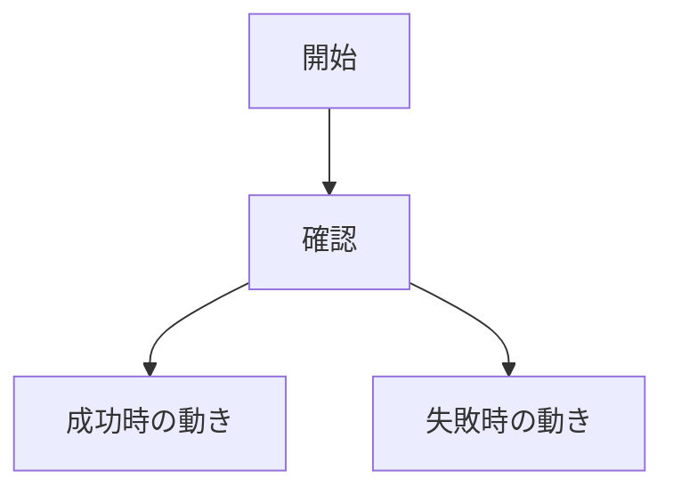
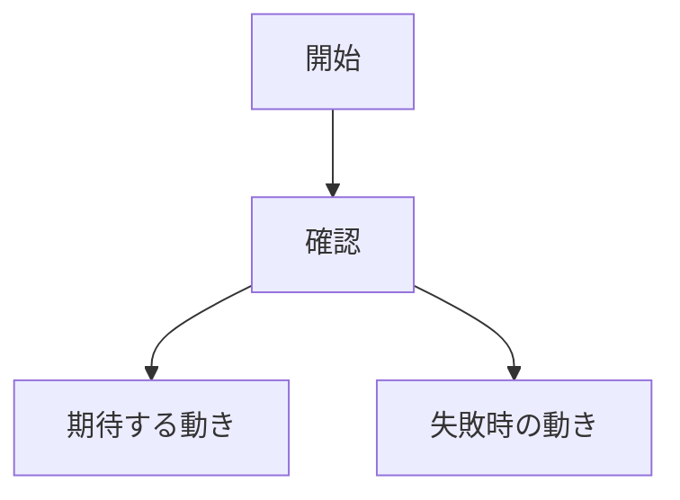

# prepare-issue

GitHub issue を、人間と `gh-issue-implement` が読みやすい形で作る。

Issue は実装前の入力資料として扱う。本文は、何をしたいか、なぜ必要か、完了条件、影響範囲、実装時の注意点が分かるように書く。

## Preflight

1. `git status --short --branch`
2. `gh --version`
3. `gh auth status -h github.com`
4. 必要に応じて `gh repo view --json nameWithOwner,url`

issue 作成前に、分かる範囲で関連情報を確認する:

- 関連する既存実装
- 関連 docs / schemas / tests
- 近い issue / PR
- 変更対象になりそうな責務境界
- 既存の失敗ログ、再現手順、スクリーンショット

調べても分からない情報は、推測で埋めず「不明」または「要確認」と書く。

## Issue 種別

最初にどちらの issue か決める:

- 新規実装: まだ無い機能や挙動を追加する
- 修正: 既存のバグ、不具合、分かりにくさ、運用上の問題を直す

GitHub UI で作る場合は `.github/ISSUE_TEMPLATE` のフォームを使う。Codex が CLI で作る場合は、このスキルの本文構成で一時ファイルを作り、`gh issue create --body-file` を使う。

## タイトル形式

```text
type: 具体的な依頼内容
```

`type`:

- `feat`: 新規実装
- `fix`: 修正
- `docs`: ドキュメントだけの変更
- `refactor`: 挙動を変えない整理
- `test`: テスト追加や修正
- `chore`: その他

## 文体方針

読み手は、実装に詳しくない人も含む。Issue だけを見て、背景、期待する動き、完了条件が分かる本文にする。

- 日本語で書く
- 小学生でも流れを追えるくらい、やさしく明確に書く
- 小学校、授業、宿題などの不自然な例え話は使わない
- たとえ話は原則使わない
- 1 文に複数の話を詰め込まない
- 主語をはっきりさせる
- あいまいな表現を避ける
- 技術的な正確さは落とさない
- 難しい単語や専門用語には短い補足を入れる

専門用語の補足例:

- バリデーション（入力された値が正しいか確認する処理）
- スキーマ（データの形や必須項目を決めるルール）
- リグレッション（前は動いていた機能が壊れること）
- 再現手順（同じ問題をもう一度起こすための手順）
- 完了条件（この issue を終わりにしてよいか判断する条件）

## 新規実装 issue の本文

````markdown
## 一言でいうと

このissueは、◯◯を◯◯するための依頼です。

## 作りたいもの

- ◯◯をできるようにする
- ◯◯の場合は◯◯になる
- 失敗した場合は◯◯になる

## なぜ必要か

今は◯◯です。

そのため、◯◯という問題があります。

## 期待する動き

- ◯◯できる
- ◯◯の場合は◯◯になる
- 失敗した場合は◯◯になる

## 流れ



## 完了条件

- [ ] ◯◯できる
- [ ] ◯◯の場合にエラーになる
- [ ] テストで◯◯を確認できる

## スコープ外

- ◯◯はこのissueでは扱わない

## 影響範囲

| 領域 | 影響 |
| --- | --- |
| API | あり / なし |
| DB / schema | あり / なし |
| Move contract | あり / なし |
| verifier / relayer / worker | あり / なし |
| UI | あり / なし |
| docs | あり / なし |

## 確認方法

- ◯◯を実行して確認する
- ◯◯のテストで確認する

<details>
<summary>実装メモ</summary>

- 変更候補: `path/to/file`
- 注意点: ◯◯
- 使うべき既存実装: ◯◯

</details>
````

## 修正 issue の本文

````markdown
## 一言でいうと

このissueは、◯◯で起きている問題を直す依頼です。

## 今起きている問題

今は◯◯です。

そのため、◯◯ができません。

## 再現手順

1. ◯◯する
2. ◯◯する
3. ◯◯になる

## 期待する動き

- ◯◯できる
- ◯◯の場合は◯◯になる
- 失敗した場合は◯◯になる

## 流れ



## 完了条件

- [ ] 問題が再現しなくなる
- [ ] 期待する動きになる
- [ ] テストで再発を防げる

## 影響範囲

| 領域 | 影響 |
| --- | --- |
| API | あり / なし |
| DB / schema | あり / なし |
| Move contract | あり / なし |
| verifier / relayer / worker | あり / なし |
| UI | あり / なし |
| docs | あり / なし |

## 確認方法

- 再現手順をもう一度実行して確認する
- ◯◯のテストで確認する

<details>
<summary>実装メモ</summary>

- 原因の見立て: ◯◯
- 変更候補: `path/to/file`
- 注意点: ◯◯
- 使うべき既存実装: ◯◯

</details>
````

## 視覚化ルール

GitHub Markdown で安定して表示できる方法を使う。

- 処理フローがある issue では Mermaid の `flowchart` を入れる
- 状態遷移がある issue では Mermaid の `stateDiagram` を入れる
- UI が関係する issue ではスクリーンショットまたは短い動画を添付する
- データ構造が関係する issue では Markdown 表を入れる
- 詳細が長い場合は `<details><summary>実装メモ</summary>` で折りたたむ
- Mermaid を入れない場合は、`流れ` に「処理フローの変更なし」または「要確認」と書く

## HTML の扱い

Issue 本文では Markdown を優先する。HTML は GitHub で安全に表示される範囲だけ使う。

使ってよい:

- `<details>`
- `<summary>`
- 必要最小限の `<br>`

使わない:

- `<script>`
- `<style>`
- `<iframe>`
- CSS 前提の装飾 HTML
- Issue 本文に埋め込むフル HTML ページ

## ルール

- 空欄やテンプレートの説明文を残さない
- 「いい感じに修正」などの曖昧な説明で終わらせない
- 不明点は隠さず、`不明` または `要確認` と書く
- `gh-issue-implement` が実装計画を作れる粒度にする
- 1 issue に複数の大きな機能を詰め込まない
- `🤖 Generated with ...` のような署名を付けない
- `Co-Authored-By` を付けない
- 関係ないラベルや存在しないラベルを無理に付けない

Issue 作成:

```bash
gh issue create --title "<title>" --body-file <tmp-file>
```

ラベルを付ける場合は、存在を確認してから使う:

```bash
gh label list
gh issue create --title "<title>" --body-file <tmp-file> --label "<label>"
```

## 完了確認

Issue 作成後に次を確認する:

```bash
gh issue view <number> --json url,title,state,body
```
