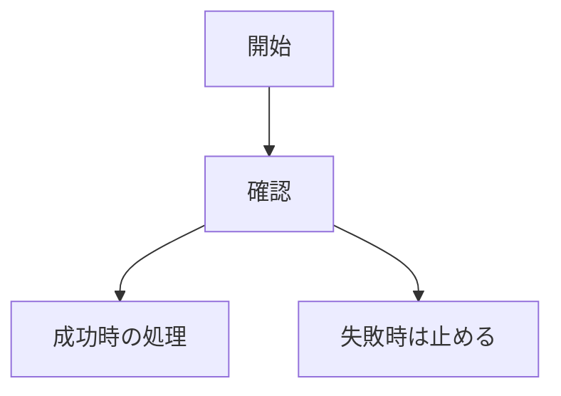

# prepare-pr

現在のブランチから、人間が内容を理解しやすい PR を作る。

PR 本文は `.github/pull_request_template.md` の構成を使う。テンプレートをそのまま貼るだけで終わらせず、差分、issue、検証結果を読んで具体的に埋める。

## Preflight

1. `git status --short --branch`
2. `git rev-parse --abbrev-ref HEAD`
3. `git fetch origin`
4. `gh --version`
5. `gh auth status -h github.com`

ベースブランチが明示されていない場合は `main` とする。指定がある場合は、そのブランチへ向けた PR を作成する。

## 差分確認

```bash
git log --oneline <base-branch>..HEAD
git diff --stat <base-branch>...HEAD
git diff <base-branch>...HEAD
```

差分確認では、少なくとも次を整理する:

- 何のための変更か
- 何が変わったか
- レビュアーに何を判断してほしいか
- ユーザー、運用、開発、テストへの影響
- 実行した検証と、実行していない重要な検証

## タイトル形式

```text
type: 具体的な変更内容を要約したタイトル
```

`type`:

- `feat`
- `fix`
- `docs`
- `refactor`
- `test`
- `other`

## 本文方針

読み手は、実装に詳しくない人も含む。PR だけを見て、内容を理解し、OK または修正指示を出せる本文にする。

- 日本語で書く
- 小学生でも流れを追えるくらい、やさしく明確に書く
- 小学校、授業、宿題などの不自然な例え話は使わない
- たとえ話は原則使わない
- 1 文に複数の話を詰め込まない
- 主語をはっきりさせる
- あいまいな表現を避ける
- ファイル単位の説明だけで終わらせない
- まず目的、背景、変更後の動きを説明する
- 技術的な正確さは落とさない
- 難しい単語や専門用語には短い補足を入れる

PR 本文は、次の 2 段階で作る:

1. まず、差分から技術的に正確な下書きを作る
2. 次に、実装に詳しくないレビュアーが読める文章へ書き直す

1 回目の下書きをそのまま PR 本文にしない。技術的に正しいだけの本文は、レビュアーが判断しにくい本文として扱う。

専門用語の補足例:

- バリデーション（入力された値が正しいか確認する処理）
- スキーマ（データの形や必須項目を決めるルール）
- リグレッション（前は動いていた機能が壊れること）
- Merkle root（複数のデータが改ざんされていないか確認するための代表値）
- BCS payload（Move に渡すために決まった形へ変換したバイナリデータ）
- TEE（外から中身を変えにくい実行環境）
- payload（システム内で受け渡すデータ本体）
- proof（条件を満たしていることを確かめるための検証用データ）
- nullifier（同じ操作を二重に扱わないための識別値）
- fail-closed（危ない時は処理を進めずに止める方針）

専門用語チェック:

1. PR 本文を書いた後、本文中の英語や専門用語を拾う
2. 初めて出る場所に、短い日本語の補足があるか確認する
3. 補足がない場合は、専門用語だけで説明せず、先に平易な言葉で説明する
4. `verified / rejected / pending_source / unsupported` のような状態名は、日本語の意味を先に書き、必要な場合だけ英語名を添える

例:

- 悪い例: `pending_source` を返す
- 良い例: 外部サービス待ちとして返す。内部の状態名は `pending_source` とする。

## 本文構成

`.github/pull_request_template.md` の構成を必ず使う。不要な見出しを削らず、「該当なし」や理由を明記する。

````markdown
## 一言でいうと

このPRは、◯◯を◯◯するための変更です。

## なぜ必要か

今までは◯◯でした。
そのため、◯◯という問題がありました。

このPRで、◯◯になります。

## 何が変わったか

| 見る場所 | 変更前 | 変更後 |
| --- | --- | --- |
| ユーザーや運用から見える動き | ◯◯ | ◯◯ |
| システム内部の動き | ◯◯ | ◯◯ |
| 失敗した時の動き | ◯◯ | ◯◯ |

## 流れ



## レビューで見てほしい点

- ◯◯の判断でよいか
- ◯◯の説明で誤解がないか
- ◯◯の失敗時の動きで問題ないか

## 影響範囲

| 領域 | 影響 |
| --- | --- |
| API | あり / なし |
| DB / schema | あり / なし |
| Move contract | あり / なし |
| verifier / relayer / worker | あり / なし |
| UI | あり / なし |
| docs | あり / なし |

## 壊れていないことの確認

- [x] `実行したコマンド`
- [x] `実行したコマンド`

実行していない重要な確認:

- ◯◯。理由: ◯◯

<details>
<summary>技術詳細</summary>

## 主な変更ファイル

- `path/to/file`
  - ◯◯を担当
  - ◯◯のために変更

## 実装メモ

- ◯◯
- ◯◯

</details>

## 関連Issue

Close #123
````

## 視覚化ルール

GitHub Markdown で安定して表示できる方法を使う。

- 処理フローが変わる PR では Mermaid の `flowchart` を入れる
- 状態遷移が変わる PR では Mermaid の `stateDiagram` を入れる
- UI が変わる PR ではスクリーンショットまたは短い動画を添付する
- データ構造が変わる PR では Markdown 表を入れる
- 技術詳細が長い PR では `<details><summary>技術詳細</summary>` で折りたたむ
- Mermaid を入れない場合は、`流れ` に「処理フローの変更なし」と書く
- Mermaid のラベルも日本語を優先する
- Mermaid に専門用語を書く場合は、本文の近くで短く説明する

Mermaid のラベル例:

- 悪い例: `verified result`
- 良い例: `確認済みとして返す`
- 悪い例: `retryable / unexpected`
- 良い例: `一時的な失敗 / 判断不能`

## HTML の扱い

PR 本文では Markdown を優先する。HTML は GitHub で安全に表示される範囲だけ使う。

使ってよい:

- `<details>`
- `<summary>`
- 必要最小限の `<br>`

使わない:

- `<script>`
- `<style>`
- `<iframe>`
- CSS 前提の装飾 HTML
- PR 本文に埋め込むフル HTML ページ

## ルール

- 空欄やテンプレートの説明文を残さない
- 「いい感じに修正」などの曖昧な説明で終わらせない
- `🤖 Generated with ...` のような署名を付けない
- `Co-Authored-By` を付けない
- `main` 向け PR では、その PR に直接関係する Issue だけを書く
- テスト結果を本文に含める
- 実行していない検証は、未実行として理由を書く

PR 作成前に、次の仕上げチェックを行う:

- 表と `流れ` だけを読んでも、変更後の動きが分かるか
- 「なぜ必要か」に、実装者以外にも分かる困りごとが書かれているか
- 英語の専門語だけで説明していないか
- 初出の専門用語に短い補足があるか
- 技術詳細が長い場合、本文の前半ではなく `<details>` に寄せているか
- レビュアーに判断してほしい点が、具体的な問いになっているか

必要なら push:

```bash
git push -u origin HEAD
```

PR 作成:

```bash
gh pr create --base <base-branch> --title "<title>" --body-file <tmp-file>
```

## 完了確認

PR 作成後に次を確認する:

```bash
gh pr view --json url,title,baseRefName,headRefName
```
