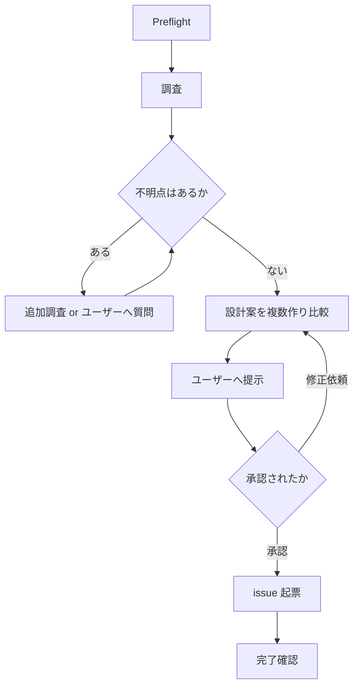
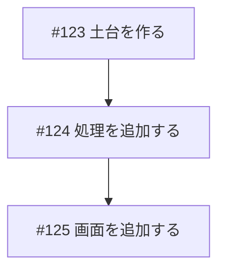
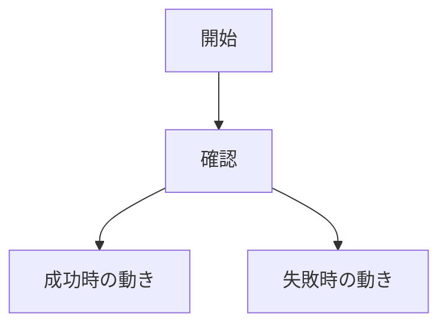
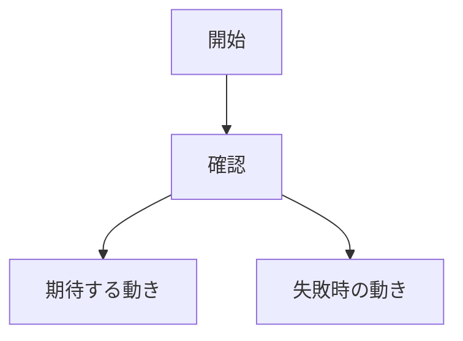

# prepare-issue

GitHub issue を、人間と `gh-issue-implement` が読みやすい形で作る。

Issue は実装前の入力資料として扱う。本文は、何をしたいか、なぜ必要か、どう作るか（設計方針）、完了条件、影響範囲が分かるように書く。

このスキルの最重要ルールは次の 2 つ:

1. 設計方針が確定していない issue は起票しない
2. ユーザーの承認を得ていない issue は起票しない

## 全体フロー



## Preflight

1. `git status --short --branch`
2. `gh --version`
3. `gh auth status -h github.com`
4. 必要に応じて `gh repo view --json nameWithOwner,url`

## 調査（必須）

設計案を作る前に、次を必ず調べる。「分かる範囲で」ではなく、設計判断に必要な範囲はすべて確認する。関連コードは推測せず、実際にファイルを開いて読む。

- 関連する既存実装（実際にコードを読む）
- 関連 docs / schemas / tests
- 近い issue / PR
- 依存する issue や、後続で作る issue
- 変更対象になりそうな責務境界
- 既存の失敗ログ、再現手順、スクリーンショット

調査中に分からない点が出たら、不明点リストを作る。不明点は次のどちらかで必ず解消する:

- 追加調査（コードを読む、ログを確認する、動かして確認する）
- ユーザーへの質問（調査では分からない仕様判断、優先度、好みなど）

不明点が 1 つでも残っている間は、設計案の提示にも issue 起票にも進まない。本文に「不明」「要確認」と書いて済ませることは禁止する。

## Issue 種別

最初にどちらの issue か決める:

- 新規実装: まだ無い機能や挙動を追加する
- 修正: 既存のバグ、不具合、分かりにくさ、運用上の問題を直す

GitHub UI で作る場合は `.github/ISSUE_TEMPLATE` のフォームを使う。Codex が CLI で作る場合は、このスキルの本文構成で一時ファイルを作り、`gh issue create --body-file` を使う。

## 設計の確定

### 固める範囲

設計は「モジュール・責務分担と方針」のレベルまで固める。細かい書き方は実装者に委ねる。

固めること:

- どのモジュール（ファイル群・コンポーネント）が何を担当するか
- 処理の流れ（正常時と失敗時）
- データの持ち方の方針（どこに何を保存するか、形をどうするか）
- エラー時の方針（誰に何をどう知らせるか）
- テストで何を確認するか

固めないこと（実装者に委ねる）:

- 関数名、変数名
- 関数の細かい引数や戻り値
- 内部実装の具体的な書き方

### 設計案の作成と比較

設計案は原則 2〜3 案作り、トレードオフ（何を取り、何をあきらめるか）を比較して、推奨案を 1 つ決める。比較するまでもなく一通りしかない小さな修正では、その旨を書いたうえで 1 案だけ提示してよい。

提示文は、実装に詳しくない人が読むことを前提にする:

- 一般的な大人が誰でも理解できる言葉遣いにする
- 専門用語には必ず短い解説をつける
- 表や図を使い、読みやすく理解しやすくする

### ユーザーへの提示フォーマット

issue を起票する前に、チャットで次の形式で提示する:

````markdown
## 設計案: ◯◯

### 調査で確認したこと

- ◯◯は現在◯◯という作りになっている
- ◯◯のテストは `path/to/test` にある

### 解消した不明点

- ◯◯が不明だった → ◯◯を確認して解消（または: ユーザーに質問して◯◯と決定）

### 案の比較

| 観点 | 案A: ◯◯ | 案B: ◯◯ |
| --- | --- | --- |
| やり方のあらまし | ◯◯ | ◯◯ |
| 良い点 | ◯◯ | ◯◯ |
| 悪い点・リスク | ◯◯ | ◯◯ |
| 変更が必要な範囲 | ◯◯ | ◯◯ |
| 将来の変えやすさ | ◯◯ | ◯◯ |

### 推奨案

案A を推奨します。理由は◯◯だからです。

### この設計で決めること

- ◯◯は◯◯が担当する
- 失敗したときは◯◯する

### 実装者に委ねること

- 関数名や内部の書き方
- ◯◯

この設計案で issue を起票してよいですか。修正したい点があれば教えてください。
````

### 承認

- ユーザーから明示的な承認（「OK」「これで進めて」など）を得るまで起票しない
- 修正依頼が来たら、設計案を直して再提示し、改めて承認を得る
- 承認された内容と異なる issue を作らない
- 起票後に設計を変えたくなった場合も、変更案を提示して再承認を得てから issue を直す

## 複数 issue と依存関係

大きな実装は、1 つの issue に詰め込まず、依存関係を持った複数 issue に分ける。

分割する場合の承認は、分割案と全 issue の設計方針をまとめて 1 回で取る。提示時は「Issue分割」「依存関係の流れ」に続けて、issue ごとの設計案（上のフォーマットの要約版でよい）を並べる。一部だけ承認・一部だけ修正の指示が来た場合は、修正分を直して全体を再提示する。

分割するときは次を守る:

- 1 issue は `gh-issue-implement` が単独で実装できる大きさにする
- 前提になる issue を先に作る
- 後続 issue には、前提 issue を `#123` の形式で明記する
- 依存関係が分かる Mermaid の `flowchart` を入れる
- それぞれの issue に完了条件と設計方針を持たせる
- 後続 issue の本文には、前提 issue が完了するまで実装しないことを書く

複数 issue を作る場合は、最初に依存関係の一覧を作る:

````markdown
## Issue分割

| 順番 | issue | 目的 | 前提 |
| --- | --- | --- | --- |
| 1 | feat: ◯◯の土台を作る | ◯◯を用意する | なし |
| 2 | feat: ◯◯を使う処理を追加する | ◯◯できるようにする | #123 |
| 3 | feat: ◯◯の画面を追加する | UIから使えるようにする | #124 |

## 依存関係の流れ


````

issue 番号は作成後に確定する。Codex が複数 issue を作る場合は、前提 issue を作成して番号を取得してから、後続 issue の `依存関係` を具体的な issue 番号で埋める。

## タイトル形式

```text
type: 具体的な依頼内容
```

`type`:

- `feat`: 新規実装
- `fix`: 修正
- `docs`: ドキュメントだけの変更
- `refactor`: 挙動を変えない整理
- `test`: テスト追加や修正
- `chore`: その他

## 文体方針

読み手は、実装に詳しくない人も含む。Issue だけを見て、背景、期待する動き、設計方針、完了条件が分かる本文にする。設計案の提示文にも、この文体方針をそのまま適用する。

- 日本語で書く
- 小学生でも流れを追えるくらい、やさしく明確に書く
- 小学校、授業、宿題などの不自然な例え話は使わない
- たとえ話は原則使わない
- 1 文に複数の話を詰め込まない
- 主語をはっきりさせる
- あいまいな表現を避ける
- 技術的な正確さは落とさない
- 難しい単語や専門用語には短い補足を入れる

専門用語の補足例:

- バリデーション（入力された値が正しいか確認する処理）
- スキーマ（データの形や必須項目を決めるルール）
- リグレッション（前は動いていた機能が壊れること）
- 再現手順（同じ問題をもう一度起こすための手順）
- 完了条件（この issue を終わりにしてよいか判断する条件）
- トレードオフ（何かを取ると、別の何かをあきらめる関係）

## 新規実装 issue の本文

````markdown
## 一言でいうと

このissueは、◯◯を◯◯するための依頼です。

## 作りたいもの

- ◯◯をできるようにする
- ◯◯の場合は◯◯になる
- 失敗した場合は◯◯になる

## なぜ必要か

今は◯◯です。

そのため、◯◯という問題があります。

## 期待する動き

- ◯◯できる
- ◯◯の場合は◯◯になる
- 失敗した場合は◯◯になる

## 流れ



## 設計方針

この設計は YYYY-MM-DD にユーザー承認済みです。実装はこの方針に従ってください。

### 採用する方針

- ◯◯は◯◯というやり方で作る
- データは◯◯に◯◯の形で持つ
- 失敗したときは◯◯する

### 責務分担

| 担当箇所 | 役割 |
| --- | --- |
| `path/to/module` | ◯◯を担当する |
| `path/to/module` | ◯◯を担当する |

### この方針を選んだ理由

- ◯◯だから

### 見送った代替案

- 案B（◯◯するやり方）: ◯◯のため見送り

### 実装者に委ねること

- 関数名や内部の書き方
- ◯◯

### 実装時に守ること

- ◯◯
- この設計方針と矛盾する点が見つかったら、実装を進めずに issue にコメントして相談する

## 完了条件

- [ ] ◯◯できる
- [ ] ◯◯の場合にエラーになる
- [ ] テストで◯◯を確認できる
- [ ] 設計方針の責務分担どおりに実装されている

## 依存関係

前提issue:

- なし

このissueに依存する後続issue:

- なし

## スコープ外

- ◯◯はこのissueでは扱わない

## 影響範囲

| 領域 | 影響 |
| --- | --- |
| API | あり / なし |
| DB / schema | あり / なし |
| Move contract | あり / なし |
| verifier / relayer / worker | あり / なし |
| UI | あり / なし |
| docs | あり / なし |

## 確認方法

- ◯◯を実行して確認する
- ◯◯のテストで確認する

<details>
<summary>実装メモ（補足ヒント）</summary>

- 変更候補: `path/to/file`
- 注意点: ◯◯
- 使うべき既存実装: ◯◯

</details>
````

## 修正 issue の本文

````markdown
## 一言でいうと

このissueは、◯◯で起きている問題を直す依頼です。

## 今起きている問題

今は◯◯です。

そのため、◯◯ができません。

## 再現手順

1. ◯◯する
2. ◯◯する
3. ◯◯になる

## 期待する動き

- ◯◯できる
- ◯◯の場合は◯◯になる
- 失敗した場合は◯◯になる

## 流れ



## 設計方針

この設計は YYYY-MM-DD にユーザー承認済みです。実装はこの方針に従ってください。

### 原因

- ◯◯が◯◯になっているため、◯◯が起きている（調査で確認済み）

### 直し方の方針

- ◯◯を◯◯に変える
- 失敗したときは◯◯する

### 責務分担

| 担当箇所 | 役割 |
| --- | --- |
| `path/to/module` | ◯◯を直す |

### この方針を選んだ理由

- ◯◯だから

### 見送った代替案

- 案B（◯◯するやり方）: ◯◯のため見送り

### 実装者に委ねること

- 関数名や内部の書き方
- ◯◯

### 実装時に守ること

- ◯◯
- この設計方針と矛盾する点が見つかったら、実装を進めずに issue にコメントして相談する

## 完了条件

- [ ] 問題が再現しなくなる
- [ ] 期待する動きになる
- [ ] テストで再発を防げる
- [ ] 設計方針の責務分担どおりに実装されている

## 依存関係

前提issue:

- なし

このissueに依存する後続issue:

- なし

## 影響範囲

| 領域 | 影響 |
| --- | --- |
| API | あり / なし |
| DB / schema | あり / なし |
| Move contract | あり / なし |
| verifier / relayer / worker | あり / なし |
| UI | あり / なし |
| docs | あり / なし |

## 確認方法

- 再現手順をもう一度実行して確認する
- ◯◯のテストで確認する

<details>
<summary>実装メモ（補足ヒント）</summary>

- 変更候補: `path/to/file`
- 注意点: ◯◯
- 使うべき既存実装: ◯◯

</details>
````

## 視覚化ルール

GitHub Markdown で安定して表示できる方法を使う。

- 処理フローがある issue では Mermaid の `flowchart` を入れる
- 状態遷移がある issue では Mermaid の `stateDiagram` を入れる
- UI が関係する issue ではスクリーンショットまたは短い動画を添付する
- データ構造が関係する issue では Markdown 表を入れる
- 詳細が長い場合は `<details><summary>実装メモ</summary>` で折りたたむ（ただし `設計方針` は折りたたまない）
- 処理フローに変更がない issue では、`流れ` に「処理フローの変更なし」と書く

## HTML の扱い

Issue 本文では Markdown を優先する。HTML は GitHub で安全に表示される範囲だけ使う。

使ってよい:

- `<details>`
- `<summary>`
- 必要最小限の `<br>`

使わない:

- `<script>`
- `<style>`
- `<iframe>`
- CSS 前提の装飾 HTML
- Issue 本文に埋め込むフル HTML ページ

## ルール

- 設計方針の承認を得る前に issue を起票しない
- `設計方針` セクションのない issue を作らない
- 「不明」「要確認」が残った状態で起票しない。調査かユーザーへの質問で必ず解消する
- 空欄やテンプレートの説明文を残さない
- 「いい感じに修正」などの曖昧な説明で終わらせない
- `gh-issue-implement` が、issue 本文だけを読んで迷わず実装計画を作れる粒度にする
- 1 issue に複数の大きな機能を詰め込まない
- 依存する issue がある場合は、`依存関係` に前提 issue を `#123` の形式で書く
- 前提 issue が未作成の場合は、先に前提 issue を作ってから後続 issue を作る
- `🤖 Generated with ...` のような署名を付けない
- `Co-Authored-By` を付けない
- 関係ないラベルや存在しないラベルを無理に付けない

Issue 作成:

```bash
gh issue create --title "<title>" --body-file <tmp-file>
```

ラベルを付ける場合は、存在を確認してから使う:

```bash
gh label list
gh issue create --title "<title>" --body-file <tmp-file> --label "<label>"
```

## 完了確認

Issue 作成後に次を確認する:

```bash
gh issue view <number> --json url,title,state,body
```

作成した issue の URL と、承認済み設計案との対応をユーザーに報告する。