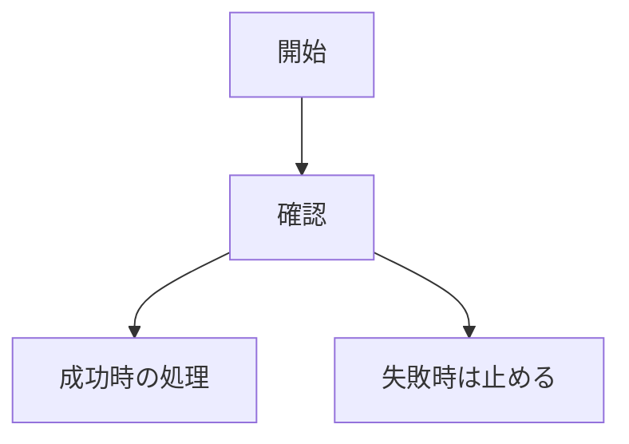

## 一言でいうと

このPRは、◯◯を◯◯するための変更です。

## なぜ必要か

今までは◯◯でした。

そのため、◯◯という問題がありました。

このPRで、◯◯になります。

## 何が変わったか

| 見る場所 | 変更前 | 変更後 |
| --- | --- | --- |
| ユーザーや運用から見える動き | ◯◯ | ◯◯ |
| システム内部の動き | ◯◯ | ◯◯ |
| 失敗した時の動き | ◯◯ | ◯◯ |

## 流れ

## レビューで見てほしい点

- ◯◯の判断でよいか
- ◯◯の説明で誤解がないか
- ◯◯の失敗時の動きで問題ないか

## 影響範囲

| 領域 | 影響 |
| --- | --- |
| API | あり / なし |
| DB / schema | あり / なし |
| Move contract | あり / なし |
| verifier / relayer / worker | あり / なし |
| UI | あり / なし |
| docs | あり / なし |

## 壊れていないことの確認

- [ ] `実行したコマンド`
- [ ] `実行したコマンド`

実行していない重要な確認:

- ◯◯。理由: ◯◯

技術詳細

## 主な変更ファイル

- `path/to/file`
  - ◯◯を担当
  - ◯◯のために変更

## 実装メモ

- ◯◯
- ◯◯

## 関連Issue

Close #123
