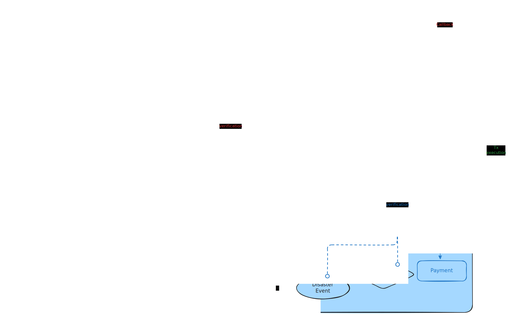

  

# Sonari

**Transparent donation infrastructure that verifies who should receive aid.**

Sonari is building a donation platform where sponsors, donors, and communities can create transparent funding pools, define support programs, and verify who should receive aid through Nautilus-backed decisioning.

## Why Sonari

Donation is one of the most important ways society moves money toward people and communities in need. But trust often breaks after funds are collected: donors may not know whether aid reached the right people, recipients may not know why they were selected or excluded, and communities may not be able to explain how money was reserved, routed, or spent.

The problem becomes sharper in urgent support programs such as disaster relief. Funds can move through multiple organizations, manual approvals, and reporting workflows before reaching recipients. Each intermediary step can add delay, administrative cost, and opacity at the exact moment when direct support matters most.

Sonari is built for donation programs where both funding and recipient selection need to be transparent. It treats aid as programmable infrastructure: donated funds sit in visible pools, support programs define explicit eligibility rules, Nautilus verifies real-world facts, and Sui Move enforces how funds can be paid.

## Market Opportunity

Charitable giving is a large real-world capital flow, not a niche behavior. In the United States alone, [Giving USA 2025](https://givingusa.org/giving-usa-2025-u-s-charitable-giving-grew-to-592-50-billion-in-2024-lifted-by-stock-market-gains/) estimates that charitable giving reached **$592.50 billion in 2024**. Globally, the [CAF World Giving Index / World Giving Report](https://www.cafonline.org/insights/research/world-giving-index) tracks giving as a broad international behavior across countries, cultures, and income levels.

For Sui, this creates an opportunity beyond crypto-native DeFi liquidity: real-world donation capital can become transparent, programmable, and auditable on-chain TVL. Sonari is designed to make that capital useful for sponsors, donors, communities, and recipients without weakening the trust boundaries that aid programs require.

## Product Overview

Sonari is a donation platform first. Its edge is that it makes both sides of an aid program inspectable: where donated funds are held, and why a recipient is eligible to receive support.

The first MVP is **parametric disaster support** for earthquake relief. Donors and sponsors fund transparent pools, support programs define payout rules, Nautilus verifies real-world earthquake and identity facts, and Sui Move enforces the final claim conditions before funds move.

> Sonari is donation-backed support infrastructure, not insurance. Donations do not create guaranteed payouts. Aid depends on pool balances, eligibility rules, program policy, fraud controls, and any verification requirements for the support program.

## How Sonari Works

Sonari turns donation-backed aid into a clear, verifiable flow:

1. **Funds enter pools.** General donations go to the Main Pool. Designated donations can fund a relief pool while also keeping the Main Pool available as a policy-controlled backstop.
2. **Programs define the rules.** A support program connects a funding policy, claim window, payout policy, and eligibility requirements.
3. **Nautilus verifies external facts.** Verifiers re-fetch source data inside a TEE, normalize it, and produce signed payloads that Move can verify.
4. **Proof services distribute inclusion proofs.** Workers can serve Merkle proofs, but they are not trusted. Move replays proofs against signed roots before accepting a claim.
5. **Move enforces the claim.** The contract checks membership, identity, residence timing, affected-cell proof, duplicate-claim state, pool balances, and campaign budget.
6. **Aid and receipts are created.** Eligible recipients receive Relief Cash, and ClaimReceipt / Impact Receipt records connect the payout to the program, event, funding source, and verification result.

## MVP Claim Model

The earthquake MVP is intentionally narrow. A recipient cannot claim only because an earthquake happened near them. A valid claim combines three things:

| Layer | What it proves |
| --- | --- |
| **Disaster proof** | Nautilus verified the earthquake source data and signed a DisasterEvent with an `affected_cells_root`. |
| **Membership and identity** | The claimant has an active Membership SBT and a valid World ID verification result. (KYC support is planned and on the roadmap, but not yet implemented in the MVP — for now, World ID is the only live claim route.) |
| **Residence and inclusion** | The claimant registered a valid `home_cell` before the earthquake cutoff, and that cell is included in the affected cells Merkle root. |

Move performs the final decision. It does not trust the frontend, worker, relayer, or storage layer to decide eligibility.

## Reference Links

All detailed documentation lives under `docs/`. This table is the full index — a good reading order is Problem → Business logic → Architecture → Contracts → Verifiers → Operations.

| Area | Details |
| --- | --- |
| Problem statement | [docs/defi_payments_problem_statement.md](docs/defi_payments_problem_statement.md) |
| Business logic | [docs/business_logic.md](docs/business_logic.md) |
| System architecture | [docs/architecture.md](docs/architecture.md) |
| Tech stack | [docs/tech_stack.md](docs/tech_stack.md) |
| Sui Move contract overview | [docs/contracts_overview.md](docs/contracts_overview.md) |
| Sui Move contract design spec | [docs/contracts_spec.md](docs/contracts_spec.md) |
| Fund flow spec | [docs/fund_flow_spec.md](docs/fund_flow_spec.md) |
| Donation flow | [docs/donation_flow.md](docs/donation_flow.md) |
| Nautilus verifier overview | [docs/verifiers/overview.md](docs/verifiers/overview.md) |
| Earthquake verifier | [docs/verifiers/earthquake.md](docs/verifiers/earthquake.md) |
| Identity verifier | [docs/verifiers/identity.md](docs/verifiers/identity.md) |
| Proof workers | [docs/verifiers/proof_workers.md](docs/verifiers/proof_workers.md) |
| Operations & runbooks | [docs/operations/README.md](docs/operations/README.md) |

---

# Sonari（日本語）

**誰が支援を受け取るべきかを検証する、透明な寄付インフラ。**

Sonari は、スポンサー・寄付者・コミュニティが透明な資金 Pool を作り、支援プログラムを定義し、誰が支援を受け取るべきかを Nautilus による判定で検証できる寄付プラットフォームを構築しています。

## なぜ Sonari か

寄付は、社会が困っている人々やコミュニティへお金を動かす最も重要な手段の一つです。しかし資金が集まったあと、信頼はしばしば壊れます。寄付者は支援が正しい人に届いたか分からず、受給者は自分が選ばれた／外された理由を知らず、コミュニティはお金がどう確保・分配・支出されたかを説明できないことがあります。

この問題は災害支援のような緊急プログラムでより深刻になります。資金は受給者に届くまでに複数の組織・手作業の承認・報告ワークフローを経由しえます。各中間ステップが、直接支援が最も重要なまさにその瞬間に、遅延・管理コスト・不透明さを足していきます。

Sonari は、資金と受給者選定の両方の透明性が必要な寄付プログラムのために作られています。支援をプログラム可能なインフラとして扱います。寄付された資金は可視の Pool に置かれ、支援プログラムは明示的な受給資格ルールを定義し、Nautilus は現実世界の事実を検証し、Sui Move は資金の支払い条件を強制します。

## プロダクト概要

Sonari はまず寄付プラットフォームです。その強みは、支援プログラムの両面を検査可能にすることです。寄付資金がどこに保持されているか、そしてなぜ受給者が支援を受ける資格があるか、の両方です。

最初の MVP は地震支援向けの **パラメトリック災害支援** です。寄付者とスポンサーが透明な Pool に資金を入れ、支援プログラムが支払いルールを定義し、Nautilus が現実世界の地震・本人確認の事実を検証し、Sui Move が資金が動く前の最終的な claim 条件を強制します。

> Sonari は寄付に裏付けられた支援インフラであり、保険ではありません。寄付は保証された支払いを生みません。支援は Pool 残高・受給資格ルール・プログラム方針・不正対策・各支援プログラムの検証要件に依存します。

## 仕組み

Sonari は寄付に裏付けられた支援を、明快で検証可能なフローに変えます。

1. **資金が Pool に入る。** 一般寄付は Main Pool に入ります。指定寄付は relief Pool に資金を入れつつ、Main Pool を方針制御のバックストップとして残せます。
2. **プログラムがルールを定義する。** 支援プログラムは資金方針・claim 期間・支払い方針・受給資格要件を結びつけます。
3. **Nautilus が外部事実を検証する。** verifier は TEE の中で source データを再取得し、正規化し、Move が検証できる署名済み payload を生成します。
4. **proof サービスが inclusion proof を配布する。** Worker は Merkle proof を配れますが、信頼されません。Move は claim を受理する前に、署名済み root に対して proof を再検証します。
5. **Move が claim を強制する。** コントラクトは membership・identity・居住タイミング・被災セル proof・重複 claim 状態・Pool 残高・Campaign 予算を確認します。
6. **支援と receipt が作られる。** 資格ある受給者は Relief Cash を受け取り、ClaimReceipt / Impact Receipt 記録が支払いをプログラム・イベント・資金源・検証結果に結びつけます。

## MVP の claim モデル

地震 MVP は意図的に狭く設計されています。近くで地震が起きたというだけでは claim できません。有効な claim は3つを組み合わせます。

| レイヤー | 何を証明するか |
| --- | --- |
| **災害 proof** | Nautilus が地震の source データを検証し、`affected_cells_root` 付きの DisasterEvent に署名した。 |
| **membership と identity** | 申請者が有効な Membership SBT と、有効な World ID 検証結果を持つ。（KYC は今後実装予定の provider だが MVP では未実装で、現状は World ID のみが有効な claim 経路。） |
| **居住と inclusion** | 申請者が地震の cutoff より前に有効な `home_cell` を登録し、そのセルが被災セル Merkle root に含まれる。 |

最終判断は Move が行います。frontend・worker・relayer・storage 層に受給資格の判断を委ねません。

## 参照リンク

詳細なドキュメントはすべて `docs/` 配下にあります。下表がその索引です（推奨の読む順序: 課題 → ビジネスロジック → アーキテクチャ → コントラクト → Verifier → 運用）。

| 領域 | 資料 |
| --- | --- |
| 課題（問題提起） | [docs/defi_payments_problem_statement.md](docs/defi_payments_problem_statement.md) |
| ビジネスロジック | [docs/business_logic.md](docs/business_logic.md) |
| システムアーキテクチャ | [docs/architecture.md](docs/architecture.md) |
| 技術スタック | [docs/tech_stack.md](docs/tech_stack.md) |
| Sui Move コントラクト概要 | [docs/contracts_overview.md](docs/contracts_overview.md) |
| Sui Move コントラクト設計仕様 | [docs/contracts_spec.md](docs/contracts_spec.md) |
| 資金フロー仕様 | [docs/fund_flow_spec.md](docs/fund_flow_spec.md) |
| 寄付フロー | [docs/donation_flow.md](docs/donation_flow.md) |
| Nautilus verifier 概要 | [docs/verifiers/overview.md](docs/verifiers/overview.md) |
| 地震 verifier | [docs/verifiers/earthquake.md](docs/verifiers/earthquake.md) |
| identity verifier | [docs/verifiers/identity.md](docs/verifiers/identity.md) |
| proof worker | [docs/verifiers/proof_workers.md](docs/verifiers/proof_workers.md) |
| 運用 & Runbook | [docs/operations/README.md](docs/operations/README.md) |
