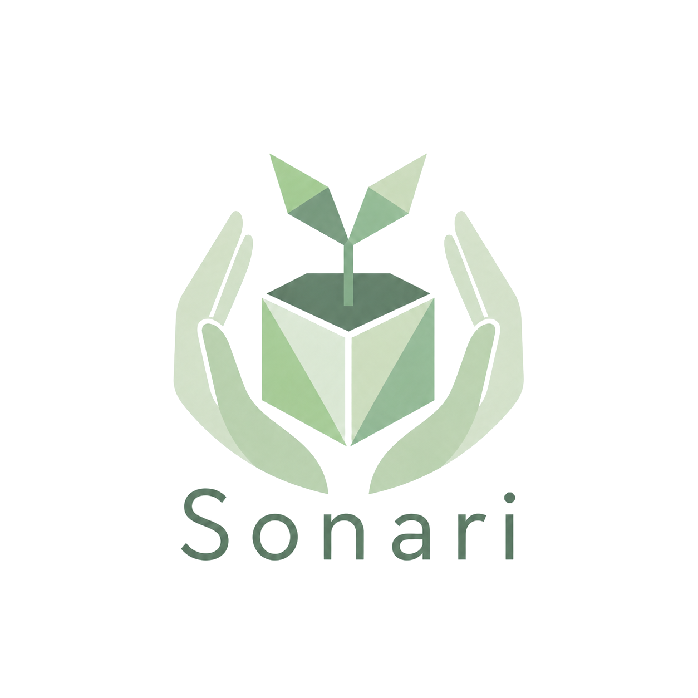

  

# Sonari

**Transparent donation infrastructure that verifies who should receive aid.**

Sonari is building a donation platform where sponsors, donors, and communities can create transparent funding pools, define support programs, and verify who should receive aid through Nautilus-backed decisioning.

## Why Sonari

Donation is one of the most important ways society moves money toward people and communities in need. But trust often breaks after funds are collected: donors may not know whether aid reached the right people, recipients may not know why they were selected or excluded, and communities may not be able to explain how money was reserved, routed, or spent.

The problem becomes sharper in urgent support programs such as disaster relief. Funds can move through multiple organizations, manual approvals, and reporting workflows before reaching recipients. Each intermediary step can add delay, administrative cost, and opacity at the exact moment when direct support matters most.

Sonari is built for donation programs where both funding and recipient selection need to be transparent. It treats aid as programmable infrastructure: donated funds sit in visible pools, support programs define explicit eligibility rules, Nautilus verifies real-world facts, and Sui Move enforces how funds can be paid.

## Market Opportunity

Charitable giving is a large real-world capital flow, not a niche behavior. In the United States alone, [Giving USA 2025](https://givingusa.org/giving-usa-2025-u-s-charitable-giving-grew-to-592-50-billion-in-2024-lifted-by-stock-market-gains/) estimates that charitable giving reached **$592.50 billion in 2024**. Globally, the [CAF World Giving Index / World Giving Report](https://www.cafonline.org/insights/research/world-giving-index) tracks giving as a broad international behavior across countries, cultures, and income levels.

For Sui, this creates an opportunity beyond crypto-native DeFi liquidity: real-world donation capital can become transparent, programmable, and auditable on-chain TVL. Sonari is designed to make that capital useful for sponsors, donors, communities, and recipients without weakening the trust boundaries that aid programs require.

## Product Overview

Sonari is a donation platform first. Its edge is that it makes both sides of an aid program inspectable: where donated funds are held, and why a recipient is eligible to receive support.

The first MVP is **parametric disaster support** for earthquake relief. Donors and sponsors fund transparent pools, support programs define payout rules, Nautilus verifies real-world earthquake and identity facts, and Sui Move enforces the final claim conditions before funds move.

> Sonari is donation-backed support infrastructure, not insurance. Donations do not create guaranteed payouts. Aid depends on pool balances, eligibility rules, program policy, fraud controls, and any verification requirements for the support program.

## How Sonari Works

> **Overview diagram placeholder:** add the final system overview image here when it is ready. Suggested path: `docs/assets/sonari-overview.png`.

Sonari turns donation-backed aid into a clear, verifiable flow:

1. **Funds enter pools.** General donations go to the Main Pool. Designated donations can fund a relief pool while also keeping the Main Pool available as a policy-controlled backstop.
2. **Programs define the rules.** A support program connects a funding policy, claim window, payout policy, and eligibility requirements.
3. **Nautilus verifies external facts.** Verifiers re-fetch source data inside a TEE, normalize it, and produce signed payloads that Move can verify.
4. **Proof services distribute inclusion proofs.** Workers can serve Merkle proofs, but they are not trusted. Move replays proofs against signed roots before accepting a claim.
5. **Move enforces the claim.** The contract checks membership, identity, residence timing, affected-cell proof, duplicate-claim state, pool balances, and campaign budget.
6. **Aid and receipts are created.** Eligible recipients receive Relief Cash, and ClaimReceipt / Impact Receipt records connect the payout to the program, event, funding source, and verification result.

## MVP Claim Model

The earthquake MVP is intentionally narrow. A recipient cannot claim only because an earthquake happened near them. A valid claim combines three things:

| Layer | What it proves |
| --- | --- |
| **Disaster proof** | Nautilus verified the earthquake source data and signed a DisasterEvent with an `affected_cells_root`. |
| **Membership and identity** | The claimant has an active Membership SBT and a valid KYC or World ID verification result. |
| **Residence and inclusion** | The claimant registered a valid `home_cell` before the earthquake cutoff, and that cell is included in the affected cells Merkle root. |

Move performs the final decision. It does not trust the frontend, worker, relayer, or storage layer to decide eligibility.

## Reference Links

Detailed component documentation lives in focused docs and package READMEs:

| Area | Details |
| --- | --- |
| Product and web app | [docs/webapp.md](docs/webapp.md) |
| Business logic | [docs/business_logic.md](docs/business_logic.md) |
| Sui Move contract design spec | [contracts/README.md](contracts/README.md) |
| Nautilus verifier overview | [nautilus/verifiers/README.md](nautilus/verifiers/README.md) |
| Earthquake verifier | [nautilus/verifiers/earthquake/README.md](nautilus/verifiers/earthquake/README.md) |
| Identity verifier | [nautilus/verifiers/membership/README.md](nautilus/verifiers/membership/README.md) |
| Affected cells proof worker | [packages/affected-cells-proof-worker/README.md](packages/affected-cells-proof-worker/README.md) |
| Residence proof worker | [packages/residence-proof-worker/README.md](packages/residence-proof-worker/README.md) |
