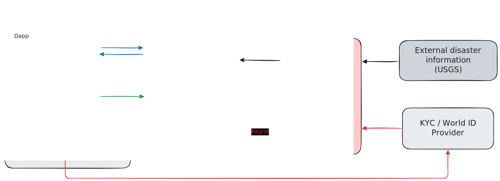

  

# Sonari

**A transparent donation platform for verified aid on Sui.**

Sonari helps donations move to people who are eligible for support, while keeping both the money flow and the eligibility decision verifiable. Donors can see where funds are held. Recipients can see why they qualify. Sui Move contracts enforce the final rules, and Nautilus-backed verifiers turn real-world facts into signed results that the contracts can check.

The MVP focuses on earthquake relief:

1. Official earthquake data is verified inside a Nautilus TEE.
2. A verified disaster creates an on-chain relief campaign.
3. A recipient proves membership, residence, and identity.
4. Sui Move checks the signed disaster result, the identity result, the affected-area proof, duplicate-claim state, and pool balances before paying relief.

Sonari is **not insurance**. Donations do not guarantee payouts. Relief depends on pool balances, program rules, verification requirements, fraud controls, and claim timing.

## Why Sonari

Donation programs often become hard to audit after funds are collected. Donors may not know whether funds reached the intended people. Recipients may not know why they were selected or excluded. Operators may need to coordinate disaster facts, identity checks, payment rules, and reports across systems that are not publicly verifiable.

Sonari is a donation platform that makes aid programmable and publicly verifiable:

- Funds are held in visible Sui pools.
- Support programs define explicit payout and eligibility rules.
- Nautilus verifiers re-check external facts in a TEE and sign only verified results.
- Sui Move contracts re-check signatures, proofs, ownership, timing, and balances before money moves.

The result is a donation-backed aid flow where the important decisions are inspectable instead of being hidden inside a server or manual process.

## MVP

| Area | MVP behavior |
| --- | --- |
| Disaster source | USGS earthquake detail data and ShakeMap data |
| Disaster verification | Nautilus TEE re-fetches source data, computes affected H3 cells, signs a finalized payload |
| Identity route | World ID is the live MVP route |
| Planned identity providers | KYC, student ID, university account, and similar provider checks can be added later |
| Chain | Sui Move contracts hold funds, verify signed results, and enforce claim rules |
| Currency | USDC |
| Aid model | Two-stage relief: immediate floor payout and later pro-rata campaign payout |

## Extension Direction

The earthquake MVP is the first use case, not the limit of the design.

**Other disasters.** Sonari can extend to floods, typhoons, tsunami, wildfire, evacuation orders, or other public emergencies when an official source policy is defined. Each new disaster type needs clear source data, payload meaning, fixtures, verifier logic, and Move checks. The key rule stays the same: the official data is re-fetched and verified inside Nautilus, then Sui accepts only the signed result.

**Student and community support.** The same pattern can support non-disaster programs. A verifier can check a student ID, university email, university SSO account, enrollment API, or other eligibility proof, then produce a signed result for Sui. The contract can then route donations to student support, scholarships, tuition assistance, emergency grants, or other community aid programs without storing raw personal data on-chain.

## How It Works

1. **Donors fund pools.** Donations are split by the contract into campaign, category, main support, and operations pools.
2. **Nautilus verifies facts.** External facts such as earthquake data or identity proof are checked inside a TEE and signed.
3. **Sui verifies the signed results.** Move contracts verify the enclave key, signature, payload bytes, status, and proof roots.
4. **Recipients claim relief.** A valid claim combines identity, membership, residence timing, affected-area proof, and duplicate-claim protection.
5. **Receipts make the flow inspectable.** Donations, payouts, and claim receipts connect funds to the campaign and verification results.

## Judge Reading Order

These four documents are the intended review path:

| Document | Purpose |
| --- | --- |
| [Disaster Oracle](docs/disaster_oracle.md) | How official disaster information becomes a signed Sui result |
| [Identity Verification](docs/identity_verification.md) | How World ID works today, and how KYC / student credentials can be added |
| [Donation Flow](docs/donation_flow.md) | How money moves, how payouts are calculated, and why payouts are not first-come-first-served |
| [Technical Architecture](docs/technical_architecture.md) | How the dapp, Nautilus, relayers, storage, and Sui contracts fit together |

Technical references remain available in [`docs/verifiers/`](docs/verifiers/), [`docs/internal/contracts_spec.md`](docs/internal/contracts_spec.md), and [`schemas/`](schemas/).

## Status

Implemented in the MVP:

- Earthquake verifier for USGS and ShakeMap data.
- Affected-cell Merkle root generation and proof distribution.
- World ID based identity verification.
- Membership SBT and residence-cell based claim checks.
- Sui Move contracts for pools, campaigns, disaster events, identity records, claims, payouts, and receipts.

Planned extensions:

- KYC provider support.
- Student ID / university account provider support.
- Additional official disaster sources and disaster categories.
- Additional dashboards for operational state and review.

---

# Sonari（日本語）

**Sui 上で、寄付資金と受給資格を検証可能にする寄付プラットフォーム。**

Sonari は、寄付されたお金がどこにあり、誰がなぜ支援を受け取れるのかを検証可能にする仕組みです。資金の流れは Sui Move コントラクトが管理し、現実世界の事実は Nautilus を使った verifier が TEE 内で検証して署名します。

MVP は地震支援に絞っています。

1. 公式地震データを Nautilus TEE 内で検証する。
2. 検証済み災害から on-chain の支援 Campaign を作る。
3. 受給者は membership、居住地域、本人確認を示す。
4. Sui Move が署名済み災害結果、本人確認結果、被災地域 proof、重複 claim、Pool 残高を検証してから支払う。

Sonari は **保険ではありません**。寄付は保証された支払いを生みません。支援は Pool 残高、プログラムルール、検証要件、不正対策、申請タイミングに依存します。

## なぜ Sonari か

寄付プログラムでは、資金を集めた後の透明性が失われがちです。寄付者は資金が意図した人に届いたか分からず、受給者は自分が選ばれた理由や外された理由を把握しにくく、運営者は災害情報、本人確認、支払いルール、報告を複数システムで調整する必要があります。

Sonari は、支援をプログラム可能で公開検証できる形にする寄付プラットフォームです。

- 資金は Sui 上の可視な Pool に置かれる。
- 支援プログラムは明示的な支払い条件と受給資格を持つ。
- Nautilus verifier は外部事実を TEE 内で再確認し、検証済み結果だけに署名する。
- Sui Move は署名、proof、所有者、時刻、残高を検証してから資金を動かす。

重要な判断をサーバーや手作業の中に隠さず、検証可能にすることが Sonari の目的です。

## MVP

| 領域 | MVP の内容 |
| --- | --- |
| 災害 source | USGS earthquake detail data と ShakeMap data |
| 災害検証 | Nautilus TEE が source data を再取得し、被災 H3 cell を計算し、finalized payload に署名 |
| 本人確認 | World ID が MVP の live route |
| 将来 provider | KYC、学生証、大学アカウントなどを後から追加可能 |
| Chain | Sui Move が資金を保持し、署名済み結果を検証し、claim rules を強制 |
| 通貨 | USDC |
| 支援モデル | 即時の床払いと、後日の Campaign 按分払いの2段階 |

## 今後の拡張

地震 MVP は最初のユースケースであり、設計の上限ではありません。

**他の災害。** 公式 source policy を定義すれば、洪水、台風、津波、火災、避難情報などにも拡張できます。新しい災害種別ごとに、source data、payload の意味、fixture、verifier logic、Move checks を定義します。基本は同じです。公式情報を Nautilus 内で再取得・検証し、Sui は署名済み結果だけを受け入れます。

**学生・コミュニティ支援。** 同じ仕組みは災害以外にも使えます。学生証、大学メール、大学 SSO、在学証明 API などを verifier provider として追加すれば、学生支援、奨学金型支援、授業料補助、緊急給付などに応用できます。raw personal data を on-chain に保存せず、検証済み result だけを使う設計です。

## 仕組み

1. **寄付者が Pool に資金を入れる。** コントラクトが寄付を Campaign、Category、Main support、Operations Pool に分割します。
2. **Nautilus が事実を検証する。** 地震データや本人確認 proof などの外部事実を TEE 内で確認し、署名します。
3. **Sui が署名済み結果を検証する。** Move が enclave key、signature、payload bytes、status、proof root を検証します。
4. **受給者が claim する。** 有効な claim には identity、membership、居住登録時刻、被災地域 proof、重複 claim 防止が必要です。
5. **receipt で追跡できる。** 寄付、支払い、claim receipt が Campaign と検証結果に結び付きます。

## 審査員向けの読む順序

以下の4本が主なレビュー導線です。

| Document | Purpose |
| --- | --- |
| [Disaster Oracle](docs/disaster_oracle.md) | 公式災害情報を署名済み Sui result にする仕組み |
| [Identity Verification](docs/identity_verification.md) | World ID の現状と、KYC / 学生 credential への拡張 |
| [Donation Flow](docs/donation_flow.md) | お金の流れ、計算式、早い者勝ちにならない理由 |
| [Technical Architecture](docs/technical_architecture.md) | dapp、Nautilus、relayer、storage、Sui contract の全体像 |

技術補足は [`docs/verifiers/`](docs/verifiers/)、[`docs/internal/contracts_spec.md`](docs/internal/contracts_spec.md)、[`schemas/`](schemas/) に残しています。

## 状況

MVP で実装済み:

- USGS / ShakeMap data 向け地震 verifier。
- affected-cell Merkle root 生成と proof 配布。
- World ID による本人確認。
- Membership SBT と residence cell に基づく claim checks。
- Pool、Campaign、DisasterEvent、IdentityRecord、Claim、Payout、Receipt 向け Sui Move contracts。

今後の拡張:

- KYC provider support。
- 学生証 / 大学アカウント provider support。
- 追加の公式災害 source と災害カテゴリ。
- 運用状態や review 用 dashboard。
