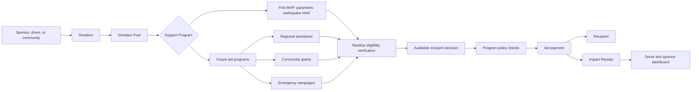
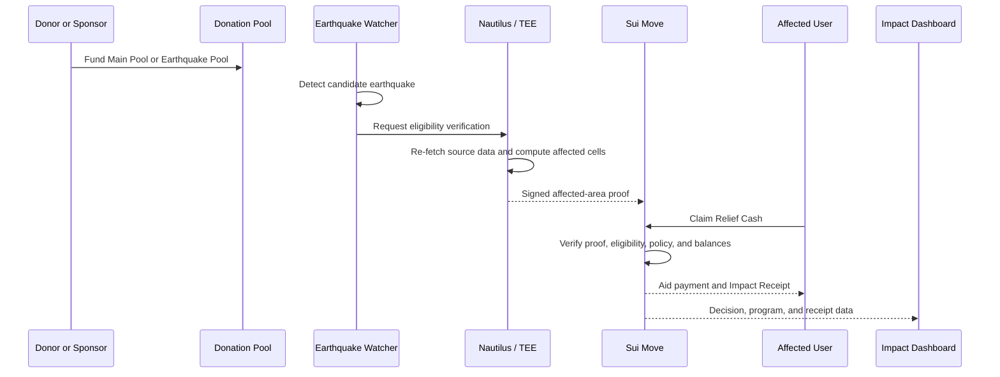

  

# Sonari

**Transparent donation infrastructure that verifies who should receive aid.**

Sonari is building a donation platform where sponsors, donors, and communities can create transparent funding pools, define support programs, and verify who should receive aid through Nautilus-backed decisioning.

Most donation platforms show where money was collected. Sonari goes further: it makes the eligibility decision itself verifiable. The first MVP is **parametric disaster support**, where Nautilus checks real-world earthquake impact and produces transparent proof that a recipient is in an affected area before aid is paid.

> Sonari is donation-backed support infrastructure, not insurance. Donations do not create guaranteed payouts. Aid depends on pool balances, eligibility rules, program policy, fraud controls, and any verification requirements for the support program.

## What Sonari Solves

Donation programs often struggle to earn trust after funds are collected:

| Problem | What it means in practice |
| --- | --- |
| Fund opacity | Donors cannot easily see where money is reserved, routed, or spent. |
| Opaque recipient selection | It is often unclear why one person, household, or region receives support while another does not. |
| Manual operations | Aid teams must coordinate eligibility, approvals, treasury movement, and reporting by hand. |
| Weak impact visibility | Sponsors and communities lack clear receipts that connect donations to outcomes. |
| Hard-to-scale programs | Each new campaign or support category often needs a new operational process. |
| Slow emergency response | In time-sensitive cases, support may arrive after the most urgent window has passed. |

Sonari reframes donation programs as programmable aid flows: transparent pools, explicit policies, Nautilus-backed eligibility verification, and receipt trails that make both funding and recipient selection easier to inspect.

## Platform Concept

Sonari is built around five platform primitives:

| Primitive | Purpose |
| --- | --- |
| **Donation Pools** | Visible funding pools for general aid, campaigns, regions, disaster categories, or sponsor programs. |
| **Support Programs** | Programmable rules that define who can receive aid, when funds can be used, and which pool pays first. |
| **Nautilus Verification** | Transparent decisioning that checks external facts and produces auditable proof of who qualifies. |
| **Aid Payments** | Direct support sent to eligible recipients. In the first MVP, this appears as Relief Cash. |
| **Impact Receipts** | Transparent records that connect donations, eligibility decisions, recipients, and sponsor impact reporting. |

Parametric disaster relief is one support program type. Over time, the same platform can support other donation-backed aid flows where eligibility needs to be explained and audited, such as regional assistance, community grants, emergency campaigns, nonprofit distributions, or sponsor-funded programs.

## Platform Flow

The long-term product loop is simple: collect donations into transparent pools, attach them to support programs, use Nautilus to verify who qualifies, move funds under clear rules, and make outcomes visible through receipts and dashboards.

## Core Participants

| Participant | Role |
| --- | --- |
| Donors and sponsors | Fund general pools, campaign pools, or program-specific pools. |
| Communities and operators | Create support programs and define how donated funds should be used. |
| Recipients | Receive aid when Nautilus verification and program rules show they qualify. |
| Nautilus verification layer | Checks external facts and produces auditable eligibility decisions for support programs. |
| Sui Move contracts | Enforce pool policy, eligibility, payout rules, and receipt creation. |
| Dashboard | Shows donation flow, pool balances, program status, claims, and impact reporting. |

## First MVP: Parametric Disaster Support

The initial MVP proves Sonari through an earthquake relief program:

MVP payout priority:

1. Use the **Earthquake Pool** first for earthquake-specific support.
2. Use the **Main Pool** as a policy-controlled backstop when the Earthquake Pool is insufficient.
3. Produce an **Impact Receipt** so each payout can be connected back to the support program, Nautilus decision, verified event, and funding source.

This MVP is intentionally narrow. Earthquakes provide a concrete way to test Sonari's core difference from ordinary donation tools: transparent donations plus verifiable recipient selection. Nautilus determines whether a claimant is connected to an affected area, and Sui Move enforces the program rules before funds move.

## Why Sui

Sui is a strong fit for Sonari because donations, pools, program policies, eligibility proofs, receipts, and recipient-facing assets can be represented as composable on-chain objects. Programmable Transaction Blocks can combine multi-step aid flows into a single user action, while Move contracts enforce transparent rules around how donated funds are used.

## What to Remember

Sonari is a donation platform first. Its key difference is that Nautilus helps verify and decide who should receive support in a transparent, auditable way. Parametric earthquake relief is the first MVP because it clearly proves that model: transparent donations, explicit support rules, trusted external signals, verifiable recipient selection, aid payments, and impact receipts.
