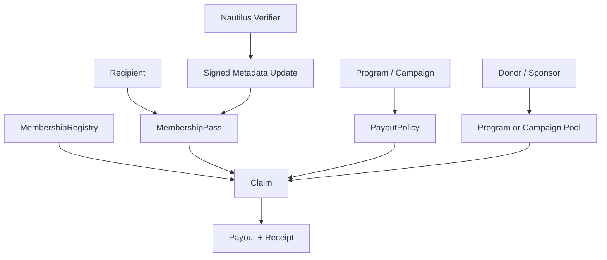
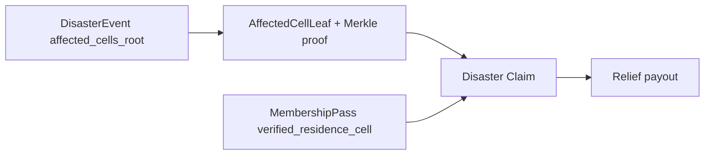

# Sonari Sui Contracts 要件定義

## 1. Overview

Sonari は、Nautilus で受取対象を検証できる汎用寄付プラットフォームである。災害支援は最初のユースケースだが、contracts の中心は災害専用 object ではなく、`Program / Campaign`、`Pool`、`Membership Pass`、`DonorPass`、`Nautilus Verifier Result`、`Eligibility Root / Result`、`Claim / Payout` の汎用基盤に置く。

Sonari は保険商品ではない。支払い保証をしない。Verification Fee は支援金の購入や継続的な掛け金ではなく、検証、Sybil 対策、運営費を支える一度きりの費用であり、Operations Pool に入る。

PR3 / MVP の donation、pool、donor、budget、payout accounting は Circle 公式 Sui USDC 固定で扱う。coin type は `0xdba34672e30cb065b1f93e3ab55318768fd6fef66c15942c9f7cb846e2f900e7::usdc::USDC` であり、source では dependency named address `usdc` により `usdc::usdc::USDC` として参照する。金額は USDC の最小単位で保存し、USDC decimals は 6 を前提にする。repository-local の代替 coin は使わない。任意の `Coin<T>` を受け取る generic donation entry、multi-coin accounting、価格換算、swap、asset whitelist、coin type ごとの Pool 分離は MVP では実装しない。

### 1.1 中心概念

| Concept | 役割 |
| --- | --- |
| `Program` | 寄付の目的、検証要件、対象者種別、Pool 方針、Claim 方針を束ねる上位単位。例: Disaster Relief Program、Student Aid Program。 |
| `Campaign` | Program 配下の期間・スポンサー・地域・災害種別などで区切った実行単位。 |
| `Pool` | Main Pool、Designated Relief Pool、Operations Pool、Campaign Pool などの資金管理単位。 |
| `MembershipPass` | 全受取者が必ず持つ受取者向け owned SBT。`has key` only / no `store` / 通常 transfer API なしとし、Pass metadata は Nautilus 署名済み update だけを信頼する。 |
| `MembershipRegistry` | current MembershipPass の shared index。lineage 単位の current pass、owner 重複発行防止、Claim 時の current pass 検証、将来 recovery の拡張点を担う。 |
| `DonorPass` | 寄付者向け owned object / has key only の SBT。通常 transfer API なしとし、寄付者の貢献証明と dapp 表示に使う。Claim 権利や支払い保証は与えない。 |
| `DonorRegistry` | donor address -> current DonorPass id の軽量 shared index。重複発行防止と 2 回目以降の current DonorPass 確認に使う。 |
| `DonationRecord` | `DonorPass` に dynamic field として紐づく寄付履歴。各寄付の最小情報だけを保持し、`DonorPass` 本体は集計情報だけを保持する。 |
| `NautilusVerifierResult` | Nautilus / TEE が生成する署名済み検証結果。Disaster、Residence、Student など verifier family ごとに作る。 |
| `EligibilityRoot` / `EligibilityResult` | Program / Campaign が Claim に使う対象者集合または個別対象判定の抽象化。 |
| `Claim` / `Payout` | MembershipRegistry、Pass、Verifier Result、Pool、PayoutPolicy を検証して支払いを実行し、二重 Claim を防ぐ。 |

`DisasterEvent` は汎用 Claim 基盤そのものではない。Disaster Relief Program のために、災害イベントと `affected_cells_root` を保存する Program 固有 object として扱う。

### 1.2 MVP 完成状態

| 分類 | mainnet で動く必要があるもの |
| --- | --- |
| Deployment | Sui mainnet に contracts package が publish されている |
| Program | Disaster Relief Program と Earthquake Campaign / Pool を作成できる |
| Pool | Main Pool、Designated Relief Pool、Operations Pool を分離して管理できる |
| Donation | General Donation、Designated Donation、Operations Donation を入金できる |
| Donation | 初回寄付時に寄付者へ DonorPass を自動発行できる |
| Donation | 2 回目以降の寄付を既存 DonorPass の DonationRecord として追加できる |
| Donation | DonorPass の集計情報と tier を dapp から読める |
| Membership | 受取者に MembershipPass を発行できる |
| Membership | MembershipRegistry shared object に current pass record と owner index を作成できる |
| Membership | Pass metadata update は Nautilus 署名済み result のみ受理する |
| Disaster | Nautilus Disaster Oracle の finalized payload から DisasterEvent を作成できる |
| Claim | active MembershipPass、Registry current pass 整合性、有効な signed Residence / Student metadata を前提に Claim 対象を判定できる |
| Payout | `PayoutPolicy` と Program / Campaign budget に基づいて Pool から支払える |
| Safety | Pool 残高、CampaignBudget、Main Pool reserve を超えて支払わない |
| dapp | Donation、Registration、Claim、Pool、Program / Campaign 状態を読める |

### 1.3 絶対制約

- 支払い保証をしない
- 保険料、掛け金、補償購入のように扱わない
- Verification Fee を Relief payout 原資として扱わない
- Operations Pool と Relief / Campaign Pool を混同しない
- Designated Pool 同士を無断流用しない
- Main Pool は 1 Campaign / 1 Event で使い切らない
- DonorPass / DonationRecord を Claim 権利や支払い保証として扱わない
- raw email、phone、GPS 履歴、端末情報、住所、学籍番号、本人確認詳細をオンチェーンに出さない
- dapp、Relayer、Worker、offchain DB を信用しない
- emergency pause を実装する
- 実資金運用の DeFi 連携は MVP では行わない
- MembershipPass / DonorPass migration / recovery API、MIGRATION verifier family、MigrationMessage、PassMigrated event は MVP では実装しない

## 2. Business Rules

### 2.1 Pool 構成

| Pool | 用途 | 原資 | MVP 方針 |
| --- | --- | --- | --- |
| Main Pool | 用途を限定しない共通支援プール。Designated Pool 不足時の backstop。 | General Donation、Designated Donation の一部 | Sonari 全体の支援原資。Future Disaster Reserve を残す。 |
| Designated Relief Pool | 災害種別、地域、スポンサー、Campaign など用途指定の支援プール。 | Designated Donation の一部 | Earthquake Pool を最初に扱う。 |
| Campaign Pool | Student Aid など災害以外の Program / Campaign に紐づく Pool。 | Campaign 指定寄付、スポンサー寄付 | docs 上の設計対象。実装は follow-up。 |
| Operations Pool | Nautilus 実行費、TEE / DB / 監視、サポート、監査、保守。 | Verification Fee、Operations Donation、将来の yield | Relief Pool と明示的に分離する。 |

Donation 配分の既存方針は維持する。

```text
General Donation
  -> 100% Main Pool

Designated Donation
  -> 50% Designated Relief Pool or Campaign Pool
  -> 50% Main Pool

Operations Donation
  -> 100% Operations Pool
```

PR3 で実装する Pool はすべて公式 Sui USDC 専用である。`MainPool`、`DesignatedPool`、`OperationsPool` は `Balance<usdc::usdc::USDC>` と累計 USDC 受入額を保持し、USDC 以外の `Coin<T>` を deposit できる public API surface を持たない。Designated Donation の split は `main = amount / 2`、`designated = amount - main` とし、奇数額の端数は Designated / Campaign Pool 側へ寄せる。

### 2.2 Donation / DonorPass

Donation flow は Pool への入金と寄付者向け記録を同じ transaction 境界で扱う。Pool split は既存方針を維持し、`DonorPass` / `DonationRecord` はその結果を寄付者側に記録するための object である。

Donation API は `contracts::accessor` に集約し、USDC 専用の `public fun` として `donate_general_usdc`、`donate_designated_usdc`、`donate_operations_usdc` を提供する。既存 `DonorPass` を更新する API は `donate_general_usdc_with_pass`、`donate_designated_usdc_with_pass`、`donate_operations_usdc_with_pass` とし、いずれも `Coin<usdc::usdc::USDC>` 固定である。この 6 つの user-facing donation API は `public entry` ではなく `accessor.move` の `public fun` として公開する。任意の `Coin<T>` generic donation は提供しない。zero amount は fail-closed で abort する。donation 前に global pause と対象 Pool pause を検証する。

Donation の user-facing callable API は `accessor.move` の薄い入口に限定し、pause check を行ったうえで Pool deposit / event emit、Designated split、first donation の `DonorPass` 発行、with-pass の owner / registry 検証と `DonationRecord` 追加を `donation` module 内の private / `public(package)` helper に委譲する。`MainPool`、`OperationsPool`、`DonorRegistry` は MVP では package init で 1 個だけ作成する genesis object とし、AdminCap gated create API は提供しない。`admin.move` は `AdminCap` gated な admin-facing API として `DesignatedPool` 作成、verifier key 管理、emergency pause 操作を担当する。`donation` / `pools` の実装関数と singleton 作成 helper は `public(package)` に留め、test convenience のために production API surface を広げない。generic `Coin<T>` donation surface と Claim / Payout 権利 API は追加しない。

初回寄付時は、寄付者 wallet に `DonorPass` を自動 mint する。2 回目以降の寄付では、既存 `DonorPass` に dynamic field として `DonationRecord` を追加し、`DonorPass` 本体の集計情報を更新する。`DonorPass` は寄付者向け owned object / has key only の SBT とし、通常 transfer API は提供しない。

`DonorRegistry` は donor address -> current DonorPass id の軽量 shared registry である。初回発行時に donor address と `DonorPass` ID を登録し、同じ donor が初回寄付 entry を再利用して複数 pass を mint することを拒否する。2 回目以降の寄付では、渡された `DonorPass` の id が registry 上の current DonorPass id と一致することを検証する。

MVP では DonorPass migration / recovery API は実装しない。`DonorPass` に status は追加せず、MembershipRecord 相当の重い record 構造も持たせない。将来 DonorPass migration を扱う場合は、既存 Pass を transfer せず、同じ `donor_lineage_id` の新 DonorPass を発行し、DonorRegistry 側で current pass を切り替える follow-up として扱う。

`DonorPass` 本体は集計情報だけを保持する。

| Field | 意味 |
| --- | --- |
| `owner` | DonorPass owner wallet |
| `donor_lineage_id` | 将来の DonorPass migration 後も寄付者系譜を追うための ID |
| `total_donated` | 累計寄付額 |
| `donation_count` | 累計寄付回数 |
| `first_donated_at_ms` | 初回寄付時刻 |
| `last_donated_at_ms` | 直近寄付時刻 |
| `tier` | 累計寄付額または寄付回数に基づく donor tier |

`DonationRecord` は各寄付の最小情報だけを保持する。

| Field | 意味 |
| --- | --- |
| `donation_index` | DonorPass 内の寄付連番 |
| `donation_type` | General / Designated / Operations などの寄付種別 |
| `program_id` | Program 指定寄付の場合の optional ID |
| `campaign_id` | Campaign 指定寄付の場合の optional ID |
| `pool_id` | 寄付が対象とした Pool |
| `amount` | 寄付額 |
| `coin_type` | 寄付 asset type。PR3 では USDC 固定値のみ |
| `donated_at_ms` | 寄付時刻 |

毎回 `DonationRecorded` event を emit する。初回寄付で `DonorPass` を mint した場合は `DonorPassIssued` event も emit する。累計寄付額または寄付回数により `tier` が変わった場合は `DonorTierUpdated` event を emit する。

PR3 の tier は累計 USDC 寄付額だけで決める。閾値は USDC 最小単位で、`TIER_NONE = 0`、`TIER_BRONZE = 1`、`TIER_SILVER = 2`、`TIER_GOLD = 3` とし、`BRONZE >= 1`、`SILVER >= 1_000_000`、`GOLD >= 10_000_000` を初期値にする。USDC decimals は 6 なので、`1_000_000` は 1 USDC、`10_000_000` は 10 USDC と解釈する。tier が変わった時だけ `DonorTierUpdated` event を emit する。

`DonorPass` / `DonationRecord` は寄付者の貢献証明と dapp 表示用であり、支払い保証、Claim 権利、Pool 優先権、Payout 権利を与えない。raw email、phone、住所、本人確認詳細などの個人情報は保持しない。

### 2.3 Program / Campaign

`Program` は、誰に、どの検証で、どの Pool から、どの上限で支払うかを定義する。

| Field | 意味 |
| --- | --- |
| `program_id` | Program 識別子 |
| `program_type` | `DISASTER_RELIEF`、`STUDENT_AID` など |
| `required_pass_metadata` | Claim に必要な Pass metadata 種別 |
| `required_verifier_family` | `disaster`、`residence`、`student` など |
| `payout_policy_id` | 支払額計算ルール |
| `default_pool_id` | 基本 Pool |
| `status` | `active`、`inactive`、`closed`。business state を表す |

emergency pause は Program / Campaign の `status` とは分離する。
`status` は business lifecycle、`PauseState` は緊急停止として扱い、admin-facing precheck は `status == active`、global pause なし、Program / Campaign target pause なしをすべて満たす場合だけ通す。Disaster Claim の user-facing entry はこれに加えて支払い元の Designated Pool / Main Pool target pause も支払い前に検証し、paused pool からは支払わない。

`Campaign` は Program 配下の具体的な実行単位である。Disaster Relief では地震イベントやスポンサー単位、Student Aid では学期・学校・スポンサー単位にできる。

### 2.4 Membership Pass / Registry

MembershipPass は全受取者に必須の owned object / has key only の SBT であり、`store` ability と通常 transfer API を持たない。owner、payout address、`pass_lineage_id`、status、issued timestamp、Residence / Student metadata を保持する。Pass は個人情報を直接保持せず、支払い判定に使う metadata は Nautilus 署名済み update のみ信頼する。

MVP では wallet migration / wallet loss recovery API は実装しない。ただし、将来の wallet 変更・紛失対応に備えて `MembershipRegistry` shared object を最小導入し、current pass index、owner 重複発行防止、Claim 時の current pass 検証、将来 recovery の拡張点として扱う。

| Metadata | 例 |
| --- | --- |
| Core | `pass_lineage_id`、owner、payout address、status、issued_at_ms、last_metadata_update_ms |
| Residence | `verified_residence_cell`、`residence_confidence`、`residence_risk_bucket`、`residence_evidence_snapshot_hash`、`residence_issued_at_ms`、`residence_expires_at_ms`、`residence_last_update_id` |
| Student | `school_region_hash`、`student_status`、`student_confidence`、`student_risk_bucket`、`student_evidence_snapshot_hash`、`student_issued_at_ms`、`student_expires_at_ms`、`student_last_update_id` |

Pass status:

- `active`
- `suspended`
- `revoked`
- `migrated`

`pass_lineage_id` は Claim 二重実行防止と将来 recovery の軸であり、二重 Claim 防止 key に含める。MVP では `status = migrated` を将来互換のため残してよいが、`migrated` へ遷移する公開 API は提供しない。

`MembershipRegistry` は shared object として以下の最小構成を持つ。

```text
MembershipRegistry {
  id
  records: pass_lineage_id -> MembershipRecord
  owner_index: owner address -> pass_lineage_id
}

MembershipRecord {
  pass_lineage_id
  current_pass_id
  current_owner
  current_payout_address
  status
  issued_at_ms
  updated_at_ms
}
```

各 field の意味:

| Field | 意味 |
| --- | --- |
| `pass_lineage_id` | Claim 二重実行防止と将来 recovery の軸。 |
| `current_pass_id` | 現在有効な MembershipPass object id。 |
| `current_owner` | 現在の owner wallet。 |
| `current_payout_address` | 現在の payout address。 |
| `status` | lineage 単位の状態。MVP では `active` を基本とし、Claim / Payout では `active` のみ許可する。 |
| `issued_at_ms` | 初回 MembershipPass 発行時刻。 |
| `updated_at_ms` | Registry record 最終更新時刻。 |
| `owner_index` | 同一 wallet による重複 MembershipPass 発行防止と dapp lookup 用。 |

MVP では `owner_index` は登録時のみ作成し、更新・削除 API は提供しない。将来 recovery 導入時は、old owner index 削除と new owner index 追加を同じ transaction で行う。

MVP では Registry の current fields や status を更新する migration / recovery API は実装しない。Claim / Payout は `membership::assert_current_pass_precheck` を必ず使い、`MembershipRecord.status == active` かつ `MembershipPass.status == active` の両方を要求する。どちらか一方でも inactive / suspended / revoked / migrated 相当なら拒否する。`membership::assert_claim_precheck` は Pass 単体の基本 precheck であり、Payout 実行時に単独では使わない。MVP では Registry status を変更する公開 API も提供しない。

`register_member_usdc` は `MembershipRegistry` を `&mut` で受け取り、global pause / OperationsPool pause / Registry pause を検証したうえで、Verification Fee 入金、MembershipPass 発行、record 作成、owner index 登録を同一 transaction で行う。同じ owner address がすでに `owner_index` に存在する場合は reject する。`pass_lineage_id` と `current_pass_id` は発行された MembershipPass object id、`current_owner` は `ctx.sender()`、`current_payout_address` は指定された payout address、Registry status は `active` とする。`MembershipPassIssued` event には `registry_id` を含める。

Future follow-up として、既存 Pass を transfer せず、同じ `pass_lineage_id` の新 Pass を発行し、Registry の `current_pass_id` / `current_owner` / `current_payout_address` を切り替える方式を検討する。MVP には含めない。

### 2.5 Nautilus Metadata Update

contracts は verifier family ごとの署名済み result を検証し、Pass metadata を更新する。

```text
ResidenceMetadataUpdateMessage {
  intent
  verifier_family
  verifier_version
  registry_id
  pass_lineage_id
  owner
  update_id
  issued_at_ms
  expires_at_ms
  verified_residence_cell
  residence_confidence
  risk_bucket
  evidence_snapshot_hash
}

StudentMetadataUpdateMessage {
  intent
  verifier_family
  verifier_version
  registry_id
  pass_lineage_id
  owner
  update_id
  issued_at_ms
  expires_at_ms
  school_region_hash
  student_status
  student_confidence
  risk_bucket
  evidence_snapshot_hash
}
```

署名対象は上記 field order の Move struct に対する `sui::bcs::to_bytes(&message)` の bytes で固定する。Residence の `intent` は `SONARI_RESIDENCE_METADATA_UPDATE_V1`、Student の `intent` は `SONARI_STUDENT_METADATA_UPDATE_V1` とし、`verifier_version` は v1 では `1` である。`payout_address` は PR5 の署名対象に含めず、Claim / Payout PR 側で使用可否を検証する。

`VerifierRegistry` は package init で空の shared registry として 1 個だけ作成し、Ed25519 public key、verifier family、version、enabled / disabled 状態を保持する。VerifierRegistry を複数作る AdminCap gated create API は提供しない。key registration は family `RESIDENCE` / `STUDENT` / `DISASTER_ORACLE`、version `V1` のみ許可し、unknown family / version は fail-closed で拒否する。MIGRATION family は MVP では追加しない。metadata update と Disaster Oracle payload は registry に登録済みで enabled な key の Ed25519 signature だけを受理する。public key bytes は 32 bytes、signature bytes は 64 bytes でない場合 fail-closed で拒否する。

metadata update の user-facing API は global pause または VerifierRegistry target pause 中に拒否する。一方、AdminCap gated な verifier key add / disable は pause 中も許可する。disable は emergency revoke 用の操作であり、pause 中でも実行できる必要がある。すでに disabled な key の再 disable は拒否し、`VerifierKeyDisabled` event の重複 emit を防ぐ。

freshness は `Clock` の `timestamp_ms` で検証する。`expires_at_ms <= now_ms`、`expires_at_ms <= issued_at_ms`、`issued_at_ms` が `now_ms` より 300,000 ms を超えて未来の場合は拒否する。replay prevention は `pass_lineage_id × verifier_family` 単位で `update_id` を monotonic に扱い、Residence と Student の update_id は別系列として進める。

MVP では metadata update は従来通り MembershipPass 単体の `pass_lineage_id` / owner binding / active status / freshness / expiry / replay prevention を検証する。metadata update は資金移動を伴わず、PR5 の署名・lineage・owner binding・expiry・replay prevention で保護する。Claim / Payout 時に MembershipRegistry current pass 整合性を必ず検証するため、最終的な支払い安全性は Claim 側で担保する。将来 recovery 導入後は、metadata update も Registry current pass 確認を要求する可能性がある。

raw email、phone、GPS 履歴、端末情報、住所、学籍番号、在学証明書の原文はオンチェーンに出さない。オンチェーンには bucket、hash、有効期限、署名検証に必要な最小情報だけを残す。

### 2.6 Web MVP Residence Confidence Scoring

MVP の residence verifier は、ユーザーが Web で提出する複数の低侵襲 signal から confidence score を作る。

例:

- self-declared region
- wallet age / pass age
- coarse check-in history hash
- proof of local interaction hash
- claim 前の residence metadata freshness
- repeated region change risk

Web MVP は raw GPS や詳細住所をオンチェーンに出さない。Nautilus は evidence snapshot を秘匿して検証し、`verified_residence_cell`、`confidence`、`risk_bucket`、`evidence_snapshot_hash` だけを署名する。

### 2.7 Student Aid Model

Student Aid Program は災害以外の汎用寄付ユースケースである。

| 項目 | 方針 |
| --- | --- |
| 対象 | 学生または学校単位の支援対象者 |
| 必須 Pass | `MembershipPass.active == true` |
| 必須 metadata | `StudentMetadataUpdate` による `student_status` と confidence |
| Claim 判定 | Campaign 条件、Pass status、Student metadata freshness、risk bucket |
| Privacy | 学籍番号、学校メール、在学証明書画像、氏名、住所はオンチェーンに出さない |

Student verifier は initial MVP では docs / dummy shared types 中心にし、実データ連携は follow-up とする。

## 3. Claim / Payout

### 3.1 Generic Claim Flow



Generic Claim は以下を検証する。

| 分類 | 条件 |
| --- | --- |
| Program | Program / Campaign が active。Claim window と対象条件を満たす。 |
| Registry / Pass | MembershipRegistry record と MembershipPass がどちらも active。Registry current pass と Pass の id / owner / payout address が一致。claimant が current owner または Pass payout address に一致。`pass_lineage_id` で二重 Claim していない。 |
| Metadata | 必要な Pass metadata が Nautilus 署名済みで、有効期限内。 |
| Eligibility | Program 固有の `EligibilityResult` または root proof が Program 条件に一致。 |
| Payout | `PayoutPolicy`、`eligibility_tier`、risk bucket、CampaignBudget、Pool 残高を超えない。 |

Disaster Claim の支払いでは、duplicate claim index と CampaignBudget claimed amount を更新する前に Designated Pool と Main Pool の target pause を検証する。どちらかの支払い元 pool が paused の場合は `admin::ETargetPaused` で abort し、paused pool からは支払わない。

Claim / Payout precheck は `membership::assert_current_pass_precheck` を通じ、少なくとも以下を要求する。

- `pass.status == active`
- `registry record.status == active`
- `registry.current_pass_id == object::id(pass)`
- `registry.current_owner == pass.owner`
- `registry.current_payout_address == pass.payout_address`
- claimant が `registry.current_owner` または `pass.payout_address`

Registry record が存在しない、wrong `current_pass_id`、wrong owner、payout address mismatch、inactive registry status、suspended / revoked / migrated pass はすべて reject する。duplicate claim prevention key は引き続き `pass_lineage_id + campaign_id/event_uid` を使う。migration 未実装でも、Registry current pass 確認と `pass_lineage_id` により MVP の Claim / Payout を進められる。Pass 単体だけを見る `membership::assert_claim_precheck` は metadata update や内部 precheck の一部として使えるが、Claim / Payout の支払い判定では Registry current pass 確認を省略してはならない。

### 3.2 Disaster Claim Composition

Disaster Relief Program の Claim は、Disaster Oracle の root と Membership Pass の residence metadata を合成する。



検証要件:

- `DisasterEvent` は finalized Nautilus payload から作成されている
- `AffectedCellLeaf` と Merkle proof が `affected_cells_root` に一致する
- `leaf.h3_index == MembershipPass.verified_residence_cell`
- `leaf.cell_band >= DisasterEvent.min_claim_band`
- Pass の residence metadata が災害発生時点または Claim window の要件を満たす
- MembershipRegistry current pass と MembershipPass の id / owner / payout address が一致する
- `pass_lineage_id + campaign_id/event_uid` で二重 Claim を拒否する

Claim window、residence metadata expiry、payout policy の membership age multiplier、ClaimReceipt / ClaimPaid の claim timestamp は、すべて Sui `Clock` の `timestamp_ms` から得た同一 `now_ms` で判定する。`TxContext.epoch_timestamp_ms()` は claim validity の根拠にしない。

`AffectedCellLeaf` の canonical order、BCS payload、hash 仕様は `schemas/affected_cell_leaf.md` と Disaster Oracle v1 仕様を維持する。この docs 更新では field order、schema、golden vector を変更しない。

### 3.3 Eligibility Result

```text
EligibilityResult {
  program_id
  campaign_id
  pass_lineage_id
  eligibility_tier
  max_amount
  verifier_family
  result_hash
  issued_at_ms
  expires_at_ms
}
```

`EligibilityLeaf` を使う Campaign では、leaf と Merkle proof により対象者集合に含まれることを検証する。Disaster Relief v1 では `AffectedCellLeaf` が地理的 eligibility leaf の役割を担い、Pass の `verified_residence_cell` と一致させる。

### 3.4 PayoutPolicy

`PayoutPolicy` は Program / Campaign ごとの支払額を定義する。

```text
target_amount =
  base_amount_by_eligibility_tier
  * membership_multiplier
  * confidence_multiplier
  * risk_multiplier
```

適用上限:

- `target_amount <= user_max_amount`
- `target_amount <= policy_max_amount`
- `target_amount <= CampaignBudget.remaining_budget`
- Pool 残高と reserve constraint を超えない

MVP Disaster Relief の既存値:

| 項目 | 値 |
| --- | --- |
| Band 1 | 50 USD 相当 |
| Band 2 | 150 USD 相当 |
| Band 3 | 300 USD 相当 |
| 登録 30 日未満 | multiplier = 0 |
| 登録 30〜90 日 | multiplier = 0.5 |
| 登録 90 日以上 | multiplier = 1.0 |
| Low risk | multiplier = 1.0 |
| Medium risk | multiplier = 0.5 |
| High risk | multiplier = 0 |

### 3.5 ProgramBudget / CampaignBudget

`EventBudget` は Disaster Relief Program 固有名に見えるため、汎用設計では `ProgramBudget` / `CampaignBudget` を使う。Disaster Event の場合は CampaignBudget が EventBudget の役割を持つ。

既存の資金設計は維持する。

```text
future_reserve_floor = main_pool_total * 50%
liquid_reserve_target = main_pool_total * 70%
main_pool_spendable = max(0, main_pool_total - future_reserve_floor)
main_backstop_budget = min(liquid_reserve_target * 20%, main_pool_spendable)
designated_budget = matching_designated_pool_balance * 80%
campaign_budget = designated_budget + main_backstop_budget
```

MVP では全対象者 target amount 合計に基づく完全な pro-rata は Future 扱いにする。CampaignBudget 上限内で Claim ごとに支払い、budget 不足時は remaining budget 内へ cap、または支払い不可にする。

## 4. On-chain Design

### 4.1 Module 構成

| Module | 責務 |
| --- | --- |
| `admin` | AdminCap、pause / unpause、emergency controls |
| `program` | Program / Campaign registry、status、required metadata |
| `pools` | Main Pool、Designated / Campaign Pool、Operations Pool、reserve rule |
| `donation` | General / Designated / Operations Donation と split、DonorPass 発行、DonationRecord 追加、donor 集計 / tier 更新 |
| `donor` (optional) | `donation` から分離する場合の DonorPass / DonationRecord 管理。MVP では donation module 内責務として扱ってよい |
| `membership` | MembershipPass、MembershipRegistry、Pass status、SBT transfer constraints |
| `metadata_verifier` | Nautilus verifier key、Residence / Student metadata update 検証 |
| `disaster_event` | Disaster Relief Program 固有の DisasterEvent 保存 |
| `payload_v1` | Disaster Oracle Payload v1 BCS decode / validation |
| `affected_cell` | AffectedCellLeaf、Merkle proof verification |
| `payout_policy` | eligibility tier、risk、confidence、budget rule |
| `claim` | MVP では Disaster Claim verification、payout execution、receipt、duplicate prevention。Generic Claim は signed eligibility payload 導入まで package 内 disabled stub として扱う |

### 4.2 Object 設計

| Object | 保持する情報 / 用途 |
| --- | --- |
| `AdminCap` | package init で 1 個だけ作成する管理者権限 |
| `PauseState` | package init で 1 個だけ作成する shared object。global pause と target pause 対象の集合。business status とは独立した emergency control |
| `DonorRegistry` | package init で 1 個だけ作成する shared object。donor address -> current DonorPass id の軽量 shared index。重複発行防止と current DonorPass 確認に使う |
| `Program` | program type、required metadata、default policy / pool、status |
| `Campaign` | program id、campaign metadata、pool id、claim window、status |
| `MembershipPass` | owner、payout address、`pass_lineage_id`、status、metadata buckets |
| `MembershipRegistry` | package init で 1 個だけ作成する shared object。pass lineage ごとの current pass record、owner index、Claim current pass 検証 |
| `DonorPass` | owner、`donor_lineage_id`、total donated、donation count、first / last donated timestamp、tier。status と MembershipRecord 相当の構造は持たない |
| `DonationRecord` | DonorPass dynamic field。donation index、donation type、optional program / campaign、pool、amount、coin type、timestamp |
| `VerifierRegistry` | package init で 1 個だけ作成する shared object。Nautilus verifier public key、verifier family、disabled flag |
| `MainPool` | package init で 1 個だけ作成する shared object。USDC balance、USDC total received、将来の reserve / paid 集計 |
| `ProgramPool` / `DesignatedPool` | program / campaign / hazard / sponsor 別 USDC balance |
| `OperationsPool` | package init で 1 個だけ作成する shared object。verification fee と operations donation の USDC 残高 |
| `PayoutPolicy` | tier amount、multipliers、caps、reserve ratios |
| `CampaignBudget` | designated budget、main backstop budget、claimed、remaining |
| `DisasterEvent` | event uid、revision、hazard type、`affected_cells_root`、data hash、min claim band |
| `DisasterRegistry` | DisasterEvent count、campaign binding index、`event_uid` ごとの latest accepted revision。exact duplicate `(event_uid, revision)` は duplicate として拒否し、latest accepted revision 以下の新規投稿は stale revision として拒否する |
| `DisasterCampaignBinding` | campaign と DisasterEvent の明示的な対応。`DisasterRegistry` の campaign binding index により 1 campaign = 1 DisasterEvent binding を強制し、claim 時に campaign id、event object id、event uid / revision を検証する |
| `ClaimReceipt` | claimant、pass lineage、program / campaign、amount、paid_from、claimed_at |

### 4.3 外部 API 関数

| API | 処理概要 |
| --- | --- |
| `initialize` | `AdminCap`、`PauseState`、`MainPool`、`OperationsPool`、`DonorRegistry`、`MembershipRegistry`、空の `VerifierRegistry` を genesis object として作成する。`DesignatedPool`、`Program`、`Campaign`、`PayoutPolicy`、`CampaignBudget` は作成しない |
| `admin::pause_global` / `admin::unpause_global` | `AdminCap` で emergency pause を全体に適用 / 解除 |
| `admin::pause_target` / `admin::unpause_target` | `AdminCap` で Program / Campaign / Pool などの target object に emergency pause を適用 / 解除。pause 判定は `target_id` ベースで行い、`target_kind` は event / readability 用の分類として扱う |
| `admin::create_designated_pool` | `AdminCap` で複数存在しうる Designated / Campaign Pool を作成 |
| `admin::create_program` / `admin::create_campaign` | `AdminCap` で Program / Campaign を作成。domain module の lifecycle helper は package 内に留め、transaction-callable admin setup API は `admin` に集約する |
| `admin::create_default_disaster_policy` / `admin::create_claim_index` / `admin::create_disaster_registry` | `AdminCap` で MVP setup object を作成 |
| `admin::open_campaign_budget_from_main` / `admin::open_campaign_budget_from_designated_and_main` | `AdminCap` で Program / Campaign / Pool に基づく budget cap を作成 |
| `admin::bind_disaster_campaign` | `AdminCap` で Campaign と DisasterEvent を binding し、DisasterRegistry の campaign binding index を更新 |
| `accessor::donate_general_usdc` | `Coin<usdc::usdc::USDC>` を 100% Main Pool に入金し、初回寄付として DonorPass / DonationRecord / donor 集計を作成する |
| `accessor::donate_general_usdc_with_pass` | 既存 DonorPass を registry と照合し、General USDC DonationRecord と donor 集計を更新する |
| `accessor::donate_designated_usdc` | `Coin<usdc::usdc::USDC>` を Designated / Campaign Pool と Main Pool に 50/50 split し、初回 DonorPass / DonationRecord / donor 集計を作成する |
| `accessor::donate_designated_usdc_with_pass` | 既存 DonorPass を registry と照合し、Designated USDC DonationRecord と donor 集計を更新する |
| `accessor::donate_operations_usdc` | `Coin<usdc::usdc::USDC>` を 100% Operations Pool に入金し、初回 DonorPass / DonationRecord / donor 集計を作成する |
| `accessor::donate_operations_usdc_with_pass` | 既存 DonorPass を registry と照合し、Operations USDC DonationRecord と donor 集計を更新する |
| `accessor::donation_record_summary` | DonorPass dynamic field に保持する DonationRecord の frontend-facing summary を index で返す |
| `accessor::register_member_usdc` | genesis `MembershipRegistry` を更新し、Verification Fee を Operations Pool に入れ、MembershipPass を発行 |
| `submit_pass_metadata_update` | Nautilus 署名済み Residence / Student metadata update を検証して Pass 更新 |
| `disaster_event::create_from_signed_payload` | Disaster Oracle v1 BCS payload、署名、public key を登録済み `VerifierRegistry` と Sui `Clock` で検証して DisasterEvent を作成。`AdminCap` は不要で、Relayer は payload の意味を変更しない配送者として扱う |
| `accessor::claim_disaster_usdc` | Disaster Claim。Sui `Clock` の `timestamp_ms` を claim validity 時刻として使い、global / Program / Campaign / Designated Pool / Main Pool pause、campaign binding、DisasterEvent、Pass residence metadata、AffectedCellLeaf / Merkle proof、budget、Designated Pool、Main Pool を検証して支払う |

Generic `accessor::claim_usdc` は MVP の public API から公開しない。`claim::claim_usdc` は package 内の disabled stub として残し、signed eligibility payload と verifier semantics が定義されるまでは常に `EGenericClaimDisabled` で abort する。
| `pause` / `unpause` | admin-only emergency control |

### 4.4 Events

| 分類 | Events |
| --- | --- |
| Program | `ProgramCreated`、`CampaignCreated`、`CampaignBudgetOpened` |
| Membership | `RegistryCreated`、`MembershipPassIssued`、`PassMetadataUpdated`、`PassStatusUpdated` |
| Verifier | `RegistryCreated`、`VerifierKeyAdded`、`VerifierKeyDisabled` |
| Pool / Donation | `PoolCreated`、`RegistryCreated`、`GeneralDonationReceived`、`DesignatedDonationReceived`、`OperationsDonationReceived`、`DonationRecorded`、`DonorPassIssued`、`DonorTierUpdated` |
| Disaster | `DisasterEventCreated` |
| Claim | `ClaimPaid`、`ClaimRejected` optional、`ClaimReceiptCreated` |
| Admin | `GenesisObjectCreated`、`Paused`、`Unpaused`、`PolicyUpdated` |

`GenesisObjectCreated` は package init で作成された singleton object 一覧を dapp / scripts が追跡するための event である。`AdminCap`、`PauseState`、`MainPool`、`OperationsPool`、`DonorRegistry`、`MembershipRegistry`、`VerifierRegistry` の id と kind を emit する。`PoolCreated` と各 module の `RegistryCreated` は module 固有の作成 event であり、init で作成される Pool / Registry でも emit する。singleton について `GenesisObjectCreated` と module 固有 event の両方が emit されることは意図した挙動である。

## 5. Validation & Security

### 5.1 Nautilus Result 検証

すべての verifier result で以下を検証する。

- registered verifier public key
- valid signature
- verifier family / version
- intent
- freshness / expiry。Disaster Oracle payload freshness は caller-supplied timestamp ではなく Sui `Clock` の `timestamp_ms` で判定する
- pass lineage / owner binding
- replay prevention
- disabled key rejection

Disaster Oracle v1 payload では、既存の `oracle_version = 1`、field order、BCS encoding、`AffectedCellLeaf` hash 仕様を変更しない。on-chain MVP は enum を狭く受理し、`primary_source = USGS`、`cells_generation_method = SHAKEMAP_GRIDXML_H3_GRID_POINT_P90_V1`、`cell_metric = USGS_MMI`、`cell_aggregation = GRID_POINT_P90`、`intensity_scale = MMI_X100` のみ許可する。JMA 系 enum は future extension として v1 payload schema 上は残せるが、この Move v1 では reject する。`severity_band` は 1〜3、`max_cell_band == severity_band` を必須にする。

### 5.2 Privacy

オンチェーンに出してよいもの:

- hash
- coarse H3 cell
- confidence / risk bucket
- eligibility tier
- timestamp / expiry
- verifier version

オンチェーンに出してはいけないもの:

- raw email
- phone number
- GPS history
- device id / fingerprint
- IP history
- detailed address
- student id
- school email raw value
- ID document image or text

### 5.3 Security 要件

| 区分 | 要件 |
| --- | --- |
| must | Pool 残高以上を支払わない |
| must | CampaignBudget 以上を支払わない |
| must | Main Pool reserve を侵さない |
| must | Verification Fee を payout 原資にしない |
| must | Pass metadata は Nautilus 署名済み update のみ信頼する |
| must | Claim / Payout は `membership::assert_current_pass_precheck` で MembershipRegistry current pass と MembershipPass の整合性を検証する |
| must | `pass_lineage_id` で二重 Claim を拒否する |
| must | Donation ごとに `DonationRecorded` を emit する |
| must | DonorPass は通常 transfer を拒否する |
| must | DonorRegistry で duplicate donor pass 発行防止と current DonorPass 確認を行う |
| must | invalid signature / expired result / disabled verifier を拒否する |
| must | paused 中の donation / claim / verifier update を拒否する |
| must not | 支払い保証を示唆する |
| must not | DonorPass / DonationRecord を Claim / Payout 権利として扱う |
| must not | raw personal data をオンチェーンに出す |
| must not | Relayer / dapp / Worker input を信用する |
| must not | MembershipPass / DonorPass migration / recovery API を MVP 必須として扱う |
| must not | DonorPass に status や MembershipRecord 相当の重い構造を追加する |

## 6. Integration & Acceptance

### 6.1 dapp 連携

| 分類 | 要件 |
| --- | --- |
| User | Wallet connect、Membership registration、Pass status view、metadata refresh、Donation、Claim、Claim history |
| Donor / Sponsor | General / Designated / Campaign Donation、DonorPass view、donation history、total donated、donor tier、sponsor contribution view |
| Admin | Program / Campaign / Pool / Verifier key / PayoutPolicy / pause 管理 |
| Dashboard | Main Pool、Designated / Campaign Pool、Operations Pool、budget、claim count、paid amount、sponsor impact |

### 6.2 Test 要件

| Test | 主要ケース |
| --- | --- |
| Program | create program / campaign、inactive reject |
| Membership | issue pass、MembershipRegistry record 作成、owner duplicate reject、Registry / Pass current precheck、paused registration reject、SBT transfer reject |
| Metadata | valid residence / student update、invalid signature reject、expired update reject、disabled verifier reject |
| Donation | `accessor.move` の 6 public donation functions only、`public entry` なし、USDC only、General 100% Main、Designated 50/50、odd remainder to Designated、Operations 100% Operations、zero amount reject、generic `Coin<T>` donation surface なし |
| DonorPass | first donation mints DonorPass、second and later donations append DonationRecord、aggregate fields update、duplicate first-donation mint reject、wrong current DonorPass reject、SBT transfer reject、status / heavy record surface なし |
| Donor events | DonationRecorded every donation、DonorPassIssued first donation only、DonorTierUpdated only when tier changes |
| Donor safety | DonorPass / DonationRecord do not grant Claim / Payout rights、raw personal data is not stored |
| Pool / Budget | designated priority、main backstop、future reserve protected、budget cap |
| Disaster | valid payload submit、invalid signature reject、duplicate event reject、AffectedCell proof |
| Claim | valid generic claim、valid disaster claim composition、stale metadata reject、duplicate claim reject、high risk reject |
| Admin | unauthorized reject、pause donation / claim / verifier update |

### 6.3 PR3 実装境界

PR3 は公式 Sui USDC fixed accounting の Pool / Donation / DonorPass 基盤を実装する。実コード API と Move type は追加するが、schema、BCS field order、`AffectedCellLeaf` canonical order、golden vector、Disaster Oracle v1 payload は変更しない。USDC asset handling の follow-up は multi-coin donation、価格換算、swap、asset whitelist、coin type ごとの Pool 分離に限定する。Campaign Pool の本実装、Claim / Payout 実行は別ロードマップ PR で扱う。
