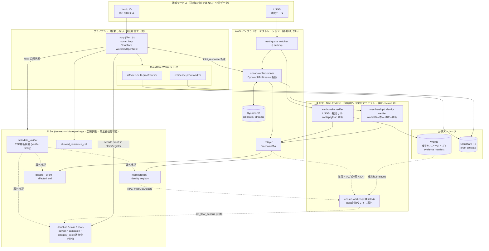

# Sonari システム全体アーキテクチャ

> **目的**: dapp / Sui / TEE / runner / 外部サービスの配線と **信頼境界** を1枚で俯瞰する。
> 個別ドメインの詳細は各仕様へ: 資金フロー=[`fund_flow_spec.md`](./fund_flow_spec.md) / オンチェーン契約=[`../contracts/README.md`](../contracts/README.md) / Web App=[`webapp.md`](./webapp.md) / 技術スタック=[`tech_stack.md`](./tech_stack.md)。
>
> ⚠️ **ドラフト**: 実装と突合して継続更新する。`(計画)` 注記は未実装（issue 進行中）。

## 1. 全体配線図

## 2. 信頼境界（このシステムの核）

| 層 | 信頼の扱い | 根拠 |
|---|---|---|
| 外部サービス (USGS / World ID) | **信頼しない**（公開・改ざん検知は下流） | TEE が原データを取得し検証 |
| クライアント (dapp / proof worker) | **信頼しない** | 全ての主張は Merkle proof / TEE 署名で下流検証 |
| **TEE (Nitro Enclave)** | **唯一の信頼の起点**。鍵は enclave 内、PCR でアテスト | `metadata_verifier` が family 別に署名検証 |
| AWS runner / relayer | **鍵を持たない**オーケストレータ | 署名は TEE、投入は誰でも検算可能 |
| Sui 公開状態 | 信頼するが**第三者が再現検証可能** | `home_cell` 等が公開 → 嘘の署名は即バレる |

**核心**: 署名は TEE のみが行い、その入力（USGS データ・World ID proof・公開オンチェーン状態）は全て公開なので、**第三者が同じ出力を再現して検算できる**。これが Sonari の信頼モデル。詳細な脅威モデルは別途整備予定（→ 不足ドキュメント issue）。

## 3. verifier family 一覧

| family | 入力 | 出力（署名） | 状況 |
|---|---|---|---|
| earthquake | USGS イベント | 被災セル root + payload | ✅ 実装・dev実機検証済 |
| membership | World ID proof | 本人確認レコード | ✅ 実装 |
| identity | World ID (Orb) | IdentityVerificationRecord | ✅ 実装 |
| residence | H3 居住セル + Merkle | （proof は client/worker） | ✅ 実装 |
| **census (=5)** | 被災セル leaves + membership snapshot | band別カウント | ❌ 計画 #302/#303/#304 |

## 4. 主要データフロー（3経路）

1. **地震**: USGS → watcher → earthquake TEE（被災セル root 署名）→ relayer → `disaster_event`（Campaign 自動作成 #301）→ census（#304）→ `set_floor_census` → 床払い開始。
2. **本人確認**: dapp（World ID/IDKit）→ runner → membership/identity TEE → relayer → `identity_registry` / `membership`。
3. **資金**: 寄付 `donation` → Pool → 申請 `claim` → 床払い/本払い `payout`（改修 #300）。

## 5. 実装済み / 計画中の境界

- ✅ **実装済**: dapp 本番(sonari.help)、earthquake/membership/identity/residence verifier、runner、relayer、proof worker、現行 Move package。
- ⚠️ **改修中 (#300)**: 資金フロー（4 Pool・床払い/本払い・version ガード）。旧 `program`/`payout_policy` は廃止予定。
- ❌ **未実装**: census worker (#304)、`schemas/`(#302)、indexer（RPC版 MVP で当面回避）。
