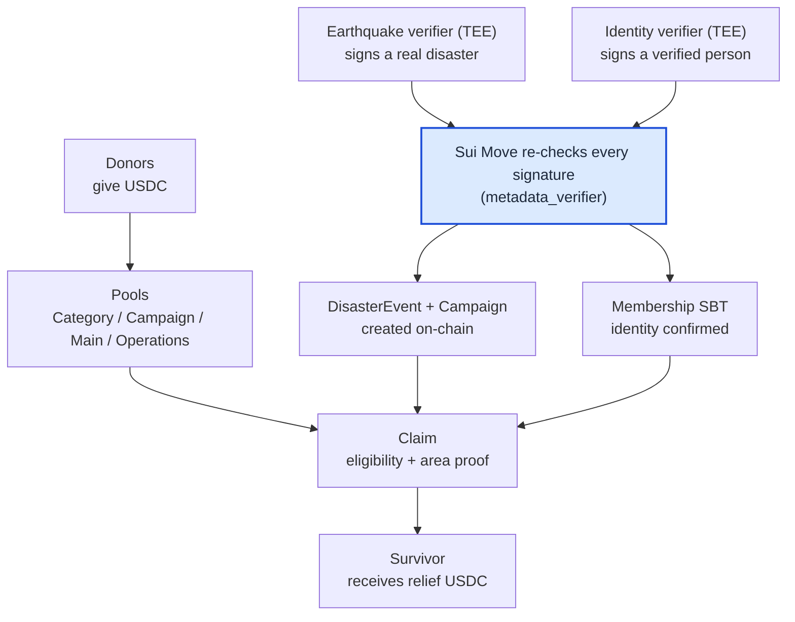
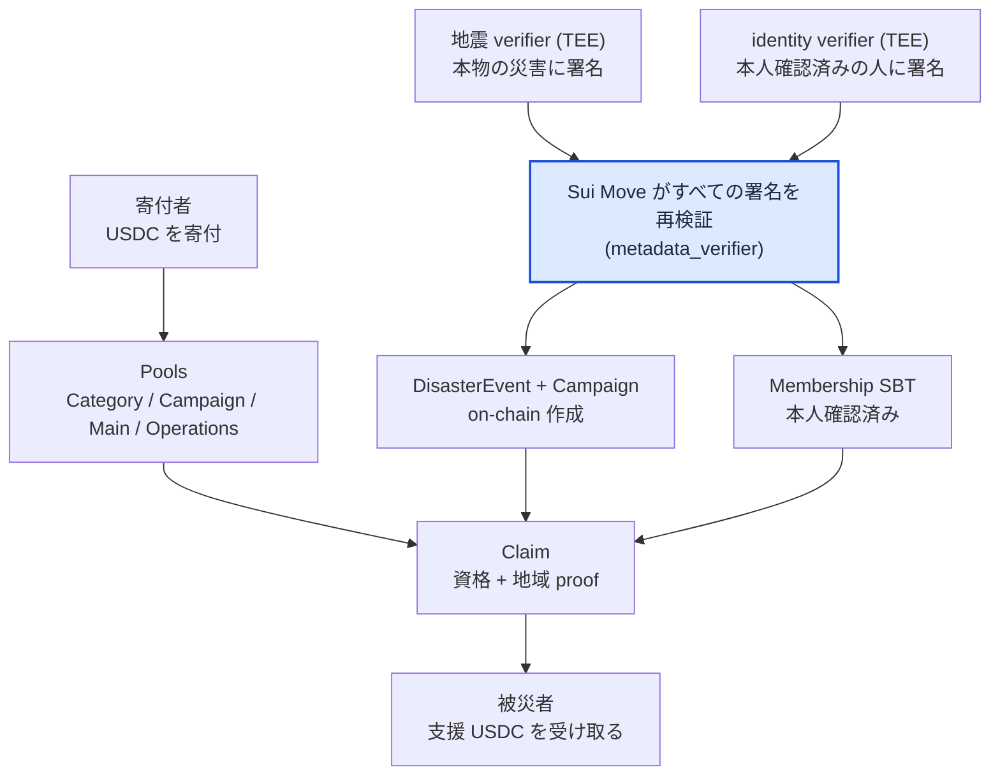

# Sonari Sui Contracts

*A disaster-relief funding platform on Sui. These Move contracts take in donations, recognize real disasters, confirm who survivors are, and pay relief — and every important decision can be re-checked on-chain, never trusted to a server.*

## In One Minute

Imagine a donation box that anyone can fund, but where the money can only leave under rules that no operator can quietly bend.

- **Donors** put USDC in. The contract immediately splits each donation into the right pools and records exactly how it was split.
- When a **real disaster** is confirmed and a **real person** in the affected area proves who they are, the contract pays them relief.
- Nobody — not the Sonari team, not a server, not a relayer — can decide on their own that "this earthquake happened" or "this person is verified." Those facts must arrive as **signed results**, and Sui re-checks every signature before it touches the money.

The hard part is trust. The data about a disaster, or about an identity, passes through many programs — a watcher, a server, a relayer, a database. Any of them could lie. So the contracts are written to **trust almost nothing**: they only act on results that were signed inside a tamper-proof computer (a TEE) and that still pass every check at the Sui boundary. Change one byte and the signature breaks; the payment never happens.

In short: the contracts hold the money and enforce the rules. The proof that "this is real" is made elsewhere (see the verifiers), and the contracts are the final, public gate that re-verifies it.

## What the Contracts Do

There are four things a person can do, in plain terms:

1. **Donate** — give USDC to a specific disaster (a `Campaign`), to a category of relief (a `CategoryPool`, e.g. earthquakes), or with no target (the `MainPool`). Each donation is split atomically and the split is recorded as an event.
2. **Recognize a disaster** — a signed earthquake result turns into an on-chain `DisasterEvent`, and a relief `Campaign` for that disaster is created automatically in the same transaction. No human picks which disasters count.
3. **Confirm identity** — a person registers a free `MembershipPass` (an SBT) and proves who they are with a signed identity result (today via World ID). The contract stores only a verified/expiry record, never raw personal data.
4. **Claim relief** — an eligible survivor in the affected area receives funds. Payment comes in two stages so it is fair regardless of who claims first:
   - **Floor payout** — an immediate minimum amount, available as soon as identity is confirmed.
   - **Main payout** — a larger, pro-rata share paid out after the donation window closes, so everyone in the same band receives the same ratio.

The exact amounts, pool math, and timing live in the design spec — see [docs/contracts_spec.md](contracts_spec.md).

## How Verification Works — the Nautilus Pattern

Sonari follows **Nautilus**, Sui's pattern for trusting work that was done inside a TEE (a sealed, tamper-proof computer, built on AWS Nitro Enclaves). But it does so with its own on-chain code:

> We do not directly depend on Mysten's move/enclave package. Sonari implements the same Nautilus onchain verification pattern in a custom metadata_verifier module, extended with verifier families, config versions, enclave instance expiry, disable controls, and DisasterEvent-specific payload verification.

In practice, the [`metadata_verifier`](../contracts/sources/metadata_verifier.move) module is the single on-chain gatekeeper for every signed result. Its extensions, in plain terms:

- **Verifier families** — one registry serves several kinds of proof at once: earthquake oracle, identity, and census (the affected-population count used for the floor payout). Each kind is kept on its own trust line so an earthquake key can never sign an identity result.
- **Config versions** — for each family, the registry stores the approved enclave fingerprint (the Nitro **PCR** set) as a versioned `VerifierConfig`. When the enclave program is rebuilt, admin can register the new fingerprint without breaking the old records.
- **Enclave instance expiry** — each signing key (`EnclaveInstance`) carries an expiry time. A signature from an expired key is rejected, so short-lived enclave keys cannot be replayed forever.
- **Disable controls** — keys, configs, and instances can each be turned off independently (recorded with a `disabled_at_ms`), so a compromised or retired component can be revoked without redeploying.
- **DisasterEvent-specific payload verification** — `assert_enclave_signed_bytes` checks the Ed25519 signature, confirms the signing key matches an approved, non-expired PCR config, and then hands the bytes to the matching payload decoder (`disaster_event`, `identity`, or `census`) which checks the *meaning* — intent, version, status, freshness, and field constraints.

A **PCR** is a fingerprint of the exact program and how it booted. It does not replace the signature; it answers a different question — *did this signing key really come from the approved program?* — before Sui starts trusting that key.

## Trust Model

Sonari never lets a contract trust a watcher, a relayer, the frontend, a database row, or a cache. Those parts move data around; they are **not allowed to decide** what a verified result means.

| We do NOT trust (transport / cache) | We DO trust (checkable on-chain) |
| --- | --- |
| Watcher, runner, relayer, frontend, Worker | The exact signed `payload_bcs` bytes from the enclave |
| DynamoDB, S3, R2, queue state | The registered verifier config, PCRs, and enclave public key |
| HTTP request bodies and workflow input | The fixed field order, intent, and version of each payload |
| USGS / World ID responses before re-checking | The TEE's own re-check of the source, re-verified at the Sui boundary |
| Any address a UI might pass in | The Sui transaction sender and the Membership SBT owner |

This is a **fail-closed** model: a bad signature, an unknown key, a stale config, an expired instance, a wrong Merkle proof, or a malformed payload all **stop** the transaction instead of writing a wrong result on-chain. And **no raw personal data is ever stored on-chain** — only verified/expiry records and hashes.

## Money Flow in One Picture

Donations flow into the pools right away. Disaster and identity facts only become real after the **highlighted gate** re-checks their signatures. A survivor's claim then draws on the pools — first the **floor payout** (immediate minimum), and after the donation window closes the **main payout** (a pro-rata share of the campaign). The precise split ratios, escrow rules, and round math are in [docs/contracts_spec.md](contracts_spec.md).

## Module Map

| Module | What it does |
| --- | --- |
| [`admin`](../contracts/sources/admin.move) | Genesis setup, the `AdminCap` for least-privilege admin actions, and global / targeted pause |
| [`pools`](../contracts/sources/pools.move) | The platform-wide `MainPool` (shared relief) and `OperationsPool` (ops fees) |
| [`category_pool`](../contracts/sources/category_pool.move) | A permanent pool per relief category (e.g. earthquake); the everyday donation home and first source of floor payouts |
| [`campaign`](../contracts/sources/campaign.move) | The per-disaster object: fundbox, floor escrow, claim applications, and payout rounds |
| [`donation`](../contracts/sources/donation.move) | Donation intake and atomic split; the donor SBT (`DonorPass`, record only — no claim rights) |
| [`disaster_event`](../contracts/sources/disaster_event.move) | Creates a `DisasterEvent` from a signed earthquake payload and auto-creates its `Campaign` |
| [`payload`](../contracts/sources/payload.move) | Decodes and validates the earthquake oracle payload (intent, version, finalized status, freshness) |
| [`census_result`](../contracts/sources/census_result.move) | Decodes and validates the signed affected-population census used to size the floor payout |
| [`affected_cell`](../contracts/sources/affected_cell.move) | Merkle-proof check that a claimant's area was actually affected |
| [`allowed_residence_cell`](../contracts/sources/allowed_residence_cell.move) | Merkle root of the residence-cell allowlist used at registration |
| [`membership`](../contracts/sources/membership.move) | Issues and manages the `MembershipPass` SBT and the owner's home cell |
| [`identity_registry`](../contracts/sources/identity_registry.move) | Binds a per-provider duplicate key and stores the identity verification record |
| [`identity_result_v1`](../contracts/sources/identity_result_v1.move) | Decodes and validates the TEE-signed identity result (KYC / World ID) |
| [`metadata_verifier`](../contracts/sources/metadata_verifier.move) | The Nautilus gate: enclave keys, PCR configs, expiry, disable controls, and signature verification |
| [`accessor`](../contracts/sources/accessor.move) | Thin external entry points: version / pause checks, then delegate to package internals |
| [`reader`](../contracts/sources/reader.move) | Read-only helpers and exported constants for the frontend |

## MVP Status

Working today:

- Earthquake disaster recognition from a signed USGS / ShakeMap result, with affected-area Merkle proofs.
- Identity confirmation via World ID, stored as a verified/expiry record (no raw PII).
- Donations with atomic splits into Category / Campaign / Main / Operations pools, in USDC.
- Automatic `Campaign` creation when a disaster is finalized, plus the two-stage floor / main payout design.

Next:

- More identity providers (e.g. KYC) as explicit implementations.
- More disaster categories, added only after their source policy, payload meaning, and Move checks are defined.
- Continued hardening of cross-language golden vectors for payloads, signatures, and Merkle roots.

## Where to Read More

- [docs/contracts_spec.md](contracts_spec.md) — the full design spec: pools, object layouts, exact amounts and constants, security requirements, test requirements, and open questions.
- [docs/verifiers/overview.md](verifiers/overview.md) — the TEE / Nautilus side that *produces* the signed results these contracts verify.
- [docs/donation_flow.md](donation_flow.md) — the donor / recipient guide.
- `schemas/` — the cross-language contract for payloads, Merkle leaves, and the census result.

---

# Sonari Sui Contracts（日本語）

*Sui 上の災害支援資金プラットフォームです。これらの Move コントラクトは、寄付を受け取り、本物の災害を認識し、被災者が誰であるかを確認し、支援金を給付します。そして重要な判断はすべて on-chain で再検証でき、サーバーを信用することは決してありません。*

## 1分でわかる説明

誰でもお金を入れられるけれど、運営者がこっそりルールを曲げられない募金箱を想像してください。

- **寄付者**は USDC を入れます。コントラクトは各寄付をその場で正しい Pool に分割し、どう分割したかを正確に記録します。
- **本物の災害**が確定し、その被災地域にいる**本物の人**が本人であることを証明したとき、コントラクトはその人に支援金を給付します。
- Sonari チームも、サーバーも、relayer も、「この地震は起きた」「この人は本人確認済み」と独断で決めることはできません。それらの事実は **署名済みの結果** として届かなければならず、Sui はお金に触れる前にすべての署名を再検証します。

難しいのは信頼です。災害や本人確認のデータは、watcher・サーバー・relayer・データベースなど多くのプログラムを通って運ばれます。どれか1つでも嘘をつくかもしれません。だからコントラクトは **ほとんど何も信用しない** ように書かれています。改ざんできないコンピューター（TEE）の中で署名され、なお Sui の境界ですべての検査を通る結果にだけ動きます。1バイトでも変えれば署名が壊れ、支払いは起きません。

つまり、コントラクトはお金を保持しルールを守らせます。「これは本物だ」という証明は別の場所（verifiers を参照）で作られ、コントラクトはそれを再検証する最後の公開ゲートです。

## コントラクトでできること

人ができることは、平たく言うと4つです。

1. **寄付する** — 特定の災害（`Campaign`）、支援カテゴリ（`CategoryPool`、例: 地震）、または指定なし（`MainPool`）に USDC を入れます。各寄付は atomic に分割され、分割内容はイベントとして記録されます。
2. **災害を認識する** — 署名済みの地震結果が on-chain の `DisasterEvent` になり、同一トランザクション内でその災害向けの支援 `Campaign` が自動作成されます。どの災害を対象にするかを人が選ぶことはありません。
3. **本人確認する** — 人は無料の `MembershipPass`（SBT）を登録し、署名済みの本人確認結果（現在は World ID 経由）で本人であることを証明します。コントラクトが保存するのは検証/有効期限の記録だけで、生の個人データは保存しません。
4. **支援を受け取る** — 被災地域の資格ある被災者が資金を受け取ります。誰が先に申請したかに関わらず公平になるよう、支払いは2段階です。
   - **床払い** — 本人確認が済みしだい受け取れる、即時の最低額。
   - **本払い** — 寄付の募集締切後に支払われる、より大きい按分の取り分。同じ band の全員が同じ比率で受け取ります。

正確な金額・Pool の計算・タイミングは設計仕様書にあります — [docs/contracts_spec.md](contracts_spec.md) を参照してください。

## 検証の仕組み — Nautilus パターン

Sonari は、TEE（AWS Nitro Enclaves を使う、外から中身を改ざんできない封じられたコンピューター）の中で行われた処理を信頼するための Sui のパターン **Nautilus** に従います。ただし、独自の on-chain コードでそれを実現しています。

> Mysten の move/enclave package には直接依存しません。Sonari は同じ Nautilus on-chain 検証パターンを独自の `metadata_verifier` module で実装し、verifier family・config version・enclave instance の有効期限・無効化制御・DisasterEvent 固有の payload 検証で拡張しています。

実際には、[`metadata_verifier`](../contracts/sources/metadata_verifier.move) module が、すべての署名済み結果に対する唯一の on-chain ゲートキーパーです。その拡張を平易に説明すると:

- **verifier family** — 1 つの registry が複数種類の証明を同時に扱います: 地震 oracle、本人確認（identity）、そしてセンサス（床払いの規模を決める被災地域の登録者数集計）です。各種類はそれぞれ独立した信頼の線に置かれ、地震用の鍵が本人確認結果に署名することは決してできません。
- **config version** — family ごとに、承認済みの enclave 指紋（Nitro の **PCR** セット）をバージョン管理された `VerifierConfig` として保持します。enclave プログラムを再ビルドしたとき、admin は旧記録を壊さずに新しい指紋を登録できます。
- **enclave instance の有効期限** — 各署名鍵（`EnclaveInstance`）は有効期限を持ちます。期限切れの鍵による署名は拒否されるため、使い捨ての enclave 鍵が永久に再利用されることはありません。
- **無効化制御** — key・config・instance はそれぞれ独立に無効化でき（`disabled_at_ms` に記録）、危殆化した／引退した構成要素を再デプロイなしに失効させられます。
- **DisasterEvent 固有の payload 検証** — `assert_enclave_signed_bytes` が Ed25519 署名を検証し、署名鍵が承認済みで期限切れでない PCR config に一致することを確認したうえで、対応する payload decoder（`disaster_event` / `identity` / `census`）にバイトを渡します。decoder は *意味* を検証します — intent・version・status・freshness・各フィールド制約です。

**PCR** は、どのプログラムがどう起動したかの指紋です。署名の代わりではなく、別の問いに答えます — 「この署名鍵は本当に承認済みのプログラムから出たのか？」を、Sui がその鍵を信頼しはじめる前に確かめます。

## 信頼モデル

Sonari は、watcher・relayer・frontend・データベースの行・cache をコントラクトに信用させません。これらはデータを運ぶだけで、検証済み結果が「何を意味するか」を **決めてはいけません**。

| 信用しないもの（transport / cache） | 信用するもの（on-chain で確かめられる） |
| --- | --- |
| Watcher、runner、relayer、frontend、Worker | enclave が署名した、そのままの `payload_bcs` バイト |
| DynamoDB、S3、R2、queue の状態 | 登録済みの verifier config、PCR、enclave public key |
| HTTP リクエストの中身、workflow の入力 | 各 payload の決まった field 順・intent・version |
| 再確認する前の USGS / World ID 応答 | TEE 自身による元データの再確認（Sui 境界で再検証される） |
| UI が渡しうる任意の address | Sui トランザクションの sender と Membership SBT の owner |

これは **fail-closed**（問題があれば止める）モデルです。署名不正・未知の鍵・古い config・期限切れの instance・誤った Merkle proof・不正な payload は、まちがった結果を on-chain に書くのではなく、すべてトランザクションを **止めます**。そして **生の個人データは一切 on-chain に保存しません** — 検証/有効期限の記録と hash だけです。

## 資金の流れ（1枚の図）

寄付はすぐ Pool に入ります。災害と本人確認の事実は、**強調されたゲート**が署名を再検証して初めて本物になります。被災者の claim はそこから Pool を引き当てます — まず **床払い**（即時の最低額）、寄付の募集締切後に **本払い**（Campaign の按分の取り分）です。正確な分割比率・escrow ルール・ラウンド計算は [docs/contracts_spec.md](contracts_spec.md) にあります。

## モジュール一覧

| モジュール | 役割 |
| --- | --- |
| [`admin`](../contracts/sources/admin.move) | genesis 初期化、最小権限の admin 操作のための `AdminCap`、global / target pause |
| [`pools`](../contracts/sources/pools.move) | プラットフォーム共通の `MainPool`（共通支援）と `OperationsPool`（運営費） |
| [`category_pool`](../contracts/sources/category_pool.move) | 支援カテゴリ（例: 地震）ごとの常設 Pool。平常時寄付の受け皿で、床払いの第1資金源 |
| [`campaign`](../contracts/sources/campaign.move) | 災害ごとのオブジェクト: 募金箱・床予約 escrow・申請・支払いラウンド |
| [`donation`](../contracts/sources/donation.move) | 寄付の受付と atomic な分割、寄付者 SBT（`DonorPass`、記録のみ・受給権なし） |
| [`disaster_event`](../contracts/sources/disaster_event.move) | 署名済み地震 payload から `DisasterEvent` を作成し、その `Campaign` を自動作成 |
| [`payload`](../contracts/sources/payload.move) | 地震 oracle payload の decode と検証（intent・version・finalized status・freshness） |
| [`census_result`](../contracts/sources/census_result.move) | 床払いの規模を決める、署名済み被災地域センサスの decode と検証 |
| [`affected_cell`](../contracts/sources/affected_cell.move) | 申請者の地域が実際に被災したことの Merkle proof 検証 |
| [`allowed_residence_cell`](../contracts/sources/allowed_residence_cell.move) | 登録時に使う許可居住セル allowlist の Merkle root |
| [`membership`](../contracts/sources/membership.move) | `MembershipPass` SBT と owner の居住セルの発行・管理 |
| [`identity_registry`](../contracts/sources/identity_registry.move) | provider ごとの duplicate key の束縛と本人確認記録の保存 |
| [`identity_result_v1`](../contracts/sources/identity_result_v1.move) | TEE 署名済み本人確認結果（KYC / World ID）の decode と検証 |
| [`metadata_verifier`](../contracts/sources/metadata_verifier.move) | Nautilus ゲート: enclave 鍵・PCR config・有効期限・無効化制御・署名検証 |
| [`accessor`](../contracts/sources/accessor.move) | 薄い外部エントリー: version / pause チェック後に package 内部へ委譲 |
| [`reader`](../contracts/sources/reader.move) | frontend 向けの読み取り専用ヘルパーと公開定数 |

## MVP の状態

今動いていること:

- 署名済みの USGS / ShakeMap 結果からの地震災害認識（被災地域の Merkle proof 付き）。
- World ID 経由の本人確認。検証/有効期限の記録として保存（生の PII なし）。
- USDC での寄付と、Category / Campaign / Main / Operations Pool への atomic な分割。
- 災害 finalize 時の `Campaign` 自動作成と、2段階の床払い / 本払い設計。

次にやること:

- KYC など、本人確認 provider をはっきりした実装として増やす。
- 災害カテゴリの追加（source 方針・payload の意味・Move チェックを定義してから）。
- payload・署名・Merkle root の cross-language golden vector を引きつづき強くする。

## 詳細資料

- [docs/contracts_spec.md](contracts_spec.md) — 完全な設計仕様: Pool・オブジェクト設計・正確な金額と定数・セキュリティ要件・テスト要件・Open Questions。
- [docs/verifiers/overview.md](verifiers/overview.md) — これらのコントラクトが検証する署名済み結果を *作る* 側（TEE / Nautilus）。
- [docs/donation_flow.md](donation_flow.md) — 寄付者 / 受給者向けガイド。
- `schemas/` — payload・Merkle leaf・センサス result の言語横断契約。
