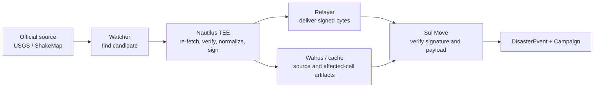
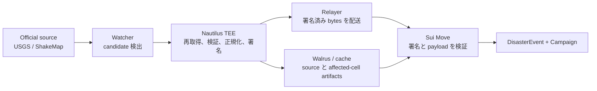

# Disaster Oracle

Sonari's first oracle verifies official earthquake information and turns it into a signed result that Sui Move can accept. The MVP uses USGS earthquake detail data and ShakeMap data, but the pattern is designed for other official disaster sources as well.

## 1. What The Oracle Proves

The disaster oracle answers one question:

> Did an official source describe a real disaster, and which geographic cells were affected strongly enough to be claimable?

For the earthquake MVP, the Nautilus verifier proves:

- the USGS event exists;
- the relevant ShakeMap source exists;
- the event is not merely a watcher guess or UI input;
- affected H3 cells were computed deterministically from source data;
- the final `affected_cells_root` matches the generated affected-cell file;
- the signed payload is `finalized` and suitable for Sui submission.

Only a finalized signed result can create an on-chain `DisasterEvent`. Pending, rejected, ignored, or failed states remain off-chain.

## 2. Flow

The watcher, relayer, cache, and frontend are transport. They are useful, but they are not trusted to decide what a disaster means. The TEE re-fetches the source data itself and signs the exact payload bytes. Sui then verifies the enclave key, signature, payload fields, freshness, status, and root before creating the disaster object.

## 3. Why Nautilus Matters

Nautilus gives Sonari a way to run verification inside a TEE. In Sonari's model:

- source data is fetched again inside the enclave;
- the signing key is generated and used inside the enclave boundary;
- the enclave public key is tied to an attestation and approved verifier config;
- the signed payload cannot be modified by a runner or relayer;
- Sui accepts only payloads signed by an approved, non-expired enclave instance.

This keeps the trust boundary narrow. Sonari does not ask the Sui contract to trust a Lambda, database row, relayer, UI, or API response body.

## 4. Affected Cells And Claims

The disaster result does not list every claimant. It commits to affected map cells.

1. The verifier converts source intensity data into H3 cells.
2. It builds an affected-cells file and a Merkle root.
3. The signed disaster payload includes `affected_cells_root`.
4. Proof services can distribute per-cell Merkle proofs.
5. Sui Move re-checks the claimant's cell proof against the signed root.

The proof service can fail, cache, or be replaced. It cannot make Sui accept a wrong cell, because the root is already signed by the TEE and checked by Move.

## 5. Extending To Other Disasters

The MVP supports earthquake relief. Other disasters can be added when their source policy and contract meaning are explicit.

Examples:

- flood or river-level alerts from official hydrology sources;
- typhoon or storm data from official weather agencies;
- tsunami warnings from public emergency systems;
- wildfire perimeters from official fire or satellite-derived public datasets;
- evacuation orders from national or local government feeds.

Each new disaster type needs:

- official source selection and freshness rules;
- deterministic normalization;
- a versioned payload layout;
- fixtures and golden vectors;
- a claimable-area or claimable-condition proof model;
- Move checks that define when a Campaign can be created.

The pattern stays the same: official data is verified inside Nautilus, the TEE signs the result, and Sui Move enforces only what it can re-check.

## 6. MVP Status

Implemented:

- USGS / ShakeMap earthquake verifier.
- Affected H3 cell generation.
- Affected-cell Merkle root and proof distribution.
- Signed finalized earthquake payloads.
- Sui-side verification of signed disaster payloads before campaign creation.

Planned:

- additional official disaster source policies;
- additional disaster categories;
- richer operations dashboards for pending, rejected, failed, finalized, and submitted states.

---

# 災害 Oracle（日本語）

Sonari の最初の oracle は、公式地震情報を検証し、Sui Move が受け入れられる署名済み result に変換します。MVP では USGS earthquake detail data と ShakeMap data を使いますが、このパターンは他の公式災害 source にも拡張できる設計です。

## 1. Oracle が証明すること

災害 oracle が答える問いは1つです。

> 公式 source は本物の災害を示しているか。そして、どの地理セルが claim 可能な強さで影響を受けたか。

地震 MVP では、Nautilus verifier が次を証明します。

- USGS event が存在する。
- 関連する ShakeMap source が存在する。
- watcher の推測や UI 入力だけではない。
- affected H3 cells が source data から決定的に計算された。
- 最終的な `affected_cells_root` が生成された affected-cell file と一致する。
- 署名済み payload が `finalized` であり、Sui 投稿対象である。

on-chain の `DisasterEvent` を作成できるのは finalized の署名済み result だけです。pending、rejected、ignored、failed state は off-chain に残ります。

## 2. Flow

watcher、relayer、cache、frontend は transport です。便利ですが、災害の意味を決めるものとして信頼しません。TEE が source data を自分で再取得し、正確な payload bytes に署名します。Sui は enclave key、signature、payload fields、freshness、status、root を検証してから disaster object を作成します。

## 3. Nautilus が重要な理由

Nautilus により、Sonari は検証処理を TEE 内で実行できます。Sonari のモデルでは:

- source data は enclave 内で再取得される。
- signing key は enclave boundary 内で生成・使用される。
- enclave public key は attestation と承認済み verifier config に紐付く。
- runner や relayer は signed payload を変更できない。
- Sui は承認済みで期限切れでない enclave instance の署名だけを受け入れる。

これにより trust boundary を狭く保ちます。Sui contract は Lambda、database row、relayer、UI、API response body を信頼しません。

## 4. Affected Cells と Claim

災害 result は claimant の一覧を持ちません。被災 map cell に commit します。

1. verifier が source intensity data を H3 cells に変換する。
2. affected-cells file と Merkle root を作る。
3. 署名済み disaster payload に `affected_cells_root` を含める。
4. proof service が cell ごとの Merkle proof を配布できる。
5. Sui Move が claimant の cell proof を署名済み root に対して再検証する。

proof service は壊れても、cache しても、置き換えられても構いません。root は TEE に署名され、Move が検証するため、間違った cell を Sui に受け入れさせることはできません。

## 5. 他災害への拡張

MVP は地震支援です。他の災害は、source policy と contract 上の意味を明示すれば追加できます。

例:

- 公式水文 source による洪水・河川水位 alert。
- 公式気象機関による台風・storm data。
- 公的緊急システムによる津波警報。
- 公式 fire dataset や public satellite-derived dataset による wildfire perimeter。
- 国や自治体 feed による避難指示。

新しい災害種別ごとに必要なもの:

- 公式 source selection と freshness rules。
- 決定的な normalization。
- versioned payload layout。
- fixtures と golden vectors。
- claimable-area または claimable-condition proof model。
- Campaign 作成条件を定義する Move checks。

基本は同じです。公式情報を Nautilus 内で検証し、TEE が result に署名し、Sui Move が再検証できるものだけを強制します。

## 6. MVP Status

実装済み:

- USGS / ShakeMap earthquake verifier。
- affected H3 cell generation。
- affected-cell Merkle root と proof distribution。
- signed finalized earthquake payload。
- Campaign 作成前の Sui-side signed disaster payload verification。

計画中:

- 追加の公式 disaster source policies。
- 追加の disaster categories。
- pending、rejected、failed、finalized、submitted state 向け operations dashboard。
