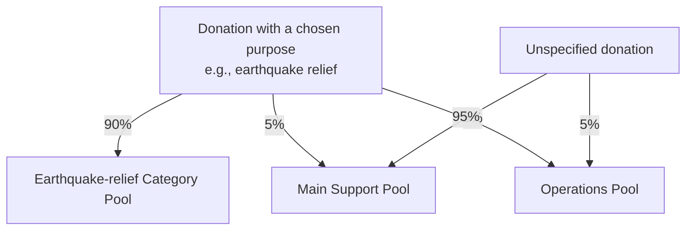
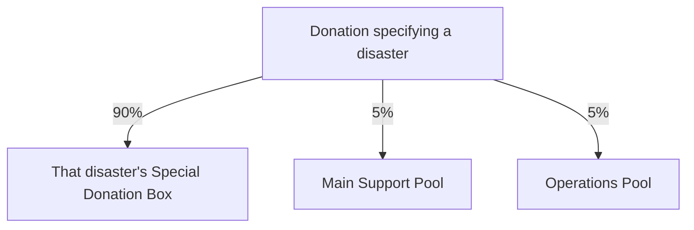
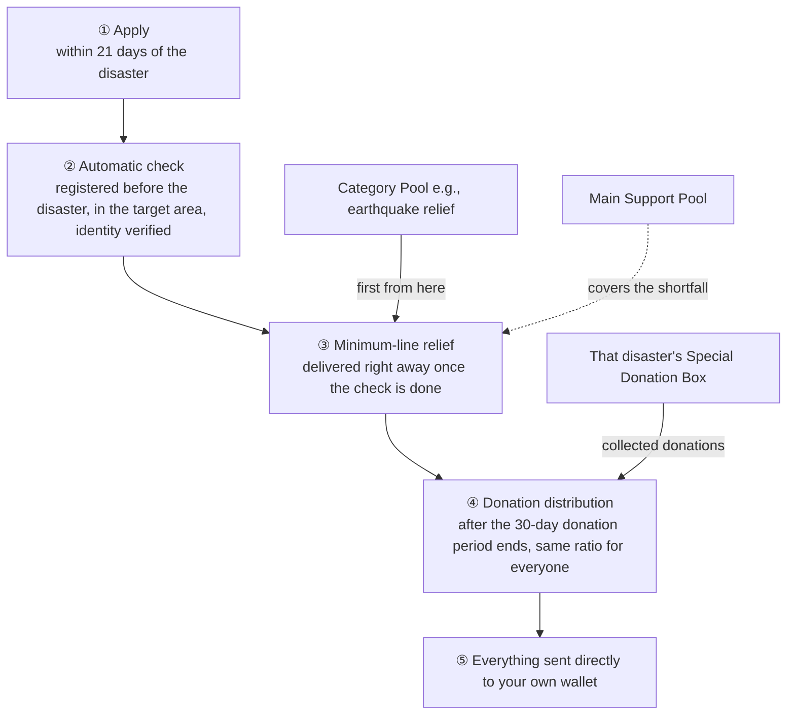
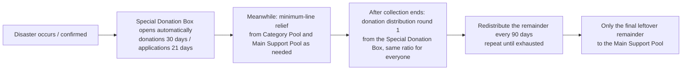
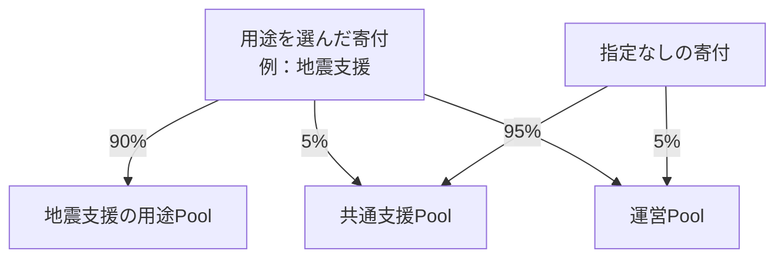
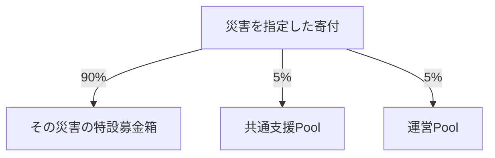
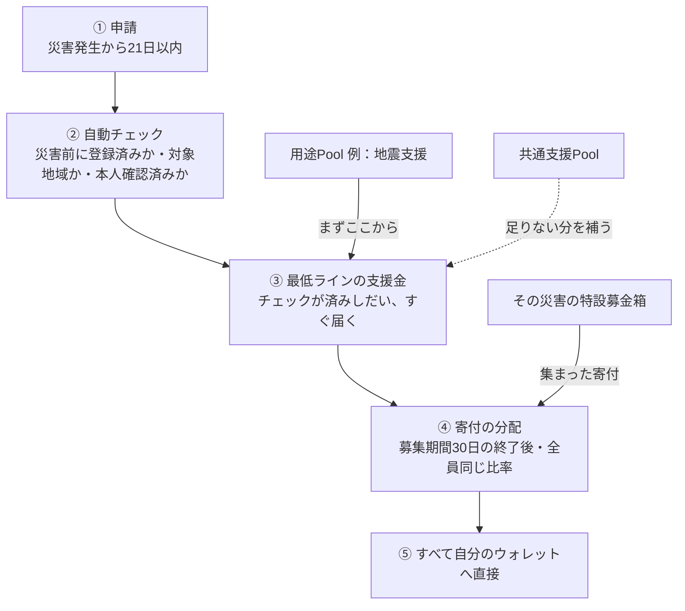
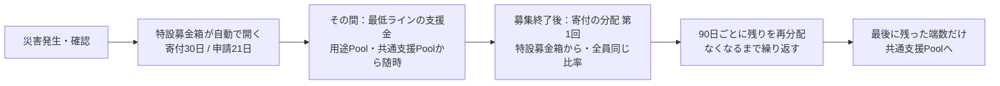

# How Money Flows in Sonari — A Guide for Donors and Recipients

Sonari is a system that gathers disaster-relief donations on the blockchain and delivers them directly to affected people.
Every flow of money is recorded and anyone can verify it.

---

## 1. There Are 4 Places to Hold Money

| Pool | Role |
|---|---|
| Category Pool | The receiver for **everyday donations**. A permanent pool per purpose you want to support, such as "earthquake relief." We start with earthquake relief and plan to expand to floods, typhoons, student support, and more |
| Special Donation Box (Campaign) | The receiver for **donations after a disaster occurs**. A time-limited donation box created automatically — one per disaster, dedicated to that disaster |
| Main Support Pool | The receiver for donations with no specified purpose. Shared money used to underpin everything as a whole |
| Operations Pool | Money to run the platform (server costs, audit fees, etc.) |

The Category Pool is for "everyday (normal times)," and the Special Donation Box is for "after a disaster occurs" — so **the timing of when you donate is different**. For both, you can verify the destination and how the money is used on the blockchain at any time.

---

## 2. [For Donors] Everyday Donations — Choose a Purpose and Prepare

For every donation, the contract automatically splits it the moment you donate.
**It is structurally impossible for operators to later withdraw money from a support Pool.**

For donations in normal times, you can choose the **purpose** you want to support (e.g., earthquake relief). You can direct money that you used to give to relief organizations toward disaster relief in a form where **the destination is fully visible**. If you have no particular preference, "unspecified" is fine. In that case it goes into the Main Support Pool.

The money accumulated in the Category Pool is used, when a disaster occurs, to **deliver a minimum line of relief (up to half the target amount) to affected people right away, without waiting for the Special Donation Box to finish collecting donations**. It guarantees a floor for every disaster — a **stable funding source that reaches victims even of disasters that never make the news**.

---

## 3. [For Donors] Donations When a Disaster Occurs — To the Special Donation Box

When a large disaster occurs, the news spreads worldwide and people who think "I want to donate to this disaster" surge all at once. The receiver for them is the Special Donation Box.

- When the occurrence of a disaster is confirmed by the verification system, **a dedicated donation box opens automatically at that very moment.** By the time the news reaches the world, the donation destination already exists.
- No human judgment is involved. **Both major disasters and unreported disasters open under the same rules, equally.**
- The rules (the recipient target amount, how donations are split, the period) are fixed the moment it opens, and **never change again for that disaster.**
- It is **time-limited**. Donations are accepted for **30 days**, and applications from affected people for **21 days**. The collected donations are distributed to everyone together **after the donation period ends** (emergency relief in the meantime is handled by the minimum-line payout from the Category Pool).

- The donation box always shows "**how much has been collected so far**" and "**roughly how much will reach each affected person**," so you can check the effect of your donation in real time.
- There is an **upper limit** on how much operations can receive from a single disaster. Any excess goes into the Main Support Pool.
- Donations that arrive after the donation period ends go into the Main Support Pool and are used for the next relief effort.

---

## 4. [For Recipients] To Receive Support

**The most important thing: you must complete registration before a disaster occurs.**
If you register after a disaster occurs, you cannot receive support for that disaster (this prevents fraudulent last-minute registration).

**◆ What to do before a disaster occurs**

1. Do member registration (Membership Pass) and register **the area where you live**
2. Complete **identity verification** (either KYC or World ID)

Registration is **completely free**. There is **one membership per person**, and personal information itself such as identity documents or your address is never put on the blockchain.

**◆ When a disaster occurs: support is delivered in 2 stages**

1. **Apply**: If your registered area is included in the target, apply **within 21 days**.
2. **Automatic check**: The system automatically confirms "whether you registered before the disaster," "whether your residence is in the target area," and "whether you are identity-verified." No human review is involved.
3. **Minimum-line relief (delivered right away)**: As soon as the check is done, **relief up to a maximum of half the target amount** is delivered first. The payment source is the **Category Pool and the Main Support Pool**. The Special Donation Box is still in the middle of collecting donations, so it is not used here. The per-person amount is fixed first based on "the number of members who registered to that area before the disaster," so **the amount is the same whether you apply early or late**.
4. **Donation distribution (after the period ends)**: Once the 30-day collection ends, the **donations collected in the Special Donation Box** are distributed to all applicants at the same ratio. If money remains, this repeats every 90 days.
5. **Receipt**: Every payment passes through no one's hands along the way and is sent **directly to your wallet** from the contract.

You apply only once, the first time. Second-stage and subsequent payments are also received through the same flow.

Receiving from multiple memberships for the same disaster is prohibited, and if fraud is found, you become subject to payment suspension or a clawback claim.

---

## 5. How Much Relief Can You Receive?

There are 3 levels of **target amount** depending on the scale of the damage.

| Band | Target amount | Per-distribution cap |
|---|---|---|
| Band 1 (light damage) | 50 USDC | 150 USDC |
| Band 2 (medium damage) | 150 USDC | 450 USDC |
| Band 3 (heavy damage) | 300 USDC | 900 USDC |

The target amount is not a guaranteed amount. The donation distribution amount is determined by:

> Distribution amount = target amount × (collected donations ÷ total money needed)

Because everyone's share is computed together after the donation period ends,
**applying early gives no advantage, and everyone receives at the same ratio.**

If many donations are collected, the distribution amount exceeds the target amount (the per-distribution cap is 3× the target amount).
Even for a disaster where few donations are collected, the **minimum-line relief arrives first from the Category Pool and the Main Support Pool**, so support is never zero. So that a single disaster does not exhaust the Category Pool, payouts have a per-disaster cap, and **money for the next disaster always remains**.

---

## 6. The Money in the Special Donation Box Ultimately Goes Entirely to That Disaster's Affected People

If a lot accumulates in the Special Donation Box and cannot be fully distributed in one round, the remainder does not disappear or get diverted elsewhere.
**It is distributed repeatedly to the same affected people every 90 days.**

- Both the "rescue money" (minimum-line relief) right after the disaster and the subsequent "rebuilding money" (donation distribution) are delivered.
- Because there is a per-round cap, no one can aim to fraudulently grab a large sum.

---

## 7. Sonari's Promises

1. **The Special Donation Box is created automatically at the same time the disaster is confirmed** (every disaster is equal; no human discretion)
2. **A donation's destination is decided automatically at the moment of donation** (operators cannot touch the money in a support Pool)
3. **The amount received is not first-come-first-served** (the minimum line fixes the amount first; the donation distribution is apportioned at the same ratio to everyone after the deadline)
4. **The money in the Special Donation Box goes entirely to that disaster's affected people** (distributed fully over time; leftovers are not confiscated)

Every movement of money is recorded on the blockchain, and anyone can verify it at any time.

---

# Sonari のお金の流れ — 寄付する人・受け取る人のためのガイド（日本語）

Sonari は、災害支援の寄付をブロックチェーン上で集めて、被災した人に直接届ける仕組みです。
お金の流れはすべて記録され、誰でも確認できます。

---

## 1. お金の置き場所は4種類

| Pool | 役割 |
|---|---|
| 用途Pool | **ふだんの寄付**の受け皿。「地震支援」のように、支援したい用途ごとに常設。まずは地震支援から始め、洪水・台風・学生支援などへ広げていく予定 |
| 特設募金箱 | **災害が起きたあとの寄付**の受け皿。災害ごとに、その災害専用に1つずつ自動で作られる期間限定の募金箱 |
| 共通支援Pool | 用途を決めない寄付の受け皿。全体の下支えに使う共通のお金 |
| 運営Pool | プラットフォームを動かすためのお金（サーバー代・監査費用など） |

用途Poolは「ふだん（平常時）」、特設募金箱は「災害が起きたあと」と、**寄付するタイミングが違います**。どちらも行き先と使われ方を、いつでもブロックチェーン上で確認できます。

---

## 2. 【寄付する人へ】ふだんの寄付 — 用途を選んで備える

どの寄付も、寄付した瞬間にコントラクトが自動で分割します。
**運営が後から支援Poolのお金を引き出すことは、仕組み上できません。**

平常時の寄付では、支援したい**用途**を選べます（例：地震支援）。これまで支援団体に寄付していたお金を、**行き先が完全に見える形**で災害支援に向けられます。特にこだわりがなければ「指定なし」でかまいません。その場合は共通支援Poolに入ります。

用途Poolに貯まったお金は、災害が起きたとき、**特設募金箱が寄付を集め終わるのを待たずに、被災者へ最低ラインの支援金（目標額の半分まで）をすぐ届ける**ために使われます。どの災害にも床を保証する、**ニュースにならない災害の被災者にも届く安定した財源**です。

---

## 3. 【寄付する人へ】災害が起きたときの寄付 — 特設募金箱へ

大きな災害が起きるとニュースで世界中に伝わり、「この災害に寄付したい」という人が一気に増えます。その受け皿が特設募金箱です。

- 災害の発生が検証システムで確認されると、**その瞬間に専用の募金箱が自動で開きます。** ニュースが世界に届くころには、寄付先がすでに存在しています。
- 人間の判断は入りません。**大災害も、報道されない災害も、同じルールで平等に**開きます。
- ルール（受取の目標額・寄付の分け方・期間）は開いた瞬間に固定され、**その災害では二度と変わりません。**
- **期間限定**です。寄付の受付は**30日間**、被災者の申請受付は**21日間**。集まった寄付は、**募集期間が終わってから**全員にまとめて分配されます（その間の緊急支援は、用途Poolからの最低ラインの支払いが担います）。

- 募金箱には「**今いくら集まっているか**」「**被災者1人あたりいくら届きそうか**」が常に公開され、自分の寄付の効果をリアルタイムで確認できます。
- 運営費が1つの災害から受け取れる金額には**上限**があります。超過分は共通支援Poolに入ります。
- 寄付期間が終わったあとに届いた寄付は、共通支援Poolに入って次の支援に使われます。

---

## 4. 【受け取る人へ】支援を受け取るには

**いちばん大切なこと：登録は、災害が起きる前に済ませておく必要があります。**
災害が起きたあとに登録しても、その災害の支援は受けられません（不正な駆け込み登録を防ぐためです）。

**◆ 災害が起きる前にやっておくこと**

1. メンバー登録（Membership Pass）をして、**住んでいる地域**を登録する
2. **本人確認**を済ませる（KYC または World ID のどちらか）

登録は**完全無料**です。メンバーシップは**1人1つ**で、本人確認書類や住所などの個人情報そのものがブロックチェーンに載ることはありません。

**◆ 災害が起きたら：支援は2段階で届きます**

1. **申請**：自分の登録地域が対象になっていたら、**21日以内**に申請します。
2. **自動チェック**：「災害の前に登録していたか」「住まいが対象地域か」「本人確認済みか」をシステムが自動で確認します。人の審査は挟みません。
3. **最低ラインの支援金（すぐ届く）**：チェックが済みしだい、**目標額の半分を上限とする支援金**がまず届きます。支払い元は**用途Poolと共通支援Pool**です。特設募金箱はまだ寄付を募集している途中なので、ここでは使いません。1人あたりの金額は「災害の前にその地域へ登録していたメンバー数」をもとに最初に確定するため、**申請が早くても遅くても同じ金額**です。
4. **寄付の分配（募集終了後）**：30日間の募集が終わると、**特設募金箱に集まった寄付**を申請者全員に同じ比率で分配します。お金が残っていれば90日ごとに繰り返します。
5. **受け取り**：どの支払いも途中で誰の手も経由せず、コントラクトから**あなたのウォレットへ直接**送られます。

申請は最初の1回だけです。2段階目以降の支払いも、同じ流れで受け取れます。

同じ災害で複数のメンバーシップから受け取ることは禁止されており、不正が見つかった場合は支払い停止や返還請求の対象になります。

---

## 5. 支援金はいくらもらえる？

被害の大きさに応じて、3段階の**目標額**があります。

| 区分 | 目標額 | 1回の分配の上限 |
|---|---|---|
| Band 1（軽い被害） | 50 USDC | 150 USDC |
| Band 2（中くらいの被害） | 150 USDC | 450 USDC |
| Band 3（大きな被害） | 300 USDC | 900 USDC |

目標額は保証額ではありません。寄付の分配額は、

> 分配額 ＝ 目標額 ×（集まった寄付 ÷ 必要なお金の合計）

で決まります。募集期間が終わってから全員分まとめて計算するので、
**早く申請した人が得をすることはなく、全員が同じ比率で受け取れます。**

寄付がたくさん集まれば、分配額は目標額より増えます（1回の分配の上限は目標額の3倍）。
寄付があまり集まらない災害でも、**最低ラインの支援金が用途Poolと共通支援Poolから先に届いている**ので、支援がゼロになることはありません。1つの災害が用途Poolを使い切らないよう支払いには1災害ごとの上限があり、**次に起こる災害のためのお金が必ず残ります**。

---

## 6. 特設募金箱のお金は、最終的に全額その災害の被災者へ

特設募金箱にたくさん集まり、1回の分配で配りきれなかった分は、消えたり他に回されたりしません。
**90日ごとに、同じ被災者へ繰り返し配られます。**

- 災害直後の「救援のお金」（最低ラインの支援金）と、その後の「生活再建のお金」（寄付の分配）の両方が届きます。
- 1回ごとの上限があるため、不正に大金を狙うことはできません。

---

## 7. Sonari の約束

1. **特設募金箱は、災害の確認と同時に自動でできる**（どの災害も平等。人の裁量なし）
2. **寄付の行き先は、寄付の瞬間に自動で決まる**（運営は支援Poolのお金に触れられない）
3. **受取額は早い者勝ちにならない**（最低ラインは最初に金額を確定、寄付の分配は締切後に全員同じ比率で按分）
4. **特設募金箱のお金は全額、その災害の被災者へ**（時間をかけて配りきる。余りの没収はない）

すべてのお金の動きはブロックチェーンに記録され、誰でもいつでも確認できます。
