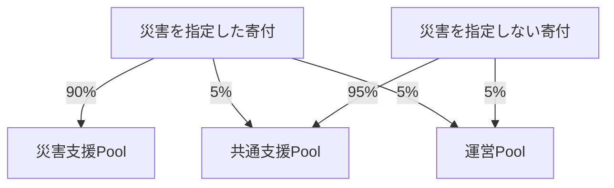
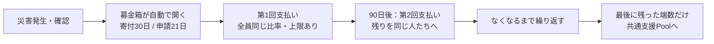

# Sonari のお金の流れ — 寄付する人・受け取る人のためのガイド
Sonari は、災害支援の寄付をブロックチェーン上で集めて、被災した人に直接届ける仕組みです。
お金の流れはすべて記録され、誰でも確認できます。
---
## 1. 3つのお財布（Pool）
| Pool | 役割 |
|---|---|
| 災害支援Pool | 災害ごとに作られる募金箱。その災害の被災者に支払う |
| 共通支援Pool | どの災害にも使える共通のお金。寄付が集まらなかった災害の下支えに使う |
| 運営Pool | プラットフォームを動かすためのお金（サーバー代・監査費用など） |
---
## 2. 募金箱はいつできる？ → 災害が確認されたら自動でできる
災害の発生が検証システムで確認されると、**その瞬間に、その災害専用の募金箱がブロックチェーン上に自動で作られます。**
- 人間の判断は入りません。**大きい災害も小さい災害も、同じルールで平等に**募金箱ができます。
- 募金箱には、作られた瞬間にルール（受取の目標額・寄付の分け方・期間）が貼り付けられ、**その災害では二度と変わりません。**
- 寄付の受付は **30日間**、被災者の申請受付は **21日間** です。
---
## 3. 【寄付する人へ】寄付したお金はどう分かれる？
寄付した瞬間に、コントラクトが自動で分けます。
**運営が後から支援Poolのお金を引き出すことは、仕組み上できません。**

- 運営費が1つの災害から受け取れる金額には**上限**があります。上限を超えた分は共通支援Poolに入ります。
- 共通支援Poolへの5%は、「ニュースにならない災害」も支援するための助け合いのお金です。
- 寄付期間が終わったあとに届いた寄付は、共通支援Poolに入って次の災害に使われます。
---
## 4. 【受け取る人へ】支援を受け取るには
**いちばん大切なこと：登録は、災害が起きる前に済ませておく必要があります。**
災害が起きたあとに登録しても、その災害の支援は受けられません（不正な駆け込み登録を防ぐためです）。
**◆ 災害が起きる前にやっておくこと**
1. メンバー登録（Membership Pass）をして、**住んでいる地域**を登録する
2. **本人確認**を済ませる（KYC または World ID のどちらか）
登録は**完全無料**です。メンバーシップは**1人1つ**で、本人確認書類や住所などの個人情報そのものがブロックチェーンに載ることはありません。
**◆ 災害が起きたら**
1. 自分の地域が対象になっていれば、**21日以内に申請**する
2. 確認が済むと、支援金が**自分のウォレットに直接**届く
同じ災害で複数のメンバーシップから受け取ることは禁止されており、不正が見つかった場合は支払い停止や返還請求の対象になります。
---
## 5. 支援金はいくらもらえる？
被害の大きさに応じて、3段階の**目標額**があります。
| 区分 | 目標額 | 1回の受取上限 |
|---|---|---|
| Band 1（軽い被害） | 50 USDC | 150 USDC |
| Band 2（中くらいの被害） | 150 USDC | 450 USDC |
| Band 3（大きな被害） | 300 USDC | 900 USDC |
目標額は保証額ではありません。実際の受取額は、
> 受取額 ＝ 目標額 ×（集まったお金 ÷ 必要なお金の合計）
で決まります。申請期間が終わってから全員分まとめて計算するので、
**早く申請した人が得をすることはなく、全員が同じ比率で受け取れます。**
寄付がたくさん集まれば受取額は目標額より増えます（上限は目標額の3倍）。
寄付が足りないときは、共通支援Poolが一定の上限まで補います。
---
## 6. 集まったお金は、最終的に全額その災害の被災者へ
たくさん集まって1回の支払いで配りきれなかった分は、消えたり他に回されたりしません。
**90日ごとに、同じ被災者へ繰り返し配られます。**

- 災害直後の「救援のお金」と、数ヶ月後の「生活再建のお金」の両方が届きます。
- 1回ごとの上限があるため、不正に大金を狙うことはできません。
---
## 7. Sonari の約束
1. **募金箱は災害の確認と同時に自動でできる**（どの災害も平等。人の裁量なし）
2. **寄付の行き先は、寄付の瞬間に自動で決まる**（運営は支援Poolのお金に触れられない）
3. **受取額は早い者勝ちにならない**（締切後に全員まとめて計算し、同じ比率で按分）
4. **集まったお金は全額、その災害の被災者へ**（時間をかけて配りきる。余りの没収はない）
すべてのお金の動きはブロックチェーンに記録され、誰でもいつでも確認できます。
