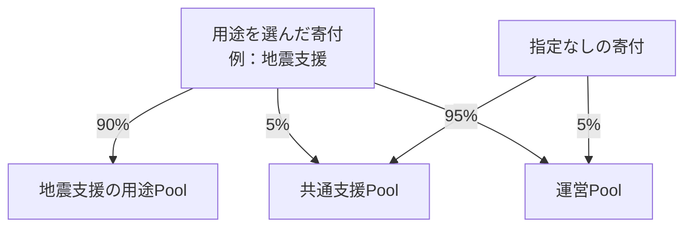
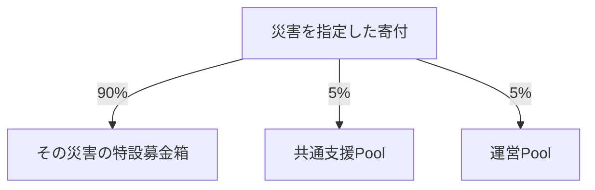
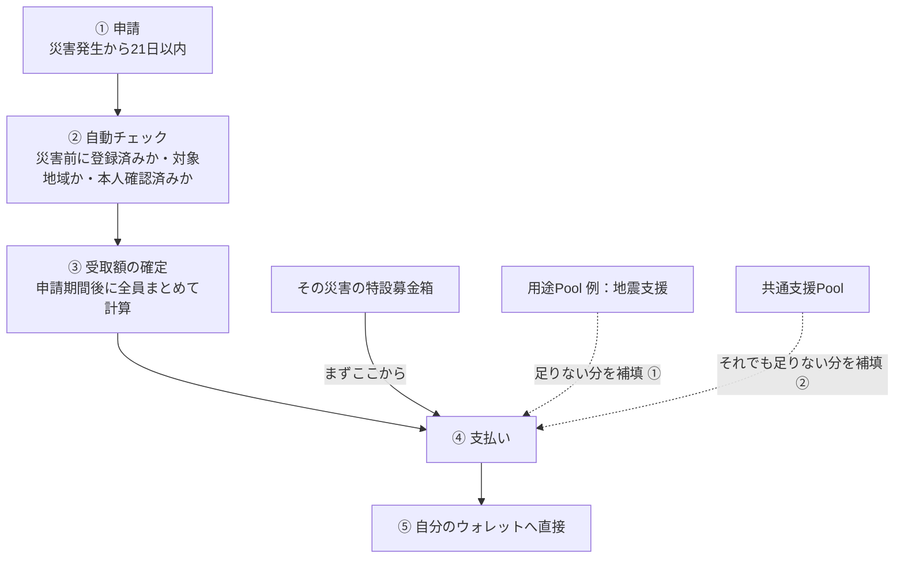
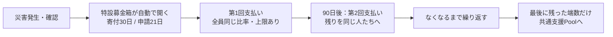

# Sonari のお金の流れ — 寄付する人・受け取る人のためのガイド
Sonari は、災害支援の寄付をブロックチェーン上で集めて、被災した人に直接届ける仕組みです。
お金の流れはすべて記録され、誰でも確認できます。
---
## 1. お金の置き場所は4種類
| Pool | 役割 |
|---|---|
| 用途Pool | **ふだんの寄付**の受け皿。「地震支援」のように、支援したい用途ごとに常設。まずは地震支援から始め、洪水・台風・学生支援などへ広げていく予定 |
| 特設募金箱 | **災害が起きたあとの寄付**の受け皿。災害ごとに、その災害専用に1つずつ自動で作られる期間限定の募金箱 |
| 共通支援Pool | 用途を決めない寄付の受け皿。全体の下支えに使う共通のお金 |
| 運営Pool | プラットフォームを動かすためのお金（サーバー代・監査費用など） |
用途Poolは「ふだん（平常時）」、特設募金箱は「災害が起きたあと」と、**寄付するタイミングが違います**。どちらも行き先と使われ方を、いつでもブロックチェーン上で確認できます。
---
## 2. 【寄付する人へ】ふだんの寄付 — 用途を選んで備える
どの寄付も、寄付した瞬間にコントラクトが自動で分割します。
**運営が後から支援Poolのお金を引き出すことは、仕組み上できません。**
平常時の寄付では、支援したい**用途**を選べます（例：地震支援）。これまで支援団体に寄付していたお金を、**行き先が完全に見える形**で災害支援に向けられます。特にこだわりがなければ「指定なし」でかまいません。その場合は共通支援Poolに入ります。

用途Poolに貯まったお金は、その用途の災害が起きたとき、特設募金箱の不足を補うために使われます。
**ニュースにならない災害の被災者にも届く、安定した財源**です。
---
## 3. 【寄付する人へ】災害が起きたときの寄付 — 特設募金箱へ
大きな災害が起きるとニュースで世界中に伝わり、「この災害に寄付したい」という人が一気に増えます。その受け皿が特設募金箱です。
- 災害の発生が検証システムで確認されると、**その瞬間に専用の募金箱が自動で開きます。** ニュースが世界に届くころには、寄付先がすでに存在しています。
- 人間の判断は入りません。**大災害も、報道されない災害も、同じルールで平等に**開きます。
- ルール（受取の目標額・寄付の分け方・期間）は開いた瞬間に固定され、**その災害では二度と変わりません。**
- **期間限定**です。寄付の受付は**30日間**、被災者の申請受付は**21日間**。

- 募金箱には「**今いくら集まっているか**」「**被災者1人あたりいくら届きそうか**」が常に公開され、自分の寄付の効果をリアルタイムで確認できます。
- 運営費が1つの災害から受け取れる金額には**上限**があります。超過分は共通支援Poolに入ります。
- 寄付期間が終わったあとに届いた寄付は、共通支援Poolに入って次の支援に使われます。
---
## 4. 【受け取る人へ】支援を受け取るには
**いちばん大切なこと：登録は、災害が起きる前に済ませておく必要があります。**
災害が起きたあとに登録しても、その災害の支援は受けられません（不正な駆け込み登録を防ぐためです）。
**◆ 災害が起きる前にやっておくこと**
1. メンバー登録（Membership Pass）をして、**住んでいる地域**を登録する
2. **本人確認**を済ませる（KYC または World ID のどちらか）
登録は**完全無料**です。メンバーシップは**1人1つ**で、本人確認書類や住所などの個人情報そのものがブロックチェーンに載ることはありません。
**◆ 災害が起きたら：申請から受け取りまでの流れ**

1. **申請**：自分の登録地域が対象になっていたら、**21日以内**に申請します。
2. **自動チェック**：「災害の前に登録していたか」「住まいが対象地域か」「本人確認済みか」をシステムが自動で確認します。人の審査は挟みません。
3. **受取額の確定**：申請期間が終わってから、申請者全員分をまとめて計算します（だから早い者勝ちになりません）。
4. **支払い**：支払い元は3段構えです。**まずその災害の特設募金箱**から。足りないときは**同じ用途の用途Pool**（例：地震支援Pool）が、それでも足りないときは**共通支援Pool**が、それぞれ上限の範囲で不足分を補います。
5. **受け取り**：支援金は途中で誰の手も経由せず、コントラクトから**あなたのウォレットへ直接**送られます。
申請は最初の1回だけです。お金が残っていれば90日ごとに行われる2回目以降の支払いも、同じ流れで受け取れます。
同じ災害で複数のメンバーシップから受け取ることは禁止されており、不正が見つかった場合は支払い停止や返還請求の対象になります。
---
## 5. 支援金はいくらもらえる？
被害の大きさに応じて、3段階の**目標額**があります。
| 区分 | 目標額 | 1回の受取上限 |
|---|---|---|
| Band 1（軽い被害） | 50 USDC | 150 USDC |
| Band 2（中くらいの被害） | 150 USDC | 450 USDC |
| Band 3（大きな被害） | 300 USDC | 900 USDC |
目標額は保証額ではありません。実際の受取額は、
> 受取額 ＝ 目標額 ×（集まったお金 ÷ 必要なお金の合計）
で決まります。申請期間が終わってから全員分まとめて計算するので、
**早く申請した人が得をすることはなく、全員が同じ比率で受け取れます。**
寄付がたくさん集まれば受取額は目標額より増えます（上限は目標額の3倍）。
足りないときは、まず**同じ用途の用途Pool**が、それでも足りなければ**共通支援Pool**が、上限の範囲で補います。
---
## 6. 特設募金箱のお金は、最終的に全額その災害の被災者へ
特設募金箱にたくさん集まり、1回の支払いで配りきれなかった分は、消えたり他に回されたりしません。
**90日ごとに、同じ被災者へ繰り返し配られます。**

- 災害直後の「救援のお金」と、数ヶ月後の「生活再建のお金」の両方が届きます。
- 1回ごとの上限があるため、不正に大金を狙うことはできません。
---
## 7. Sonari の約束
1. **特設募金箱は、災害の確認と同時に自動でできる**（どの災害も平等。人の裁量なし）
2. **寄付の行き先は、寄付の瞬間に自動で決まる**（運営は支援Poolのお金に触れられない）
3. **受取額は早い者勝ちにならない**（締切後に全員まとめて計算し、同じ比率で按分）
4. **特設募金箱のお金は全額、その災害の被災者へ**（時間をかけて配りきる。余りの没収はない）
すべてのお金の動きはブロックチェーンに記録され、誰でもいつでも確認できます。
