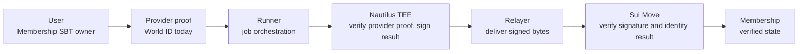
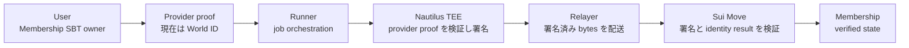

# Identity Verification

Sonari needs to know that a claimant is a real eligible person without storing raw personal data on-chain. The MVP uses World ID as the live identity route. The same verifier pattern can later support KYC, student IDs, university accounts, or other provider-backed eligibility checks.

## 1. What Identity Verification Proves

The identity verifier answers this question:

> Does this Membership SBT owner have a valid provider verification result that can be bound to the membership without exposing raw personal data on-chain?

For the MVP, World ID proves personhood for the Membership SBT. The verifier output is a signed `IdentityVerificationResult`. Sui Move checks that result before marking the membership as verified.

KYC is part of the planned provider model, but it is not the live MVP route. The MVP live route is World ID.

## 2. Flow

The runner and relayer do not decide whether the user is verified. They transport the request and the signed result. The TEE checks the provider proof and signs only successful results. Sui verifies the enclave key, signature, payload layout, provider field, duplicate key, membership id, owner, issued time, and expiry.

## 3. Privacy Boundary

Sonari does not put raw personal information on-chain.

Not stored on-chain:

- identity document images;
- raw KYC provider responses;
- World ID proof body;
- phone number;
- street address;
- GPS history;
- university account password or private account data.

Stored or checked on-chain:

- membership id;
- owner address;
- provider type;
- verification status and expiry;
- duplicate key hash;
- evidence hash;
- signed payload bytes and signature metadata.

This lets the contract enforce eligibility while avoiding public disclosure of the underlying personal data.

## 4. Duplicate Protection

A support system must prevent one person from creating many memberships and claiming repeatedly.

Sonari handles this with provider-specific duplicate keys. The verifier computes a `duplicate_key_hash` from provider-specific stable values, then Sui binds that duplicate key to a membership. A duplicate key already bound to another membership is rejected.

For World ID, the duplicate key is derived from the World ID context and nullifier. For KYC, a future provider would derive it from the provider id and provider user id. For student support, a future provider could derive it from a university id, student account id, or enrollment verification id, depending on the source policy.

The exact raw identifiers do not need to be public on-chain. The contract needs the hash and the verifier signature.

## 5. Student And University Support

The identity verifier is not limited to disaster relief.

Future provider examples:

- student ID card verification;
- university email verification;
- university SSO login;
- enrollment status API;
- scholarship office or registrar confirmation;
- community membership credential.

With those providers, Sonari can support:

- student emergency grants;
- scholarship-style donations;
- tuition or textbook assistance;
- food, housing, or relocation support;
- community aid programs where eligibility comes from an external institution.

The same trust rule applies: the frontend does not decide eligibility. A Nautilus verifier checks the provider source, signs a minimal result, and Sui Move accepts only the signed result.

## 6. Relationship To Residence And Disaster Checks

Identity verification is only one part of a claim.

For disaster relief, a claimant also needs:

- an active Membership SBT;
- a home cell registered before the disaster cutoff;
- proof that the home cell is included in the signed affected-cells root;
- no duplicate claim for the same campaign and round.

For student support, the residence and disaster checks may be replaced by different program rules, such as enrollment status, school, region, aid category, or campaign-specific constraints. The identity verifier proves provider eligibility; the program contract decides how that proof is used.

## 7. MVP Status

Implemented:

- World ID verification route.
- Signed `IdentityVerificationResult`.
- Duplicate key hash model.
- Sui-side identity result verification.
- Membership verified/expiry state.

Planned:

- KYC provider implementation.
- Student ID / university account provider implementation.
- Additional support-program rules that use non-disaster eligibility.

---

# 本人・資格確認（日本語）

Sonari では、raw personal data を on-chain に保存せずに、claimant が実在し受給資格を持つ人であることを確認する必要があります。MVP では World ID が live identity route です。同じ verifier pattern は、将来 KYC、学生証、大学アカウント、その他 provider-backed eligibility checks に拡張できます。

## 1. Identity Verification が証明すること

identity verifier が答える問いは次です。

> この Membership SBT owner は、raw personal data を on-chain に公開せずに membership へ紐付けられる有効な provider verification result を持つか。

MVP では、World ID が Membership SBT 向けの personhood を証明します。verifier output は署名済み `IdentityVerificationResult` です。Sui Move はその result を検証してから membership を verified にします。

KYC は planned provider model に含まれますが、MVP の live route ではありません。MVP の live route は World ID です。

## 2. Flow

runner と relayer は、user が verified かどうかを決めません。request と signed result を運ぶだけです。TEE が provider proof を検証し、成功 result だけに署名します。Sui は enclave key、signature、payload layout、provider field、duplicate key、membership id、owner、issued time、expiry を検証します。

## 3. Privacy Boundary

Sonari は raw personal information を on-chain に置きません。

on-chain に保存しないもの:

- 本人確認書類画像。
- raw KYC provider response。
- World ID proof body。
- 電話番号。
- 住所。
- GPS history。
- 大学アカウントの password や private account data。

on-chain に保存または検証するもの:

- membership id。
- owner address。
- provider type。
- verification status and expiry。
- duplicate key hash。
- evidence hash。
- signed payload bytes と signature metadata。

これにより、基礎となる個人データを公開せずに contract が eligibility を強制できます。

## 4. Duplicate Protection

支援システムでは、1人が複数 membership を作って繰り返し claim することを防ぐ必要があります。

Sonari は provider-specific duplicate key を使います。verifier が provider 固有の安定値から `duplicate_key_hash` を計算し、Sui がその duplicate key を membership に binding します。別 membership にすでに紐付いた duplicate key は reject されます。

World ID では、World ID context と nullifier から duplicate key を導出します。将来の KYC provider では、provider id と provider user id から導出できます。学生支援では、source policy に応じて university id、student account id、enrollment verification id などから導出できます。

raw identifier そのものを on-chain で公開する必要はありません。contract が必要とするのは hash と verifier signature です。

## 5. 学生・大学支援

identity verifier は災害支援だけに限定されません。

将来 provider の例:

- 学生証 verification。
- 大学メール verification。
- 大学 SSO login。
- 在学状態 API。
- 奨学金窓口や学籍担当による confirmation。
- community membership credential。

これらの provider を使うと、Sonari は次のような支援に応用できます。

- 学生向け緊急給付。
- 奨学金型の寄付。
- 授業料や教材費の補助。
- 食料、住居、転居支援。
- 外部機関の eligibility に基づく community aid program。

信頼ルールは同じです。frontend は eligibility を決めません。Nautilus verifier が provider source を検証し、最小限の result に署名し、Sui Move は署名済み result だけを受け入れます。

## 6. Residence / Disaster Checks との関係

identity verification は claim の一部にすぎません。

災害支援では、claimant は次も必要です。

- active な Membership SBT。
- 災害 cutoff より前に登録された home cell。
- home cell が署名済み affected-cells root に含まれる proof。
- 同じ campaign / round で重複 claim していないこと。

学生支援では、residence や disaster checks は別の program rules に置き換えられます。例えば在学状態、学校、地域、支援カテゴリ、campaign-specific constraints などです。identity verifier は provider eligibility を証明し、program contract がその proof の使い方を決めます。

## 7. MVP Status

実装済み:

- World ID verification route。
- signed `IdentityVerificationResult`。
- duplicate key hash model。
- Sui-side identity result verification。
- Membership verified/expiry state。

計画中:

- KYC provider implementation。
- 学生証 / 大学アカウント provider implementation。
- 非災害 eligibility を使う追加 support-program rules。
