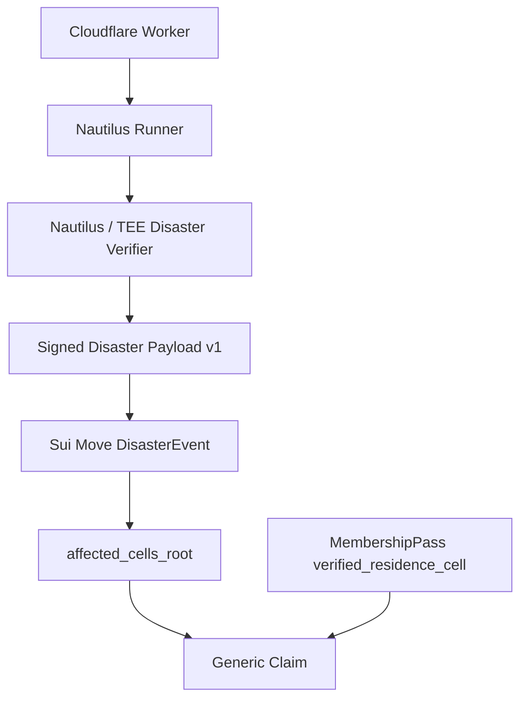

# Sonari Nautilus Disaster Oracle 要件定義

Sonari Disaster Oracle は、災害イベントと対象セル root を Nautilus / TEE 内で再検証し、Sui Move で検証可能な署名付き Disaster Payload へ変換する verifier family である。

この verifier は個人の居住地や受取資格を判定しない。個人の residence metadata、student metadata、Pass migration は `nautilus/verifiers/membership/` の責務である。Disaster Claim では、この verifier が作る `DisasterEvent.affected_cells_root` と、Membership Pass に保存された `verified_residence_cell` を contracts 側で合成する。

## 主なワークフロー

1. Cloudflare Cron が Cloudflare Worker を起動する。
2. Worker が USGS recent earthquakes API を取得する。
3. Worker が `type === "earthquake"` の event id を D1 へ冪等記録し、summary fields で軽量 screening する。
4. Worker が auto-screening を通過した event、または手動投入された event だけを Nautilus runner へ渡す。
5. Nautilus / TEE が USGS 詳細を再取得・再検証する。
6. Nautilus / TEE が Band、H3 cell、Merkle root、監査 hash、BCS Payload、署名を生成する。
7. Relayer が `finalized` の署名付き Payload だけを Sui Move へ投稿する。
8. Move が署名、intent、freshness、revision、source、root を検証して DisasterEvent を作成する。
9. Claim 時は contracts が DisasterEvent root と Membership Pass residence metadata を照合する。



## このワークフローの要点

- Worker は軽量 Watcher であり、USGS recent feed の earthquake event id 記録、状態管理、auto-screening、Nautilus 起動だけを担当する。
- Nautilus / TEE は最終判定者として、外部 source を再取得し、Band 判定、H3 生成、Payload 生成、署名を行う。
- `pending_source` / `pending_mmi` / `rejected` / `ignored_small` は offchain D1 state だけで管理し、Sui へ投稿しない。
- Magnitude / summary MMI / alert / tsunami は TEE 起動対象を絞る Watcher 運用フィルタであり、DisasterEvent finalize 条件ではない。
- Relayer は単なる配送係であり、`finalized` Payload だけを投稿する。Move は Relayer や Worker を信頼しない。
- Move は登録済み Nautilus / TEE 署名済みの `finalized` Payload だけを検証し、DisasterEvent を作成する。
- 個人の居住地判定と Pass metadata 更新は membership verifier が担当する。

## 1. MVP 方針

| 項目 | 方針 |
| --- | --- |
| MVP 災害 | 地震のみ |
| 候補検出 | Cloudflare Worker が USGS recent earthquakes API を定期取得し、`type === "earthquake"` を D1 へ記録 |
| Runner 起動フィルタ | Worker が summary fields で auto-screening し、TEE 起動対象を絞る |
| 最終検証 | Nautilus / TEE が USGS 詳細を再取得して実施 |
| セル生成方式 | 初期 MVP から cell_intensity 方式 |
| Band 判定 | H3 セルごとの USGS MMI または JMA 震度 |
| Magnitude | Watcher auto-screening には使うが finalize 条件には使わない |
| Claim 接続 | `finalized` の DisasterEvent のみ root として使用可能 |
| H3 | resolution 7 固定 |
| affected_cells | `cell_band >= 1` の H3 セル集合 |
| raw data | `raw_data_hash` は必須、`raw_data_uri` は MVP では optional |
| TEE | AWS EC2 / Nitro Enclaves 上の Nautilus 実行環境。候補検出時のみ起動する |

## 2. 責任分界

### Cloudflare Worker がやること

- Cloudflare Cron Trigger で 3〜5 分ごとに起動する。
- USGS recent earthquakes API を取得する。
- 過去 60 分の `type === "earthquake"` event id を重複スキャンする。
- `source_event_id` による冪等管理を行う。
- D1 にイベント状態を保存する。
- USGS recent feed summary fields の `mag`、`mmi`、`alert`、`tsunami` を保存し、auto-screening で `new` と `ignored_small` を分ける。
- threshold 未満の地震は `ignored_small` + `WATCHER_BELOW_AUTO_THRESHOLD` として D1 に残し、runner / TEE には渡さない。
- 後続の USGS summary update で auto-screening 条件を満たした場合のみ、`ignored_small` から `new` へ昇格する。
- auto-screening を通過した地震、または手動投入された地震だけ AWS Nautilus runner 起動 API を呼ぶ。
- `pending_source` / `pending_mmi` の再チェック予定を管理する。
- Worker 失敗、AWS runner 起動失敗、timeout、TEE 処理失敗、再試行上限到達を D1 の `error_code` に保存し、admin 通知対象にする。

### Cloudflare Worker がやらないこと

- DisasterEvent を finalize しない。
- auto-screening 結果を DisasterEvent finalization として扱わない。
- Magnitude、summary MMI、alert、tsunami だけで Claim 対象かどうかを判断しない。
- Band 最終判定をしない。
- H3 cell を生成しない。
- Merkle root を生成しない。
- BCS Payload を生成しない。
- TEE 署名をしない。
- Sui へ DisasterEvent を直接作成しない。
- 個人の居住地や受取資格を判定しない。

### Nautilus / TEE がやること

- Worker から受け取った `source_event_id` をもとに USGS 詳細を再取得する。
- USGS detail GeoJSON の `products.shakemap` を確認し、ShakeMap product の最新版を特定する。
- ShakeMap が未公開の場合は finalize せず、`pending_source` として再チェック対象にする。
- MVP live source として USGS ShakeMap `grid.xml.zip` を取得・照合する。
- source freshness、source 更新時刻、許可 source を検証する。
- raw source data から `raw_data_hash` を生成する。
- H3 resolution 7 の候補セルを生成する。
- 各 H3 セルに対して USGS MMI を集約する。
- 各 H3 セルの `cell_band` を決定する。
- `cell_band >= 1` のセルを `affected_cells` に採用する。
- `severity_band = max(cell_band)` を決定する。
- D1 へ返す offchain status として `pending_source` / `pending_mmi` / `finalized` / `rejected` を決定する。
- Claim 対象セルだけの `affected_cells_root` を生成する。
- `source_set_hash` を生成する。
- Move と同じ構造の BCS Payload を生成する。
- `finalized` の場合だけ、Nautilus / TEE 内の秘密鍵で Payload に署名する。

### Nautilus / TEE がやらないこと

- 個人の residence metadata を更新しない。
- Membership Pass を発行しない。
- Student status を検証しない。
- Claim payout を決めない。

### Sui Move がやること

- Nautilus 署名済みの `finalized` Payload だけを検証する。
- 古い revision、期限切れ Payload、許可されていない source を拒否する。
- `affected_cells_root`、`affected_cells_uri`、`affected_cells_data_hash` を保存する。
- Disaster Relief Program 固有 object として `DisasterEvent` を作成する。
- Claim 時に提出される `AffectedCellLeaf` と Merkle proof を検証する。
- Claim 対象セルの `h3_index` が Membership Pass の `verified_residence_cell` と一致することを検証する。
- `cell_band >= min_claim_band` を検証する。

### Sui Move がやらないこと

- ShakeMap 取得。
- MMI 計算。
- H3 polygon 変換。
- p90 集約。
- 地理計算。
- 個人の住所、GPS、電話番号などの raw evidence 保存。

## 3. 技術スタック

| 対象 | 採用技術 | 役割 |
| --- | --- | --- |
| `nautilus/verifiers/disaster/watcher/` | Cloudflare Workers、TypeScript、Wrangler | Cron、USGS recent earthquakes API 取得、D1 状態管理、Queue 投入、AWS 起動 API 呼び出し、手動投入 API |
| `nautilus/verifiers/disaster/tee/` | Rust、Nautilus、serde、reqwest、bcs、sha2、h3o または h3ron | USGS 詳細再取得、セル別震度集約、Band 判定、H3 生成、Merkle root 生成、監査 hash 生成、BCS Payload 生成、TEE 署名 |
| `nautilus/verifiers/disaster/relayer/` | TypeScript または Rust、Sui SDK | 署名済み Payload の Sui 投稿、投稿結果の記録、再試行 |
| `nautilus/verifiers/disaster/shared/` | TypeScript | Disaster verifier 内部の共有型、定数、validator |
| `nautilus/verifiers/disaster/fixtures/` | JSON | USGS / JMA の再現用サンプルデータ、TEE・Watcher・Relayer の共通テスト入力 |
| `nautilus/verifiers/membership/` | TypeScript / docs / future Nautilus | Residence / Student metadata verifier family。個人 metadata 更新はこちらで扱う |
| `contracts/` | Sui Move | Payload 検証、DisasterEvent 作成、Claim 接続用 root 保存、generic claim との接続 |

## 4. DisasterEvent 判定方針

DisasterEvent の finalize 条件には Magnitude を使わない。Magnitude、USGS summary MMI、alert、tsunami は Watcher auto-screening にだけ使い、Claim 接続可否は TEE が再取得した source と cell-level Band で判断する。

Band 判定はイベント全体ではなく、H3 セルごとの揺れ強度を基準にする。

| Cell Band | USGS MMI | JMA 震度 | Move での扱い |
| --- | --- | --- | --- |
| Band 0 | MMI VII 未満 | 震度 6 弱未満 | Claim 対象外 |
| Band 1 | MMI VII 以上 | 震度 6 弱 | Claim 対象 |
| Band 2 | MMI VIII 以上 | 震度 6 強 | Claim 対象 |
| Band 3 | MMI IX 以上 | 震度 7 | Claim 対象 |

```txt
affected_cells = all H3 cells where cell_band >= 1
event.severity_band = max(cell.cell_band)
```

`severity_band` はイベント全体の最大 Band。同じ地震イベント内でも、H3 セルごとに Band 1 / 2 / 3 が混在し得る。

Claim 可否は、Membership Pass の `verified_residence_cell` が `affected_cells_root` に含まれ、かつ必要 Band 以上であることで判定する。

### Source 優先順位

| 優先度 | Source | 用途 |
| --: | --- | --- |
| 1 | USGS ShakeMap MMI grid | MVP live source。グローバル標準のセル別 MMI 判定 |
| 2 | JMA 推計震度分布 | 日本デモ用 fixture。本番 parser は Could 要件 |
| 3 | JMA 観測点震度 | Future 補助 source |
| 4 | USGS event summary `properties.mmi` | fallback。イベント全体の参考値 |
| 5 | Magnitude / 震源情報 | Watcher auto-screening・初期テストのみ。finalize 根拠にはしない |

### H3 セルへの震度集約

```txt
H3 resolution: 7
Cell intensity source: USGS MMI
Cell aggregation: GRID_POINT_P90
Cell inclusion: cell_band >= 1
Event band: max(cell_band)
```

MVP では、USGS ShakeMap `grid.xml.zip` の格子点 MMI を H3 resolution 7 へ割り当て、各 H3 セル内の MMI 値から P90 を取る `GRID_POINT_P90` を標準にする。

## 5. Status / D1 状態管理

MVP の status は `new` / `processing` / `pending_source` / `pending_mmi` / `finalized` / `submitted` / `failed` / `rejected` / `ignored_small` である。manual review 用 status は作らない。

| Status | 意味 | due対象 | runner / TEE | terminal / completed | Claim接続 |
| --- | --- | --- | --- | --- | --- |
| `new` | runner 起動待ち | 可 | 渡す | いいえ | 不可 |
| `processing` | runner / TEE 処理中 | 不可 | 渡さない | いいえ | 不可 |
| `pending_source` | source 公開待ち | 可 | 渡す | いいえ | 不可 |
| `pending_mmi` | source はあるがセル単位 MMI 未確定 | 可 | 渡す | いいえ | 不可 |
| `finalized` | 署名付き Payload 生成済み | 不可 | 渡さない | はい | root として使用可能 |
| `submitted` | Sui 投稿済み | 不可 | 渡さない | はい | root として使用可能 |
| `failed` | 一時失敗、再試行または通知対象 | 可 | 渡す | いいえ | 不可 |
| `rejected` | TEE/Core が検証した結果、対象外または finalize 不可 | 不可 | 渡さない | はい | 不可 |
| `ignored_small` | Watcher auto-screening で threshold 未満として skip | 不可 | 渡さない | はい | 不可 |

共通 `error_code` は既存実装の値を維持する。特に以下を区別する。

| error_code | 意味 |
| --- | --- |
| `NO_AFFECTED_CELLS` | TEE/Core が USGS 詳細と ShakeMap を検証したが、Claim 対象セルが 1 つもなかった |
| `WATCHER_BELOW_AUTO_THRESHOLD` | Watcher が summary auto-screening で小さい地震として skip し、TEE/Core を呼んでいない |
| `REJECTED_AUTO_TRIGGER` | 72h finalization deadline 超過により auto trigger 処理を終了した |

## 6. Payload 要件

この docs 更新では、Disaster Oracle v1 payload と `AffectedCellLeaf` の仕様を変更しない。BCS field order、enum 値、integer encoding、hash 対象 field、sort rule は `schemas/` と golden vector を正とする。

### 入力要件

Nautilus / TEE は、Worker または手動投入 API から最低限以下を受け取る。

| Field | 要件 |
| --- | --- |
| `request_type` | `DETECT_BY_EVENT_ID` を MVP の基本形にする |
| `hazard_type` | `EARTHQUAKE` のみ許可 |
| `primary_source` | MVP では `USGS` を基本にする |
| `source_event_id` | USGS event id。冪等管理と再取得の主キー |
| `geo_resolution` | 7 固定 |

Worker は hash、root、Band、Payload、signature を TEE に渡さない。TEE は source を再取得して自分で生成する。

### 署名 Payload 要件

Nautilus / TEE が Move へ渡す BCS Payload には、既存 v1 として少なくとも以下を含める。

| Field | 要件 |
| --- | --- |
| `intent` | Sonari Earthquake Oracle 専用 intent |
| `oracle_version` | 許可された判定ロジック version |
| `event_uid` | hazard type、source、source event id、occurred time から決定的に生成 |
| `hazard_type` | EARTHQUAKE |
| `severity_band` | `finalized` では affected cells 内の最大 `cell_band` |
| `status` | Move 投稿 Payload では `finalized` のみ |
| `event_revision` | TEE が source manifest から決定する Sonari Finalized Revision |
| `occurred_at_ms` | 地震発生時刻 |
| `observed_at_ms` | Oracle 観測時刻 |
| `source_updated_at_ms` | source 側の更新時刻 |
| `primary_source` | 許可 source 名 |
| `source_set_hash` | source 集合の監査 hash |
| `raw_data_hash` | 元データの監査 hash |
| `raw_data_uri` | MVP では optional |
| `affected_cells_root` | Claim 対象セルだけの Merkle root。`cell_band >= 1` の leaf のみ含める |
| `affected_cells_uri` | `finalized` では必須 |
| `affected_cells_data_hash` | 対象セル一覧ファイル全体の 32-byte hash |
| `geo_resolution` | 7 |
| `cells_generation_method` | MVP では `shakemap_gridxml_h3_grid_point_p90_v1` |
| `cell_metric` | v1 schema では `USGS_MMI` または `JMA_SHINDO`。Move MVP では `USGS_MMI` のみ受理 |
| `cell_aggregation` | MVP 標準は `GRID_POINT_P90` |
| `intensity_scale` | v1 schema では `MMI_X100` または `JMA_SHINDO_X10`。Move MVP では `MMI_X100` のみ受理 |
| `max_cell_band` | affected cells 内の最大 Band。`severity_band` と一致 |
| `affected_cell_count` | affected cells に含まれる H3 セル数 |
| `min_claim_band` | Claim 対象とする最低 Band。MVP では 1 |
| `freshness_deadline_ms` | 署名済み Payload を Move へ投稿できる期限。MVP 初期値は `observed_at_ms + 6 hours` |

### Merkle leaf 要件

`affected_cells_root` は Claim 対象セル証明用 root である。`cell_band >= 1` の leaf だけを含め、Band 0 セルは含めない。

```rust
struct AffectedCellLeaf {
    event_uid: [u8; 32],
    event_revision: u32,
    h3_index: u64,
    geo_resolution: u8,
    cell_metric: CellMetric,
    intensity_value: u16,
    intensity_scale: IntensityScale,
    cell_band: u8,
    cells_generation_method: u8,
    oracle_version: u64,
}
```

```txt
leaf_hash = hash(
  event_uid,
  event_revision,
  h3_index,
  geo_resolution,
  cell_metric,
  intensity_value,
  intensity_scale,
  cell_band,
  cells_generation_method,
  oracle_version
)

sort by h3_index ascending
```

leaf hash には上記全フィールドを含める。Rust / TypeScript / Move の型、enum 値、field 順序、integer encoding、hash 順序は `schemas/affected_cell_leaf.md` に合わせる。

## 7. Move 検証要件

Move は Worker、Relayer、外部 API レスポンスを直接信頼しない。登録済み Nautilus / TEE 署名 Payload に対して、最低限以下を検証する。

| 検証項目 | 要件 |
| --- | --- |
| signature | 登録済み Nautilus / TEE 公開鍵で検証できること |
| intent | Sonari Earthquake Oracle 専用 intent |
| oracle_version | 許可 version |
| status | `finalized` のみ DisasterEvent 作成を許可 |
| freshness | Sui `Clock` の `timestamp_ms` が `freshness_deadline_ms` を過ぎていないこと |
| revision | 古い revision、同一 revision 再投稿を拒否 |
| hazard_type | EARTHQUAKE のみ |
| severity_band | finalized では 1〜3 のみ。`max_cell_band` と一致すること |
| primary_source | Move MVP では `USGS` のみ |
| source_set_hash | 空でない 32-byte hash |
| raw_data_hash | 空でない 32-byte hash |
| affected_cells_root | 空でない 32-byte root |
| affected_cells_uri | finalized では空でない |
| affected_cells_data_hash | finalized では空でない 32-byte hash |
| affected_cell_count | finalized では 0 より大きい |
| min_claim_band | MVP では 1 |

Move MVP の on-chain v1 は、USGS earthquake + ShakeMap `grid.xml` H3 P90 + USGS MMI だけを受理する。具体的には `primary_source = USGS`、`cells_generation_method = SHAKEMAP_GRIDXML_H3_GRID_POINT_P90_V1`、`cell_metric = USGS_MMI`、`cell_aggregation = GRID_POINT_P90`、`intensity_scale = MMI_X100` を必須にする。JMA 系 enum は fixture / future extension として schema 上は残すが、この Move v1 では reject する。

Move 側の DisasterEvent または Registry は、最低限 `event_uid`、`accepted_revision`、`source_updated_at_ms`、`affected_cells_root`、`affected_cells_data_hash` を保持する。

Claim 時は、提出された `AffectedCellLeaf` と Merkle proof が `affected_cells_root` に一致することを検証する。Claim 対象セルの `h3_index` は Membership Pass の `verified_residence_cell` と一致し、`cell_band >= min_claim_band` を満たす必要がある。

## 8. 見逃しリスク対策

- Cron は 3〜5 分ごとに再実行する。
- 各 Cron で過去 60 分の USGS recent earthquakes を重複スキャンする。
- `type === "earthquake"` の `source_event_id` は summary auto-screening 結果にかかわらず D1 へ upsert する。
- `source_event_id` で冪等管理し、同じ event を重複起動しない。
- `ignored_small` は due 対象外にし、runner / TEE には渡さない。
- 後続 USGS summary update で `mag >= 5.5`、`mmi >= 6.0`、`alert IN ("yellow", "orange", "red")`、`tsunami == 1` のいずれかを満たした場合のみ `ignored_small -> new` へ昇格する。
- `pending_source` / `pending_mmi` は再チェック予定時刻を持つ。
- 24 時間未満の地震は finalize せず、D1 の `next_retry_at_ms` で再チェックする。
- 48 時間時点の latest `RELEASED` ShakeMap は Sonari Finalized Revision として採用できる。
- 72 時間以内に ShakeMap / MMI を取得できなければ `status = rejected`、`error_code = REJECTED_AUTO_TRIGGER` に固定する。
- `freshness_deadline_ms` は finalization deadline ではなく、署名済み Payload の投稿期限として `observed_at_ms + 6 hours` を初期値にする。
- 手動投入 API で特定 `source_event_id` を再処理できるようにし、summary auto-screening を bypass して runner 対象にできるようにする。

## 9. MVP Must / Should / Could

### Must

- Cloudflare Workers Cron Trigger。
- USGS recent earthquakes API 取得。
- `source_event_id` 冪等管理。
- D1 による primary state 管理。
- Watcher auto-screening による `new` / `ignored_small` 分岐。
- Worker では finalize せず、Nautilus / TEE が再取得・再検証する責任分界。
- H3 セルごとの Band 1〜3 判定。
- H3 resolution 7 固定。
- `affected_cells = cell_band >= 1` の H3 セル集合。
- `affected_cells_root` は Claim 対象セルだけの leaf から生成する。
- BCS Payload 生成。
- Nautilus / TEE 署名。
- Move で signature / intent / oracle_version / freshness / revision / source / root / data hash を検証。
- Claim では membership verifier が更新した `verified_residence_cell` と `AffectedCellLeaf.h3_index` を照合する。

### Should

- `pending_source` / `pending_mmi` 再チェックスケジューリング。
- Cloudflare Queues によるジョブ化。
- 過去 24 時間の定期バックフィル。
- Worker 失敗・Nautilus 起動失敗通知。
- JMA 震度 fixture。
- `cell_metric` / `cell_aggregation` / `intensity_scale` を Payload に含める。
- 異常に大きい `affected_cell_count` の warning log と admin 通知。
- `raw_data_uri`。

### Could

- permissionless trigger。
- USGS + JMA など複数 Watcher source。
- R2 watcher snapshot 保存。
- 複数 AWS Region / 複数 Enclave fallback。
- USGS ShakeMap HDF 対応。
- JMA 本番 parser。
- 複数 source の quorum。
- UI で H3 セルごとの Band 可視化。
- Walrus 保存。

## 10. Implementation follow-up TODO

この docs-only 更新では実装コード、schemas、contracts、relayer、tee は変更しない。次 PR 以降で以下を実装対象にする。

- shared 型へ `ignored_small` status と `WATCHER_BELOW_AUTO_THRESHOLD` error code を追加する。
- watcher parser で USGS recent feed summary fields の `mag`、`mmi`、`alert`、`tsunami` を保持する。
- D1 upsert 時に summary auto-screening を実行し、`new` / `ignored_small` を分ける。
- due query から `ignored_small` を除外し、runner / TEE へ渡さない。
- 後続 USGS summary update で条件を満たした場合だけ `ignored_small -> new` 昇格を実装する。
- Disaster Claim では membership verifier の `ResidenceMetadataUpdate` が Pass に保存した `verified_residence_cell` を使う。

## まとめ

Sonari Disaster Oracle v1 は、Cloudflare Worker で USGS recent feed の earthquake event id を D1 へ記録し、summary auto-screening で TEE 起動対象を絞り、Nautilus / TEE でセル単位の揺れ強度を再取得・再検証し、`finalized` 署名付き Payload だけを Sui Move へ渡す。

この verifier の責務は、災害イベントと対象セル root の作成に集中すること。個人の受取資格、居住地 confidence、Student status、Pass migration は membership verifier と contracts の generic claim flow で扱う。
