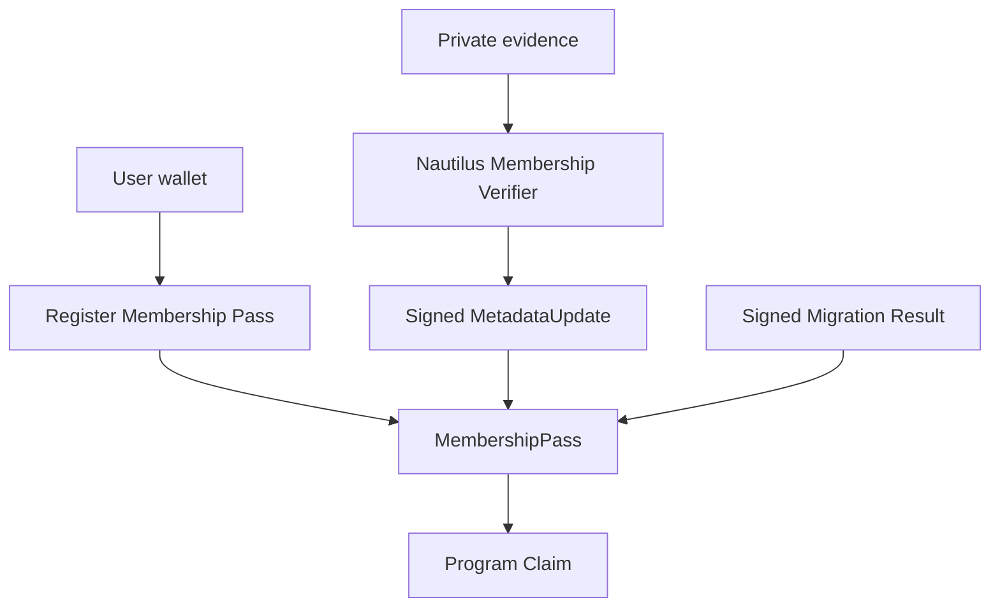
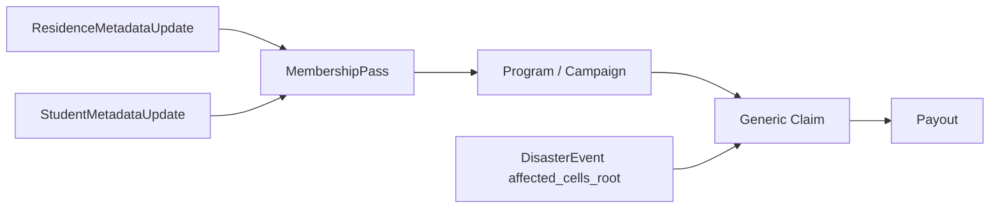

# Sonari Nautilus Membership Verifier 要件定義

Nautilus Membership Verifier は、Membership Pass の metadata を更新する verifier family である。Disaster Oracle が災害イベントと対象セル root を作るのに対し、Membership Verifier は受取者側の residence、student status、risk、confidence、Pass migration を扱う。

この verifier は raw 個人情報をオンチェーンに出さない。Nautilus / TEE 内で evidence を検証し、contracts が検証可能な署名済み metadata update だけを出力する。

## 1. Scope

対象:

- Membership Pass metadata update
- residence verifier
- student verifier
- Web MVP residence confidence scoring
- evidence snapshot hash
- signed metadata update
- Pass migration result

対象外:

- DisasterEvent / affected cells root 作成
- Disaster Oracle v1 payload field order 変更
- Claim payout 実行
- raw KYC data のオンチェーン保存
- 本番 school API / government address API 連携

## 2. Membership Pass との関係

Membership Pass は全受取者必須の準 SBT である。Pass は owner、payout address、`pass_lineage_id`、status、metadata bucket を持つ。



Pass metadata は Nautilus 署名済み update のみ支払い判定に使う。dapp 入力や self-declared value は metadata update の入力にはできるが、contracts はそれ自体を信用しない。

## 3. Verifier Family

| Verifier | 目的 | Output |
| --- | --- | --- |
| residence | 受取者が coarse region / H3 cell に関係することを検証する | `ResidenceMetadataUpdate` |
| student | 受取者が Student Aid Campaign の対象になり得ることを検証する | `StudentMetadataUpdate` |
| migration | wallet 移行が正当であることを検証する | `PassMigrationResult` |

## 4. Residence Verifier

Residence verifier は、個人の詳細住所をオンチェーンに出さずに、支払い判定に使える coarse residence metadata を生成する。

### 4.1 Web MVP Scoring

MVP では、Web で提出される複数の低侵襲 signal を Nautilus 内で scoring する。

入力例:

- self-declared region
- wallet / Pass age
- coarse check-in history hash
- local interaction proof hash
- previous verified residence freshness
- region change frequency
- optional document hash

オンチェーンに出さないもの:

- raw phone number
- GPS history
- device id / fingerprint
- IP history
- detailed address
- raw document image

Output:

```text
ResidenceMetadataUpdate {
  pass_lineage_id
  owner
  verified_residence_cell
  residence_confidence
  risk_bucket
  evidence_snapshot_hash
  issued_at_ms
  expires_at_ms
  verifier_version
}
```

`verified_residence_cell` は Claim 用の coarse H3 cell であり、詳細住所ではない。Disaster Claim では、この値を `AffectedCellLeaf.h3_index` と照合する。

### 4.2 Confidence

| Level | 意味 | Claim 方針 |
| --- | --- | --- |
| low | evidence が弱い、または古い | Program によって reject または低 tier |
| medium | 最低限の consistency がある | reduced payout 可能 |
| high | 複数 signal が整合 | full payout 可能 |

confidence は支払い保証ではない。Program / Campaign の `PayoutPolicy` が最終的に扱いを決める。

## 5. Student Verifier

Student verifier は、Student Aid Program で必要な student status metadata を生成する。

入力例:

- school email proof
- enrollment document hash
- school / campus region hash
- term / semester claim
- student self declaration

オンチェーンに出さないもの:

- raw school email
- student id
- transcript
- enrollment certificate image
- legal name
- detailed address

Output:

```text
StudentMetadataUpdate {
  pass_lineage_id
  owner
  student_status
  school_region_hash
  student_confidence
  risk_bucket
  evidence_snapshot_hash
  issued_at_ms
  expires_at_ms
  verifier_version
}
```

`student_status` は `verified`、`probable`、`expired`、`rejected` などの bucket で表現する。raw student id は保存しない。

## 6. Nautilus Execution Timing

Membership Verifier は常時実行ではなく、イベントに応じて実行する。

| Trigger | Residence | Student |
| --- | --- | --- |
| Pass registration | 初回 metadata 作成 | optional |
| metadata refresh | 期限切れ前に再検証 | 学期 / term ごとに再検証 |
| Claim preparation | stale metadata の更新 | stale metadata の更新 |
| risk review | region change や異常行動の再評価 | duplicate student proof の再評価 |
| migration | old / new wallet binding | old / new wallet binding |

Disaster 発生後に初めて residence metadata を作る場合は、Program が低 confidence として扱うか、cooldown により reject できる。

## 7. Evidence Snapshot

Verifier は evidence 全体をオンチェーンに出さず、snapshot hash だけを出す。

```text
EvidenceSnapshot {
  verifier_family
  pass_lineage_id
  evidence_schema_version
  normalized_evidence_hashes
  scoring_inputs_hash
  created_at_ms
}
```

`evidence_snapshot_hash` は audit / dispute のための anchor であり、raw evidence を復元可能にしてはいけない。

## 8. Metadata Update Verification

contracts は metadata update で以下を検証する。

- registered verifier public key
- verifier family
- verifier version
- signature
- intent
- pass lineage binding
- owner binding
- freshness
- expiry
- replay prevention
- disabled verifier rejection

Metadata update は Pass の status が `active` のときだけ通常更新できる。`suspended` / `revoked` の扱いは Admin / verifier policy で決める。

## 9. Pass Migration

Pass は準 SBT であり、通常 transfer しない。wallet 紛失や recovery のための移行は、Nautilus 署名付き migration result がある場合だけ許可する。

```text
PassMigrationResult {
  pass_lineage_id
  old_owner
  new_owner
  new_payout_address
  migration_reason_bucket
  evidence_snapshot_hash
  issued_at_ms
  expires_at_ms
  verifier_version
}
```

Migration 後も `pass_lineage_id` は維持する。二重 Claim 防止 key は wallet address ではなく `pass_lineage_id + campaign_id` を使う。

## 10. Program との接続



Disaster Relief Program:

- required metadata: Residence
- required verifier: disaster + residence
- eligibility: `AffectedCellLeaf.h3_index == Pass.verified_residence_cell`

Student Aid Program:

- required metadata: Student
- required verifier: student
- eligibility: Campaign condition + Student metadata freshness + risk bucket

## 11. MVP / Future 境界

### MVP

- docs-only design
- `nautilus/verifiers/membership/shared` の placeholder types
- residence fixture placeholder
- student fixture placeholder
- dummy residence verifier
- dummy student verifier
- metadata update shape
- privacy policy

### Future

- Rust / Nautilus TEE implementation
- production evidence normalization
- school API integration
- address / residence provider integration
- multiple verifier quorum
- dispute / review workflow
- encrypted evidence storage
- Pass migration production flow

## 12. Security / Privacy

- raw email、phone、GPS 履歴、端末情報、住所、学籍番号をオンチェーンに出さない。
- `evidence_snapshot_hash` から raw evidence を復元できないようにする。
- verifier result は short-lived にし、expiry を必須にする。
- verifier key rotation と disabled key rejection を contracts 側で扱う。
- dapp self declaration をそのまま Claim 条件に使わない。
- confidence / risk bucket は支払い保証ではない。

## まとめ

Nautilus Membership Verifier は、Sonari を災害専用ではなく汎用寄付プラットフォームにするための受取者側 verifier family である。Residence verifier は Disaster Claim の `verified_residence_cell` を提供し、Student verifier は Student Aid Program の metadata を提供する。どちらも raw 個人情報をオンチェーンに出さず、contracts は Nautilus 署名済み metadata update のみを信頼する。
