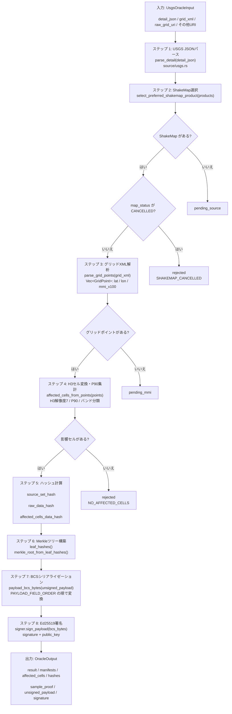
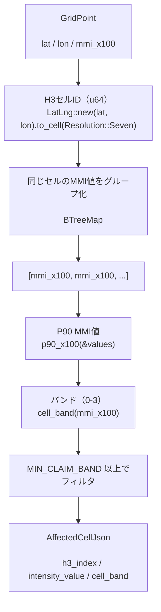
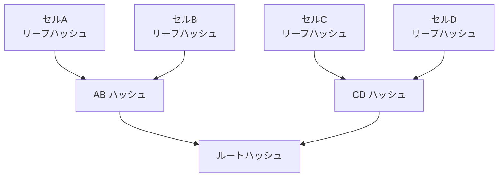

# TEE Core — Oracle 検証エンジン（Rust）

地震データを受け取り、影響を受けたH3セルを計算し、Merkleツリーを構築して署名する Rust 製の検証コアです。

---

## TEEとは何か

**Trusted Execution Environment（信頼実行環境）** とは、コンピュータの中に作られた「のぞき見できない金庫」のようなものです。

- 外部から計算の内容を見ることができない
- 計算結果が「本当にこのプログラムが出した」と証明できる（アテステーション）
- この証明があることで、ブロックチェーン上のスマートコントラクトが結果を信頼できる

---

## ディレクトリ構造

```
tee/
├── src/
│   ├── lib.rs                    ← ライブラリのエントリポイント・定数定義
│   ├── main.rs                   ← HTTPサーバー（Lambda環境）
│   ├── core/
│   │   ├── processing.rs         ← メイン処理パイプライン
│   │   ├── artifacts.rs          ← 出力データの構造体定義
│   │   ├── source_archive.rs     ← Walrus blob id/source hash 参照の生成
│   │   └── types.rs              ← OracleInput/Output/Error の型定義
│   ├── compute/
│   │   ├── geo.rs                ← グリッドポイント → H3セル変換
│   │   ├── intensity.rs          ← MMI計算・P90・バンド分類
│   │   └── merkle.rs             ← Merkleツリー構築・証明生成
│   ├── source/
│   │   └── usgs.rs               ← USGS JSON/XML パース
│   ├── encoding/
│   │   ├── bcs_payload.rs        ← BCSシリアライゼーション
│   │   └── json.rs               ← カノニカルJSONバイト生成
│   └── crypto/
│       └── mod.rs                ← SHA-256・Ed25519署名
└── tests/
    └── oracle_core.rs            ← フィクスチャベースの統合テスト
```

---

## 処理パイプライン詳細



---

## 各モジュールの解説

### `core/processing.rs` — メイン処理

4つの公開関数があります：

| 関数名 | 用途 |
|---|---|
| `process_usgs(input)` | テスト用。署名なし |
| `process_usgs_with_signer(input, signer)` | 本番用。署名あり |
| `process_usgs_from_worker_request(request, input)` | `EarthquakeVerifierRequest` を検証してから実行。関数名は旧互換名 |
| `process_usgs_with_source_archive(input, archive, signer)` | Walrus content-addressed reference 付き本番用 |

本番 runner からは CLI の `production` subcommand を使います。production input contract は stdin/stdout です。

```bash
printf '%s' '{"source_event_id":"us7000sonari","hazard_type":1,"primary_source":1,"geo_resolution":7}' | tee production
```

stdin は `WorkerToTeeRequest` JSON、stdout は `TeeCoreResult` JSON です。`production` command は enclave 内で USGS detail を再取得し、preferred ShakeMap の `download/grid.xml.zip` を優先して取得します。署名には `SONARI_TEE_SIGNING_KEY_SEED` が必須で、dev seed fallback は使いません。finalized output では raw source bytes の SHA-256 と `walrus blob-id --n-shards "$SONARI_WALRUS_N_SHARDS"` で得た deterministic blob id を raw data manifest に入れて署名します。TEE は `walrus store` を実行せず、Walrus への実保存、pin、retry、aggregator fetch による再検証は TEE 外の archiver が担います。`SONARI_WALRUS_N_SHARDS=1000` は対象 Walrus network の shard count と一致必須で、network、protocol、shard count 変更時は VerifierConfig version、PCR、source policy も同時に更新します。

Nitro Enclave 本番環境では外部 network へ直接接続できないため、`SONARI_EARTHQUAKE_EGRESS_PROXY_URL` を `http://127.0.0.1:<port>` に設定します。AWS runner artifact には `vsock-tcp-bridge` が同梱され、enclave 内の `reqwest` はこの local proxy 経由で USGS へ HTTPS CONNECT します。親 EC2 は allowlist 付き transport proxy だけを担当し、USGS response の検証、正規化、hash、BCS payload、署名は enclave 内で行います。

ローカル検証や fixture/debug では、従来どおり file input も使えます。

```bash
tee production --input worker_request.json
```

### `compute/geo.rs` — H3地理空間変換

**なぜH3を使うか？**

地球の表面を均一な六角形タイルで分割することで：
- どのセルも面積がほぼ等しい（地域による不公平がない）
- セルIDが1つの64bit整数で表せる（ブロックチェーンに乗せやすい）
- 解像度7では1セルあたり約1.2km²（適度な粒度）



### `compute/intensity.rs` — MMI計算

**MMI（修正メルカリ震度）とは？**

数値が大きいほど揺れが強い。USGSのShakeMapでは小数点付きで提供されます（例: 3.72）。

このモジュールでは：

1. `mmi_decimal_to_x100("3.72")` → `372`（小数点を×100して整数化）
2. `p90_x100(values)` → ソートして上位10%の境界値を取得
3. `cell_band(mmi_x100)` → 以下のバンドに分類：

| MMI値（×100） | バンド | 意味 |
|---|---:|---|
| 0 〜 699 | 0 | 申請対象外（MMI 7.00未満） |
| 700 〜 749 | 1 | 弱い被害（7.00 <= MMI < 7.50） |
| 750 〜 799 | 2 | 中程度の被害（7.50 <= MMI < 8.00） |
| 800以上 | 3 | 強い被害（MMI 8.00以上） |

### `compute/merkle.rs` — Merkleツリー

**Merkleツリーとは？**

木の形に似たデータ構造で、大量のデータを1つのハッシュ（ルートハッシュ）で表現できます。



内部ノードのハッシュ計算：
```
SHA-256( 0x01 || 左ノード(32bytes) || 右ノード(32bytes) )
```

`sample_proof()` は任意の1セルについてルートまでの証明経路（兄弟ハッシュの列）を生成します。スマートコントラクトは証明経路を使って、特定のセルが本当にこのOracleに含まれているかを効率的に検証できます。

### `source/usgs.rs` — USGSデータパース

- `parse_detail(json_bytes)` → USGS GeoJSON詳細データを解析
- `parse_grid_points(xml_bytes)` → ShakeMap の grid.xml から格子点（lat, lon, MMI）を抽出
- `select_preferred_shakemap_product(products)` → 複数のShakeMapから最適なものを選択

### `encoding/bcs_payload.rs` — BCSシリアライゼーション

BCS（Binary Canonical Serialization）はSUIブロックチェーンのデータ形式です。同じデータを常に同じバイト列に変換できる（決定論的）特性があり、署名の検証に使えます。

- `payload_bcs_bytes(payload)` → `PAYLOAD_FIELD_ORDER` の順でペイロードをシリアライズ
- `leaf_hashes(cells, event_uid_bytes)` → 各セルのBCSバイト列を計算してSHA-256ハッシュ化
- `event_uid_bytes(hazard_type, source, event_id, occurred_at_ms)` → イベントUIDのバイト列

### `crypto/mod.rs` — 暗号処理

- `sha256_bytes(data)` → SHA-256ハッシュ（32バイト）を計算
- `to_hex(bytes)` → バイト列を `0x` プレフィックス付き16進文字列に変換
- `PayloadSigner::sign_payload(bcs_bytes)` → Ed25519で署名

---

## OracleOutput の全フィールド

finalized（正常完了）時に生成される主要ファイル：

| ファイル名 | 内容 |
|---|---|
| `result.json` | 処理結果サマリー（status, source_event_id など） |
| `unsigned_payload.json` | 28フィールドのOracleペイロード |
| `affected_cells.json` | 影響H3セルの一覧 |
| `source_manifest.json` | データソース記録 |
| `raw_data_manifest.json` | 生データのハッシュ記録 |
| `expected_hashes.json` | 全ハッシュの期待値（テスト検証用） |
| `sample_proof.json` | Merkle証明サンプル |
| `signature.json` | Ed25519署名と公開鍵 |

---

## エラーと状態の分類

| 状態 | 意味 | 再試行 |
|---|---|---|
| `pending_source` | ShakeMapが準備されていない | あり（ShakeMap公開後） |
| `pending_mmi` | グリッドXMLが空/未取得 | あり（データ更新後） |
| `rejected` | 処理上の問題（キャンセル、被害なし、締切超過） | なし |

---

## テストの実行方法

```bash
# ユニットテスト（リポジトリルートから）
cargo test --manifest-path nautilus/verifiers/earthquake/tee/Cargo.toml

# フィクスチャ統合テスト（詳細出力付き）
cargo test --manifest-path nautilus/verifiers/earthquake/tee/Cargo.toml -- --nocapture

# 特定のテストのみ実行
cargo test --manifest-path nautilus/verifiers/earthquake/tee/Cargo.toml finalized_fixture_core_matches_expected_hashes_without_signing

# Pythonフィクスチャ検証（ハッシュ・BCS・Merkleの独立検証）
python3 nautilus/verifiers/earthquake/fixtures/verify_fixtures.py
```

---

## グローバル定数（lib.rs より）

| 定数名 | 値 | 意味 |
|---|---|---|
| `ORACLE_VERSION` | 1 | Oracle仕様バージョン |
| `GEO_RESOLUTION` | 7 | H3セル解像度（約1.2km²/セル） |
| `MIN_CLAIM_BAND` | 1 | 申請対象の最低バンド |
| `FRESHNESS_WINDOW_MS` | （設定値） | Oracleの有効期間 |
| `INTENT_SONARI_EARTHQUAKE_ORACLE` | 1 | このOracleの用途識別子 |
| `HAZARD_TYPE_EARTHQUAKE` | 1 | 地震を示す数値 |
| `PRIMARY_SOURCE_USGS` | 1 | USGSを示す数値 |
| `ONCHAIN_STATUS_FINALIZED` | 3 | オンチェーンの完了ステータス |
