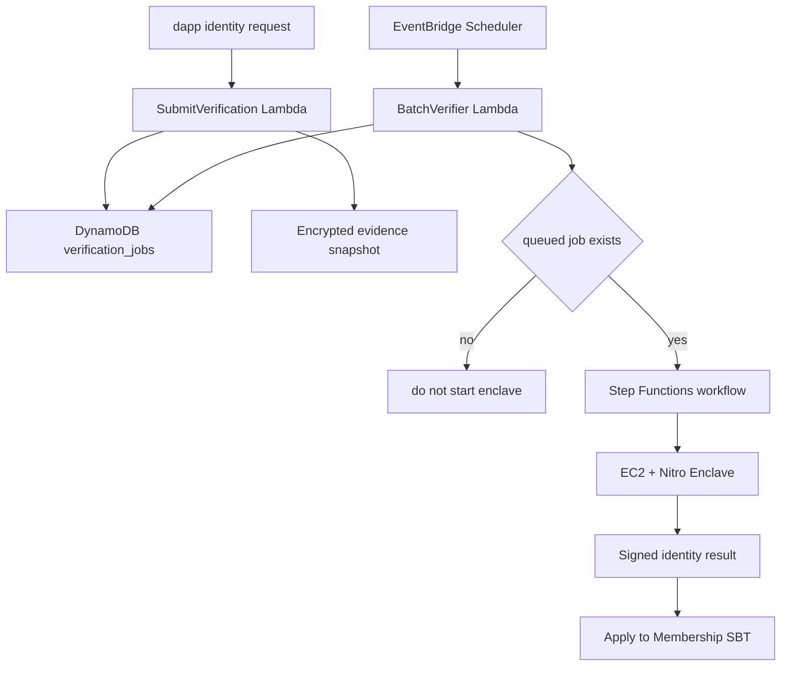

# Sonari Identity Verifiers

## 概要

Membership verifier は、Membership SBT の本人確認状態を更新する。
本人確認 provider は KYC と World ID の 2 つを想定する。現状の MVP で実際に署名 payload を生成できるのは World ID のみで、KYC は今後実装予定の provider だが MVP では未実装（`KYC_UNSUPPORTED`）である。

地震 verifier は災害 event と affected cells を検証する。
identity verifier は、受取者が本人確認済みかを検証する。
この 2 つの責務は混ぜない。

residence cell validation は本人確認とは別の検証である。
ユーザーが自己申告した居住セルが登録可能な陸地セルかを検証する。
KYC / World ID の本人確認結果を作らない。
地震 verifier の affected cells も作らない。

MVP では、H3 resolution 7 の陸地 allowlist を使う。
この allowlist は `land_allowlist_res7` として扱う。
TEE / verifier は、申告された residence cell が `land_allowlist_res7` に含まれることを検証する。
海のみの cell は reject する。
検証に成功した場合、TEE は verified residence metadata result に署名する。
dApp と relayer はその signed metadata result を配送するだけであり、意味を変更しない。
Move / metadata verifier が signed result を検証して適用する。
TEE が Membership SBT を直接 mutate するわけではない。

dApp 側の validation は UX のための早期 feedback である。
信頼境界として必須なのは TEE / verifier 側の validation である。

MVP の陸地データは Natural Earth を優先 source とする。
OSM land polygons は将来候補である。
小さな無人島や複雑な海岸線の厳密な precision は MVP では要求しない。
`land_allowlist_res7` の保存形式、差分形式、commitment の形式はこの段階では固定しない。

## MVP provider

| Provider | 役割 | MVP 実装状況 |
| --- | --- | --- |
| World ID | Sonari 専用 action の proof を検証する | ✅ 実装済み（live） |
| KYC | provider response と署名を検証する | 🚧 実装予定（MVP 未実装・`KYC_UNSUPPORTED`） |

オンチェーン設計上は KYC と World ID のどちらも満額 Claim ルートで provider による減額はない。ただし現状の MVP で有効に動く Claim ルートは World ID のみで、KYC は今後実装予定だが MVP ではまだ未実装である。
未認証の Membership SBT は Claim できない。

World ID action は Sonari 専用にする。
TEE は、設定された World ID app id と次の action だけを受け付ける。
request で別の app id や action が来た場合は reject する。
World ID API base URL は HTTPS のみ許可する。

```text
sonari_membership_register_v1
```

signal hash は TEE が再計算して、request の値と一致するか確認する。
signal には Sui address、membership id、署名済み statement hash、
domain separator を含める。
これにより、proof の流用を防ぐ。

```text
sha256("sonari:world_id_signal:v1" \0 owner \0 membership_id \0 signed_statement_hash)
```

World ID API には `max_age = 604800` を明示して送る。
これは World ID が許す最大 7 日の root age である。
queued job の遅延で、既定の 2 時間に依存しないためである。

## Verifier output

verifier output は最小限にする。

```text
IdentityVerificationResult {
  intent
  verifier_family
  verifier_version
  registry_id
  membership_id
  owner
  provider
  verified
  duplicate_key_hash
  evidence_hash
  issued_at_ms
  expires_at_ms
  terms_version
  signed_statement_hash
}
```

`provider` は `kyc` または `world_id` である。
`verified` が `true` のときだけ、Membership SBT を verified にできる。

## membership TEE CLI contract

`membership-tee` は stdin で `IdentityVerifyRequest` JSON を受け取る。
request は未知の field を拒否する。
TEE は request の意味を変えず、検証結果だけを stdout に返す。
TEE は 1 request = 1 JSON in / 1 JSON out の stateless な処理である。
stateless とは、TEE が前の job 状態を持たないという意味である。

```text
membership-tee fixture [--world-id-status verified|rejected|pending-source]
membership-tee server
membership-tee production
membership-tee --encode-only
```

fixture はローカル検証と golden vector 用である。
World ID の verified fixture では `issued_at_ms` が必須である。
`validity_ms` は fixture でだけ任意の有効期間として使える。
`--world-rp-id` は期待する World ID `rp_id` を固定する。
request の `world_id.idkit_response` が期待する action / environment / signal と一致しない場合は reject する。

`membership-tee server` は AWS / Nautilus production entrypoint である。
server path は enclave-local ephemeral key を起動時に作る。
この key は `/get_attestation` の attestation public key と、
`/process_data` の verified payload 署名に使う。
worker は `/get_attestation` を登録し、registration metadata を受け取る。
submit-capable relayer 設定がない default / dry-run smoke では、worker は `/process_data` envelope 用の local registration metadata を作る。
その metadata を `/process_data` の request envelope に入れる。
server は verified result に registration metadata を注入して返す。

World ID API base は canonical value を使い、egress は `egress_proxy_url` / `SONARI_WORLD_ID_EGRESS_PROXY_URL` で渡す。
server path の canonical base は `https://developer.world.org` である。
host や bootstrap は base URL を差し替えない。
bootstrap JSON の `egress_proxy_url` だけが、World ID HTTPS traffic の経路を指定する。

`membership-tee production` は legacy/local stdin/stdout 互換 route である。
AWS / Nautilus production の source of truth ではない。
production は `SONARI_WORLD_ID_API_BASE` と `SONARI_WORLD_ID_APP_ID` を読む。
legacy/local production の World ID API base URL は HTTPS のみ許可する。
署名鍵は `SONARI_TEE_SIGNING_KEY_SEED` または
`SONARI_TEE_SIGNING_KEY_SEED_FILE` から読む。
legacy/local production では dev fallback を使わない。

legacy/local stdin/stdout 互換の AWS 境界 interface として残る env は次の 3 つである。
これらは、古い外側の worker が TEE process に渡していた値である。

```text
SONARI_TEE_SIGNING_KEY_SEED
SONARI_TEE_SIGNING_KEY_SEED_FILE
SONARI_WORLD_ID_API_BASE
```

`SONARI_WORLD_ID_APP_ID` は production の runtime config として必須である。
ただし AWS 境界 interface の固定対象とは分けて扱う。
#74 では deploy config から TEE process env に注入する。
本番では KMS や Nitro attestation へ差し替える場合がある。
その場合も stdin/stdout の JSON 契約は変えない。

server path と legacy/local production では `issued_at_ms` と `validity_ms` を request から信頼しない。
TEE が現在時刻を `issued_at_ms` に使う。
有効期間も TEE 側の既定値を使う。
これにより caller が署名済み result の寿命を延ばせない。

成功時の stdout は `status: "verified"` と result fields を返す。
この stdout は bare `IdentityTeeResult` ではない。
`IdentityTeeResult` の fields に `payload_bcs_hex`、`signature`、`public_key` を足す。
署名対象は `payload_bcs_hex` の bytes そのものである。
Sui intent prefix は付けない。

```json
{
  "status": "verified",
  "intent": "SONARI_IDENTITY_VERIFICATION_V1",
  "verifier_family": "identity",
  "verifier_version": 1,
  "registry_id": "0x...",
  "membership_id": "0x...",
  "owner": "0x...",
  "provider": "world_id",
  "verified": true,
  "duplicate_key_hash": "0x...",
  "evidence_hash": "0x...",
  "issued_at_ms": 1800000000000,
  "expires_at_ms": 1831536000000,
  "terms_version": 1,
  "signed_statement_hash": "0x...",
  "payload_bcs_hex": "0x...",
  "signature": "0x...",
  "public_key": "0x..."
}
```

非成功時の stdout は `status` と `error_code` だけを返す。
`rejected`、`pending_source`、`unsupported` には署名を付けない。
payload BCS も返さない。
非 verified stdout は `status` と `error_code` だけを返す。
`pending_source` は earthquake と同じ再試行用の語である。

```json
{ "status": "rejected", "error_code": "WORLD_ID_VERIFICATION_FAILED" }
```

`--encode-only` は完成済み `IdentityTeeResult` JSON を stdin で受け取る。
stdout には `payload_bcs_hex` だけを返す。
`verified == false` の result は拒否する。

### Signed payload BCS layout

Move に渡す signed payload は、次の順番で BCS bytes にする。
この順番は contract-facing な契約として扱う。

```text
intent: vector<u8> UTF-8
verifier_family: vector<u8> UTF-8, identity
verifier_version: u64
registry_id: 32-byte Sui object id
membership_id: 32-byte Sui object id
owner: 32-byte Sui address
provider: u8, KYC = 1, World ID = 2
verified: bool
duplicate_key_hash: 32 bytes
evidence_hash: 32 bytes
issued_at_ms: u64
expires_at_ms: u64
terms_version: u64
signed_statement_hash: 32 bytes
```

`duplicate_key_hash` は provider 内の重複登録を防ぐために使う。
すでに別 SBT に紐づく duplicate key は reject する。

```text
kyc_duplicate_key = hash(kyc_provider_id, provider_user_unique_id)
world_duplicate_key = hash(rp_id, action, nullifier)
```

実装では SHA-256 を使う。
input は UTF-8 文字列を NUL byte で区切る。
大文字小文字は暗黙に変換しない。

```text
KYC: sonari:kyc:v1\0{provider_id}\0{provider_user_unique_id}
World ID: sonari:world_id:v2\0{rp_id}\0{action}\0{nullifier}
```

World ID の `nullifier` は、hash 前に正規化する。
decimal と `0x` hex は同じ 10 進文字列へ変換する。
先頭の `0` や hex の大文字小文字では別 key にしない。

KYC と World ID をまたぐ完全な同一人物判定は MVP 外である。
登録時と Claim 時に、複数 SBT と複数 Claim を禁じる表示を出す。
その内容に対して Sui wallet 署名を求める。

`evidence_hash` は、verifier が結果 payload を組み立てる時に計算する。
caller から受け取った値は使わない。
raw PII や proof body も入れない。

```text
sha256("sonari:identity_evidence:v1" \0 provider \0 duplicate_key_hash_hex \0 verification_level \0 issued_at_ms_decimal)
```

`duplicate_key_hash_hex` は `0x` 付き小文字 hex である。
`issued_at_ms_decimal` には、TEE が result を発行した時刻を 10 進数で入れる。

## Privacy boundary

verifier は raw personal data を output に含めない。

出してはいけないもの:

- KYC document image
- KYC detail
- World ID proof detail
- raw credential data
- detailed address
- phone
- device identifier
- location history

出してよいもの:

- provider
- verified flag
- duplicate key hash
- evidence hash
- issued / expiry time
- terms version
- signed statement hash

## Job model

identity verification request は queued job として扱う。
job があるときだけ batch workflow を起動する。
job が 0 件なら EC2 / Nitro Enclave は起動しない。
AWS on-demand interface の固定内容は `infra/aws/membership-identity-runner/README.md` に置く。



## Job schema

Suggested fields:

- `job_id`
- `membership_id`
- `owner_wallet`
- `provider`
- `status`
- `priority`
- `submitted_at`
- `started_at`
- `finished_at`
- `attempt_count`
- `evidence_hash`
- `evidence_s3_key`
- `result_s3_key`
- `duplicate_key_hash`
- `error_code`

## ディレクトリ構成

```txt
nautilus/verifiers/membership/
  README.md
  shared/
  tee/
  fixtures/
```

旧 residence / student verifier docs は target MVP から外す。
将来の Program で必要になった場合は、本人確認 gate とは別の
eligibility verifier として再設計する。
