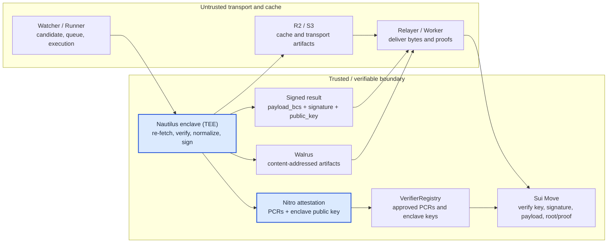
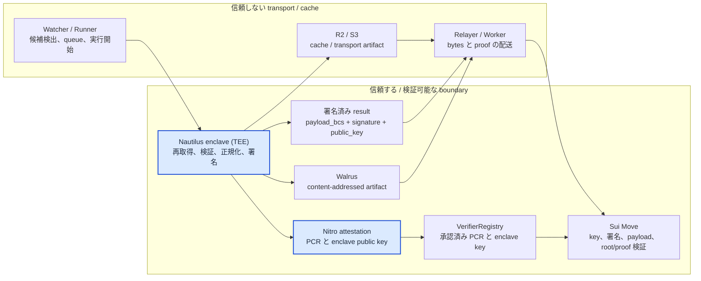

# Sonari Verifiers

*These verifiers are built on **Nautilus**, Sui's framework for running verifiable computation inside a TEE.*

## In One Minute

When a disaster happens, or when someone proves who they are, Sonari needs to know that the data is real before it is written on Sui.

The problem: the data travels through many programs — a watcher, a server, a relayer, a database, a cache. Any of them could change the data on the way. We do not want to trust them.

Sonari's answer is **Nautilus**. Nautilus is Sui's framework for running trustworthy work inside a **TEE** — a sealed, tamper-proof computer, built on AWS Nitro Enclaves. The real check happens inside this Nautilus enclave: it fetches the source data again by itself, checks it, and then signs the result. After that, other programs only carry the signed data. They cannot change it, because changing even one byte breaks the signature.

So the rest of this document is really about *how Sonari uses Nautilus*: what each Nautilus enclave re-checks, what it signs, and how Sui re-verifies that signature at the end.

Think of the relayer as a **delivery driver carrying a sealed package**:

- the package is the data (`payload_bcs`),
- the seal is the signature,
- and the sender's ID card is the enclave public key.

Sui does not accept the package just because the driver brought it. Sui checks the ID card, checks the seal against the exact bytes, and only then opens the package. So the delivery path can fail or be replaced, but it can never fake a result.

For the MVP there are two main Nautilus verifiers:

- **Earthquake** — checks real earthquake data and which map areas were shaken.
- **Identity** — checks an identity proof (today this is World ID) for the Membership SBT.

## How the Pieces Fit Together

How to read this diagram: the boxes on the left (`Watcher`, `Relayer`, `R2 / S3`) only move data around — we do not trust them. The **highlighted blue boxes are Nautilus**: the enclave re-checks the source and signs the result, and produces the Nitro attestation that proves the signing key. The other boxes on the right (the signed result and `Sui Move`) are still part of the trusted boundary, and Sui re-checks everything at the very end.

## What Sonari Verifiers Do

Sonari never asks a Sui contract to trust a watcher, a runner, a relayer, the frontend, a database row, or a cache. These parts can find candidates, queue work, start the Nautilus run, store files, and deliver transactions. But they are **not allowed to decide** what a verified earthquake or identity result means.

The flow has six steps:

1. An untrusted off-chain part receives or finds a candidate.
2. A runner starts the verifier and hands a small, fixed request into the Nautilus enclave (the TEE).
3. The Nautilus enclave fetches the source again, checks the request, cleans up the result, builds the final bytes (`payload_bcs`), and signs **only** results that passed.
4. The enclave proves, with a Nitro attestation, that its signing key really came from the approved program. Sui only accepts that key after the proof matches the approved setup (the PCRs).
5. A relayer or worker delivers the signed result and any extra proof files.
6. Sui Move re-checks everything — the registered config, the enclave key, the signature, the bytes, the Merkle root/proof, and the status — and only then updates state.

The key idea: the final decision can always be re-checked at the Sui boundary. The delivery system can break or be swapped out, but it cannot forge a valid signed result, and it cannot make Sui accept a wrong proof. Change the bytes and the signature stops matching. Change the key too, and the new key is rejected unless it was registered with a matching attestation.

## Core Trust Model

| We do NOT trust (transport / cache) | We DO trust (checkable boundary) |
| --- | --- |
| Watcher, runner, relayer, frontend, Worker | The exact `payload_bcs` bytes signed by the Nautilus enclave |
| DynamoDB, S3, R2, queue state | The registered config, PCRs, and enclave public key |
| HTTP request bodies and workflow input | The fixed field order, intent, and version of the payload |
| USGS, World ID, and other outside responses (before re-checking) | The Nautilus enclave's own re-check of the source and the cleaned result |
| Proof delivery endpoints | Walrus content-addressed files, signed file hashes, and the Merkle root/proof, re-checked by the verifier or by Move |

This is a **fail-closed** model: if anything looks wrong — bad input, missing source data, an unknown enclave key, a signature that does not match, a stale config, or a wrong proof — the flow **stops** instead of writing a wrong result on-chain.

A note on PCRs: a PCR is a kind of fingerprint of the exact program and how it booted (AWS Nitro records these values). PCRs do not replace signatures. They answer a different question — *did this signing key come from the approved program?* — before Sui starts trusting that key.

The trust lines are kept separate on purpose:

- The earthquake verifier proves disaster data and which areas were affected.
- The identity verifier proves that a Membership SBT owner has a verified identity result.
- Things like residence or claim eligibility are never guessed from the delivery path. They must come from the matching signed result and the matching Move check.

## Implemented Flows

### Earthquake Verification

The earthquake verifier starts from a USGS event id. The watcher may use a quick USGS summary to spot a candidate, but the result is only finalized **after the Nautilus enclave fetches the full USGS data and the ShakeMap grid again** by itself.

Inside the Nautilus enclave, the verifier:

- checks that the event and its ShakeMap really exist;
- turns the shaking values into map cells (using the H3 cell system);
- adds up the intensity per cell in a fixed, repeatable way, and labels how strongly each cell was hit;
- fetches the public residence tile manifest and tile shards, then counts only the affected cells that are on the residence land allowlist;
- builds one short fingerprint of all affected cells (the `affected_cells_root`);
- writes an evidence list pointing to the source and generated files;
- signs the final earthquake result.

The evidence list points to archived files. Sonari stores them on **Walrus**, where each file is addressed by its own content — so if any byte is changed, the stored hash no longer matches and the change is caught. Walrus does not decide what the result *means*; it just makes the files tamper-evident. At claim time, per-area proofs are checked against the `affected_cells_root`.

Only a `finalized` earthquake result can be sent to Sui. Other states (such as "waiting for source", "rejected", "too small", or "failed") stay off-chain and are never submitted as accepted disaster events. If the ShakeMap affected area contains only water cells, the enclave returns `SEA_ONLY_AFFECTED_CELLS`; no signed payload is produced.

### Identity Verification

The identity verifier sits behind the Membership SBT's identity state. The folder is named `membership/`, but the verifier family and the signing intent are `identity`.

Today the path is built around World ID:

- a submit Lambda reads a verification request and stores it as a job;
- a runner picks up jobs that are due and starts the shared AWS/Nitro run;
- the Nautilus enclave gets an attestation for its own short-lived signing key;
- the enclave checks the World ID proof against Sonari's own app / action / signal rules;
- only a `verified` result is turned into signed bytes;
- other results (rejected, waiting, or unsupported) carry **no** bytes and **no** signature;
- the runner can dry-run the Sui transaction first, require that dry-run before submitting, submit only when explicitly configured, and read the on-chain record back after a successful submit.

KYC is treated as a **planned** future provider here. The on-chain format leaves room for it, but only World ID has a working path today.

### Proof Distribution and Sui Verification

Per-area earthquake proofs are delivered separately from the signed earthquake result. The affected-cells proof Worker registers the Walrus `affected_cells` file, checks its hash/root/schema, builds the Merkle proof files, stores them on R2, and serves one proof per area to the frontend.

The Worker, R2, and the frontend are still untrusted transport/cache. Walrus files are content-addressed, so any changed byte is caught by a hash/root check. The Worker does its own integrity checks before returning a proof, but the **real** security check is still the proof re-check against `affected_cells_root` in the verification path. Any mismatch — hash, root, schema, shard, leaf hash, or replay — fails closed.

For Sui submission, relayers are just delivery. The earthquake relayer supports preview, dry-run, and explicit submit. Identity submission also needs a dry-run first and an explicit submit setting. A relayer only packages the signed bytes, signature, public key, and the object references Move needs — it must never reinterpret the meaning. Edit the bytes and the signature breaks; swap in your own key and the enclave check rejects it.

## Current MVP Status and Next Steps

Done in the MVP:

- Earthquake verifier for USGS full data and ShakeMap grid data.
- A signed earthquake result with an evidence list and the affected-cells fingerprint.
- Walrus archive references for earthquake evidence files.
- Affected-cells proof registration and delivery Worker, backed by R2.
- Identity verifier path built around World ID.
- A shared runner contract for both earthquake and membership-identity kinds.
- Sui preview / dry-run / submit where explicitly configured.

Next:

- Add more identity providers, such as KYC, as explicit implementations.
- Add more disaster types only after defining the source policy, payload meaning, fixtures, and Move checks.
- Grow the operational dashboards for pending, rejected, failed, finalized, and submitted states.
- Keep tightening the golden vectors and cross-language tests for payloads, signatures, Merkle roots, and proof files.

## Technical Details (for developers)

This section keeps the exact values, in case you need them.

- **Earthquake signed payload — 17 fields, fixed order** (`PAYLOAD_FIELD_ORDER` in [earthquake/shared/src/index.ts](../../nautilus/verifiers/earthquake/shared/src/index.ts)): `intent`, `oracle_version`, `event_uid`, `event_revision`, `source_event_id`, `title`, `region`, `occurred_at_ms`, `hazard_type`, `status`, `severity_band`, `affected_cells_root`, `affected_cell_count`, `evidence_manifest_uri`, `evidence_manifest_hash`, `verified_at_ms`, `freshness_deadline_ms`. The bytes are BCS-encoded in this exact order; the order is a cross-language contract.
- **Geo resolution:** H3 resolution **7** (`geo_resolution: 7`).
- **Earthquake states:** only `finalized` is eligible for Sui submission. `pending_source`, `pending_mmi`, `rejected`, `ignored_small`, and `failed` (plus internal states like `new` / `queued` / `processing` / `submitted`) stay off-chain.
- **Identity states:** only `verified` is encoded as BCS bytes and signed. `rejected`, `pending_source`, and `unsupported` carry no payload bytes and no signature.
- **Identity signing intent:** `SONARI_IDENTITY_VERIFICATION_V1`.
- **Verifier kinds:** `earthquake` and `membership_identity` (`common/contracts`).
- **Relayer modes (earthquake):** `build-request` (preview), `dry-run`, and `submit`.
- **Affected count semantics:** `affected_cells_root` covers the full affected cells artifact; the signed `affected_cell_count` is only the residence-land subset counted inside the enclave.
- **Proof artifacts:** the affected-cells proof Worker verifies the Walrus file (hash / root / schema), builds Merkle proofs, and stores them on R2; the security-critical check is the Merkle root/proof replay against `affected_cells_root`.

## Where to Read More

- [earthquake/README.md](./earthquake.md): earthquake verifier responsibilities, AWS execution model, payloads, and security notes.
- [earthquake/shared/README.md](./earthquake_shared.md): earthquake signed payload, BCS layout, evidence manifest, and shared TypeScript contract.
- [earthquake/tee/README.md](./earthquake_tee.md): Rust TEE core, USGS / ShakeMap processing, fixture behavior, and golden checks.
- [earthquake/watcher/README.md](./earthquake_watcher.md): watcher state, runner workflow, SourceArchiver, and proof registration path.
- [earthquake/relayer/README.md](./earthquake_relayer.md): Sui preview, dry-run, and submit behavior for earthquake payloads.
- [membership/README.md](./identity.md): identity verifier overview, World ID / KYC direction, signed result format, and BCS layout.
- [membership/runner/README.md](./identity_runner.md): verification jobs, AWS workflow handoff, and Sui submission responsibilities.
- [membership/tee/README.md](./identity_tee.md): membership TEE server, World ID verification, signing behavior, and failure modes.
- [common/contracts/README.md](../../nautilus/verifiers/common/contracts/README.md): shared runner contract, verifier kind parsing, and runner helper boundaries.
- [shared-tee/README.md](../../nautilus/verifiers/shared-tee/README.md): shared TEE utilities for signing, hashing, seeds, and signature artifacts.
- [affected-cells-proof-worker/README.md](./proof_workers.md): affected-cells proof registration and distribution API.

---

# Sonari Verifiers（日本語）

*このディレクトリの verifier は、Sui が作った検証可能計算フレームワーク **Nautilus** の上に構築されています。*

## 1分でわかる説明

災害が起きたとき、あるいは誰かが「自分が本人だ」と証明するとき、Sonari はそのデータを Sui に書きこむ前に「本物かどうか」を確かめる必要があります。

問題は、データがたくさんのプログラム（watcher、サーバー、relayer、データベース、cache）を通って運ばれることです。どれか一つでも、途中でデータを書きかえてしまうかもしれません。だから、これらを信用したくありません。

Sonari の答えが **Nautilus** です。Nautilus は、信頼できる処理を **TEE（＝外から中身を改ざんできない、封じられたコンピューター。AWS Nitro Enclaves を使う）** の中で動かすための、Sui のフレームワークです。本当の検査は、この Nautilus の enclave（TEE）の中で行います。enclave は元のデータを自分でもう一度取り直し、検査してから、結果に署名します。そのあとは、ほかのプログラムは署名ずみのデータを運ぶだけです。1バイトでも書きかえると署名が合わなくなるので、書きかえることはできません。

つまりこの文書は、ようするに「Sonari が Nautilus をどう使っているか」の説明です。各 Nautilus enclave が何を確かめ直し、何に署名し、最後に Sui がその署名をどう検証し直すか、を順に説明します。

relayer は **「封をした荷物を運ぶ配達員」** だと思ってください。

- 荷物が中身のデータ（`payload_bcs`）、
- 封が署名、
- 送り主の身分証が enclave の public key（公開鍵）です。

Sui は、配達員が持ってきたというだけでは荷物を受け取りません。まず身分証を確認し、次に封が中身のバイトと正しく合うか確認し、それから初めて荷物を開けます。つまり、運ぶ経路は壊れても入れかわってもよいのですが、結果を偽物にすることは絶対にできません。

MVP では主な Nautilus verifier は2つです。

- **地震** — 本物の地震データと、ゆれた地図エリアを確かめます。
- **identity（本人確認）** — 本人確認の証明（今は World ID）を確かめ、Membership SBT に使います。

## 全体のつながり

図の読み方: 左側の箱（`Watcher`、`Relayer`、`R2 / S3`）はデータを運ぶだけで、信用しません。**青く強調された箱が Nautilus** です。enclave が元データを確かめ直して結果に署名し、署名鍵を証明する Nitro attestation も作ります。右側の残りの箱（署名ずみの結果と `Sui Move`）も信頼する境界の一部で、大事なことは最後にもう一度 Sui の中で確かめ直します。

## Sonari Verifiers が行うこと

Sonari は、watcher、runner、relayer、frontend、データベースの行、cache を Sui コントラクトに信用させません。これらは候補を見つけたり、作業を queue に入れたり、Nautilus の実行を始めたり、ファイルを保存したり、トランザクションを届けたりできます。でも、検証ずみの地震や identity の結果が「どういう意味か」を **決めてはいけません**。

流れは6ステップです。

1. 信用しない off-chain の部分が、候補を受け取る、または見つける。
2. runner が verifier を始め、小さく決まった依頼を Nautilus の enclave（TEE）に渡す。
3. Nautilus の enclave が元のデータをもう一度取り直し、依頼を検査し、結果を整え、最終的なバイト（`payload_bcs`）を作り、検査に通った結果に **だけ** 署名する。
4. enclave は Nitro attestation で「自分の署名鍵が承認ずみのプログラムから出たものだ」と証明する。Sui は、その証明（PCR）が承認ずみの設定と合ったときだけ、その鍵を受け入れる。
5. relayer または Worker が、署名ずみの結果と追加の proof ファイルを届ける。
6. Sui Move が全部をもう一度確かめる（登録ずみの設定、enclave の鍵、署名、バイト、Merkle root/proof、status）。それから初めて state を更新する。

大事な考え方は、最終判断はいつでも Sui の境界でやり直して確かめられる、ということです。配送のしくみは壊れても入れかえてもよいのですが、正しい署名ずみの結果を偽造したり、まちがった proof を Sui に受け入れさせたりはできません。バイトを書きかえれば署名が合わなくなります。鍵まで差しかえても、新しい鍵は attestation が合う形で登録されていなければ拒否されます。

## コア信頼モデル

| 信用しないもの（transport / cache） | 信用するもの（確かめられる境界） |
| --- | --- |
| Watcher、runner、relayer、frontend、Worker | Nautilus の enclave が署名した、そのままの `payload_bcs` バイト |
| DynamoDB、S3、R2、queue の状態 | 登録ずみの設定、PCR、enclave の public key |
| HTTP リクエストの中身、workflow の入力 | payload の決まった field 順・intent・version |
| 再確認する前の USGS / World ID などの外部応答 | Nautilus の enclave 自身による元データの再確認と、整えた結果 |
| proof を配る endpoint | Walrus の content-addressed ファイル、署名ずみのファイル hash、Verifier か Move が確かめ直す Merkle root / proof |

これは **fail-closed（＝問題があれば止める）** モデルです。何かおかしいとき（入力が不正、元データが欠けている、知らない enclave 鍵、署名が合わない、設定が古い、proof が合わない）は、まちがった結果を on-chain に書くのではなく、流れを **止めます**。

PCR について一言: PCR は「どのプログラムが、どう起動したか」の指紋のようなものです（AWS Nitro が記録します）。PCR は署名の代わりではありません。署名とは別の問いに答えます。つまり「この署名鍵は承認ずみのプログラムから出たのか？」を、Sui がその鍵を信用しはじめる前に確かめます。

信頼の線は、わざと分けてあります。

- 地震 verifier は、災害データと、ゆれたエリアを証明する。
- identity verifier は、Membership SBT の持ち主が本人確認ずみの結果を持つことを証明する。
- 住所や受け取り資格などは、配送経路から推測しません。対応する署名ずみの結果と、対応する Move のチェックで確かめます。

## 実装済みフロー

### 地震検証

地震 verifier は USGS の event id から始まります。watcher は候補をすばやく見つけるために USGS の要約を使うことがありますが、結果が確定するのは **Nautilus の enclave が USGS の詳細データと ShakeMap グリッドを自分でもう一度取り直したあと** だけです。

Nautilus の enclave（TEE）の中で verifier は次を行います。

- その event と ShakeMap が本当にあるか確かめる。
- ゆれの値を地図のセルに変える（H3 というセルのしくみを使う）。
- セルごとの強さを、決まった再現できる手順で合計し、各セルがどれくらい強くゆれたかラベルをつける。
- ゆれたセル全部の短い指紋を1つ作る（`affected_cells_root`）。
- 元ファイルと生成ファイルを指す evidence（証拠）のリストを書く。
- 最終的な地震の結果に署名する。

evidence リストは保存ずみのファイルを指します。Sonari はそれらを **Walrus** に保存します。Walrus では各ファイルが「中身そのもの」で住所づけされるので、1バイトでも変わると保存ずみの hash と合わなくなり、変更がすぐ分かります。Walrus が結果の *意味* を決めるわけではなく、ファイルを改ざんに気づける状態にするだけです。受け取り時には、エリアごとの proof を `affected_cells_root` と照らして確かめます。

Sui に送れる地震の結果は `finalized` だけです。それ以外の状態（「元データ待ち」「却下」「規模が小さい」「失敗」など）は off-chain にとどまり、受理ずみの災害イベントとしては送りません。

### identity（本人確認）検証

identity verifier は、Membership SBT の identity 状態の裏側にあります。フォルダ名は `membership/` ですが、verifier family と署名の intent は `identity` です。

今の道すじは World ID を中心にしています。

- submit Lambda が検証リクエストを読み、job として保存する。
- runner が期限の来た job を取り、共有の AWS / Nitro 実行を始める。
- Nautilus の enclave（TEE server）が、自分用の使い捨て署名鍵の attestation を取る。
- enclave が Sonari 独自の app / action / signal のルールに照らして World ID proof を検証する。
- `verified` の結果だけを署名ずみのバイトにする。
- それ以外の結果（却下・待ち・未対応）は、バイトも署名も **付けない**。
- runner は Sui トランザクションをまず dry-run でき、submit の前に dry-run を必須にでき、明示的に設定したときだけ submit でき、submit 成功後に on-chain の記録を読み返せる。

KYC は、ここでは **これからの（予定の）** provider として扱います。on-chain の形式には入れる余地がありますが、今ちゃんと動く道すじがあるのは World ID だけです。

### proof の配布と Sui 検証

エリアごとの地震 proof は、署名ずみの地震結果とは別に配ります。affected-cells proof Worker は Walrus の `affected_cells` ファイルを登録し、hash / root / schema を確かめ、Merkle proof のファイルを作り、R2 に保存して、frontend にエリア1つにつき1つの proof を返します。

Worker、R2、frontend は、やはり信用しない transport / cache です。Walrus のファイルは content-addressed なので、変わったバイトは hash / root のチェックで見つかります。Worker は proof を返す前に自分でも整合チェックをしますが、**本当に大事な** チェックは、検証経路で `affected_cells_root` に対して proof をやり直して確かめることです。どれか1つでも合わない（hash、root、schema、shard、leaf hash、再検証）なら fail-closed で止まります。

Sui への submit では、relayer はただの配送です。地震の relayer は preview、dry-run、明示的な submit に対応します。identity の submit も、先に dry-run を要求し、明示的な submit 設定が必要です。relayer は署名ずみのバイト、署名、public key、Move に必要な object 参照をまとめるだけで、意味を解釈し直してはいけません。バイトを書きかえれば署名が合わなくなり、自分の鍵に差しかえれば enclave のチェックで拒否されます。

## 現在の MVP 状態と次の作業

MVP でできていること:

- USGS の詳細データと ShakeMap グリッドを対象にした地震 verifier。
- evidence リストと affected-cells の指紋を含む、署名ずみの地震結果。
- 地震 evidence ファイルの Walrus archive 参照。
- R2 を使う affected-cells proof の登録・配布 Worker。
- World ID を中心にした identity verifier の道すじ。
- 地震と membership-identity の両方に使う共有 runner contract。
- 明示設定したときの Sui preview / dry-run / submit。

次にやること:

- KYC など、identity provider をはっきりした実装として増やす。
- 災害タイプを増やすのは、source の方針・payload の意味・fixture・Move チェックを決めてから。
- pending、rejected、failed、finalized、submitted の運用ダッシュボードを充実させる。
- payload、署名、Merkle root、proof ファイルの golden vector と cross-language テストを引きつづき強くする。

## 技術詳細（開発者向け）

必要なときのために、正確な値をここにまとめます。

- **地震の署名 payload — 17 フィールド・順序固定**（[earthquake/shared/src/index.ts](../../nautilus/verifiers/earthquake/shared/src/index.ts) の `PAYLOAD_FIELD_ORDER`）: `intent`, `oracle_version`, `event_uid`, `event_revision`, `source_event_id`, `title`, `region`, `occurred_at_ms`, `hazard_type`, `status`, `severity_band`, `affected_cells_root`, `affected_cell_count`, `evidence_manifest_uri`, `evidence_manifest_hash`, `verified_at_ms`, `freshness_deadline_ms`。バイトはこの順で BCS encode され、順序は cross-language の契約です。
- **geo resolution:** H3 resolution **7**（`geo_resolution: 7`）。
- **地震の状態:** Sui submit の対象は `finalized` だけ。`pending_source`、`pending_mmi`、`rejected`、`ignored_small`、`failed`（および `new` / `queued` / `processing` / `submitted` などの内部状態）は off-chain。
- **identity の状態:** BCS bytes に encode して署名するのは `verified` だけ。`rejected`、`pending_source`、`unsupported` は payload bytes も署名も持たない。
- **identity の署名 intent:** `SONARI_IDENTITY_VERIFICATION_V1`。
- **verifier kind:** `earthquake` と `membership_identity`（`common/contracts`）。
- **relayer モード（地震）:** `build-request`（preview）、`dry-run`、`submit`。
- **proof artifact:** affected-cells proof Worker は Walrus ファイル（hash / root / schema）を確かめ、Merkle proof を作り、R2 に保存する。security-critical なチェックは `affected_cells_root` に対する Merkle root/proof の再検証。

## 詳細資料

- [earthquake/README.md](./earthquake.md): earthquake verifier の責務、AWS 実行モデル、payload、security notes。
- [earthquake/shared/README.md](./earthquake_shared.md): earthquake signed payload、BCS layout、evidence manifest、shared TypeScript contract。
- [earthquake/tee/README.md](./earthquake_tee.md): Rust TEE core、USGS / ShakeMap processing、fixture behavior、golden checks。
- [earthquake/watcher/README.md](./earthquake_watcher.md): watcher state、runner workflow、SourceArchiver、proof registration path。
- [earthquake/relayer/README.md](./earthquake_relayer.md): earthquake payload の Sui preview、dry-run、submit behavior。
- [membership/README.md](./identity.md): identity verifier overview、World ID / KYC direction、signed result format、BCS layout。
- [membership/runner/README.md](./identity_runner.md): verification job、AWS workflow handoff、Sui submission responsibilities。
- [membership/tee/README.md](./identity_tee.md): membership TEE server、World ID verification、signing behavior、failure modes。
- [common/contracts/README.md](../../nautilus/verifiers/common/contracts/README.md): shared runner contract、verifier kind parsing、runner helper boundaries。
- [shared-tee/README.md](../../nautilus/verifiers/shared-tee/README.md): signing、hashing、seed、signature artifact 用の shared TEE utility。
- [affected-cells-proof-worker/README.md](./proof_workers.md): affected-cells proof registration / distribution API。
