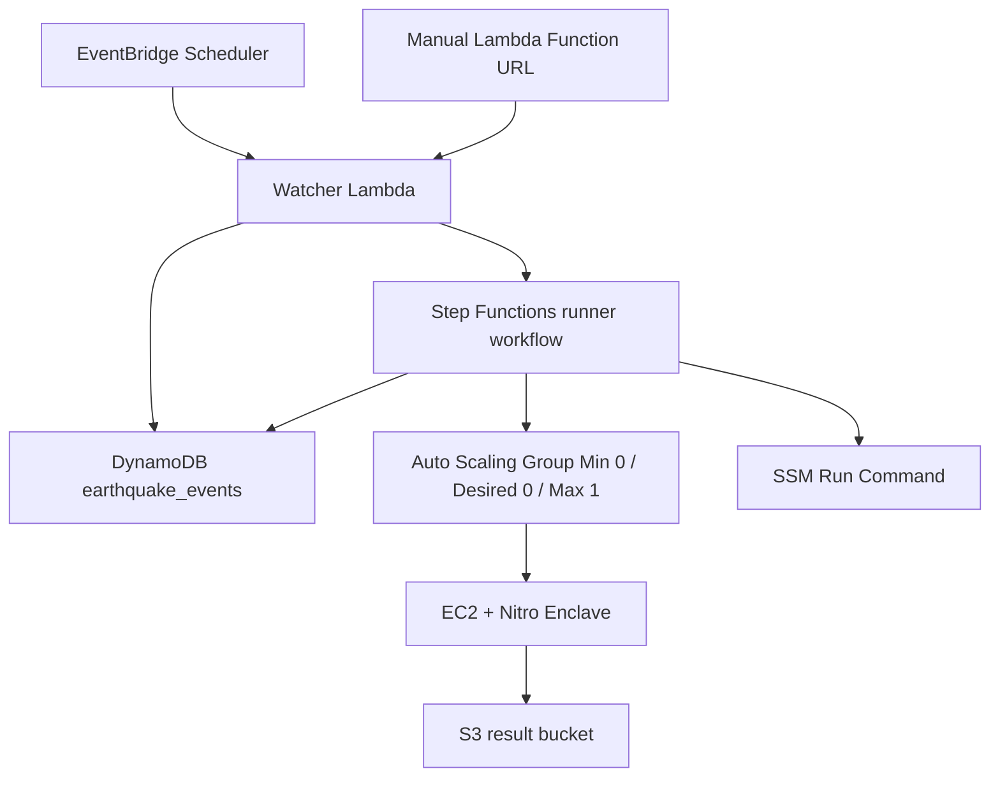

# Disaster Oracle AWS Template

Sonari disaster oracle を AWS 内で完結して動かすための CloudFormation template です。

この構成では、通常時に EC2 runner や ALB を起動しません。EventBridge Scheduler が定期的に Watcher Lambda を起動し、対象地震がある場合だけ Step Functions が Auto Scaling Group を `0 -> 1 -> 0` に変更して、EC2 + Nitro Enclave 上の TEE command を SSM Run Command で実行します。



作成する主なリソース:

- Nitro Enclaves を有効化した EC2 LaunchTemplate
- 通常時 `DesiredCapacity: 0` の Auto Scaling Group
- inbound を持たない EC2 security group
- EventBridge Scheduler schedule
- scheduled / manual 用 Watcher Lambda
- runner 制御用 Lambda
- Step Functions Standard state machine
- DynamoDB event state table
- S3 runner result bucket
- Secrets Manager secret を読める IAM role
- SSM Run Command を実行できる IAM role
- CloudWatch Logs log group

必須 parameter:

```txt
VpcId
SubnetIds
RunnerTokenSecretArn
TeeSigningKeySecretArn
WalrusConfigSecretArn
NitroEnclaveProcessCommand
WalrusAggregatorUrl
InstanceType
AmiId
LambdaCodeS3Bucket
LambdaCodeS3Key
```

`NitroEnclaveProcessCommand` は EC2 host 側から Nitro Enclave へ disaster verifier request を渡す executable path です。TEE process には `SONARI_WALRUS_AGGREGATOR_URL`、`SONARI_WALRUS_CONFIG`、`SONARI_TEE_SIGNING_KEY_SEED_FILE` が注入されます。

bootstrap script は `/opt/sonari/runner-token`、`/opt/sonari/tee-signing-key`、`/opt/sonari/walrus-config.json`、`/opt/sonari/runner.env` を `ec2-user:ec2-user` 所有、`0400` permission で作成します。

本番利用前に確認すること:

- 選択した instance type が Nitro Enclaves をサポートしていること
- build 済み runner / TEE artifact が AMI または deploy pipeline により `/opt/sonari/app` へ配置されること
- Lambda artifact zip を `LambdaCodeS3Bucket` / `LambdaCodeS3Key` に配置していること
- Secrets Manager の値が production 用 token / signing key / Walrus config であること

料金面の前提:

- EC2 は通常時 0 台なので、地震検証がない時間の EC2 compute cost は発生しません。
- ALB は作成しないため、ALB の常時料金は発生しません。
- Lambda、EventBridge、Step Functions、DynamoDB、S3、Secrets Manager、CloudWatch Logs は従量課金または少額の保存課金が発生します。
