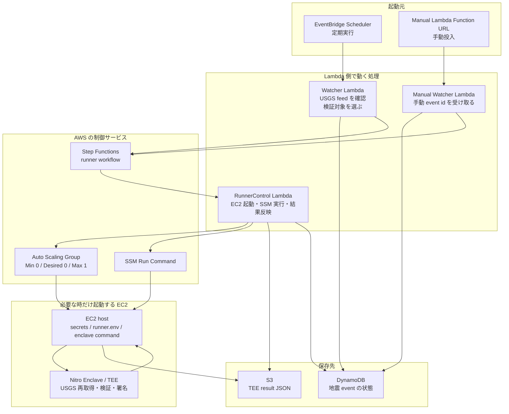
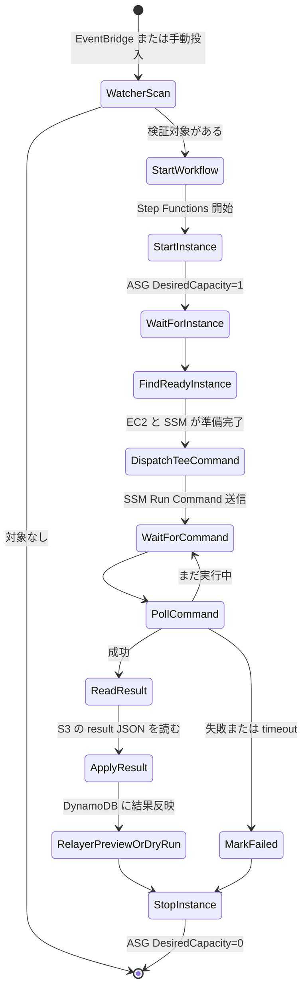
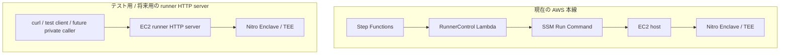

# 地震オラクル AWS 構成

このテンプレートは、Sonari の地震オラクルを AWS 上で動かすための構成です。

一番大事な考え方は、**ふだんは EC2 を止めておき、検証したい地震がある時だけ EC2 + Nitro Enclave を起動する**ことです。これにより、地震がない時間は EC2 の計算料金を発生させません。

## 全体像



## 何がどこで動くか

| 処理 | 実行場所 | 役割 |
| --- | --- | --- |
| 定期起動 | EventBridge Scheduler | Watcher Lambda を定期的に呼ぶ |
| 地震候補の確認 | Watcher Lambda | USGS recent feed を見て、検証する価値がある地震を選ぶ |
| 手動投入 | Manual Watcher Lambda | 人間が指定した `source_event_id` を受け取る |
| 状態保存 | DynamoDB | `new`、`processing`、`finalized`、`failed` などの状態を保存する |
| 実行手順の管理 | Step Functions | EC2 起動から停止までの手順を順番に実行する |
| EC2 起動/停止 | RunnerControl Lambda | Auto Scaling Group を `0 -> 1 -> 0` に変更する |
| TEE 実行命令 | RunnerControl Lambda -> SSM Run Command | EC2 host に shell command を送る |
| 地震データの検証 | Nitro Enclave / TEE | USGS を再取得し、検証し、署名済み result を作る |
| 結果保存 | EC2 host -> S3 | TEE が出した JSON を S3 に置く |
| 結果反映 | RunnerControl Lambda | S3 から result を読み、DynamoDB に反映する |
| Relayer preview / dry-run | RunnerControl Lambda | `RELAYER_MODE` が設定されている場合だけ実行する |

## 処理フロー



## EC2 runner HTTP server について

`nautilus/verifiers/earthquake/runner` には、EC2 host 上で動かせる HTTP server 実装があります。

この server は、主にローカル検証、手動テスト、将来の private runner service 化のために用意されています。現在の CloudFormation 本線では、Step Functions がこの HTTP server を呼ぶのではなく、RunnerControl Lambda が SSM Run Command で EC2 host に直接 command を送ります。



HTTP server が持つ主な endpoint は次の通りです。

| Endpoint | 用途 |
| --- | --- |
| `GET /health` | runner server が起動しているか確認する |
| `POST /start` | runner session を開始する |
| `POST /process` | TEE に地震 verifier request を渡して検証を実行する |
| `POST /stop` | runner session を停止し、実行中 process があれば abort する |
| `POST /relayer/preview` | relayer request を組み立てるテストをする |
| `POST /relayer/dry_run` | Sui dry-run のテストをする |

本番 AWS 経路を理解するときは、まず SSM Run Command 経路を見てください。runner HTTP server は便利なテスト用部品ですが、現在の CloudFormation では必須経路ではありません。

## TEE が担当すること

TEE は、地震オラクルで一番信頼したい処理だけを担当します。

- USGS detail GeoJSON と ShakeMap を再取得する
- 取得した source data を検証する
- affected cells と Merkle root を作る
- contract に渡す BCS payload を作る
- TEE signing key で署名する
- `pending_source`、`pending_mmi`、`rejected`、`finalized` のいずれかを返す

Watcher、RunnerControl Lambda、EC2 host、Relayer は TEE の外側にあります。これらは便利な運用部品ですが、payload の意味を変えてはいけません。Sui contract が信頼するのは、TEE が署名した `finalized` payload です。

## Relayer について

このテンプレートの本線では、Relayer は既定で無効です。
`RelayerMode` が空なら、TEE result が `finalized` でも skip します。

`RelayerMode=dry_run` では、RunnerControl Lambda が Sui dry-run を実行します。
dry-run は Sui object を作りません。
DynamoDB には `relayer_status=succeeded` を残します。

`RelayerMode=submit` では、RunnerControl Lambda が Sui submit を実行します。
submit は `RelayerAllowSubmit=true` がない限り fail-closed です。
signer は `RelayerSignerSecretArn` の private key から作ります。
Lambda は必要な時だけ secret を読みます。

Relayer は TEE payload の意味を変えてはいけません。
Sui contract が検証できる署名済み finalized payload だけを送ります。

## 作成される主な AWS リソース

- Nitro Enclaves を有効化した EC2 Launch Template
- 通常時 `DesiredCapacity: 0` の Auto Scaling Group
- inbound を持たない EC2 security group
- EventBridge Scheduler schedule
- scheduled / manual 用 Watcher Lambda
- runner 制御用 RunnerControl Lambda
- Step Functions Standard state machine
- DynamoDB event state table
- S3 runner result bucket
- Secrets Manager secret を読める IAM role
- SSM Run Command を実行できる IAM role
- `/sonari/earthquake-runner/` 配下の CloudWatch Logs log group

## 必須パラメータ

```txt
VpcId
SubnetIds
RunnerTokenSecretArn
TeeSigningKeySecretArn
WalrusConfigSecretArn
SuiWalletConfigSecretArn
SuiKeystoreSecretArn
NitroEnclaveProcessCommand
WalrusAggregatorUrl
WalrusContext
InstanceType
AmiId
LambdaCodeS3Bucket
LambdaCodeS3Key
TeeArtifactS3Bucket
TeeArtifactS3Key
TeeArtifactSha256
```

初回デプロイでは、`ScheduleState` は既定値の `DISABLED` のままにしてください。Manual Watcher Function URL から手動 event で workflow を確認し、EC2 起動、SSM 実行、TEE result 保存、DynamoDB 更新が成功してから `ENABLED` に切り替えます。

## Lambda artifact の作成

CloudFormation の `LambdaCodeS3Bucket` / `LambdaCodeS3Key` には、repo で作成した Lambda zip を S3 に置いた場所を渡します。

```bash
pnpm build:aws-earthquake-lambda
aws s3 cp dist/aws/earthquake-runner-lambda.zip s3://<bucket>/<prefix>/<commit-sha>/earthquake-runner-lambda.zip
```

このコマンドは、Watcher Lambda 用の `dist/src/lambda.js` と RunnerControl Lambda 用の `dist/src/runner_workflow.js` を bundle し、zip ルートに ESM 用の `package.json` を含めます。zip 内の path は CloudFormation template の handler 指定と一致している必要があります。

出力先を変える場合は `--out` を指定します。中間 build directory を確認したい場合だけ `--keep-work-dir` を使います。

```bash
pnpm build:aws-earthquake-lambda -- --out /tmp/earthquake-runner-lambda.zip --keep-work-dir
```

## 開発用 TEE artifact の作成

開発段階では、TEE binary を `bin/tee`、Walrus CLI を `bin/walrus` として含む `tar.gz` を作成し、CloudFormation の `TeeArtifactS3Bucket` / `TeeArtifactS3Key` / `TeeArtifactSha256` に渡します。`bin/walrus` は TEE process が Walrus archive を作るために呼び出す CLI です。

```bash
pnpm build:aws-earthquake-tee-artifact
tar -tzf dist/aws/earthquake-tee-artifact.tar.gz
sha256sum -c dist/aws/earthquake-tee-artifact.tar.gz.sha256
```

`tar -tzf` の出力に `bin/tee` と `bin/walrus` が含まれていることを確認してください。checksum file は `sha256sum -c` で検証できる形式です。

AWS 用 artifact の TEE binary は、既定で `x86_64-unknown-linux-musl` target の static binary として build します。host の glibc に依存した binary を AL2023 EC2 に配置すると、EC2 側の glibc version と合わず実行できないためです。local host に musl toolchain を入れられない場合は、Rust container などで `musl-tools` と `rustup target add x86_64-unknown-linux-musl` を用意して build し、`SONARI_TEE_BINARY=/path/to/static/tee pnpm build:aws-earthquake-tee-artifact` で package してください。

S3 へ配置する例は次の通りです。

```bash
aws s3 cp dist/aws/earthquake-tee-artifact.tar.gz s3://<bucket>/<prefix>/<commit-sha>/earthquake-tee-artifact.tar.gz
TEE_ARTIFACT_SHA256="$(cut -d ' ' -f 1 dist/aws/earthquake-tee-artifact.tar.gz.sha256)"
```

CloudFormation deploy では、artifact の場所と checksum を parameter として渡します。

```bash
aws cloudformation deploy \
  --template-file infra/aws/earthquake-runner/template.yaml \
  --stack-name <stack-name> \
  --capabilities CAPABILITY_IAM \
  --parameter-overrides \
    LambdaCodeS3Bucket=<bucket> \
    LambdaCodeS3Key=<prefix>/<commit-sha>/earthquake-runner-lambda.zip \
    TeeArtifactS3Bucket=<bucket> \
    TeeArtifactS3Key=<prefix>/<commit-sha>/earthquake-tee-artifact.tar.gz \
    TeeArtifactSha256="$TEE_ARTIFACT_SHA256" \
    SuiWalletConfigSecretArn=<sui-wallet-config-secret-arn> \
    SuiKeystoreSecretArn=<sui-keystore-secret-arn> \
    WalrusContext=testnet \
    NitroEnclaveProcessCommand="/opt/sonari/tee-artifact/bin/tee production"
```

`NitroEnclaveProcessCommand` の既定値は `/opt/sonari/tee-artifact/bin/tee production` です。別の wrapper や enclave 起動 command を検証する場合だけ、この parameter を上書きします。`WalrusContext` の既定値は `testnet` です。mainnet や独自 config を使う場合は、渡す Walrus config の context 名に合わせて上書きしてください。

## GitHub Actions dev deploy

dev deploy workflow は、現在の commit から Lambda zip と TEE tar.gz を build し、同じ artifact bucket の `<prefix>/<commit-sha>/` 配下へ配置してから CloudFormation deploy を実行します。S3 には最新 deploy commit の 2 object だけを残します。

```txt
<prefix>/<commit-sha>/earthquake-runner-lambda.zip
<prefix>/<commit-sha>/earthquake-tee-artifact.tar.gz
```

古い artifact は deploy 成功直後には消さず、post-deploy guardrail 成功後に削除します。削除対象は workflow の `ARTIFACT_BUCKET` と `S3_PREFIX` 配下だけです。最新 commit の Lambda zip と TEE tar.gz は保持し、それ以外の object は `aws s3api delete-objects` で削除します。

TEE artifact には Walrus CLI binary も含めるため、dev deploy workflow は pinned Walrus CLI artifact を download し、sha256 を検証してから `bin/walrus` として package します。Move contract の build / test は通常 CI 側で実行します。Sui CLI は dev deploy workflow では使いません。

rollback は S3 に残した古い artifact へ戻すのではなく、Git revert を `main` に merge または push し、通常の CI deploy で再 build / 再 deploy します。dev deploy workflow は `main` push でも起動するため、revert commit が deploy 対象になります。この運用により、contract / schema / application code / artifact の組み合わせを Git history と CI の結果に一本化します。

dev deploy 用 OIDC role には、通常の CloudFormation / EC2 / IAM / Lambda / Step Functions / EventBridge / DynamoDB / Secrets Manager 権限に加えて、artifact bucket への `s3:PutObject`、prefix cleanup 用の `s3:ListBucket`、`s3:DeleteObject` が必要です。`s3:ListBucket` は artifact bucket に対して `s3:prefix` を dev deploy prefix に制限し、`s3:PutObject` と `s3:DeleteObject` は `<prefix>/*` に制限してください。

## dev 用 Sui / Walrus secret の準備

ローカル検証用の Sui wallet / Walrus config は repo 内の `infra/aws/earthquake-runner/.local/` 配下に置きます。このディレクトリは gitignore 済みで、秘密鍵や keystore を含むファイルを commit してはいけません。

AWS Secrets Manager に入れるファイルは、EC2 上の path に合わせたコピーを使います。

```txt
WalrusConfigSecretArn    <- .local/sonari-dev/aws-secrets/walrus-client-config.yaml
SuiWalletConfigSecretArn <- .local/sonari-dev/aws-secrets/sui_config.yaml
SuiKeystoreSecretArn     <- .local/sonari-dev/aws-secrets/sui.keystore
```

AWS 用 `walrus-client-config.yaml` の wallet path は `/opt/sonari/sui_config.yaml`、AWS 用 `sui_config.yaml` の keystore path は `/opt/sonari/sui.keystore` にしておきます。ローカル用 config をそのまま Secrets Manager に入れると EC2 上で path が合わず、Walrus CLI が wallet を読めません。

## TEE artifact の配置方針

EC2 host には、`NitroEnclaveProcessCommand` として実行できる TEE artifact を配置しておく必要があります。

開発段階では TEE binary、Walrus CLI、enclave 起動 command が頻繁に変わるため、AMI に焼き込まず、S3 に保存した artifact を EC2 起動時に取得して配置します。EC2 bootstrap は checksum を検証してから `/opt/sonari/tee-artifact` に展開し、`/opt/sonari/tee-artifact/bin/tee` と `/opt/sonari/tee-artifact/bin/walrus` が実行可能であることを確認してから bootstrap 完了 marker を作ります。これにより、binary 更新のたびに AMI を作り直さずに検証できます。

本番運用では、検証済みの TEE artifact と起動 command を AMI に焼き込みます。AMI に固定することで、EC2 起動時の外部取得失敗を減らし、実行環境を再現しやすくします。

```txt
開発: S3 artifact -> EC2 host に配置 -> manual workflow で検証
本番: 検証済み artifact を AMI に焼き込み -> immutable runner image として運用
```

`NitroEnclaveProcessCommand` は、EC2 host 側から Nitro Enclave へ地震 verifier request を渡す command です。この command は stdin から `WorkerToTeeRequest` JSON を読み、stdout に `TeeCoreResult` JSON を出す契約です。

AWS runner workflow は request JSON を pipe で渡すため、本番 command は `--input` file を要求してはいけません。TEE CLI を直接使う場合の例は次の通りです。

```bash
/opt/sonari/bin/tee production
```

`tee production --input worker_request.json` は、ローカル検証や fixture/debug 用の互換入口です。

SSM 実行時には、EC2 host 上で次の値を読み込み、TEE process に渡します。

- `SONARI_TEE_SIGNING_KEY_SEED`
- `SONARI_WALRUS_CLI`
- `SONARI_WALRUS_CONFIG`
- `SONARI_WALRUS_WALLET`
- `SONARI_WALRUS_CONTEXT`
- `SONARI_WALRUS_EPOCHS`
- `SONARI_WALRUS_AGGREGATOR_URL`

## EC2 起動時に作られるファイル

EC2 bootstrap script は、Secrets Manager から値を読み、次のファイルを作ります。

```txt
/opt/sonari/runner-token
/opt/sonari/tee-signing-key
/opt/sonari/walrus-client-config.yaml
/opt/sonari/sui_config.yaml
/opt/sonari/sui.keystore
/opt/sonari/runner.env
/opt/sonari/tee-artifact/bin/tee
/opt/sonari/tee-artifact/bin/walrus
/opt/sonari/bootstrap-complete
```

`runner-token`、`tee-signing-key`、`walrus-client-config.yaml`、`sui_config.yaml`、`sui.keystore`、`runner.env` は `ec2-user:ec2-user` owner、`0400` permission で作成されます。`/opt/sonari/tee-artifact` 配下は `ec2-user:ec2-user` owner、owner-only permission で配置されます。

## 本番利用前に確認すること

- 選択した instance type が Nitro Enclaves に対応していること
- 開発では S3 に保存した TEE artifact を EC2 host に配置できること
- 本番では検証済み TEE artifact と起動 command を AMI に焼き込むこと
- Lambda artifact zip を `LambdaCodeS3Bucket` / `LambdaCodeS3Key` に配置していること
- Secrets Manager の値が本番用 token / signing key / Walrus config / Sui wallet config / Sui keystore であること
- 初回は `ScheduleState=DISABLED` のまま manual workflow で検証すること
- Relayer submit を有効化する場合は、Sui signer と retry 設計が決まっていること

## dev deploy の確認と rollback

GitHub Actions の dev deploy workflow は、commit ごとの Lambda artifact と TEE artifact を S3 に upload し、`ScheduleState=DISABLED` のまま CloudFormation stack を更新します。S3 には最新 deploy commit の 2 object だけを残します。

dev deploy environment には次の GitHub variables を設定します。Walrus CLI は workflow 内で download し、sha256 を検証してから TEE artifact に含めます。Move contract の build / test は通常 CI 側で実行するため、Sui CLI は dev deploy workflow では使いません。

| Variable | 用途 |
| --- | --- |
| `AWS_EARTHQUAKE_RUNNER_DEV_REGION` | dev stack の AWS region |
| `AWS_EARTHQUAKE_RUNNER_DEV_ROLE_ARN` | OIDC で assume する dev IAM role |
| `AWS_EARTHQUAKE_RUNNER_DEV_ACCOUNT_ID` | dev AWS account id |
| `AWS_EARTHQUAKE_RUNNER_DEV_STACK_NAME` | dev CloudFormation stack name |
| `AWS_EARTHQUAKE_RUNNER_DEV_ARTIFACT_BUCKET` | Lambda / TEE artifact を置く S3 bucket |
| `AWS_EARTHQUAKE_RUNNER_DEV_WALRUS_CLI_URL` | pinned Walrus CLI artifact URL |
| `AWS_EARTHQUAKE_RUNNER_DEV_WALRUS_CLI_SHA256` | Walrus CLI artifact の sha256 |

Relayer を dev stack で使う場合は、stack parameter に次を渡します。
何も渡さない場合、既定では Relayer は skip されます。

| Parameter | dry-run | submit |
| --- | --- | --- |
| `RelayerMode` | `dry_run` | `submit` |
| `RelayerNetwork` | `testnet` | `testnet` |
| `RelayerTarget` | 必須 | 必須 |
| `RelayerRegistry` | 必須 | 必須 |
| `RelayerVerifierRegistry` | 必須 | 必須 |
| `RelayerGrpcUrl` | `https://fullnode.testnet.sui.io:443` | `https://fullnode.testnet.sui.io:443` |
| `RelayerSenderAddress` | 必須 | 任意 |
| `RelayerSignerSecretArn` | 不要 | 必須 |
| `RelayerAllowSubmit` | `false` | `true` |

submit 用 secret には Sui private key 文字列だけを保存します。
`sui_config.yaml` や `sui.keystore` は Lambda に置きません。
signer address には必要最小限の SUI gas だけを入れてください。

dev deploy 用 OIDC role には、通常の CloudFormation / EC2 / IAM / Lambda / Step Functions / EventBridge / DynamoDB / Secrets Manager 権限に加えて、artifact bucket への `s3:PutObject`、prefix cleanup 用の `s3:ListBucket`、`s3:DeleteObject` が必要です。`s3:ListBucket` は artifact bucket に対して `s3:prefix` を dev deploy prefix に制限し、`s3:PutObject` と `s3:DeleteObject` は `earthquake-runner/*` に制限してください。

`aws cloudformation describe-stacks` では、deploy 後に次の output を確認できます。

| Output | 確認する値 |
| --- | --- |
| `DeployedGitCommitSha` | stack に記録された deployed commit |
| `LambdaCodeS3KeyOutput` | Lambda zip の S3 key |
| `TeeArtifactS3KeyOutput` | TEE artifact の S3 key |
| `TeeArtifactSha256Output` | TEE artifact の sha256 |
| `RunnerAutoScalingGroupName` | runner ASG name |
| `WatcherScheduleName` | EventBridge Scheduler schedule name |
| `WatcherLambdaName` | scheduled watcher Lambda name |
| `ManualWatcherLambdaName` | manual watcher Lambda name |
| `RunnerControlLambdaName` | runner control Lambda name |

deploy 後は、対象 commit を `TARGET_COMMIT` に入れて次を確認します。

```bash
STACK_NAME=<dev-stack-name>
TARGET_COMMIT=<40-char-commit-sha>

aws cloudformation describe-stacks \
  --stack-name "$STACK_NAME" \
  --query "Stacks[0].Outputs[?contains(['DeployedGitCommitSha','LambdaCodeS3KeyOutput','TeeArtifactS3KeyOutput','TeeArtifactSha256Output','RunnerAutoScalingGroupName','WatcherScheduleName','WatcherLambdaName','ManualWatcherLambdaName','RunnerControlLambdaName'], OutputKey)].{Key:OutputKey,Value:OutputValue}" \
  --output table
```

確認する guardrail は次の通りです。

- `DeployedGitCommitSha` が `TARGET_COMMIT` と一致する。
- `LambdaCodeS3KeyOutput` と `TeeArtifactS3KeyOutput` が `TARGET_COMMIT` を含む。
- `RunnerAutoScalingGroupName` の ASG `DesiredCapacity` が `0`。
- `WatcherScheduleName` の schedule `State` が `DISABLED`。
- `WatcherLambdaName`、`ManualWatcherLambdaName`、`RunnerControlLambdaName` の `CodeSha256` が同じ値。
- post-deploy guardrail 成功後、`earthquake-runner/` 配下には `TARGET_COMMIT` の Lambda zip と TEE tar.gz だけが残る。

必要な AWS CLI query は次の形で実行できます。

```bash
ASG_NAME="$(aws cloudformation describe-stacks --stack-name "$STACK_NAME" --query "Stacks[0].Outputs[?OutputKey=='RunnerAutoScalingGroupName'].OutputValue | [0]" --output text)"
SCHEDULE_NAME="$(aws cloudformation describe-stacks --stack-name "$STACK_NAME" --query "Stacks[0].Outputs[?OutputKey=='WatcherScheduleName'].OutputValue | [0]" --output text)"
WATCHER_LAMBDA="$(aws cloudformation describe-stacks --stack-name "$STACK_NAME" --query "Stacks[0].Outputs[?OutputKey=='WatcherLambdaName'].OutputValue | [0]" --output text)"
MANUAL_WATCHER_LAMBDA="$(aws cloudformation describe-stacks --stack-name "$STACK_NAME" --query "Stacks[0].Outputs[?OutputKey=='ManualWatcherLambdaName'].OutputValue | [0]" --output text)"
RUNNER_CONTROL_LAMBDA="$(aws cloudformation describe-stacks --stack-name "$STACK_NAME" --query "Stacks[0].Outputs[?OutputKey=='RunnerControlLambdaName'].OutputValue | [0]" --output text)"

aws autoscaling describe-auto-scaling-groups \
  --auto-scaling-group-names "$ASG_NAME" \
  --query 'AutoScalingGroups[0].DesiredCapacity' \
  --output text

aws scheduler get-schedule \
  --name "$SCHEDULE_NAME" \
  --query State \
  --output text

aws lambda get-function --function-name "$WATCHER_LAMBDA" --query 'Configuration.CodeSha256' --output text
aws lambda get-function --function-name "$MANUAL_WATCHER_LAMBDA" --query 'Configuration.CodeSha256' --output text
aws lambda get-function --function-name "$RUNNER_CONTROL_LAMBDA" --query 'Configuration.CodeSha256' --output text
```

### Relayer dry-run / submit の確認

manual watcher で `us6000m0xl` を投入します。
dry-run では、DynamoDB row に次が残ることを確認します。

- `relayer_mode` が `dry_run`
- `relayer_status` が `succeeded`
- `relayer_digest` が空
- `relayer_object_id` が空

submit では、DynamoDB row に次が残ることを確認します。

- `status` が `submitted`
- `relayer_mode` が `submit`
- `relayer_status` が `succeeded`
- `relayer_digest` に Sui tx digest が入る
- `relayer_object_id` に `DisasterEvent` object ID が入る

作成 object は Sui testnet から取得します。
contract-visible field が TEE result と一致することを確認します。

```bash
SUI_GRPC_URL=https://fullnode.testnet.sui.io:443
DISASTER_EVENT_ID=<relayer_object_id>

sui client object "$DISASTER_EVENT_ID" --json
```

確認する field は次です。

- `source_event_id`
- `event_uid`
- `event_revision`
- `hazard_type`
- `oracle_version`
- `payload_bcs_hash`
- `affected_cells_root`
- `affected_cell_count`

Relayer が失敗した場合も、Step Functions は `StopInstance` に進みます。
最後に ASG が空へ戻ったことを確認します。

```bash
aws autoscaling describe-auto-scaling-groups \
  --auto-scaling-group-names "$ASG_NAME" \
  --query 'AutoScalingGroups[0].{Desired:DesiredCapacity,Instances:Instances[].InstanceId}' \
  --output json
```

期待値は `Desired=0` と `Instances=[]` です。

rollback する場合は、Git revert を `main` に merge または push し、通常の CI deploy で再 build / 再 deploy します。S3 の古い artifact を直接指定して戻す運用はしません。revert commit の deploy 後も同じ post-deploy check を実行し、`DeployedGitCommitSha` と artifact key が revert commit を指すこと、ASG が `DesiredCapacity=0`、schedule が `DISABLED`、3 つの Lambda の `CodeSha256` が一致していることを確認します。

## 料金面の前提

- EC2 は通常時 0 台なので、地震検証がない時間の EC2 計算料金は発生しません。
- ALB は作成しないため、ALB の常時料金は発生しません。
- Lambda、EventBridge、Step Functions、DynamoDB、S3、Secrets Manager、CloudWatch Logs は従量課金または少額の保存課金が発生します。
