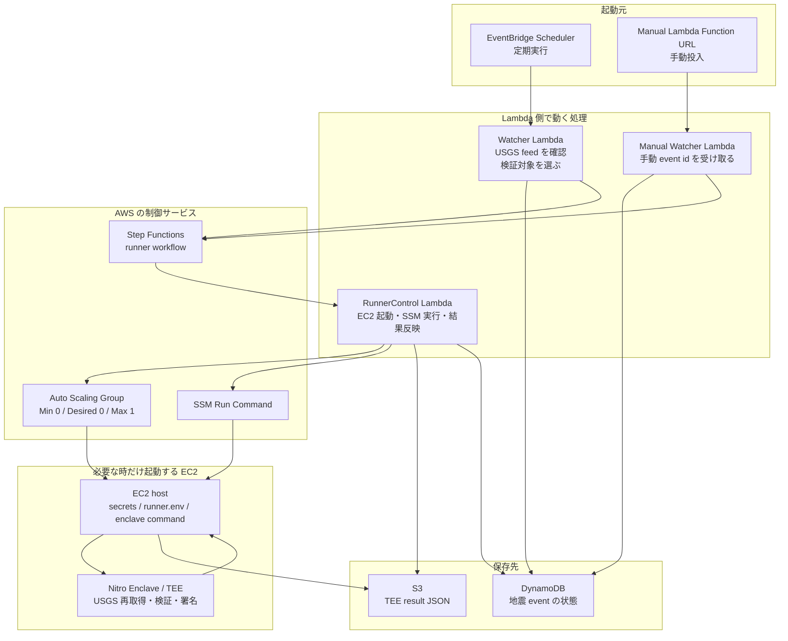
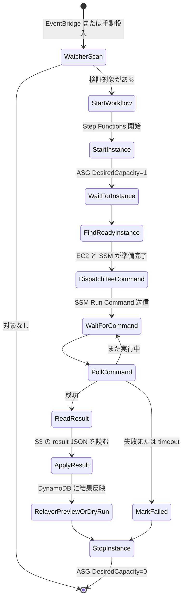
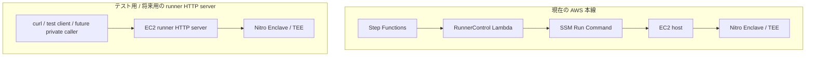

# 地震オラクル AWS 構成

このテンプレートは、Sonari の地震オラクルを AWS 上で動かすための構成です。

一番大事な考え方は、**ふだんは EC2 を止めておき、検証したい地震がある時だけ EC2 + Nitro Enclave を起動する**ことです。これにより、地震がない時間は EC2 の計算料金を発生させません。

## 全体像



## 何がどこで動くか

| 処理 | 実行場所 | 役割 |
| --- | --- | --- |
| 定期起動 | EventBridge Scheduler | Watcher Lambda を定期的に呼ぶ |
| 地震候補の確認 | Watcher Lambda | USGS recent feed を見て、検証する価値がある地震を選ぶ |
| 手動投入 | Manual Watcher Lambda | 人間が指定した `source_event_id` を受け取る |
| 状態保存 | DynamoDB | `new`、`processing`、`finalized`、`failed` などの状態を保存する |
| 実行手順の管理 | Step Functions | EC2 起動から停止までの手順を順番に実行する |
| EC2 起動/停止 | RunnerControl Lambda | Auto Scaling Group を `0 -> 1 -> 0` に変更する |
| TEE 実行命令 | RunnerControl Lambda -> SSM Run Command | EC2 host に shell command を送る |
| 地震データの検証 | Nitro Enclave / TEE | USGS を再取得し、検証し、署名済み result を作る |
| 結果保存 | EC2 host -> S3 | TEE が出した JSON を S3 に置く |
| 結果反映 | RunnerControl Lambda | S3 から result を読み、DynamoDB に反映する |
| Relayer preview / dry-run | RunnerControl Lambda | `RELAYER_MODE` が設定されている場合だけ実行する |

## 処理フロー



## EC2 runner HTTP server について

`nautilus/verifiers/earthquake/runner` には、EC2 host 上で動かせる HTTP server 実装があります。

この server は、主にローカル検証、手動テスト、将来の private runner service 化のために用意されています。現在の CloudFormation 本線では、Step Functions がこの HTTP server を呼ぶのではなく、RunnerControl Lambda が SSM Run Command で EC2 host に直接 command を送ります。



HTTP server が持つ主な endpoint は次の通りです。

| Endpoint | 用途 |
| --- | --- |
| `GET /health` | runner server が起動しているか確認する |
| `POST /start` | runner session を開始する |
| `POST /process` | TEE に地震 verifier request を渡して検証を実行する |
| `POST /stop` | runner session を停止し、実行中 process があれば abort する |
| `POST /relayer/preview` | relayer request を組み立てるテストをする |
| `POST /relayer/dry_run` | Sui dry-run のテストをする |

本番 AWS 経路を理解するときは、まず SSM Run Command 経路を見てください。runner HTTP server は便利なテスト用部品ですが、現在の CloudFormation では必須経路ではありません。

## TEE が担当すること

TEE は、地震オラクルで一番信頼したい処理だけを担当します。

- USGS detail GeoJSON と ShakeMap を再取得する
- 取得した source data を検証する
- affected cells と Merkle root を作る
- contract に渡す BCS payload を作る
- TEE signing key で署名する
- `pending_source`、`pending_mmi`、`rejected`、`finalized` のいずれかを返す

Watcher、RunnerControl Lambda、EC2 host、Relayer は TEE の外側にあります。これらは便利な運用部品ですが、payload の意味を変えてはいけません。Sui contract が信頼するのは、TEE が署名した `finalized` payload です。

## Relayer について

このテンプレートの本線では、Relayer はまだ本番 submit まで有効化されていません。

`RunnerControlLambda` は `RELAYER_MODE`、`RELAYER_TARGET`、`RELAYER_REGISTRY`、`RELAYER_VERIFIER_REGISTRY` などの環境変数があれば、TEE result が `finalized` の時に preview または dry-run を実行できます。ただし、この CloudFormation テンプレートの現在の定義では、それらの環境変数を渡していないため、デフォルトでは Relayer は skip されます。

実 submit を行うには、Sui signer の扱い、retry、重複 submit 対策、gas 管理を別途設計する必要があります。

## 作成される主な AWS リソース

- Nitro Enclaves を有効化した EC2 Launch Template
- 通常時 `DesiredCapacity: 0` の Auto Scaling Group
- inbound を持たない EC2 security group
- EventBridge Scheduler schedule
- scheduled / manual 用 Watcher Lambda
- runner 制御用 RunnerControl Lambda
- Step Functions Standard state machine
- DynamoDB event state table
- S3 runner result bucket
- Secrets Manager secret を読める IAM role
- SSM Run Command を実行できる IAM role
- `/sonari/earthquake-runner/` 配下の CloudWatch Logs log group

## 必須パラメータ

```txt
VpcId
SubnetIds
RunnerTokenSecretArn
TeeSigningKeySecretArn
WalrusConfigSecretArn
NitroEnclaveProcessCommand
WalrusAggregatorUrl
InstanceType
AmiId
LambdaCodeS3Bucket
LambdaCodeS3Key
```

`NitroEnclaveProcessCommand` は、EC2 host 側から Nitro Enclave へ地震 verifier request を渡す command です。

SSM 実行時には、EC2 host 上で次の値を読み込み、TEE process に渡します。

- `SONARI_TEE_SIGNING_KEY_SEED`
- `SONARI_WALRUS_CONFIG`
- `SONARI_WALRUS_AGGREGATOR_URL`

## EC2 起動時に作られるファイル

EC2 bootstrap script は、Secrets Manager から値を読み、次のファイルを作ります。

```txt
/opt/sonari/runner-token
/opt/sonari/tee-signing-key
/opt/sonari/walrus-config.json
/opt/sonari/runner.env
/opt/sonari/bootstrap-complete
```

`runner-token`、`tee-signing-key`、`walrus-config.json`、`runner.env` は `ec2-user:ec2-user` owner、`0400` permission で作成されます。

## 本番利用前に確認すること

- 選択した instance type が Nitro Enclaves に対応していること
- build 済み runner / TEE artifact が AMI または deploy pipeline により `/opt/sonari/app` へ配置されること
- Lambda artifact zip を `LambdaCodeS3Bucket` / `LambdaCodeS3Key` に配置していること
- Secrets Manager の値が本番用 token / signing key / Walrus config であること
- Relayer submit を有効化する場合は、Sui signer と retry 設計が決まっていること

## 料金面の前提

- EC2 は通常時 0 台なので、地震検証がない時間の EC2 計算料金は発生しません。
- ALB は作成しないため、ALB の常時料金は発生しません。
- Lambda、EventBridge、Step Functions、DynamoDB、S3、Secrets Manager、CloudWatch Logs は従量課金または少額の保存課金が発生します。
