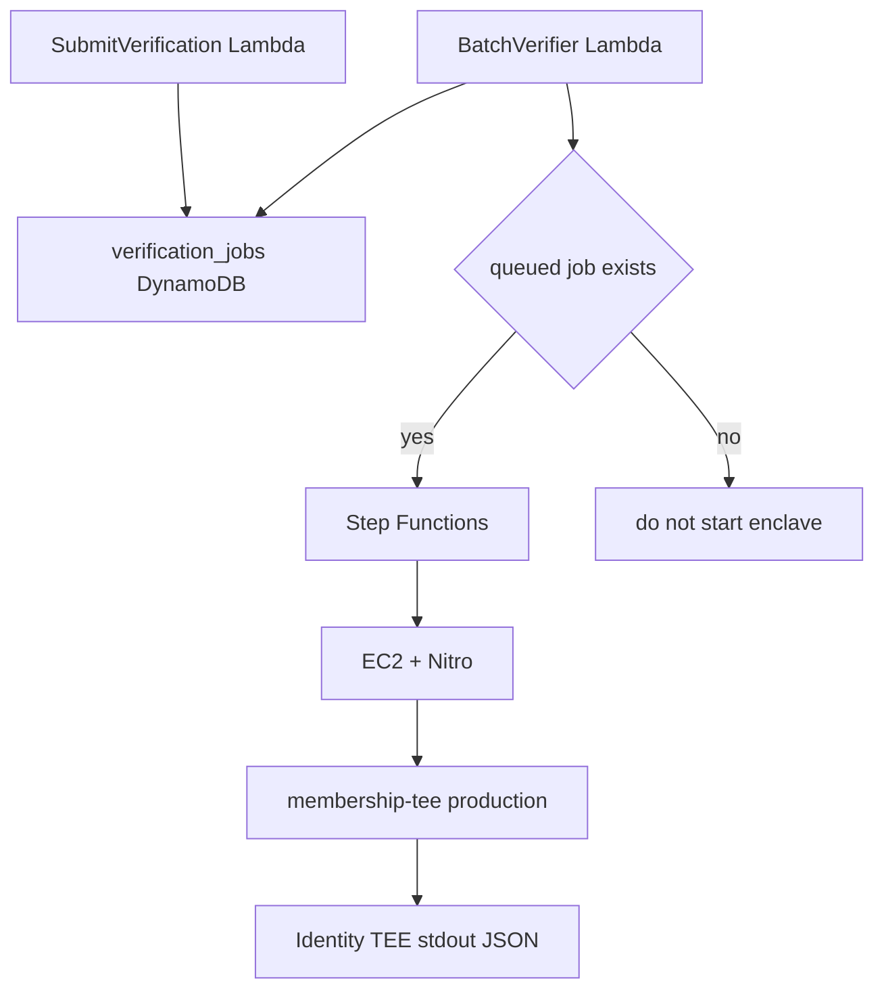

# Membership identity AWS runner

This document is the operator runbook for issue #74 step 6. It covers the
path from local artifact build through AWS deploy, World ID verification, Sui
dry-run, Sui submit, and post-tx membership pass state readback.

Credential absence means issue cannot be closed. If AWS credentials, World ID
app/proof inputs, Sui object IDs, or Sui submit signer material are missing,
stop at the matching gate and record that blocker in the evidence template.

The evidence template is
`infra/aws/membership-identity-runner/evidence-template.md`.

## Job model

Identity verification requests are queued jobs. When there are no due jobs,
EC2 + Nitro capacity stays at zero.

```text
SubmitVerification Lambda -> verification_jobs DynamoDB -> BatchVerifier Lambda -> Step Functions -> EC2 + Nitro
```



## Trust boundary

worker は request 作成と状態管理を担当する。
worker は TEE stdout の意味を変えない。

TEE は検証、正規化、署名を担当する。
TEE は stdin の `IdentityVerifyRequest` を検証する。
TEE は stdout に status 付き JSON を 1 つ返す。

relayer は結果を配送するだけである。
relayer は payload の意味を変更しない。
Move contract は署名済み verified payload だけを信頼する。

## Fixed TEE interface

AWS calls this command:

```bash
membership-tee production
```

AWS passes one `IdentityVerifyRequest` JSON value on stdin. The TEE returns one
JSON value on stdout. This 1 request = 1 JSON in / 1 JSON out contract does not
change.

Statuses are fixed to:

```text
verified
rejected
pending_source
unsupported
```

`pending_source` は earthquake verifier と同じ再試行用の語である。
運用ツールは同じ語を見て retry や監視を組み立てられる。

AWS 境界 interface として固定する env は次の 3 つである。

```text
SONARI_TEE_SIGNING_KEY_SEED
SONARI_TEE_SIGNING_KEY_SEED_FILE
SONARI_WORLD_ID_API_BASE
```

`SONARI_WORLD_ID_APP_ID` is production runtime config. In AWS it is injected from
deploy config into the TEE process env. The signing seed must not be injected as
plaintext in Lambda or on the EC2 host; production signing material is encrypted
and decrypted only through KMS/Nitro attestation measurements.

## Required artifacts

Build and retain these before deploy:

- `dist/aws/membership-identity-tee-artifact.tar.gz`
- `dist/aws/membership-identity-tee-artifact.tar.gz.sha256`
- `dist/aws/membership-identity-tee.eif`
- `dist/aws/membership-identity-tee.eif.sha256`, or the equivalent EIF checksum
  captured from the build/deploy system
- Lambda code bundle uploaded to S3 for `LambdaCodeS3Bucket` and
  `LambdaCodeS3Key`
- encrypted signing material uploaded to S3 for
  `SigningSeedCiphertextS3Bucket` and `SigningSeedCiphertextS3Key`

The membership artifact is built from
`scripts/build_aws_membership_identity_tee_artifact.ts`, which follows the
earthquake reference `scripts/build_aws_earthquake_tee_artifact.ts`.

```bash
pnpm build:aws-membership-identity-tee-artifact
pnpm build:aws-membership-identity-eif
sha256sum -c dist/aws/membership-identity-tee-artifact.tar.gz.sha256
```

Cargo manifest:

```text
nautilus/verifiers/membership/tee/Cargo.toml
```

Default target:

```text
x86_64-unknown-linux-musl
```

Artifact command:

```bash
bin/membership-tee production
```

Walrus CLI を含めない。
membership TEE は Walrus を呼ばない。
stdin/stdout 契約は変えない。

## KMS/Nitro attestation measurements

Capture the EIF identity before deploying the stack parameters:

- EIF identity
- ImageSha384
- PCR3

Use the measurements from `nitro-cli build-enclave` output or the available
Nitro CLI inspection command in the target AMI. The CloudFormation template
gates KMS decrypt on:

```text
NitroEnclaveImageSha384
NitroEnclavePcr3
kms:RecipientAttestation:ImageSha384
kms:RecipientAttestation:PCR3
```

Do not deploy with placeholder measurements. A mismatch must fail closed by
preventing decrypt of the encrypted signing material.

## Required operator inputs

### World ID app/proof inputs

Use real World ID proof inputs for the live smoke:

- `SONARI_WORLD_ID_APP_ID`
- `SONARI_WORLD_ID_API_BASE`, normally the vsock-proxy endpoint inside the
  enclave path
- `world_id.world_app_id`
- `world_id.nullifier_hash`
- `world_id.merkle_root`
- `world_id.proof`
- `world_id.verification_level`
- `world_id.action`, expected `sonari_membership_register_v1`
- `world_id.signal_hash`

The request must also include `registry_id`, `membership_id`, `owner`,
`terms_version`, and `signed_statement_hash`.

### Stack parameters

The AWS deployment requires these stack parameters at minimum:

- `VpcId`
- `SubnetIds`
- `InstanceType`
- `AmiId`
- `LambdaCodeS3Bucket`
- `LambdaCodeS3Key`
- `TeeArtifactS3Bucket`
- `TeeArtifactS3Key`
- `TeeArtifactSha256`
- `TeeEifS3Bucket`
- `TeeEifS3Key`
- `TeeEifSha256`
- `NitroEnclaveCpuCount`
- `NitroEnclaveMemoryMiB`
- `NitroEnclaveCid`
- `SigningSeedCiphertextS3Bucket`
- `SigningSeedCiphertextS3Key`
- `NitroEnclaveImageSha384`
- `NitroEnclavePcr3`
- `WorldIdAppId`
- `WorldIdApiBase`
- `ScheduleState`
- `GitCommitSha`

### Sui object IDs

Sui dry-run, Sui submit, and post-tx membership pass state readback require:

- `SONARI_IDENTITY_PACKAGE_ID`
- `SONARI_IDENTITY_PAUSE_STATE_ID`
- `SONARI_IDENTITY_REGISTRY_ID`
- `SONARI_MEMBERSHIP_REGISTRY_ID`
- `SONARI_VERIFIER_REGISTRY_ID`
- `SONARI_MEMBERSHIP_PASS_ID`
- `SONARI_SUI_CLOCK_ID`, default `0x6`
- `RELAYER_NETWORK`, such as `testnet`
- `RELAYER_GRPC_URL`
- `RELAYER_SENDER_ADDRESS`
- `RELAYER_MODE`, first `dry_run`, then `submit`
- `RELAYER_ALLOW_SUBMIT=true` for submit only
- `RELAYER_SIGNER_SECRET_ARN` for submit only

## Operator runbook

### 1. Local unit tests

Run local unit tests before uploading artifacts:

```bash
pnpm exec vitest run scripts/membership_identity_aws_interface_doc.test.ts
pnpm exec vitest run scripts/aws_membership_identity_tee_artifact_build.test.ts scripts/aws_membership_identity_eif_build.test.ts scripts/aws_membership_identity_runner_template.test.ts
pnpm --filter @sonari/membership-verifier-runner test
cargo test -p membership-tee
```

Record the command, exit code, and relevant log path in the evidence template.

### 2. Build, checksum, and upload artifacts

Build the tar and EIF, verify the tar checksum, and upload the required
artifacts to S3.

```bash
pnpm build:aws-membership-identity-tee-artifact
pnpm build:aws-membership-identity-eif
sha256sum -c dist/aws/membership-identity-tee-artifact.tar.gz.sha256
```

Record the tar artifact checksum, EIF checksum, EIF identity, ImageSha384, and
PCR3.

### 3. Deploy or update the AWS stack

Deploy with all stack parameters resolved from the evidence file or secure
parameter storage.

```bash
aws cloudformation deploy \
  --template-file infra/aws/membership-identity-runner/template.yaml \
  --stack-name "$STACK_NAME" \
  --capabilities CAPABILITY_NAMED_IAM \
  --parameter-overrides \
    VpcId="$VPC_ID" \
    SubnetIds="$SUBNET_IDS" \
    AmiId="$AMI_ID" \
    LambdaCodeS3Bucket="$LAMBDA_CODE_S3_BUCKET" \
    LambdaCodeS3Key="$LAMBDA_CODE_S3_KEY" \
    TeeArtifactS3Bucket="$TEE_ARTIFACT_S3_BUCKET" \
    TeeArtifactS3Key="$TEE_ARTIFACT_S3_KEY" \
    TeeArtifactSha256="$TEE_ARTIFACT_SHA256" \
    TeeEifS3Bucket="$TEE_EIF_S3_BUCKET" \
    TeeEifS3Key="$TEE_EIF_S3_KEY" \
    TeeEifSha256="$TEE_EIF_SHA256" \
    SigningSeedCiphertextS3Bucket="$SIGNING_SEED_CIPHERTEXT_S3_BUCKET" \
    SigningSeedCiphertextS3Key="$SIGNING_SEED_CIPHERTEXT_S3_KEY" \
    NitroEnclaveImageSha384="$NITRO_ENCLAVE_IMAGE_SHA384" \
    NitroEnclavePcr3="$NITRO_ENCLAVE_PCR3" \
    WorldIdAppId="$SONARI_WORLD_ID_APP_ID" \
    WorldIdApiBase="$SONARI_WORLD_ID_API_BASE" \
    GitCommitSha="$(git rev-parse HEAD)"
```

### 4. AWS deployment smoke

After deploy, read stack outputs and confirm the private control plane exists:

```bash
aws cloudformation describe-stacks --stack-name "$STACK_NAME"
aws dynamodb describe-table --table-name "$VERIFICATION_JOBS_TABLE_NAME"
aws lambda get-function --function-name "$SUBMIT_VERIFICATION_LAMBDA_NAME"
aws lambda get-function --function-name "$BATCH_VERIFIER_LAMBDA_NAME"
aws stepfunctions describe-state-machine --state-machine-arn "$RUNNER_STATE_MACHINE_ARN"
```

Record stack name, output names, and smoke result.

### 5. Nitro Enclave start

Trigger one queued job and confirm the workflow starts EC2 capacity, starts the
Nitro Enclave, and returns capacity to zero after completion or failure.

```bash
aws autoscaling describe-auto-scaling-groups \
  --auto-scaling-group-names "$RUNNER_AUTO_SCALING_GROUP_NAME"
aws stepfunctions list-executions \
  --state-machine-arn "$RUNNER_STATE_MACHINE_ARN" \
  --max-results 5
```

On the instance, the runner command uses `nitro-cli run-enclave` with the
configured CPU, memory, CID, and EIF path.

### 6. vsock-proxy World ID real API smoke

Submit a real World ID request and verify the enclave reaches the World ID API
only through vsock-proxy. A proxy failure must produce a fail-closed error or
`pending_source`; it must not fall back to direct host-side proof acceptance.

Record:

- World ID app id
- redacted proof request id or job id
- TEE stdout status
- public key for verified output
- sanitized CloudWatch log location

### 7. Sui dry-run

Set relayer mode to dry-run first:

```bash
RELAYER_MODE=dry_run
```

Run the workflow through `dry_run_sui_submission`. The dry-run must use the
signed `payload_bcs_hex`, `signature`, and `public_key` without changing their
meaning.

Record the dry-run result and effects.

### 8. Sui submit

Submit only after dry-run succeeds and the signer secret is configured:

```bash
RELAYER_MODE=submit
RELAYER_ALLOW_SUBMIT=true
RELAYER_SIGNER_SECRET_ARN="$RELAYER_SIGNER_SECRET_ARN"
```

The submit path calls `accessor::update_identity_verification` and stores the tx
digest. Record the tx digest and do not overwrite it on duplicate completion.

### 9. post-tx membership pass state readback

Read `SONARI_MEMBERSHIP_PASS_ID` from the same Sui network after the tx digest
is finalized. Confirm the membership pass identity verification fields reflect
the submitted verified payload.

Record the post-tx membership pass state readback, including:

- membership pass object id
- identity verified flag
- provider mask or provider field
- verified/expires timestamps
- terms version
- signed statement hash

Issue #74 can close only after this readback matches the tx digest evidence.

## Evidence gate

Fill `evidence-template.md` during the live run. The minimum close-out evidence
is:

- stack name
- artifact checksum
- EIF identity
- ImageSha384
- PCR3
- public key
- tx digest
- post-tx readback

credential absence means issue cannot be closed.
