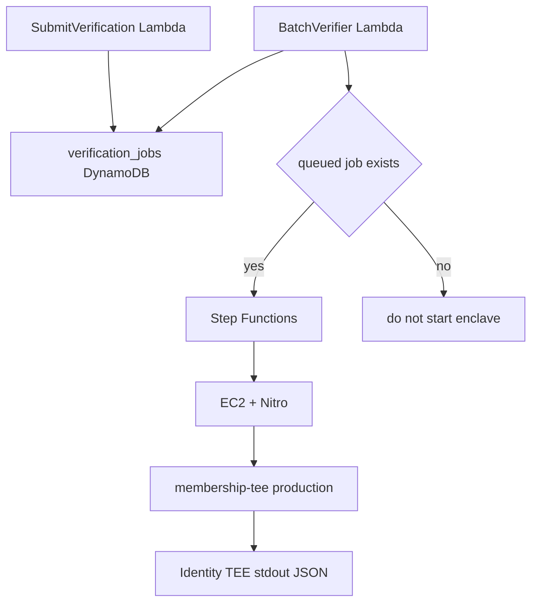

# Membership identity AWS interface

この文書は、membership identity TEE を AWS on-demand で動かす時の境界を固定する。
on-demand とは、job がある時だけ実行環境を起動する方式である。

この issue で固定する対象は TEE 境界契約である。
AWS resource はこの issue では作らない。
Lambda、DynamoDB、Step Functions、EC2、Nitro Enclave の実構築は #74 で扱う。

## Job model

identity verification request は queued job として扱う。
job が 0 件なら EC2 + Nitro は起動しない。
job がある時だけ batch workflow が TEE 実行へ進む。

固定する流れは次の通りである。

```text
SubmitVerification Lambda -> verification_jobs DynamoDB -> BatchVerifier Lambda -> Step Functions -> EC2 + Nitro
```



DynamoDB は AWS の表形式 DB である。
Step Functions は AWS の手順管理サービスである。
EC2 + Nitro は TEE process を隔離して動かす場所である。

## Trust boundary

worker は request 作成と状態管理を担当する。
worker は TEE stdout の意味を変えない。

TEE は検証、正規化、署名を担当する。
TEE は stdin の `IdentityVerifyRequest` を検証する。
TEE は stdout に status 付き JSON を 1 つ返す。

relayer は結果を配送するだけである。
relayer は payload の意味を変更しない。
Move contract は署名済み verified payload だけを信頼する。

## Fixed TEE interface

AWS 側が固定して呼ぶ command は次である。

```bash
membership-tee production
```

AWS 側は stdin に `IdentityVerifyRequest` JSON を 1 つ渡す。
TEE は stdout に JSON を 1 つ返す。
この 1 request = 1 JSON in / 1 JSON out の形は変えない。

status は次の 4 語に固定する。

```text
verified
rejected
pending_source
unsupported
```

`pending_source` は earthquake verifier と同じ再試行用の語である。
運用ツールは同じ語を見て retry や監視を組み立てられる。

AWS 境界 interface として固定する env は次の 3 つである。

```text
SONARI_TEE_SIGNING_KEY_SEED
SONARI_TEE_SIGNING_KEY_SEED_FILE
SONARI_WORLD_ID_API_BASE
```

`SONARI_WORLD_ID_APP_ID` は production の runtime config として必須である。
ただし AWS 境界 interface の固定対象とは分けて扱う。
本番では KMS や Nitro attestation へ差し替える場合がある。
その場合も stdin/stdout の JSON 契約は変えない。

## TEE artifact build design

identity 版 artifact build は、地震版の設計を参考にする。
参考元は `scripts/build_aws_earthquake_tee_artifact.ts` である。

将来の script 名は次で固定する。

```text
scripts/build_aws_membership_identity_tee_artifact.ts
```

Cargo manifest は次を使う。

```text
nautilus/verifiers/membership/tee/Cargo.toml
```

既定 target は `x86_64-unknown-linux-musl` とする。
AWS host の glibc version に依存しない static binary を作るためである。

出力先は次で固定する。

```text
dist/aws/membership-identity-tee-artifact.tar.gz
dist/aws/membership-identity-tee-artifact.tar.gz.sha256
```

checksum は `.sha256` file に書く。
`sha256sum -c` で確認できる形式にする。

artifact 内の実行 command は次で固定する。

```bash
bin/membership-tee production
```

identity artifact は Walrus CLI を含めない。
membership TEE は Walrus を呼ばないためである。
地震 TEE の Walrus archive 前提を identity 側に混ぜない。

Nitro Enclave image 化は後続実装で行う。
その時も stdin/stdout 契約は変えない。
AWS 側の command wrapper は、この JSON 契約を保つ必要がある。

## Out of scope

この issue では AWS template を作らない。
この issue では Lambda code を作らない。
この issue では DynamoDB schema を実装しない。
この issue では Step Functions workflow を実装しない。
この issue では Nitro Enclave image を作らない。
この issue では dApp を変更しない。
