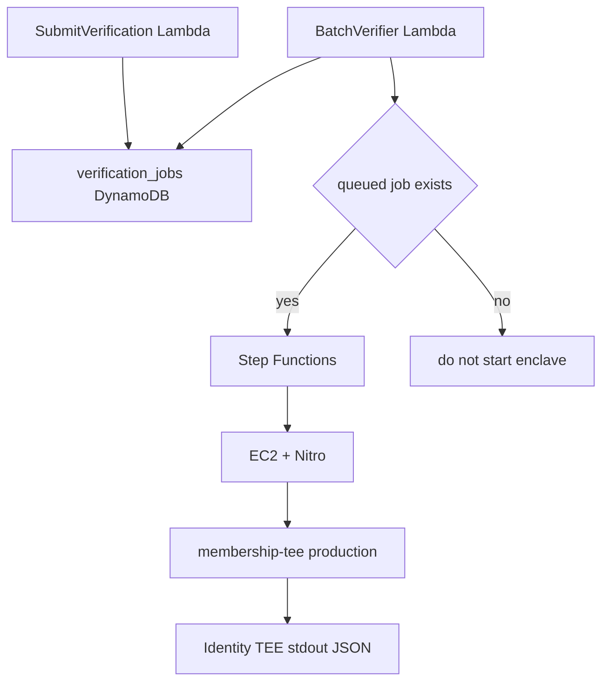

# Membership identity AWS runner 運用手順

この文書は、issue #74 step 6 の運用 runbook です。local artifact build から AWS deploy、World ID verification、Sui dry-run、Sui submit、post-tx membership pass state readback までの手順を扱います。

AWS credential、World ID app / proof input、Sui object ID、Sui submit signer material がない場合、この issue は close できません。不足がある場合は、該当 gate で止め、blocker を evidence template に記録してください。

Evidence template は `infra/aws/membership-identity-runner/evidence-template.md` です。

## Job モデル

Identity verification request は queued job として扱います。処理対象 job がない場合、EC2 + Nitro capacity は zero のままです。

```text
SubmitVerification Lambda -> verification_jobs DynamoDB -> BatchVerifier Lambda -> Step Functions -> EC2 + Nitro
```

この PR の dapp 連携範囲は、`SubmitVerification` に request を POST し、`verification_jobs.status=queued` の job を作るところまでです。`BatchVerifier` による TEE 実行、Sui dry-run / submit、MembershipPass readback は後続の運用 gate として扱います。



## 信頼境界

worker は request 作成と状態管理を担当します。worker は TEE stdout の意味を変えてはいけません。

TEE は検証、正規化、署名を担当します。TEE は stdin の `IdentityVerifyRequest` を検証し、stdout に status 付き JSON を 1 つ返します。

relayer は結果を配送するだけです。relayer は payload の意味を変更してはいけません。Move contract は署名済み verified payload だけを信頼します。

## 固定 TEE interface

AWS は次の command を呼び出します。

```bash
membership-tee production
```

AWS は stdin に `IdentityVerifyRequest` JSON value を 1 つ渡します。TEE は stdout に JSON value を 1 つ返します。この 1 request = 1 JSON in / 1 JSON out の contract は変えません。

devnet と testnet の smoke verification では、同じ `IdentityVerifyRequest.world_id` shape を保ちつつ fixture verifier を使う dummy-proof EIF を build します。

```bash
pnpm build:aws-membership-identity-eif -- --tee-mode fixture --world-id-status verified --world-app-id app_staging_dummy --out dist/aws/membership-identity-tee-dummy.eif
```

これは `SONARI_WORLD_ID_PROOF_MODE=dummy` かつ `RELAYER_NETWORK=devnet` または `RELAYER_NETWORK=testnet` の場合だけ使います。mainnet では real World ID proof を使った `membership-tee production` が必須です。

Status は次の値に固定します。

```text
verified
rejected
pending_source
unsupported
```

`pending_source` は earthquake verifier と同じ再試行用の語です。運用ツールは同じ語を見て retry や監視を組み立てられます。

AWS 境界 interface として固定する env は次の 3 つです。

```text
SONARI_TEE_SIGNING_KEY_SEED
SONARI_TEE_SIGNING_KEY_SEED_FILE
SONARI_WORLD_ID_API_BASE
```

`SONARI_WORLD_ID_APP_ID` は production runtime config です。AWS では deploy config から TEE process env に注入します。Signing seed は Lambda や EC2 host に平文で注入してはいけません。本番 signing material は暗号化し、KMS / Nitro attestation measurement を通してのみ decrypt します。

## 必須 artifact

deploy 前に次を build し、保持します。

- `dist/aws/membership-identity-tee-artifact.tar.gz`
- `dist/aws/membership-identity-tee-artifact.tar.gz.sha256`
- `dist/aws/membership-identity-tee.eif`
- `dist/aws/membership-identity-tee.eif.sha256`、または build / deploy system から取得した同等の EIF checksum
- `LambdaCodeS3Bucket` と `LambdaCodeS3Key` 用に S3 upload した Lambda code bundle
- `SigningSeedCiphertextS3Bucket` と `SigningSeedCiphertextS3Key` 用に S3 upload した encrypted signing material

Membership artifact は `scripts/build_aws_membership_identity_tee_artifact.ts` から build します。この script は earthquake 側の reference である `scripts/build_aws_earthquake_tee_artifact.ts` に従います。

```bash
pnpm build:aws-membership-identity-tee-artifact
pnpm build:aws-membership-identity-eif
sha256sum -c dist/aws/membership-identity-tee-artifact.tar.gz.sha256
```

Cargo manifest:

```text
nautilus/verifiers/membership/tee/Cargo.toml
```

Default target:

```text
x86_64-unknown-linux-musl
```

Artifact command:

```bash
bin/membership-tee production
```

Walrus CLI を含めません。membership TEE は Walrus を呼びません。stdin/stdout 契約は変えません。

## KMS / Nitro attestation measurement の取得

Stack parameter を deploy する前に、EIF identity を取得します。

- EIF identity
- ImageSha384
- PCR3

Target AMI 上で `nitro-cli build-enclave` output、または利用可能な Nitro CLI inspection command から measurement を取得します。CloudFormation template は次の条件で KMS decrypt を gate します。

```text
NitroEnclaveImageSha384
NitroEnclavePcr3
kms:RecipientAttestation:ImageSha384
kms:RecipientAttestation:PCR3
```

Placeholder measurement で deploy してはいけません。不一致は encrypted signing material の decrypt を防ぎ、fail-closed になる必要があります。

## 必須 operator input

### World ID app / proof input

mainnet live smoke では real World ID proof input を使います。

- `SONARI_WORLD_ID_APP_ID`
- `SONARI_WORLD_ID_API_BASE`: 通常は enclave path 内の vsock-proxy endpoint
- `world_id.world_app_id`
- `world_id.nullifier_hash`
- `world_id.merkle_root`
- `world_id.proof`
- `world_id.verification_level`
- `world_id.action`: 期待値は `sonari_membership_register_v1`
- `world_id.signal_hash`

request には `registry_id`、`membership_id`、`owner`、`terms_version`、`signed_statement_hash` も含める必要があります。
`registry_id` は stack の `SonariIdentityRegistryId` / Lambda env の `SONARI_IDENTITY_REGISTRY_ID` と一致する必要があります。
一致しない request は `verification_jobs` に保存せず、HTTP 400 で fail-closed します。

### dapp からの queue 投入

AWS stack は `SubmitVerificationFunctionUrlOutput` に dapp 用の POST endpoint を出力します。この endpoint は public Function URL です。`AuthType: NONE` のため、Lambda 側の schema validation、unknown field 拒否、`registry_id` 照合を fail-closed の入口防御として扱います。

dapp には次の build-time env を設定します。

```text
NEXT_PUBLIC_SONARI_IDENTITY_SUBMIT_URL=<SubmitVerificationFunctionUrlOutput>
NEXT_PUBLIC_SONARI_IDENTITY_REGISTRY_ID=<SonariIdentityRegistryId>
```

dapp は documented schema の field だけを送信します。private key、AWS secret、raw KYC image、raw document image は送信しません。`provider=kyc` の request では `world_id` field を省略します。

devnet / testnet の場合のみ、dummy proof mode で同じ field を持つ experimental value を使えます。`SONARI_WORLD_ID_PROOF_MODE=dummy` を設定してください。`RELAYER_NETWORK=mainnet` の場合、live gate はこの mode を拒否します。

### Stack parameter

AWS deployment には、少なくとも次の stack parameter が必要です。

- `VpcId`
- `SubnetIds`
- `InstanceType`
- `AmiId`
- `LambdaCodeS3Bucket`
- `LambdaCodeS3Key`
- `TeeArtifactS3Bucket`
- `TeeArtifactS3Key`
- `TeeArtifactSha256`
- `TeeEifS3Bucket`
- `TeeEifS3Key`
- `TeeEifSha256`
- `NitroEnclaveCpuCount`
- `NitroEnclaveMemoryMiB`
- `NitroEnclaveCid`
- `SigningSeedCiphertextS3Bucket`
- `SigningSeedCiphertextS3Key`
- `NitroEnclaveImageSha384`
- `NitroEnclavePcr3`
- `WorldIdAppId`
- `WorldIdApiBase`
- `ScheduleState`
- `GitCommitSha`

Launch template の user data は、AWS Nitro Enclaves allocator の `/etc/nitro_enclaves/allocator.yaml` を `NitroEnclaveCpuCount` / `NitroEnclaveMemoryMiB` に合わせて更新し、`nitro-enclaves-allocator.service` を restart します。`nitro-cli run-enclave --memory` より小さい hugepage 予約で instance を起動してはいけません。

### Sui object ID

Sui dry-run、Sui submit、post-tx membership pass state readback には次が必要です。

- `SONARI_IDENTITY_PACKAGE_ID`
- `SONARI_IDENTITY_PAUSE_STATE_ID`
- `SONARI_IDENTITY_REGISTRY_ID`
- `SONARI_MEMBERSHIP_REGISTRY_ID`
- `SONARI_VERIFIER_REGISTRY_ID`
- `SONARI_MEMBERSHIP_PASS_ID`
- `SONARI_SUI_CLOCK_ID`: default は `0x6`
- `RELAYER_NETWORK`: 例 `testnet`
- `RELAYER_GRPC_URL`
- `RELAYER_SENDER_ADDRESS`
- `RELAYER_MODE`: 最初は `dry_run`、次に `submit`
- `RELAYER_ALLOW_SUBMIT=true`: submit のみ
- `RELAYER_SIGNER_SECRET_ARN`: submit のみ

## 運用 runbook

### 1. Local unit test

Artifact を upload する前に local unit test を実行します。

```bash
pnpm exec vitest run scripts/membership_identity_aws_interface_doc.test.ts
pnpm exec vitest run scripts/aws_membership_identity_tee_artifact_build.test.ts scripts/aws_membership_identity_eif_build.test.ts scripts/aws_membership_identity_runner_template.test.ts
pnpm --filter @sonari/membership-verifier-runner test
cargo test -p membership-tee
```

Command、exit code、関連 log path を evidence template に記録します。

### 2. Artifact build、checksum、upload

tar と EIF を build し、tar checksum を検証し、必須 artifact を S3 に upload します。

```bash
pnpm build:aws-membership-identity-tee-artifact
pnpm build:aws-membership-identity-eif
sha256sum -c dist/aws/membership-identity-tee-artifact.tar.gz.sha256
```

tar artifact checksum、EIF checksum、EIF identity、ImageSha384、PCR3 を記録します。

### 3. AWS stack の deploy または update

Evidence file または secure parameter storage からすべての stack parameter を解決して deploy します。

```bash
aws cloudformation deploy \
  --template-file infra/aws/membership-identity-runner/template.yaml \
  --stack-name "$STACK_NAME" \
  --capabilities CAPABILITY_NAMED_IAM \
  --parameter-overrides \
    VpcId="$VPC_ID" \
    SubnetIds="$SUBNET_IDS" \
    AmiId="$AMI_ID" \
    LambdaCodeS3Bucket="$LAMBDA_CODE_S3_BUCKET" \
    LambdaCodeS3Key="$LAMBDA_CODE_S3_KEY" \
    TeeArtifactS3Bucket="$TEE_ARTIFACT_S3_BUCKET" \
    TeeArtifactS3Key="$TEE_ARTIFACT_S3_KEY" \
    TeeArtifactSha256="$TEE_ARTIFACT_SHA256" \
    TeeEifS3Bucket="$TEE_EIF_S3_BUCKET" \
    TeeEifS3Key="$TEE_EIF_S3_KEY" \
    TeeEifSha256="$TEE_EIF_SHA256" \
    SigningSeedCiphertextS3Bucket="$SIGNING_SEED_CIPHERTEXT_S3_BUCKET" \
    SigningSeedCiphertextS3Key="$SIGNING_SEED_CIPHERTEXT_S3_KEY" \
    NitroEnclaveImageSha384="$NITRO_ENCLAVE_IMAGE_SHA384" \
    NitroEnclavePcr3="$NITRO_ENCLAVE_PCR3" \
    WorldIdAppId="$SONARI_WORLD_ID_APP_ID" \
    WorldIdApiBase="$SONARI_WORLD_ID_API_BASE" \
    GitCommitSha="$(git rev-parse HEAD)"
```

### 4. AWS deployment smoke

Deploy 後、stack output を読み、private control plane が存在することを確認します。

```bash
aws cloudformation describe-stacks --stack-name "$STACK_NAME"
aws dynamodb describe-table --table-name "$VERIFICATION_JOBS_TABLE_NAME"
aws lambda get-function --function-name "$SUBMIT_VERIFICATION_LAMBDA_NAME"
aws lambda get-function --function-name "$BATCH_VERIFIER_LAMBDA_NAME"
aws stepfunctions describe-state-machine --state-machine-arn "$RUNNER_STATE_MACHINE_ARN"
```

Stack name、output name、smoke result を記録します。

### 5. Nitro Enclave start

Queued job を 1 つ trigger し、workflow が EC2 capacity を起動し、Nitro Enclave を起動し、完了または失敗後に capacity を zero に戻すことを確認します。

```bash
aws autoscaling describe-auto-scaling-groups \
  --auto-scaling-group-names "$RUNNER_AUTO_SCALING_GROUP_NAME"
aws stepfunctions list-executions \
  --state-machine-arn "$RUNNER_STATE_MACHINE_ARN" \
  --max-results 5
```

Instance 上では、runner command が設定済み CPU、memory、CID、EIF path で `nitro-cli run-enclave` を使います。

### 6. vsock-proxy World ID real API smoke

Real World ID request を submit し、enclave が vsock-proxy 経由でのみ World ID API に到達することを確認します。Proxy failure は fail-closed error または `pending_source` を返す必要があります。host 側で直接 proof を受け入れる fallback があってはいけません。

記録するもの:

- World ID app id
- redacted proof request id または job id
- TEE stdout status
- verified output の public key
- sanitized CloudWatch log location

### 7. Sui dry-run

最初に relayer mode を dry-run にします。

```bash
RELAYER_MODE=dry_run
```

Workflow を `dry_run_sui_submission` まで実行します。dry-run は、署名済み `payload_bcs_hex`、`signature`、`public_key` の意味を変えずに使う必要があります。

Dry-run result と effects を記録します。

### 8. Sui submit

Dry-run が成功し、signer secret が設定された後にだけ submit します。

```bash
RELAYER_MODE=submit
RELAYER_ALLOW_SUBMIT=true
RELAYER_SIGNER_SECRET_ARN="$RELAYER_SIGNER_SECRET_ARN"
```

Submit path は `accessor::update_identity_verification` を呼び、tx digest を保存します。tx digest を記録し、duplicate completion で上書きしてはいけません。

### 9. Post-tx membership pass state readback

Tx digest が finalized された後、同じ Sui network から `SONARI_MEMBERSHIP_PASS_ID` を読みます。Membership pass の identity verification field が submit した verified payload を反映していることを確認します。

記録するもの:

- membership pass object id
- identity verified flag
- provider mask または provider field
- verified / expires timestamp
- terms version
- signed statement hash

Issue #74 は、この readback が tx digest evidence と一致した後にだけ close できます。

## Evidence gate

Live run 中に `evidence-template.md` を埋めます。Close-out に必要な最小 evidence は次の通りです。

- stack name
- artifact checksum
- EIF identity
- ImageSha384
- PCR3
- public key
- tx digest
- post-tx readback

Credential がない場合、この issue は close できません。
