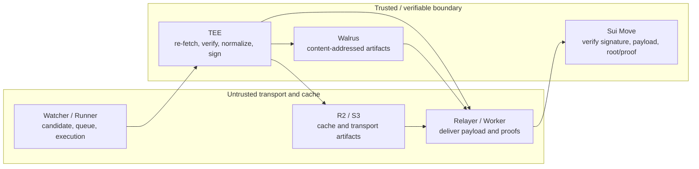
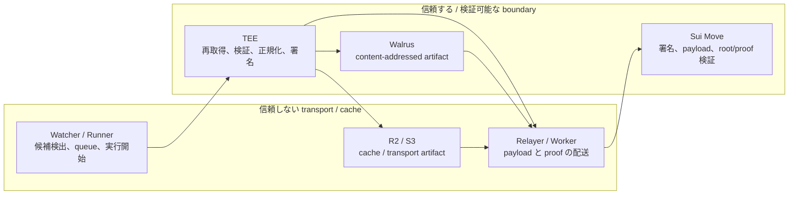

# Sonari Verifiers

Sonari verifiers turn real-world facts into signed data that Sui Move contracts can verify without trusting the off-chain path that delivered it.

For the MVP, the main verifier families are earthquake verification and identity verification. Earthquake verification re-fetches disaster data inside a TEE, normalizes it, builds affected-cell commitments, and signs a BCS payload. Identity verification verifies a provider proof, currently centered on World ID, and signs a verified identity result for Membership SBT state.

## What Sonari Verifiers Do

Sonari does not ask Sui contracts to trust a watcher, runner, relayer, frontend, database row, or mutable cache object. Those components can find candidates, queue work, start AWS/Nitro execution, cache artifacts, and deliver transactions, but they are not allowed to decide what a verified earthquake or identity result means.

The verifier flow is:

1. An untrusted off-chain component receives or detects a candidate.
2. A runner starts the verifier execution and passes a bounded request into a TEE.
3. The TEE re-fetches or re-checks the external source, validates the request, normalizes the result, builds contract-facing bytes, and signs only successful outputs.
4. A relayer or worker distributes the signed result and related proof artifacts.
5. Sui Move verifies the registered verifier configuration, enclave instance, signature, BCS payload, Merkle root/proof, and status before applying state.

The important property is that the final decision is replayable at the contract boundary. Delivery infrastructure can fail or be replaced, but it cannot forge a valid signed payload or make Move accept a mismatched proof.

## Core Trust Model

| Untrusted transport and cache | Trusted / verifiable boundary |
| --- | --- |
| Watcher, runner, relayer, frontend, Worker | TEE-signed payload bytes |
| DynamoDB, S3, R2, queue state | Registered verifier config and enclave public key |
| HTTP request bodies and workflow input | BCS field order, intent, version, and domain-specific constraints |
| USGS, World ID, and other external responses before re-checking | TEE-side source verification and normalized result |
| Proof distribution endpoints | Walrus content-addressed blob references, signed artifact hashes, Merkle root, and proof replay performed by verifier code or Move |

This is a fail-closed model. Invalid input, unknown fields, missing source data, unsupported provider state, signature mismatch, stale configuration, or root/proof mismatch must stop the flow rather than produce an accepted on-chain update.

The trust boundaries are intentionally separate:

- The earthquake verifier proves disaster event data and affected H3 cells.
- The identity verifier proves that a Membership SBT owner has a verified identity provider result.
- Residence or claim eligibility is not inferred from off-chain transport. It must be verified by the relevant signed result and Move path.

## Implemented Flows

### Earthquake Verification

The earthquake verifier takes a USGS event id as input. The watcher may use USGS summary data to find candidates, but finalization happens only after the TEE re-fetches the USGS detail GeoJSON and ShakeMap grid data.

Inside the TEE, the verifier:

- validates the source event and ShakeMap availability;
- converts ShakeMap MMI values into H3 resolution 7 cells;
- aggregates cell intensity deterministically and assigns affected cell bands;
- builds the affected-cells Merkle root as `affected_cells_root`;
- creates a canonical evidence manifest for source artifacts and generated affected cells;
- signs a 17-field earthquake BCS payload containing `evidence_manifest_uri`, `evidence_manifest_hash`, and `affected_cells_root`.

The evidence manifest points to archived source and generated artifacts. Walrus is used as content-addressed artifact storage: if served bytes are changed or mismatched, the blob reference and signed hash checks detect it. Walrus does not decide payload meaning, but its content-addressed references are part of the verifiable artifact boundary. The signed payload carries the manifest URI and hash, and Move verifies the contract-facing payload. Claim-time proof checks use `affected_cells_root`.

Only `finalized` earthquake outputs are eligible for Sui submission. `pending_source`, `pending_mmi`, `rejected`, `ignored_small`, and `failed` are off-chain states and are not submitted as accepted disaster events.

### Identity Verification

The identity verifier is the verifier family behind Membership SBT identity state. The directory is named `membership/`, but the verifier family and signing intent are `identity`.

The current MVP path is centered on World ID:

- a submit Lambda parses a verification request and stores it as a job;
- a runner claims due jobs and starts the shared AWS/Nitro workflow;
- the TEE server obtains attestation for an enclave-local ephemeral signing key;
- the TEE verifies the World ID proof against Sonari-specific app/action/signal constraints;
- only `verified` results are encoded as BCS bytes and signed;
- `rejected`, `pending_source`, and `unsupported` results do not include payload bytes or signatures;
- the runner can dry-run the Sui transaction, require a stored dry-run handoff before submit, submit only with explicit submit configuration, and read back `IdentityVerificationRecord` after successful submit when the chain read is available.

KYC is treated as a planned provider / future extension in this README. The contract-facing identity format reserves provider semantics, but the production-centered MVP documentation should not imply that KYC has the same implemented path as World ID.

### Proof Distribution and Sui Verification

Affected-cell proofs are distributed separately from the signed earthquake payload. The affected-cells proof Worker registers a Walrus `affected_cells` artifact, verifies its hash/root/schema, generates Merkle proof artifacts, stores them in R2, and serves per-cell proofs to frontends.

Worker, R2, and the frontend remain untrusted transport/cache layers. Walrus artifacts are content-addressed and therefore tamper-evident: mismatched bytes are detected by hash/root checks. The Worker performs integrity checks before returning a proof, but the security-critical check is still the root/proof replay against `affected_cells_root` in the verification path. A mismatched hash, root, schema, shard, leaf hash, or replay result fails closed.

For Sui submission, relayers are delivery components. Earthquake relayer modes support preview, dry-run, and explicit submit. Identity submission similarly requires dry-run handoff before submit and explicit submit configuration. Relayers must not reinterpret payload meaning; they only package signed bytes, signatures, public keys, and required object references for Move.

## Current MVP Status and Next Steps

Implemented MVP scope:

- Earthquake verifier for USGS detail GeoJSON and ShakeMap grid data.
- Earthquake signed payload with `evidence_manifest_uri`, `evidence_manifest_hash`, and `affected_cells_root`.
- Walrus archive references for earthquake evidence artifacts.
- Affected-cells proof registration and distribution Worker backed by R2.
- Identity verifier path centered on World ID verification.
- Shared runner contracts for earthquake and membership identity verifier kinds.
- Sui preview / dry-run / submit support where explicitly configured.

Next steps:

- Add or complete additional identity providers such as KYC as explicit provider implementations.
- Add more disaster types only after defining source policy, payload semantics, fixtures, and Move verification paths.
- Expand operational dashboards for pending, rejected, failed, finalized, and submitted states.
- Continue tightening golden vectors and cross-language tests for BCS payloads, signatures, Merkle roots, and proof artifacts.

## Where to Read More

- [earthquake/README.md](./earthquake/README.md): earthquake verifier responsibilities, AWS execution model, payloads, and security notes.
- [earthquake/shared/README.md](./earthquake/shared/README.md): earthquake signed payload, BCS layout, evidence manifest, and shared TypeScript contract.
- [earthquake/tee/README.md](./earthquake/tee/README.md): Rust TEE core, USGS / ShakeMap processing, fixture behavior, and golden checks.
- [earthquake/watcher/README.md](./earthquake/watcher/README.md): watcher state, runner workflow, SourceArchiver, and proof registration path.
- [earthquake/relayer/README.md](./earthquake/relayer/README.md): Sui preview, dry-run, and submit behavior for earthquake payloads.
- [membership/README.md](./membership/README.md): identity verifier overview, World ID / KYC direction, signed result format, and BCS layout.
- [membership/runner/README.md](./membership/runner/README.md): verification jobs, AWS workflow handoff, and Sui submission responsibilities.
- [membership/tee/README.md](./membership/tee/README.md): membership TEE server, World ID verification, signing behavior, and failure modes.
- [common/contracts/README.md](./common/contracts/README.md): shared runner contract, verifier kind parsing, and runner helper boundaries.
- [shared-tee/README.md](./shared-tee/README.md): shared TEE utilities for signing, hashing, seeds, and signature artifacts.
- [affected-cells-proof-worker/README.md](../../packages/affected-cells-proof-worker/README.md): affected-cells proof registration and distribution API.

---

# Sonari Verifiers（日本語）

Sonari verifiers は、現実世界の事実を、Sui Move コントラクトが検証できる署名済みデータへ変換する層です。Sui は、そのデータを届けた off-chain 経路そのものを信頼する必要がありません。

MVP の主な verifier family は、地震検証と identity 検証です。地震検証は TEE 内で災害データを再取得し、正規化し、affected cell の commitment を作り、BCS payload に署名します。Identity 検証は provider proof を検証し、現在は World ID を中心として、Membership SBT state 用の verified identity result に署名します。

## Sonari Verifiers が行うこと

Sonari は、watcher、runner、relayer、frontend、database row、mutable cache object を Sui コントラクトに信頼させません。これらの component は、候補検出、queue 投入、AWS / Nitro 実行開始、artifact cache、transaction 配送を担当できますが、検証済み地震や identity result の意味を決めてはいけません。

Verifier flow は次の通りです。

1. 信頼しない off-chain component が候補を受け取る、または検出する。
2. Runner が verifier execution を開始し、制限された request を TEE に渡す。
3. TEE が外部 source を再取得または再確認し、request を検証し、結果を正規化し、contract-facing bytes を作り、成功 output だけに署名する。
4. Relayer または Worker が、署名済み result と関連 proof artifact を配布する。
5. Sui Move が、登録済み verifier config、enclave instance、signature、BCS payload、Merkle root / proof、status を検証してから state を適用する。

重要な性質は、最終判断が contract boundary で再検証可能であることです。配送基盤は失敗しても交換されても構いませんが、有効な署名済み payload を偽造したり、不一致の proof を Move に受け入れさせたりすることはできません。

## コア信頼モデル

| 信頼しない transport / cache | 信頼する / 検証可能な boundary |
| --- | --- |
| Watcher、runner、relayer、frontend、Worker | TEE が署名した payload bytes |
| DynamoDB、S3、R2、queue state | 登録済み verifier config と enclave public key |
| HTTP request body と workflow input | BCS field order、intent、version、domain-specific constraint |
| 再確認前の USGS、World ID、その他外部 response | TEE 側の source verification と正規化済み result |
| Proof distribution endpoint | Walrus content-addressed blob reference、署名済み artifact hash、Verifier code または Move が行う Merkle root / proof replay |

これは fail-closed model です。不正 input、unknown field、source data 欠落、unsupported provider state、signature mismatch、stale configuration、root / proof mismatch は、受理される on-chain update ではなく停止として扱います。

信頼境界は意図的に分離しています。

- Earthquake verifier は disaster event data と affected H3 cell を証明する。
- Identity verifier は Membership SBT owner が verified identity provider result を持つことを証明する。
- Residence や claim eligibility は off-chain transport から推測しない。該当する署名済み result と Move path で検証する。

## 実装済みフロー

### 地震検証

Earthquake verifier は USGS event id を input とします。Watcher は候補検出に USGS summary data を使うことがありますが、finalization は TEE が USGS detail GeoJSON と ShakeMap grid data を再取得した後にだけ行います。

TEE 内で verifier は次を行います。

- source event と ShakeMap availability を検証する。
- ShakeMap MMI values を H3 resolution 7 cell に変換する。
- cell intensity を決定的に集約し、affected cell band を割り当てる。
- affected-cells Merkle root を `affected_cells_root` として作る。
- source artifact と生成された affected cells の canonical evidence manifest を作る。
- `evidence_manifest_uri`、`evidence_manifest_hash`、`affected_cells_root` を含む 17-field earthquake BCS payload に署名する。

Evidence manifest は、archive 済み source と生成 artifact を指します。Walrus は content-addressed artifact storage として使います。返された bytes が書き換えられていたり参照と一致しなかったりする場合は、blob reference と署名済み hash check で検知できます。Walrus が payload の意味を決めるわけではありませんが、content-addressed reference は検証可能な artifact boundary の一部です。署名済み payload は manifest URI と hash を持ち、Move は contract-facing payload を検証します。Claim 時の proof check は `affected_cells_root` を使います。

Sui submission の対象になる earthquake output は `finalized` だけです。`pending_source`、`pending_mmi`、`rejected`、`ignored_small`、`failed` は off-chain state であり、受理済み disaster event としては submit しません。

### Identity 検証

Identity verifier は Membership SBT identity state の背後にある verifier family です。Directory 名は `membership/` ですが、verifier family と signing intent は `identity` です。

現在の MVP path は World ID を中心にしています。

- submit Lambda が verification request を parse し、job として保存する。
- runner が due job を claim し、shared AWS / Nitro workflow を開始する。
- TEE server が enclave-local ephemeral signing key の attestation を取得する。
- TEE が Sonari 固有の app / action / signal constraint に照らして World ID proof を検証する。
- `verified` result だけを BCS bytes に encode して署名する。
- `rejected`、`pending_source`、`unsupported` result には payload bytes や signature を含めない。
- runner は Sui transaction を dry-run し、submit 前に保存済み dry-run handoff を要求し、明示的な submit 設定がある場合だけ submit し、chain read が利用できる場合は submit 成功後に `IdentityVerificationRecord` を read back できる。

この README では、KYC は planned provider / future extension として扱います。Contract-facing identity format は provider semantics を予約していますが、production-centered MVP documentation では、KYC が World ID と同じ実装済み path を持つとは書きません。

### Proof 配布と Sui 検証

Affected-cell proof は、署名済み earthquake payload とは別に配布します。Affected-cells proof Worker は Walrus の `affected_cells` artifact を登録し、hash / root / schema を検証し、Merkle proof artifact を生成し、R2 に保存し、frontend に per-cell proof を返します。

Worker、R2、frontend は引き続き信頼しない transport / cache layer です。Walrus artifact は content-addressed なので tamper-evident であり、bytes の不一致は hash / root check で検知できます。Worker は proof を返す前に integrity check を行いますが、security-critical な check は verification path で `affected_cells_root` に対して root / proof replay を行うことです。Hash、root、schema、shard、leaf hash、replay result の不一致は fail-closed になります。

Sui submission において、relayer は配送 component です。Earthquake relayer mode は preview、dry-run、明示的 submit を support します。Identity submission も submit 前に dry-run handoff を要求し、明示的な submit 設定を必要とします。Relayer は payload の意味を再解釈せず、署名済み bytes、signature、public key、必要な object reference を Move 用に package するだけです。

## 現在の MVP 状態と次の作業

実装済み MVP scope:

- USGS detail GeoJSON と ShakeMap grid data を対象にした earthquake verifier。
- `evidence_manifest_uri`、`evidence_manifest_hash`、`affected_cells_root` を含む earthquake signed payload。
- Earthquake evidence artifact の Walrus archive reference。
- R2 を使う affected-cells proof registration / distribution Worker。
- World ID verification を中心にした identity verifier path。
- Earthquake と membership identity verifier kind の shared runner contract。
- 明示設定時の Sui preview / dry-run / submit support。

Next steps:

- KYC などの追加 identity provider を明示的な provider implementation として追加または完了する。
- 追加 disaster type は、source policy、payload semantics、fixture、Move verification path を定義してから追加する。
- pending、rejected、failed、finalized、submitted state の operational dashboard を拡充する。
- BCS payload、signature、Merkle root、proof artifact の golden vector と cross-language test を継続して強化する。

## 詳細資料

- [earthquake/README.md](./earthquake/README.md): earthquake verifier の責務、AWS 実行モデル、payload、security notes。
- [earthquake/shared/README.md](./earthquake/shared/README.md): earthquake signed payload、BCS layout、evidence manifest、shared TypeScript contract。
- [earthquake/tee/README.md](./earthquake/tee/README.md): Rust TEE core、USGS / ShakeMap processing、fixture behavior、golden checks。
- [earthquake/watcher/README.md](./earthquake/watcher/README.md): watcher state、runner workflow、SourceArchiver、proof registration path。
- [earthquake/relayer/README.md](./earthquake/relayer/README.md): earthquake payload の Sui preview、dry-run、submit behavior。
- [membership/README.md](./membership/README.md): identity verifier overview、World ID / KYC direction、signed result format、BCS layout。
- [membership/runner/README.md](./membership/runner/README.md): verification job、AWS workflow handoff、Sui submission responsibilities。
- [membership/tee/README.md](./membership/tee/README.md): membership TEE server、World ID verification、signing behavior、failure modes。
- [common/contracts/README.md](./common/contracts/README.md): shared runner contract、verifier kind parsing、runner helper boundaries。
- [shared-tee/README.md](./shared-tee/README.md): signing、hashing、seed、signature artifact 用の shared TEE utility。
- [affected-cells-proof-worker/README.md](../../packages/affected-cells-proof-worker/README.md): affected-cells proof registration / distribution API。
