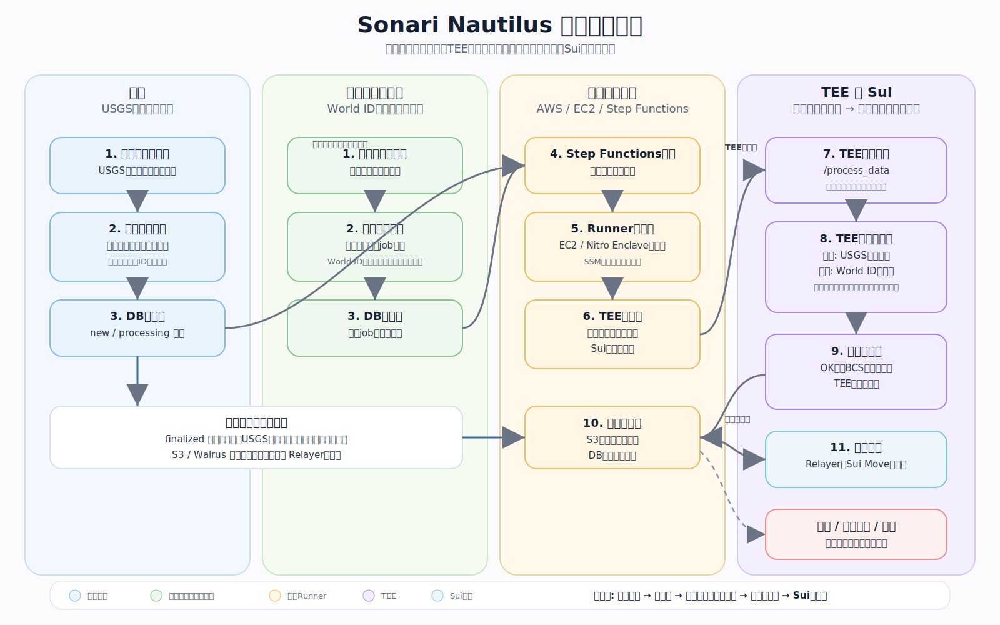
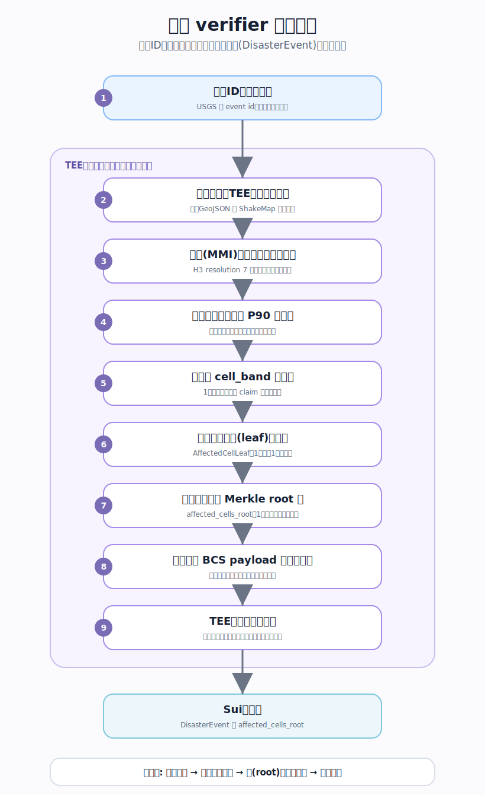
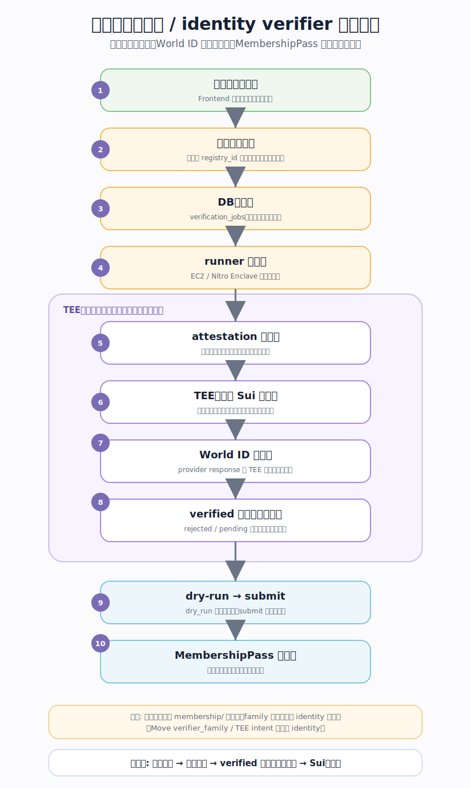
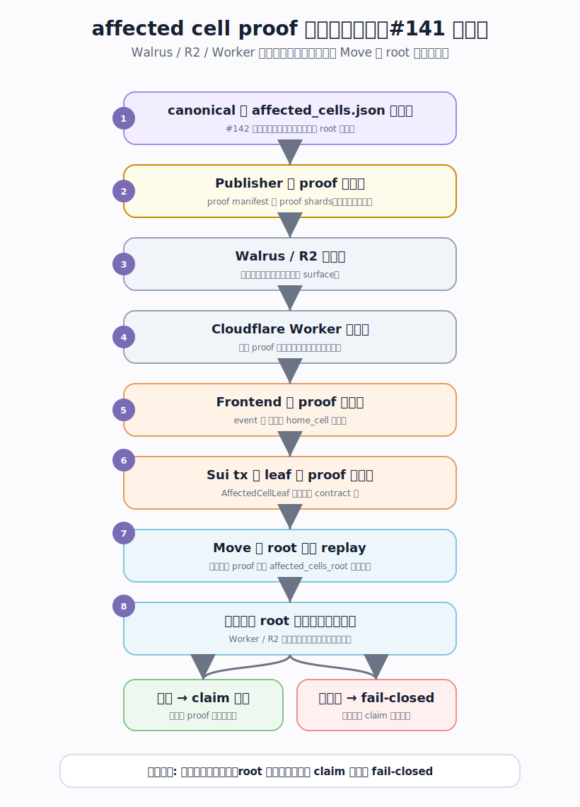

# Sonari Verifiers

`nautilus/verifiers` は、**外の世界のできごとを確かめて、Sui のスマートコントラクトが「これは本物だ」と検証できる “署名済みデータ” に変える**ところです。

やさしく言うと、「外から来た情報を鵜呑みにせず、安全な箱(TEE)の中で確かめ直して、改ざんできない形にしてからブロックチェーンへ渡す」しくみです。

> 専門用語（TEE / attestation / Merkle root など）は[用語ミニ辞典](#用語ミニ辞典)に1行ずつまとめています。初めて読む人はそこを先に開いておくと楽です。

## ぜんたいの流れ（5ステップ）

1. **見つける / 受け取る** — 地震なら USGS の地震一覧から候補を拾い、メンバーシップなら利用者の申請を受け取ります。
2. **並べる** — 候補や申請を DB に保存し、共通ランナー(AWS / EC2 / Step Functions)が順番に処理を始めます。
3. **安全な箱で確かめる** — TEE(中の処理を外から覗いたり書き換えたりできない “安全な箱”)の中で、元データを取り直して検証し、契約用のデータに整えます。
4. **サインする** — 検証に通ったものだけ、TEE の鍵で署名します。これで中身を後から差し替えられなくなります。
5. **Sui に保存する** — relayer が署名済みデータを Sui へ運び、Move コントラクトが署名と中身を検証してから記録します。

大事なのは、途中の配送や保存が壊れても、**最後の正しさは Move コントラクトが署名と中身で確かめ直す**ことです。

## 何を信じて、何を信じないか

verifier の考え方の中心は「信頼できないものを、信頼できる形に変える」ことです。だから登場人物を、最初から2種類に分けて扱います。

| 信じない（untrusted） | 信じる（trusted） |
| --- | --- |
| watcher / runner / relayer | TEE の鍵で署名された payload |
| frontend からの入力 | 登録済みの verifier 設定 / enclave instance |
| 外部 API のレスポンス（USGS / World ID など） | Merkle root と、それを検証できる proof |
| S3 / Walrus / R2 / Worker などの保存・配布 | Move が再検証できる値（署名・intent・field order など） |

- 左側（untrusted）は、候補を見つける・queue に入れる・状態を保存する・実行を起動する・配送する、といった「運ぶ・並べる」役です。中身の正しさは保証しません。
- 右側（trusted）は、TEE の中で作られて署名された結果と、Move が自分で検証し直せる値だけです。
- relayer は署名済みデータを運ぶだけで、中身の意味は変えません。

（この2分割は上の全体像の図に描き込んであるので、ここでは図は省きます。）

## フォルダの地図

| フォルダ | なにが入っているか |
| --- | --- |
| `common/` | verifier 共通で使う TypeScript の取り決め(型・契約)と、ランナー用の補助コード |
| `earthquake/` | USGS の地震データを確かめて、災害イベントと「揺れた地域(affected cells)」のデータを作る verifier |
| `membership/` | 本人確認(identity)を確かめて、Membership SBT 用のデータを作る verifier。※フォルダ名は `membership/` ですが family の正式名は `identity` |
| `shared-tee/` | Rust の TEE crate で共通して使う、署名・hash・seed・artifact・attestation / server まわりの部品 |

## 用語ミニ辞典

このあとの説明で出てくる言葉を、先に1行ずつ。

- **TEE** … Trusted Execution Environment。中の処理を外から覗いたり書き換えたりできない “安全な箱”。ここで作った結果だけを信用します。
- **Nitro Enclave** … AWS が提供する TEE の実装。EC2 から切り離された隔離環境で処理を走らせます。
- **attestation** … 「この処理は本物の安全な箱の中で動いている」ことを証明する文書。enclave の公開鍵と一緒に出てきます。
- **BCS payload** … Sui が読むために、データを “決まった並び順” のバイト列で表したもの。並び順が1バイトでも違うと別物になります。
- **Merkle root / proof** … たくさんのデータを1個の代表ハッシュ(root)にまとめたもの。root と proof(経路)があれば「ある要素が確かに含まれていた」ことを後から検証できます。
- **intent** … 署名が「どの用途のためのものか」を区別する印(domain separation)。別用途の署名を流用されないようにします。
- **config_key** … on-chain の `VerifierRegistry` で各 verifier 設定を指す番号。verifier ごとに固有です。
- **relayer** … 署名済みデータを Sui へ送るだけの配送役。中身は変えません。

## 共通の処理ライフサイクル

verifier の種類が違っても、Nautilus 由来の実行手順は同じです。ランナーと安全な箱(enclave)の間で、だいたい次の順に進みます。

1. **health_check** — 箱の準備ができているか確認する。
2. **get_attestation** — 箱から attestation 文書と公開鍵を受け取る。
3. **register** — その公開鍵を Sui の `VerifierRegistry` に登録する(この鍵の署名だけ信用する設定にする)。
4. **process_data** — 箱の中で元データを取得・検証・正規化し、BCS payload を作る。
5. **sign** — 検証に通ったものだけ、箱の鍵で署名する。
6. **relay** — relayer が署名済み結果を Move へ運び、Move が設定・enclave・署名を検証する。

> **注意:** `get_attestation` と `process_data` は、必ず同じ enclave instance の鍵を使います。ホスト側が用意した固定 seed・debug 鍵・偽の attestation 文書で代用してはいけません。

新しい verifier を共通基盤に載せるときの North Star(目指す形)は、**verifier 固有の実装を `sonari-tee-core::ProcessDataHandler` 1つに集める**ことです。handler はドメインのロジックだけを担当し、署名・attestation・一時鍵・登録メタデータ・VSOCK / HTTP の入出力は共通基盤に任せます。

## 地震 verifier の流れ

地震 verifier は、USGS の詳細 GeoJSON と ShakeMap グリッドを **TEE の中で取り直し**、claim(被災の申請)の対象になる「揺れた H3 セル」を作ります。

ざっくり言うと、地震ID を入口に、揺れ(MMI)を地図のマス(H3 セル)単位に集約し、セルごとの代表値で「どれくらい揺れたか(cell_band)」を決め、対象セルを1個の `affected_cells_root` にまとめて署名する、という流れです。

地震 verifier は、個人の住所・学生情報・電話番号・GPS・本人確認書類などは扱いません。住んでいる場所の資格(residence eligibility)やメンバーシップは、identity family と Move 側の別の責務です。

いまの地震 verifier の状態(status)は次の通りです。Sui に投稿されるのは `finalized` だけです。

| status | 意味 | Sui 投稿 |
| --- | --- | --- |
| `pending_source` | 詳細 / ShakeMap の元データがまだ揃っていない | しない |
| `pending_mmi` | 元データはあるが MMI グリッドがまだ使えない | しない |
| `rejected` | 元データは検証できたが対象外 | しない |
| `ignored_small` | watcher の summary screening で閾値未満 | しない |
| `failed` | 実行や環境の失敗 | しない |
| `finalized` | affected cells root と署名済み payload ができた | する |

## メンバーシップ / identity verifier の流れ

identity verifier は、Membership SBT の本人確認結果を作る verifier family です。

申請を受け取り、入力をチェックして DB に保存し、runner を起動して安全な箱(enclave)を用意します。箱の中で attestation を取り、Sui に鍵を登録してから、World ID などの本人確認(provider response)を検証します。

> **名前の注意:** ディレクトリ名は `membership/` ですが、verifier family の正式名は `identity` です(Move `verifier_family` / TEE `VERIFIER_FAMILY` / intent ともに `identity`)。この文書では、family を指すときは `identity`、SBT / runner の crate を指すときは `membership` と書き分けます。

MVP の provider は `world_id` と `kyc` です。いまの中心は World ID で、KYC は provider family として想定しています。

identity verifier の大事な境界は次のとおりです。

- `verified` のときだけ、payload の BCS bytes と署名を返します。`rejected` / `pending_source` / `unsupported` には署名を付けません。
- production では、リクエスト由来の `issued_at_ms` / `validity_ms` を信用せず、TEE 側の時刻と既定の TTL を使います。
- `registry_id` / `membership_id` / `owner` / provider proof などの入力は、境界で検証します。
- relayer は `accessor::update_identity_verification` を呼ぶだけで、payload の意味は変えません。

## これから作る・直すところ（#142 / #141 / #143）

この節は open issue を正として、いま実装中・予定の変更を「いまの課題 → どう直すか」で短くまとめます。細かい field order より、「何を達成するか」を中心にしています。

### #142: DisasterEvent payload を evidence manifest 中心に整理する

- **いまの課題:** production の finalized payload / Object に、取得できない placeholder の URI が残っている。
- **どう直すか:** Walrus 上の `evidence_manifest` 参照に寄せる。payload / Object は `evidence_manifest_uri`(= `walrus://blob/<manifest_blob_id>`)と `evidence_manifest_hash` を持ち、`affected_cells_root` は claim proof 検証用に残す。元データ・`affected_cells.json`・`evidence_manifest.json` の保存は SourceArchiver が担当し、期待 blob id と実際の blob id が一致しなければ relayer の submit に進みません(fail-closed)。

### #141: affected cells proof の配布フローを設計する

claim には「自分の住むセルが `affected_cells_root` に含まれている」ことを示す proof が必要です。`#141` は、その proof をどこに保存し、どう配るかを整理する後続 issue です。

- **いまの課題:** proof の置き場所・配布方法がまだ決まっていない。
- **どう直すか:** Publisher が proof manifest / shards を作り、Walrus / R2 / Worker から配る。ただし **Worker / R2 / Walrus は信頼しません。** Frontend が取得した leaf + proof を Sui tx に渡し、Move が `affected_cells_root` まで replay して一致を確認します。合わなければ claim は fail-closed です。`#141` は `#142` の後続で、`evidence_manifest` と canonical な affected cells artifact が確定するまで、proof manifest schema / R2 key / Worker API は確定しません。

### #143: MembershipPass 登録を AWS から Sui まで一気通貫にする

- **いまの課題:** frontend の本人確認リクエストから、Sui testnet の `MembershipPass` 更新までが繋がっていない。
- **どう直すか:** request schema を固定し、`registry_id` が AWS 設定の `SONARI_IDENTITY_REGISTRY_ID` と一致しなければ拒否する。Membership runner workflow に attestation・enclave 登録・TEE 処理・dry-run・submit を接続する。`IdentityRelayerMode=dry_run` は本番送信せず terminal 状態にし、`submit` は dry-run 成功後だけ送信して `tx_digest` を保存する。submit 後は MembershipPass を読み戻して、identity verification field の更新を確認する。

## 開発者向けリファレンス（くわしい人向け）

ここから下は、新しい verifier を足す人・契約値を触る人向けの詳しい資料です。

### family の信頼境界の違い

`earthquake` と `membership`(identity family)は **別の信頼境界**です。地震 verifier は災害イベントと affected cells を、identity verifier は本人確認・居住セル・将来の属性検証を扱います。両者の payload・source・rejection rule・署名鍵・on-chain apply path は混ぜません。

### 採番表（family / config_key / attestation label / intent）

採番は **この1箇所に集約**します。コード側の正本は `sonari-tee-core` の `registry` module(`shared-tee/src/registry.rs`)で、その uniqueness テストが `config_key` と attestation label の重複を防ぎます。この表は registry の値をミラーするだけで、別の場所に二重定義を増やしません。

| verifier | family (u8) | config_key (u64) | attestation public-key label | intent |
| --- | --- | --- | --- | --- |
| earthquake | 3 | 1 | `sonari-earthquake-attestation-public-key` | u8 enum tag `1`（`SONARI_EARTHQUAKE_ORACLE`、BCS payload 先頭の `u8`） |
| identity (membership) | 4 | 2 | `sonari-membership-attestation-public-key` | UTF-8 string `SONARI_IDENTITY_VERIFICATION_V1`（BCS payload 先頭の intent 文字列） |

- `family`(u8) は Move `metadata_verifier`(`contracts/sources/metadata_verifier.move`)の `verifier_family` と一致させます(earthquake oracle = 3, identity = 4)。
- `config_key`(u64) は on-chain `VerifierRegistry` の config key です。
- attestation label は、enclave が attestation public key を導出するために署名する byte string で、`sonari-tee-core::registry` の `*_ATTESTATION_PUBLIC_KEY_LABEL` 定数が正本です。
- intent は署名対象 payload の domain separation marker です。2 family で表現が構造的に異なる(earthquake は BCS 先頭の `u8` enum tag、identity は BCS 先頭の UTF-8 文字列)ので、registry の `VerifierIntent` enum がその形まで記録します。

### config_key 採番規約

`config_key` は verifier ごとに **+1 ずつ採番し、再利用しません**。earthquake = 1, identity = 2, **次の verifier は 3 を予約**します(`sonari-tee-core::registry::NEXT_VERIFIER_CONFIG_KEY`)。新しい verifier を足すときは registry に1行追加し、`NEXT_VERIFIER_CONFIG_KEY` を次の値へ更新し、上の採番表に1行足します。

### 新 verifier 追加チェックリスト

共有 EC2 / Nitro 基盤に新しい verifier を載せるときに足すもの一覧です。verifier 固有ロジックは TEE handler 1つに収め、残りは共通基盤の設定追加で済むことを意図しています。

- [ ] **採番**: 上の採番表に1行追加し、`sonari-tee-core::registry` に entry を追加(`config_key` は `NEXT_VERIFIER_CONFIG_KEY`、`NEXT_VERIFIER_CONFIG_KEY` を +1)。uniqueness テストが green であること。
- [ ] **Move**(`contracts/sources/metadata_verifier.move` ほか): `verifier_family` 定数、`*_CONFIG_KEY`、config 登録関数(`create_*_verifier_config` / `update_*_verifier_config_pcrs`)、admin 入口(`contracts/sources/admin.move`)、署名検証 / apply path(payload module と `verify_*`)。#127 の family-generic 化に倣う。
- [ ] **verifier_kind 定義**(`nautilus/verifiers/common/contracts/src/index.ts` の `VERIFIER_KINDS` / `parseVerifierKind`、`scripts/build_aws_sonari_verifier_runner_lambda.ts` の分岐)に新 kind を追加。
- [ ] **TEE handler crate**(`nautilus/verifiers/<name>/tee/`): `ProcessDataHandler` 実装を1つ書く(domain logic のみ。署名・attestation・I/O は書かない)。`main.rs` は shared server へ handler と attestation label / orchestration 設定を渡すだけ。
- [ ] **runner**(`nautilus/verifiers/<name>/runner/` または watcher、`infra/aws/<name>-runner/`): 候補検出・queue・実行起動・配送。
- [ ] **build script**(`scripts/build_aws_*` と `package.json` の `build:aws-*-tee-artifact` / `build:aws-*-eif` script)に新 verifier の artifact / EIF build を追加。
- [ ] **CFn parameter**(`infra/aws/<name>-runner/template.yaml`、共有なら `infra/aws/sonari-verifier-runner/template.yaml`)に verifier 固有 parameter を追加。
- [ ] **GitHub Actions step**(`.github/workflows/aws-sonari-verifier-runner-dev-deploy.yml`)に TEE artifact / EIF build・PCR 読み取り・artifact upload の step を追加。
- [ ] **admin tx 手順**(`infra/README.md`)に新 verifier config の登録(PCR0/1/2 を `VerifierRegistry` に登録する admin tx)手順を追記。
- [ ] **テスト / golden vector**: BCS payload・field order・enum 値・golden vector を Rust / TypeScript / Move 横断で更新。

### 変更時の注意

BCS payload・field order・enum 値・署名対象 bytes・Merkle root・golden vector は、Rust / TypeScript / Move をまたぐ契約です。変更するときは、schema または docs、fixture / golden vector、Rust / TypeScript / Move のテストを一緒に更新してください。

通常の実装確認は、変更した package の test から始め、影響範囲に応じて root の check / test まで広げます。
