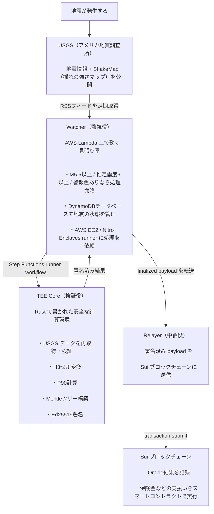
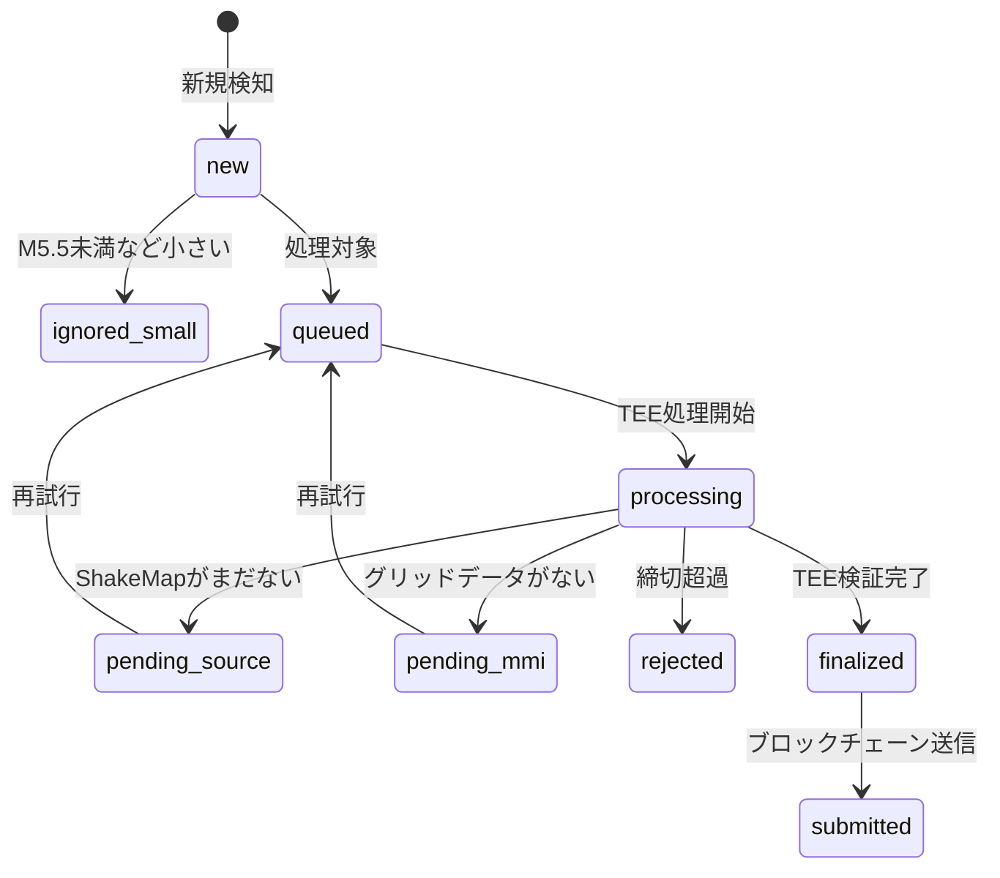

# Disaster Oracle — システム全体ガイド

地震が起きたとき、「本当に被害があったか」をコンピュータが自動で確認し、保険金などの支払いをブロックチェーン上で実行する仕組みです。

---

## なぜこのシステムが必要か

従来の地震保険は、担当者が現地を調査して被害を確認するため、支払いまでに数週間〜数ヶ月かかります。このシステムは：

- **USGS**（アメリカ地質調査所）の公開地震データを自動取得
- **TEE**（改ざんが証明できる安全な計算環境）でデータを検証・計算
- **SUIブロックチェーン**に結果を記録

することで、数時間以内に支払いの根拠となる「Oracle結果」を生成します。

---

## 全体フロー



---

## 状態遷移

地震イベントは以下の状態を通って処理されます：



> `failed` はシステムエラー（AWS起動失敗など）で、再試行可能な状態です。

---

## 各コンポーネントの役割

### [shared/](./shared/) — 共通ルール定義
TypeScript と Rust の両方で使う型・定数・バリデーション関数を管理します。ペイロードの26フィールド定義、エラーコード一覧などがここにあります。

### [tee/](./tee/) — TEE Core（Rust）
地震データの検証と Oracle ペイロードの計算を行います。改ざん防止が証明できる TEE 環境で実行され、Ed25519 署名で結果の真正性を保証します。

### [runner/](./runner/) — AWS Runner Host（TypeScript）
EC2 上で SSM runner workflow を公開し、Step Functions からの SSM command と relayer preview/dry-run を受けます。`process` は Nitro Enclave 側の production TEE entrypoint に `DisasterVerifierRequest` を渡します。

### [watcher/](./watcher/) — 監視 & オーケストレーション（TypeScript）
AWS Lambda 上で動く監視システム。地震を検知し、TEE Core への処理依頼・結果の記録・Relayer への転送を管理します。

### [relayer/](./relayer/) — ブロックチェーン中継（TypeScript）
TEE の署名済み結果を SUI ブロックチェーンのスマートコントラクトに送信します。

### [fixtures/](./fixtures/) — テストデータ
TEE Core の正確性を検証するための入力データと期待結果を管理します。

---

## 用語集

| 用語 | 意味 |
|---|---|
| **USGS** | アメリカ地質調査所。地震データの公開元 |
| **ShakeMap** | 地震の揺れの強さを地図上に表したもの（USGS提供） |
| **MMI** | 修正メルカリ震度（Modified Mercalli Intensity）。揺れの強さの国際的な尺度 |
| **H3セル** | 地球の表面を六角形のタイルで区切った単位。Uber社が開発 |
| **TEE** | Trusted Execution Environment。外部から内容を見えなくしたまま計算できる安全な環境 |
| **Merkleツリー** | 大量のデータを木のような構造でまとめ、改ざんを効率的に検出できる仕組み |
| **BCS** | Binary Canonical Serialization。SUIブロックチェーンで使うバイト列変換形式 |
| **Ed25519** | 電子署名のアルゴリズム。計算機が「この結果は私が出した」と証明するために使う |
| **SUI** | 高速なブロックチェーンプラットフォーム |
| **Oracle** | ブロックチェーン外のデータ（地震情報など）をブロックチェーン上に届ける仕組み |
| **P90** | 90パーセンタイル。100個のデータを小さい順に並べたとき90番目の値 |

---

## ディレクトリ構成

```
disaster/
├── README.md             ← このファイル
├── shared/               ← 共通型定義・定数・バリデーション
│   ├── README.md
│   └── src/index.ts
├── tee/                  ← Rust製 Oracle Core（TEE環境で動く）
│   ├── README.md
│   └── src/
├── watcher/              ← AWS Lambda 監視システム
│   ├── README.md
│   └── src/
├── runner/               ← AWS EC2 / Nitro Enclaves host runner
│   ├── package.json
│   └── src/
├── relayer/              ← SUI ブロックチェーン中継
│   ├── README.md
│   └── src/
└── fixtures/             ← テストデータ
    ├── README.md
    └── usgs/
```
