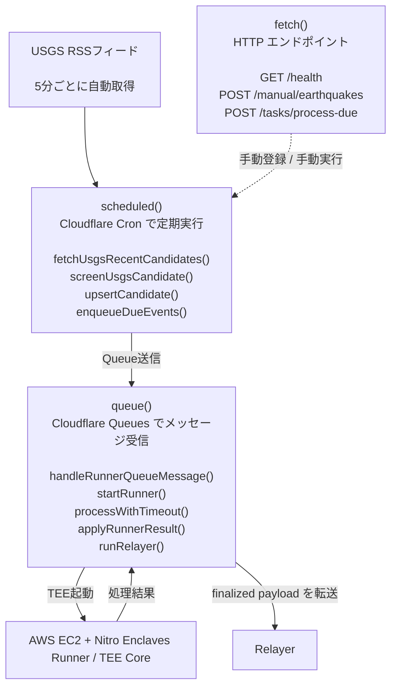
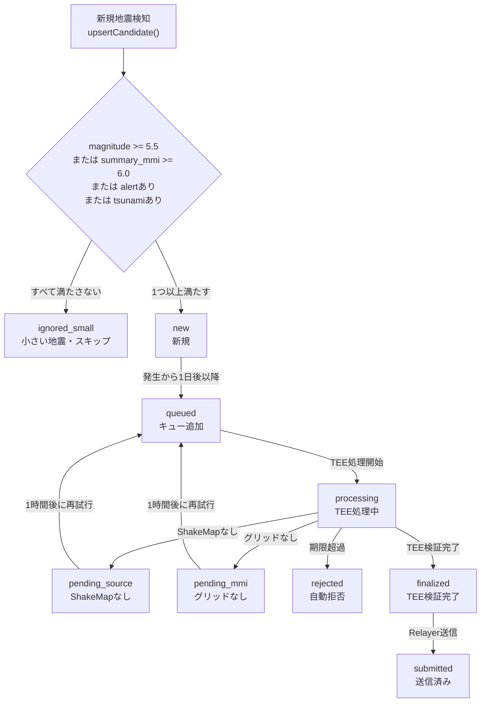
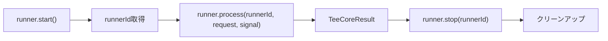

# Watcher — 地震監視 & オーケストレーター

地震を「見張り」し、TEE Core（検証エンジン）への処理依頼・結果管理・Relayer への転送を担う Cloudflare Workers アプリケーションです。

---

## Cloudflare Workers とは

Cloudflare Workers は、世界中のサーバーで同時に動く軽量なプログラムです。定期実行（cron）、HTTP リクエスト処理、キュー処理の3つの動作モードがあり、このシステムで活用しています。

---

## アーキテクチャ図



---

## D1 データベーススキーマ

Cloudflare D1（SQLite互換）に地震イベントの状態を保存します。

主なカラム（`EarthquakeEventRow`）：

| カラム | 型 | 意味 |
|---|---|---|
| `source_event_id` | string | USGSのイベントID（例: us7000abc1） |
| `status` | OffchainStatus | 現在の処理状態 |
| `occurred_at_ms` | number | 地震発生時刻（ミリ秒） |
| `source_updated_at_ms` | number | USGSデータ更新時刻 |
| `finalization_deadline_at_ms` | number | 処理期限（発生から7日後など） |
| `magnitude` | number\|null | マグニチュード |
| `summary_mmi` | number\|null | 推定最大MMI |
| `alert` | string\|null | 警報レベル（green/yellow/orange/red） |
| `runner_job_id` | string\|null | TEE処理ジョブID |
| `runner_attempt` | number | 試行回数 |
| `retry_count` | number | リトライ回数 |
| `next_retry_at_ms` | number\|null | 次回試行時刻 |

---

## 状態遷移（詳細版）



---

## スクリーニング条件（screening.ts）

以下のいずれか1つでも満たせば処理対象になります：

```typescript
WATCHER_MIN_MAGNITUDE = 5.5    // マグニチュード5.5以上
WATCHER_MIN_SUMMARY_MMI = 6.0  // 推定震度6.0以上
WATCHER_ALERT_LEVELS = ["yellow", "orange", "red"]  // 警報色あり
candidate.tsunami = true        // 津波警報あり
```

満たさない場合は `ignored_small` として記録されます（削除ではなくDBに残る）。

---

## 各モジュールの解説

### `usgs.ts` — USGS RSSフィード取得

- `fetchUsgsRecentCandidates(fetcher)` → USGS の Recent Earthquakes フィードから地震リストを取得
- `parseUsgsRecentFeed(text)` → フィードをパースして `UsgsEarthquakeCandidate[]` を返す
- `USGS_RECENT_FEED_URL` → フィードのURL定数

### `screening.ts` — スクリーニング

- `screenUsgsCandidate(candidate)` → 処理対象かどうか判定
  - 戻り値: `{ runnerEligible: boolean, status: "new" | "ignored_small", error_code: ... }`

### `state.ts` — データベース操作（StateRepository）

`D1StateRepository` が Cloudflare D1 の実装、`InMemoryStateRepository` がテスト用です。

主要メソッド：

| メソッド | 用途 |
|---|---|
| `upsertCandidate(candidate, nowMs, options)` | 地震を登録または更新 |
| `listDue(nowMs, limit)` | 処理期限が来たイベントを取得 |
| `enqueueRunnerJob(...)` | TEEジョブをキューに追加 |
| `claimQueuedForProcessing(job, ...)` | 処理中としてマーク |
| `applyRunnerResult(id, result, nowMs)` | TEE結果を反映 |
| `markRejected(id, errorCode, nowMs)` | 拒否としてマーク |
| `markFailed(id, errorCode, nowMs, retryAt)` | 失敗としてマーク（再試行あり） |
| `recoverStaleProcessing(...)` | タイムアウトした処理中を回復 |
| `markRelayerSucceeded(id, result, nowMs)` | Relayer成功を記録 |

### `trigger_tee.ts` — Runner（TEE）制御

Runner backend は `RUNNER_MODE` で必ず明示します。未設定の場合は production 安全側として fail-closed します。

3種類のアダプタがあります：

| アダプタ | 用途 |
|---|---|
| `AwsRunnerLifecycleAdapter` | 本番用。AWS runner service の `start/process/stop` contract を呼ぶ |
| `HttpRunnerAdapter` | サイドカーURL経由でTEEを呼び出す |
| `MockRunnerLifecycleAdapter` | テスト用モック。`RUNNER_MODE=mock` と `ALLOW_MOCK_RUNNER=true` が必要 |

処理フロー：


タイムアウト処理（`processWithTimeout`）は `AbortController` を使って TEE の処理時間を制限します。

### `relayer_preview.ts` — Relayer制御

`HttpRelayerAdapter` が Oracle Sidecar URL 経由で Relayer を呼び出します。

3つのモードがあります（詳細は [relayer/README.md](../relayer/README.md) 参照）：
- `preview` — リクエスト確認のみ（デフォルト）
- `dry_run` — シミュレーション
- `submit` — 本番送信（Worker経由では現在未対応。signer設定がないためfail-closed）

---

## 定数一覧（constants.ts）

| 定数 | 意味 |
|---|---|
| `DAY_MS` | 1日のミリ秒数 |
| `HOUR_MS` | 1時間のミリ秒数 |
| `FINALIZATION_WINDOW_MS` | 完了を期待する期間 |
| `PROCESSING_STALE_AFTER_MS` | 処理中とみなす最大時間（これを超えると回復対象） |
| `FAILED_RETRY_BACKOFF_MS` | 失敗後の次回試行までの待機時間 |
| `DEFAULT_DUE_LIMIT` | 1回の処理で取り出す最大イベント数 |

---

## 環境変数（WorkerEnv）

| 変数名 | 必須 | 説明 |
|---|---|---|
| `EARTHQUAKE_EVENTS` | ✓ | D1データベースバインディング |
| `RUNNER_JOBS` | ✓ | Cloudflare Queue バインディング |
| `MANUAL_SUBMIT_TOKEN` | — | 手動登録用の認証トークン |
| `RUNNER_MODE` | ✓ | `aws` / `sidecar` / `mock`。未設定は fail-closed |
| `ALLOW_MOCK_RUNNER` | test only | `RUNNER_MODE=mock` を許可する明示フラグ |
| `RUNNER_SIDECAR_URL` | sidecar | `RUNNER_MODE=sidecar` の sidecar URL |
| `ORACLE_SIDECAR_URL` | local | Relayer sidecar URL。AWS dry-run では `AWS_RUNNER_BASE_URL` を使用 |
| `RELAYER_MODE` | — | `preview` / `dry_run` / `submit`（Workerの`submit`は現在未対応） |
| `RELAYER_TARGET` | — | SUI Moveコントラクトのターゲット |
| `RELAYER_REGISTRY` | — | OracleレジストリのオブジェクトID |
| `RELAYER_VERIFIER_REGISTRY` | — | Verifierレジストリのオブジェクトid |
| `RELAYER_GRPC_URL` | — | SUI gRPC URLdry_run/submit用 |
| `RELAYER_SENDER_ADDRESS` | — | 送信者のSUIアドレス |
| `RELAYER_ALLOW_SUBMIT` | — | `"true"` でsubmitモードの明示許可。ただしWorkerにはsigner設定がないため送信は未対応 |
| `AWS_RUNNER_BASE_URL` | aws | AWS runner service の HTTPS URL |
| `AWS_RUNNER_TOKEN` | aws | AWS runner service の Bearer token |
| `AWS_RUNNER_TIMEOUT_MS` | — | runner処理のタイムアウト（デフォルト30秒） |

Production の dry-run 構成例：

```txt
RUNNER_MODE=aws
AWS_RUNNER_BASE_URL=https://<runner-endpoint>
AWS_RUNNER_TOKEN=<secret>
AWS_RUNNER_TIMEOUT_MS=90000

RELAYER_MODE=dry_run
RELAYER_GRPC_URL=<sui-grpc-url>
RELAYER_SENDER_ADDRESS=<sui-address>
RELAYER_TARGET=<package>::<module>::<function>
RELAYER_REGISTRY=<object-id>
RELAYER_VERIFIER_REGISTRY=<object-id>
```

---

## テストの実行方法

```bash
# Watcher のユニットテスト・統合テスト
cd nautilus/verifiers/disaster/watcher
npm test

# 型チェック
npm run typecheck
```
