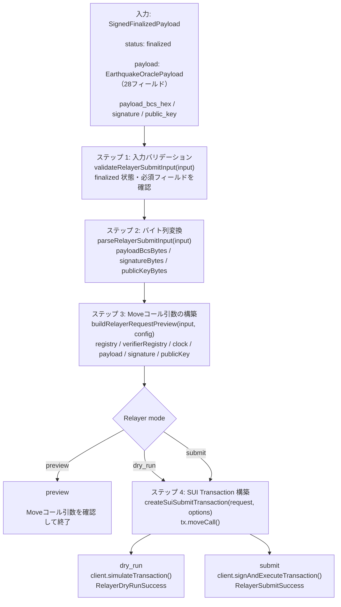

# Relayer — SUI ブロックチェーン中継

TEE Core が生成した署名済み Oracle ペイロードを、SUI ブロックチェーンのスマートコントラクトに送信するコンポーネントです。

---

## 3つの動作モード

Relayer は目的に応じて3つのモードで動作します：

### `preview` モード（デフォルト）

リクエストを確認するだけで、実際には何も送信しません。送信されるデータの内容を確認したいときに使います。

### `dry_run` モード

SUI にトランザクションを送信しますが、実際には実行しません。送信前にエラーがないか確認したいときに使います。`grpcUrl` と `senderAddress` が必要です。

### `submit` モード

本番送信です。SUI ブロックチェーンに実際にトランザクションを送信します。`RELAYER_ALLOW_SUBMIT=true` の設定と署名鍵（Signer）が必要です。

---

## トランザクション構築フロー



---

## 主要エクスポート

### 関数

| 関数名 | 説明 |
|---|---|
| `buildRelayerRequestPreview(input, config)` | プレビュー（Moveコール引数の確認） |
| `dryRunRelayerSubmit(input, config)` | ドライラン（シミュレーション） |
| `submitRelayerPayload(input, config)` | 本番送信 |
| `parseRelayerSubmitInput(input)` | 入力をバイト列に変換 |
| `createSuiSubmitTransaction(request, options)` | SUI Transaction オブジェクトを構築 |
| `loadFixtureRelayerSubmitInput(caseId)` | フィクスチャから入力を読み込む（テスト用） |

### 型

```
RelayerRequestConfig     ← target, registry, verifierRegistry
RelayerDryRunConfig      ← + grpcUrl, senderAddress
RelayerSubmitConfig      ← + grpcUrl, signer
RelayerRequestPreview    ← Moveコール引数の確認結果
RelayerDryRunSuccess     ← シミュレーション成功結果
RelayerSubmitSuccess     ← 本番送信成功結果（digest付き）
RelayerResult<T>         ← { ok: true, value: T } | { ok: false, error_code, message }
```

### エラーコード

| エラーコード | 意味 |
|---|---|
| `RELAYER_SUBMIT_FAILED` | 送信失敗（設定エラー、ネットワークエラーなど） |
| `MOVE_REJECTED` | SUI Move コントラクトが取引を拒否した |

---

## SUI ネットワーク自動判定

`inferSuiNetwork(grpcUrl)` は gRPC URL の文字列から接続先を判定します：

| gRPC URL の内容 | 判定結果 |
|---|---|
| `"mainnet"` を含む | `mainnet` |
| `"devnet"` を含む | `devnet` |
| `"127.0.0.1"` または `"localhost"` を含む | `localnet` |
| それ以外 | `testnet`（デフォルト） |

---

## フィクスチャを使ったテスト

```typescript
import { loadFixtureRelayerSubmitInput, buildRelayerRequestPreview } from "@sonari/earthquake-relayer";

// フィクスチャから入力を読み込む
const input = loadFixtureRelayerSubmitInput("usgs/finalized_minimal");

// プレビューを確認
const result = buildRelayerRequestPreview(input, {
  target: "0xpackage::accessor::create_disaster_event_from_signed_payload",
  registry: "0xregistry_object_id",
  verifierRegistry: "0xverifier_registry_id",
});

if (result.ok) {
  console.log(result.value.arguments); // Moveコール引数
}
```

---

## テストの実行方法

```bash
# Relayer のユニットテスト
cd nautilus/verifiers/earthquake/relayer
npm test

# 型チェック
npm run typecheck
```

---

## Watcher との関係

Watcher は `HttpRelayerAdapter` を通じて Relayer を呼び出します。Watcher 内の `relayer_preview.ts` は Oracle Sidecar URL 経由でこのパッケージを利用します。Relayer の各モード設定は Watcher の環境変数（`RELAYER_MODE`, `RELAYER_TARGET` など）で制御されます。

詳細は [watcher/README.md](../watcher/README.md) を参照してください。
