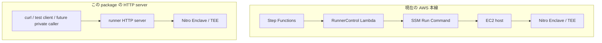

# 地震 Runner

地震検証器用の EC2 host service です。Nitro Enclave / TEE に地震 verifier request を渡し、TEE が返した result JSON を呼び出し元へ返すための薄い HTTP server です。

現在の CloudFormation 本線では、この HTTP server は必須経路ではありません。本番 AWS workflow は、Step Functions が RunnerControl Lambda を呼び、RunnerControl Lambda が SSM Run Command で EC2 host に直接 command を送ります。



この package は、主に次の用途のために残しています。

- ローカル検証や手動テストで `curl` から TEE 実行を試す。
- EC2 host 上で `/health` を確認する。
- 将来、SSM Run Command ではなく private network 内の runner service として動かす。
- relayer preview / dry-run を sidecar 的に試す。

提供するエンドポイント:

- `GET /health`
- `POST /start`
- `POST /process`
- `POST /stop`
- `POST /relayer/preview`
- `POST /relayer/dry_run`

すべてのエンドポイントは `Authorization: Bearer <RUNNER_TOKEN>` を必須とします。`/process` が受け付ける body は次の形式だけです。

```json
{
  "payload": {
    "source_event_id": "us7000...",
    "hazard_type": 1,
    "primary_source": 1,
    "geo_resolution": 7
  }
}
```

ライフサイクル契約:

1. `POST /start` を `{}` で呼び出す。応答は `{ "ok": true, "runner_id": "..." }` を含む。
2. 上記 payload wrapper と `x-runner-id: <runner_id>` header を付けて `POST /process` を呼び出す。Runner は runner id がない request、または unknown runner id の request を拒否する。
3. `{ "runner_id": "..." }` で `POST /stop` を呼び出す。対象 runner で TEE command が実行中の場合、service はそれを abort し、spawn 済み child process を終了する。Unknown runner id は error にする。

`RUNNER_BACKEND=aws` の場合、設定された `NITRO_ENCLAVE_PROCESS_COMMAND` を実行し、request JSON を stdin で渡します。`RUNNER_BACKEND=aws` 以外では、local verification 用に `cargo run --manifest-path <TEE_CARGO_MANIFEST_PATH> -- production --input <tmp>` を使います。

HTTP server を AWS backend で起動する場合の環境変数:

```txt
RUNNER_TOKEN=<bearer-token>
RUNNER_BACKEND=aws
NITRO_ENCLAVE_PROCESS_COMMAND=<host-to-enclave-command>
SONARI_TEE_SIGNING_KEY_SEED=<32-byte-hex-seed>
SONARI_WALRUS_AGGREGATOR_URL=<url>
```

EC2 bootstrap script が Secrets Manager の値を runner service user から読める local file として materialize する場合は、`RUNNER_TOKEN_FILE` と `SONARI_TEE_SIGNING_KEY_SEED_FILE` も利用できます。
