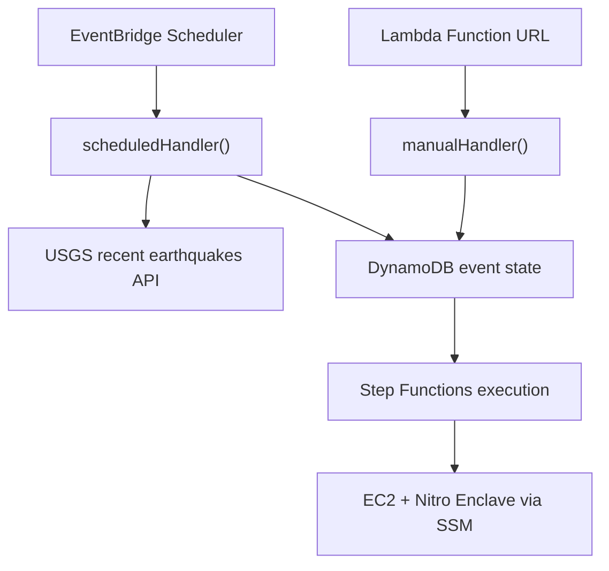
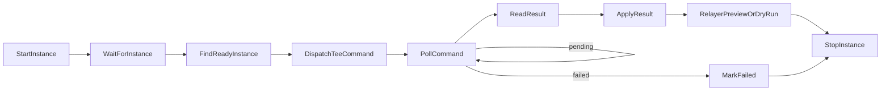

# 地震 Watcher

AWS Lambda 上で動く地震オラクルの watcher です。USGS recent feed を定期取得し、軽量 screening、DynamoDB 状態管理、Step Functions runner workflow の起動、手動投入を担当します。



## Lambda ハンドラ

| ハンドラ | 役割 |
| --- | --- |
| `scheduledHandler` | EventBridge Scheduler から呼ばれ、USGS recent feed を取得して due event の runner workflow を開始する |
| `manualHandler` | Lambda Function URL から手動 event id を受け取り、認証後に runner workflow を開始する |
| `runner_workflow.handler` | Step Functions から呼ばれ、ASG scale、EC2 discovery、SSM command、S3 result read を行う |

## 状態

`DynamoDbStateRepository` が production 用の DynamoDB 実装です。MVP では低頻度運用を前提に、due event の取得は Scan + in-process filtering で始めます。必要になったら GSI を追加してください。

主な状態:

| Status | 意味 |
| --- | --- |
| `new` | runner workflow 起動待ち |
| `processing` | Step Functions / EC2 / TEE 実行中 |
| `pending_source` | USGS source 公開待ち |
| `pending_mmi` | MMI 確定待ち |
| `finalized` | 署名付き payload 生成済み |
| `submitted` | Sui 投稿済み |
| `failed` | 一時失敗、再試行対象 |
| `rejected` | TEE/Core が対象外と判定 |
| `ignored_small` | summary screening で閾値未満 |

## Runner ワークフロー

Step Functions Standard workflow は次の段階で runner を動かします。



EC2 は Auto Scaling Group で通常 `DesiredCapacity=0` にし、処理時だけ `1` にします。TEE command の結果は S3 に JSON として保存し、runner control Lambda が読み取ります。

## 環境変数

| 変数名 | 用途 |
| --- | --- |
| `EVENTS_TABLE_NAME` | DynamoDB event state table |
| `RUNNER_STATE_MACHINE_ARN` | runner workflow の Step Functions ARN |
| `RUNNER_TOKEN_SECRET_ARN` | manual Function URL 認証 token の Secrets Manager ARN |
| `MANUAL_SUBMIT_TOKEN` | local/test 用の直接 token。設定時は secret より優先 |
| `RUNNER_ASG_NAME` | runner EC2 Auto Scaling Group 名 |
| `RESULT_BUCKET` | TEE result JSON を保存する S3 bucket |
| `NITRO_ENCLAVE_PROCESS_COMMAND` | EC2 host から Nitro Enclave へ request を渡す command |
| `RELAYER_MODE` | 未設定なら Relayer を skip。設定時は `preview` / `dry_run` / `submit`。`submit` は signer 未設定のため fail-closed |
| `RELAYER_TARGET` | Relayer preview / dry-run 用 Move target |
| `RELAYER_REGISTRY` | Relayer preview / dry-run 用 registry object |
| `RELAYER_VERIFIER_REGISTRY` | Relayer preview / dry-run 用 verifier registry object |
| `RELAYER_GRPC_URL` | dry-run 用 Sui gRPC URL |
| `RELAYER_SENDER_ADDRESS` | dry-run 用 sender address |

## ローカル検証

```txt
pnpm --filter @sonari/earthquake-watcher test
pnpm --filter @sonari/earthquake-watcher typecheck
```
