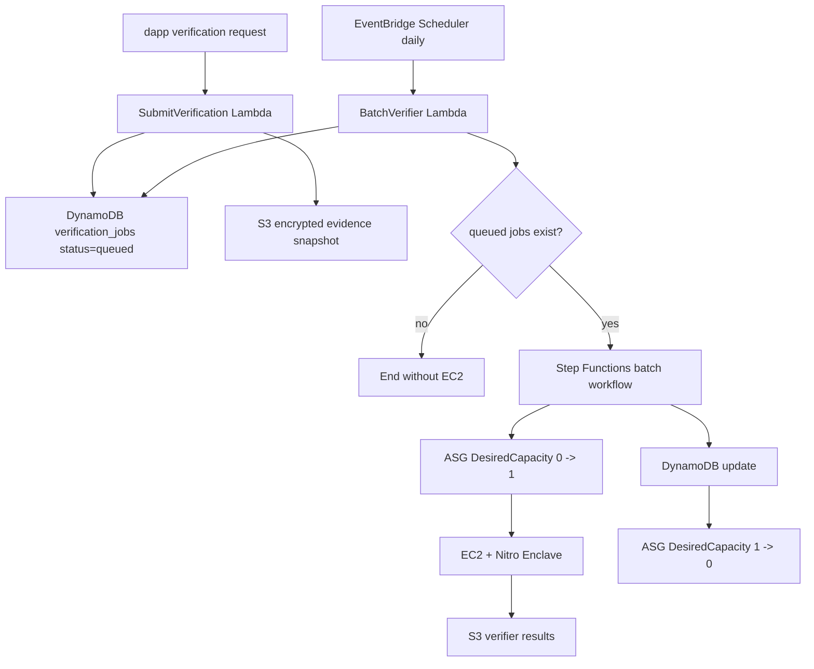

# Sonari Membership Verifiers

## Overview

Membership verifiers update Membership Pass metadata for receiver-side eligibility. They are separate from the Earthquake verifier, which creates the affected-cell root for earthquake events.

Verifier families:

- `residence`: produces `ResidenceMetadataUpdate` for coarse H3 residence eligibility.
- `student`: produces `StudentMetadataUpdate` for Student Aid campaigns.
- `migration`: future pass lineage / wallet migration verification.

Contracts trust only Nautilus-signed metadata updates, not raw dapp input.

## Responsibilities

- Normalize and score private evidence inside verifier execution.
- Produce signed metadata updates bound to `pass_lineage_id` and owner wallet.
- Keep raw personal evidence off-chain and out of verifier output.
- Provide confidence and risk buckets for campaign-specific payout policy.

Membership verifiers do not create earthquake affected-cell roots, update Earthquake Oracle payload field order, or execute payouts.

## Batch Runner Policy

Residence, student, and migration verification do not start EC2 immediately for each dapp request. A dapp request first creates a queued verification job. A scheduled batch runner, such as once per day, processes queued jobs together.

If queued jobs are zero, EC2 / Nitro Enclave is not started. When jobs exist, the batch workflow scales the ASG `0 -> 1 -> 0` and minimizes EC2 runtime. Future claim periods or major disaster windows may add urgent priority and increased execution frequency.



## Job Schema

Proposed DynamoDB fields:

- `job_id`
- `pass_lineage_id`
- `owner_wallet`
- `verifier_family`: `residence | student | migration`
- `status`: `queued | processing | finalized | rejected | failed | needs_user_action`
- `priority`: `normal | urgent`
- `submitted_at`
- `scheduled_for`
- `started_at`
- `finished_at`
- `attempt_count`
- `evidence_snapshot_hash`
- `evidence_s3_key`
- `result_s3_key`
- `confidence`
- `risk_bucket`
- `error_code`

## Metadata Outputs

Residence output includes `verified_residence_cell`, `residence_confidence`, `risk_bucket`, `evidence_snapshot_hash`, issue / expiry times, and verifier version.

Student output includes student status bucket, school region hash, confidence, risk bucket, `evidence_snapshot_hash`, issue / expiry times, and verifier version.

Migration output will bind old owner, new owner, payout address, migration reason bucket, and `pass_lineage_id`.

## Privacy / Security

- Raw evidence is never written on-chain.
- Raw evidence is stored in encrypted S3 only when needed and with short retention.
- Long-term audit state keeps `evidence_snapshot_hash`, not recoverable raw evidence.
- Verifier output must not include raw phone, GPS history, detailed address, school email, student id, IP history, or raw document images.
- Signing keys are separated by verifier family.
- Dapp self-declarations may be inputs, but contracts must not treat them as trusted eligibility.

## Directory Structure

```txt
nautilus/verifiers/membership/
  README.md
  shared/              Placeholder shared TypeScript contracts
  tee/                 Future Nautilus / TEE implementation
  fixtures/residence/  Residence fixture notes
  fixtures/student/    Student fixture notes
  verifiers/residence/ Residence verifier notes
  verifiers/student/   Student verifier notes
```

No empty runner directory is added until implementation needs it.

## Future Work

- Implement deterministic residence and student dummy verifiers from fixtures.
- Define signed metadata update canonical payloads.
- Add encrypted evidence retention policy and deletion automation.
- Add contracts integration for metadata update verification.
- Add urgent priority scheduling for active claim windows.
