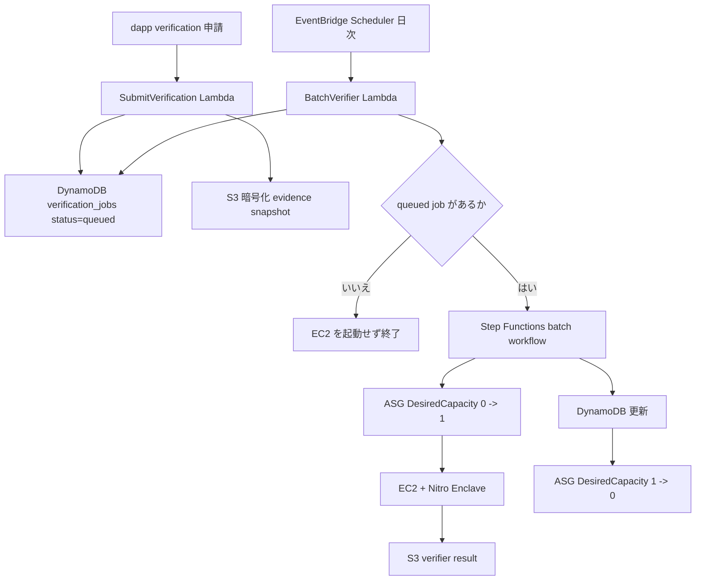

# Sonari 本人認証検証器

## 概要

本人認証検証器は、受取者側の eligibility に使う Membership Pass metadata を更新する検証器ファミリーです。地震検証器が地震 event の affected-cell root を作るのに対し、本人認証検証器は residence、student、migration など受取者側の metadata を扱います。

検証器ファミリーは次の通りです。

- `residence`: coarse H3 residence eligibility 用の `ResidenceMetadataUpdate` を生成する。
- `student`: Student Aid campaign 用の `StudentMetadataUpdate` を生成する。
- `migration`: 将来の pass lineage / wallet migration verification。

コントラクトは Nautilus 署名済み metadata update だけを信頼し、dapp からの生 input は信頼しません。

## 責務

- private evidence を verifier execution 内で normalize / score する。
- `pass_lineage_id` と owner wallet に bind された署名済み metadata update を生成する。
- 生の個人 evidence を off-chain に留め、verifier output に含めない。
- Campaign-specific payout policy が使う confidence と risk bucket を提供する。

本人認証検証器は地震 affected-cell root の作成、地震オラクル payload field order の更新、payout 実行を行いません。

## 一括 Runner 方針

Residence、student、migration verification は、dapp 申請ごとに EC2 を即時起動しません。dapp 申請はまず queued verification job を作成します。1日1回などの scheduled batch runner が queued job をまとめて処理します。

Queued job が 0 件なら EC2 / Nitro Enclave は起動しません。Job がある場合だけ batch workflow が ASG を `0 -> 1 -> 0` に scale し、EC2 稼働時間を最小化します。将来、claim 期間中や大規模災害時には urgent priority と実行頻度増加を追加できる設計にします。



## ジョブスキーマ

DynamoDB 項目の提案:

- `job_id`
- `pass_lineage_id`
- `owner_wallet`
- `verifier_family`: `residence | student | migration`
- `status`: `queued | processing | finalized | rejected | failed | needs_user_action`
- `priority`: `normal | urgent`
- `submitted_at`
- `scheduled_for`
- `started_at`
- `finished_at`
- `attempt_count`
- `evidence_snapshot_hash`
- `evidence_s3_key`
- `result_s3_key`
- `confidence`
- `risk_bucket`
- `error_code`

## メタデータ出力

Residence output は、`verified_residence_cell`、`residence_confidence`、`risk_bucket`、`evidence_snapshot_hash`、issued / expiry time、verifier version を含みます。

Student output は、student status bucket、school region hash、confidence、risk bucket、`evidence_snapshot_hash`、issued / expiry time、verifier version を含みます。

Migration output は、old owner、new owner、payout address、migration reason bucket、`pass_lineage_id` を bind します。

## プライバシー / セキュリティ

- 生の evidence は on-chain に書きません。
- 生の evidence は必要な場合だけ暗号化 S3 に短期保存します。
- 長期 audit state には生の evidence を復元できない `evidence_snapshot_hash` を残します。
- 検証器の出力には raw phone、GPS history、detailed address、school email、student id、IP history、raw document image を含めません。
- Signing key は検証器ファミリーごとに分けます。
- dapp self-declaration は input にできますが、contract が trusted eligibility として扱ってはいけません。

## ディレクトリ構成

```txt
nautilus/verifiers/membership/
  README.md
  shared/              共有 TypeScript contract の placeholder
  tee/                 将来の Nautilus / TEE 実装
  fixtures/residence/  residence fixture のメモ
  fixtures/student/    student fixture のメモ
  verifiers/residence/ residence verifier のメモ
  verifiers/student/   student verifier のメモ
```

実装が必要になるまで空の `runner/` ディレクトリは追加しません。

## 今後の作業

- Fixture から deterministic residence / student dummy verifier を実装する。
- 署名済み metadata update の canonical payload を定義する。
- Encrypted evidence retention policy と deletion automation を追加する。
- Metadata update verification の contract integration を追加する。
- Active claim window 用の urgent priority scheduling を追加する。
