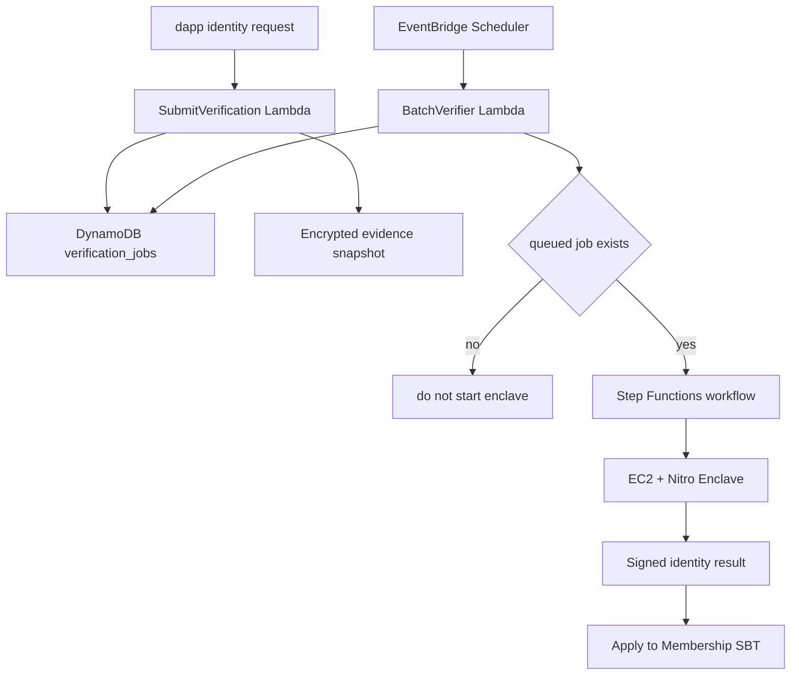

# Sonari Identity Verifiers

## 概要

Membership verifier は、Membership SBT の本人確認状態を更新する。
MVP の provider は KYC と World ID の 2 つだけである。

地震 verifier は災害 event と affected cells を検証する。
identity verifier は、受取者が本人確認済みかを検証する。
この 2 つの責務は混ぜない。

residence cell validation は本人確認とは別の検証である。
ユーザーが自己申告した居住セルが登録可能な陸地セルかを検証する。
KYC / World ID の本人確認結果を作らない。
地震 verifier の affected cells も作らない。

MVP では、H3 resolution 7 の陸地 allowlist を使う。
この allowlist は `land_allowlist_res7` として扱う。
TEE / verifier は、申告された residence cell が `land_allowlist_res7` に含まれることを検証する。
海のみの cell は reject する。
検証に成功した場合、TEE は verified residence metadata result に署名する。
dApp と relayer はその signed metadata result を配送するだけであり、意味を変更しない。
Move / metadata verifier が signed result を検証して適用する。
TEE が Membership SBT を直接 mutate するわけではない。

dApp 側の validation は UX のための早期 feedback である。
信頼境界として必須なのは TEE / verifier 側の validation である。

MVP の陸地データは Natural Earth を優先 source とする。
OSM land polygons は将来候補である。
小さな無人島や複雑な海岸線の厳密な precision は MVP では要求しない。
`land_allowlist_res7` の保存形式、差分形式、commitment の形式はこの段階では固定しない。

## MVP provider

| Provider | 役割 |
| --- | --- |
| KYC | provider response と署名を検証する |
| World ID | Sonari 専用 action の proof を検証する |

KYC と World ID は、どちらも満額 Claim ルートである。
未認証の Membership SBT は Claim できない。

World ID action は Sonari 専用にする。

```text
sonari_membership_register_v1
```

signal には Sui address、nonce、domain separator を含める。
これにより、proof の流用を防ぐ。

## Verifier output

verifier output は最小限にする。

```text
IdentityVerificationResult {
  intent
  verifier_family
  verifier_version
  registry_id
  membership_id
  owner
  provider
  verified
  duplicate_key_hash
  evidence_hash
  issued_at_ms
  expires_at_ms
  terms_version
  signed_statement_hash
}
```

`provider` は `kyc` または `world_id` である。
`verified` が `true` のときだけ、Membership SBT を verified にできる。

### Signed payload BCS layout

Move に渡す signed payload は、次の順番で BCS bytes にする。
この順番は contract-facing な契約として扱う。

```text
intent: vector<u8> UTF-8
verifier_family: vector<u8> UTF-8, identity
verifier_version: u64
registry_id: 32-byte Sui object id
membership_id: 32-byte Sui object id
owner: 32-byte Sui address
provider: u8, KYC = 1, World ID = 2
verified: bool
duplicate_key_hash: 32 bytes
evidence_hash: 32 bytes
issued_at_ms: u64
expires_at_ms: u64
terms_version: u64
signed_statement_hash: 32 bytes
```

`duplicate_key_hash` は provider 内の重複登録を防ぐために使う。
すでに別 SBT に紐づく duplicate key は reject する。

```text
kyc_duplicate_key = hash(kyc_provider_id, provider_user_unique_id)
world_duplicate_key = hash(world_app_id, action, nullifier)
```

KYC と World ID をまたぐ完全な同一人物判定は MVP 外である。
登録時と Claim 時に、複数 SBT と複数 Claim を禁じる表示を出す。
その内容に対して Sui wallet 署名を求める。

## Privacy boundary

verifier は raw personal data を output に含めない。

出してはいけないもの:

- KYC document image
- KYC detail
- World ID proof detail
- raw credential data
- detailed address
- phone
- device identifier
- location history

出してよいもの:

- provider
- verified flag
- duplicate key hash
- evidence hash
- issued / expiry time
- terms version
- signed statement hash

## Job model

identity verification request は queued job として扱う。
job があるときだけ batch workflow を起動する。
job が 0 件なら EC2 / Nitro Enclave は起動しない。



## Job schema

Suggested fields:

- `job_id`
- `membership_id`
- `owner_wallet`
- `provider`
- `status`
- `priority`
- `submitted_at`
- `started_at`
- `finished_at`
- `attempt_count`
- `evidence_hash`
- `evidence_s3_key`
- `result_s3_key`
- `duplicate_key_hash`
- `error_code`

## ディレクトリ構成

```txt
nautilus/verifiers/membership/
  README.md
  shared/
  tee/
  fixtures/
```

旧 residence / student verifier docs は target MVP から外す。
将来の Program で必要になった場合は、本人確認 gate とは別の
eligibility verifier として再設計する。
